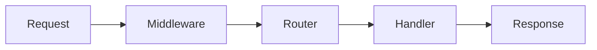

# NextRush MDX & UI Documentation Instructions

These instructions guide GitHub Copilot when **writing or modifying MDX-based documentation** for the NextRush docs site.

This file defines **how to use UI elements responsibly** to improve clarity, readability, and developer experience.

MDX is a tool for understanding — not decoration.

---

## Core Principle

> **Use UI components only when they reduce cognitive load.**

Do not add UI elements for visual appeal alone.
Every component must earn its place by making content easier to understand.

---

## When to Use MDX

Use `.mdx` instead of `.md` **only** when you need:

* Tabs to compare alternatives (Node vs Bun vs Deno vs Edge)
* Accordions to hide long or optional sections
* Callouts with semantic meaning (tip, warning, danger)
* Visual grouping of complex ideas
* Interactive explanations

If plain Markdown is sufficient, do not use MDX.

---

## Approved UI Components

Only use the following component types unless explicitly extended.

---

### Tabs

**Use Tabs when:**

* Showing multiple runtimes
* Comparing approaches
* Offering alternatives
* Presenting language or environment differences

**Do not use Tabs for:**

* Sequential steps
* Narrative content
* Hiding essential information

**Rules:**

* Maximum 4 tabs
* Each tab must stand alone
* Titles must be short and concrete

**Example**

````mdx
<Tabs>
  <Tab title="Node.js">
    ```ts
    createNodeAdapter()
    ```
  </Tab>
  <Tab title="Edge">
    ```ts
    createEdgeAdapter()
    ```
  </Tab>
</Tabs>
````

---

### Accordion / Details

**Use for:**

* Long examples
* Advanced explanations
* Optional internals
* Full source listings

**Rules:**

* Never hide critical steps
* Title must describe what’s inside
* Do not nest accordions

**Example**

```mdx
<details>
<summary>How middleware composition works internally</summary>

Detailed explanation here.

</details>
```

---

### Callouts

Use callouts to communicate intent, not decoration.

#### Tip

Use for:

* Helpful hints
* Optional improvements
* Best practices

#### Warning

Use for:

* Common mistakes
* Non-obvious behavior
* Edge cases

#### Danger

Use **only** for:

* Security risks
* Data loss
* Production-breaking behavior

**Rules:**

* Never stack callouts
* Keep content short
* Do not repeat surrounding text

**Example**

```md
::: warning
Middleware order matters. This runs before routing.
:::
```

---

## Code Blocks

### Code Block Rules

* Always specify language (`ts`, `js`, `bash`)
* Prefer `ts` over `js`
* Keep examples minimal and runnable
* Avoid overly long code blocks in the main flow

If code exceeds ~30 lines, hide it behind an accordion.

---

### Code Highlighting and Focus

Use comments to explain **why**, not syntax.

Avoid:

* Inline commentary on obvious lines
* Highlighting without explanation

---

## Diagrams (Mermaid)

### When to Use Mermaid

Use Mermaid diagrams for:

* Request lifecycle
* Middleware chains
* Plugin pipelines
* Architecture overviews

Do not use Mermaid for:

* UI mockups
* Branding
* Decorative visuals

---

### Mermaid Rules

* Keep diagrams small and readable
* Prefer left-to-right flow
* Use consistent naming
* Explain the diagram in text before or after

**Example**

````md


Never include a diagram without explanation.

---

## Visual Density Rules

To keep pages readable:

- Avoid more than 2 UI components back-to-back
- Alternate text and visuals
- Add breathing space between sections
- Prefer clarity over compactness

If a page feels busy, reduce UI elements.

---

## Layout & Flow

### Section Flow

A well-structured MDX page typically follows:

1. Short explanation
2. Example or diagram
3. Clarification
4. Optional deep dive (accordion)

Avoid long uninterrupted blocks of code or UI.

---

### Headings and UI

- Do not place UI components immediately after a heading without context
- Introduce what the reader is about to see
- UI should support the section title, not replace it

---

## Comparisons Using UI

When comparing approaches:

- Use Tabs for parallel comparison
- Keep examples symmetrical
- Avoid bias in wording

**Bad**
- One tab has more detail than others
- Editorial language inside tabs

---

## Accessibility & Readability

- Do not rely on color alone to convey meaning
- Always explain what the user should notice
- Assume dark mode is enabled
- Avoid tiny text inside UI components

---

## Performance Considerations

- Do not overuse MDX components
- Avoid deeply nested components
- Prefer static content over dynamic behavior

Documentation should remain fast and lightweight.

---

## What to Avoid

Never:
- Turn docs into a design showcase
- Use UI components to hide poor writing
- Over-nest components
- Add animation-heavy elements
- Replicate marketing landing page patterns

Docs are tools, not ads.

---

## Final MDX Quality Check

Before finalizing an MDX page:

- Does every UI element improve understanding?
- Could any MDX be replaced with plain Markdown?
- Is the page easy to scan?
- Does the UI slow reading or help it?

If UI does not help, remove it.

---

## Final Rule

> **MDX exists to reduce thinking, not increase it.**

If the reader has to stop and “figure out” the UI, it has failed.
```

---

## Where you are now (important)

You now have **three clean, professional instruction files**:

1. ✅ `docs-site.instructions.md` → structure & philosophy
2. ✅ `docs-writing.instructions.md` → language & explanation
3. ✅ `docs-mdx-ui.instructions.md` → UI, MDX, visuals

This is **exactly how mature projects do it**.
