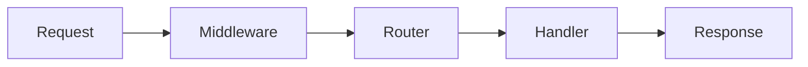

# NextRush MDX & UI Component Guide

This file defines which components are available, how to use them, and when they earn a place on the page.

For writing standards and page structure, see `docs-standards.instructions.md`.
For API reference formatting, see `docs-api-reference.instructions.md`.

---

## Core Principle

> **Every UI component must reduce cognitive load. If it does not, remove it.**

MDX is a tool for understanding — not decoration. If plain Markdown conveys the same information with equal clarity, use plain Markdown.

---

## When to Use MDX

Use `.mdx` instead of `.md` when you need:

- Tabs to compare alternatives (runtimes, approaches, package managers)
- Steps for sequential procedures
- Callouts for warnings, tips, or breaking changes
- TypeTable for structured API properties
- PackageInstall for multi-manager install commands
- Mermaid diagrams for flows and architecture
- Accordions to hide long optional content

If the page only needs headings, paragraphs, code blocks, and lists — use `.md`.

---

## Available Components

All components below are globally available in `.mdx` files. No imports needed unless noted.

---

### Callout

Semantic callouts for important information. Available via Fumadocs default MDX components.

**Types:**

| Type    | Use For                                                 |
| ------- | ------------------------------------------------------- |
| `info`  | Helpful context, version notes, good-to-know facts      |
| `warn`  | Common mistakes, non-obvious behavior, edge cases       |
| `error` | Security risks, data loss, production-breaking behavior |

**Syntax:**

```mdx
<Callout type="info" title="Optional Title">
  Content here. Keep it short — 1-3 sentences max.
</Callout>

<Callout type="warn">
  Middleware order matters. Security middleware must run before routing.
</Callout>

<Callout type="error" title="Breaking Change in v3">
  The `ctx.body` property is now read-only. Use `ctx.json()` to send responses.
</Callout>
```

**Rules:**

- Never stack callouts (no two callouts back-to-back)
- Keep content to 1–3 sentences
- Do not repeat surrounding text inside a callout
- Use `title` only when the callout needs disambiguation
- Maximum 3 callouts per page

---

### Tabs / Tab

Compare alternatives side by side. Globally registered from Fumadocs.

**Use for:**

- Runtime alternatives (Node.js vs Bun vs Deno)
- Approach comparison (functional vs class-based)
- Different configurations

**Do not use for:**

- Sequential steps (use Steps instead)
- Narrative content
- Hiding essential information

**Syntax:**

```mdx
<Tabs items={['Node.js', 'Bun', 'Deno']}>
  <Tab value="Node.js">Content for Node.js</Tab>
  <Tab value="Bun">Content for Bun</Tab>
  <Tab value="Deno">Content for Deno</Tab>
</Tabs>
```

**Rules:**

- Maximum 4 tabs
- Each tab must stand alone (no dependencies between tabs)
- Tab labels must be short and concrete
- Keep tab content roughly equal in length
- Do not nest tabs inside tabs

---

### Steps / Step

Sequential procedures with numbered steps. Globally registered from Fumadocs.

**Use for:**

- Installation procedures
- Setup sequences
- Multi-step configuration
- Getting started flows

**Syntax:**

````mdx
<Steps>
  <Step>
    ### Install the package

    ```bash
    pnpm add @nextrush/core
    ```

  </Step>
  <Step>
    ### Create the application

    ```ts
    import { createApp } from '@nextrush/core';
    const app = createApp();
    ```

  </Step>
  <Step>
    ### Start the server

    ```ts
    app.listen(3000);
    ```

  </Step>
</Steps>
````

**Rules:**

- Each step must be independently understandable
- Keep steps focused — one action per step
- Use headings (h3) inside steps for clarity
- Maximum 7 steps. Split into multiple sections if longer.

---

### PackageInstall

Multi-package-manager install tabs with copy button. Custom component, globally registered.

**Syntax:**

```mdx
<PackageInstall packages={['@nextrush/core', '@nextrush/router']} />

<PackageInstall packages={['@nextrush/core']} dev={['@nextrush/dev', 'typescript']} />
```

**Props:**

| Prop       | Type       | Required | Description                        |
| ---------- | ---------- | -------- | ---------------------------------- |
| `packages` | `string[]` | Yes      | Production dependencies to install |
| `dev`      | `string[]` | No       | Dev dependencies to install        |

**Rules:**

- Use instead of raw `pnpm add` / `npm install` commands
- Shows pnpm, npm, yarn, and bun tabs automatically
- One PackageInstall per installation section

---

### TypeTable

Structured property/type display for API documentation. Custom component, globally registered.

**Syntax:**

```mdx
<TypeTable
  title="Context Properties"
  types={{
    method: { type: 'HttpMethod', description: 'HTTP request method' },
    path: { type: 'string', description: 'Request path' },
    params: { type: 'Record<string, string>', description: 'Route parameters', optional: true },
    query: { type: 'Record<string, string>', description: 'Query parameters', default: '{}' },
  }}
/>
```

**Props:**

| Prop    | Type                             | Required | Description          |
| ------- | -------------------------------- | -------- | -------------------- |
| `title` | `string`                         | No       | Table heading        |
| `types` | `Record<string, TypeDefinition>` | Yes      | Property definitions |

**TypeDefinition shape:**

| Field         | Type      | Required | Description            |
| ------------- | --------- | -------- | ---------------------- |
| `type`        | `string`  | Yes      | TypeScript type        |
| `description` | `string`  | Yes      | What the property does |
| `optional`    | `boolean` | No       | Shows `?` marker       |
| `default`     | `string`  | No       | Default value display  |

**Rules:**

- Use for API properties, configuration objects, and interface definitions
- Prefer TypeTable over manual Markdown tables for type documentation
- Keep descriptions to one sentence
- Verify all types against actual source code

---

### Feature / FeatureGrid

Feature cards for landing and overview pages. Custom components, globally registered.

**Syntax:**

```mdx
<FeatureGrid>
  <Feature icon="⚡" title="High Performance" description="35,000+ requests per second" />
  <Feature icon="🎯" title="Type Safe" description="Full TypeScript strict mode" />
  <Feature icon="📦" title="Modular" description="Install only what you need" />
</FeatureGrid>
```

**Rules:**

- Use only on index/overview pages
- 3–6 features per grid
- Keep descriptions under 10 words
- Do not use inside concept, guide, or API reference pages

---

### Mermaid Diagrams

Two ways to add Mermaid diagrams:

**Option 1 — Fenced code block** (via `remarkMdxMermaid` plugin):

````mdx

````

**Option 2 — Mermaid component** (custom, globally registered):

```mdx
<Mermaid
  chart={`
  sequenceDiagram
    Client->>Server: HTTP Request
    Server->>Middleware: Process
    Middleware->>Handler: Route
    Handler->>Client: Response
`}
/>
```

**When to use:**

- Request lifecycle flows
- Middleware chains
- Plugin pipelines
- Package dependency graphs
- Architecture overviews

**When NOT to use:**

- UI mockups or branding
- Decorative visuals
- Anything text explains equally well

**Rules:**

- Prefer `graph LR` (left-to-right) for flows
- Use `sequenceDiagram` for request lifecycles
- Keep under 10 nodes
- Use real component names from code
- Always explain the diagram in text before or after
- Maximum 2 diagrams per page

---

### Accordion / Details

Native HTML element. For hiding long or optional content.

```mdx
<details>
<summary>Full middleware composition source</summary>

Extended code or explanation here.

</details>
```

**Use for:**

- Long code examples (>30 lines)
- Advanced explanations most readers skip
- Internal implementation details
- Complete source listings

**Rules:**

- Never hide critical information
- Summary text must describe what is inside
- Do not nest accordions
- Maximum 3 per page

---

## Code Blocks

### Rules

- Always specify language: `ts`, `js`, `bash`, `json`
- Prefer `ts` over `js`
- Keep examples minimal and runnable
- If code exceeds ~30 lines, use an accordion
- Use comments to explain **why**, not syntax

---

## Visual Density Rules

| Rule                                  | Limit                |
| ------------------------------------- | -------------------- |
| Callouts per page                     | Max 3                |
| Diagrams per page                     | Max 2                |
| Accordions per page                   | Max 3                |
| Back-to-back UI components            | Max 2, then add text |
| Code blocks without text between them | Max 2                |

**Flow pattern:** Text → Component → Text → Component

Alternate content and visuals. Never create walls of components.

---

## Layout and Flow

### Section Flow

A well-structured MDX page follows:

1. Short explanation (1–2 paragraphs)
2. Code example or diagram
3. Clarification or table
4. Optional deep dive (accordion)

### Heading Rules

- Never place a component immediately after a heading without context text
- Introduce what the reader is about to see
- The component supports the section — it does not replace it

---

## Accessibility

- Do not rely on color alone to convey meaning
- Always explain what the reader should notice
- Assume dark mode as the default
- Keep text inside components readable (no tiny text)
- Callout types provide semantic meaning beyond color

---

## Performance

- Do not overuse client-side components
- Avoid deeply nested component trees
- Prefer static content over interactive behavior
- Documentation pages must remain fast and lightweight

---

## Forbidden Patterns

- Turning docs into a design showcase
- Using components to hide poor writing
- Over-nesting components
- Animation or transition-heavy elements
- Marketing landing page patterns in technical docs
- Decorative diagrams with no informational value
- Tabs containing sequential steps (use Steps)
- Stacking callouts back-to-back
- Excess component density without breathing room

---

## Component Decision Guide

| Need                             | Component               |
| -------------------------------- | ----------------------- |
| Comparing runtimes or approaches | Tabs                    |
| Sequential setup or procedure    | Steps                   |
| Important warning, tip, or alert | Callout                 |
| Displaying API types/properties  | TypeTable               |
| Installing packages              | PackageInstall          |
| Explaining flow or architecture  | Mermaid                 |
| Long optional content            | Accordion (`<details>`) |
| Landing page feature showcase    | FeatureGrid + Feature   |
| Everything else                  | Plain Markdown          |
