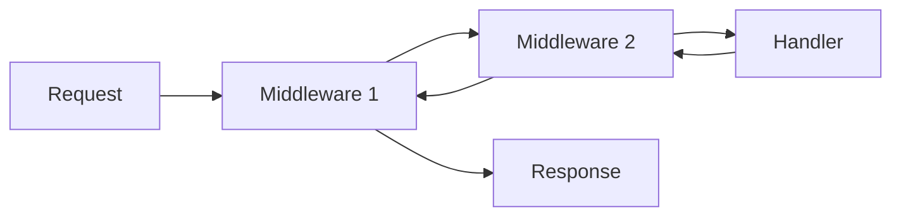

# NextRush Documentation Site Standards

This instruction file defines how to write **world-class framework documentation** for NextRush v3.

The goal is clear: **Make NextRush the most well-documented backend framework in the Node.js ecosystem.**

Documentation is not an afterthought. It is a core feature of the framework.

---

## Why This Matters

The best-documented frameworks win. Period.

| Framework | Adoption Level | Documentation Quality |
|-----------|---------------|----------------------|
| React | Massive | Exceptional (new docs) |
| Vue | Large | Outstanding |
| Svelte | Growing fast | Excellent |
| NestJS | Large | Good (but verbose) |
| Fastify | Medium | Technical-heavy |

NextRush aims to match **React's new documentation standard**: human-first, progressive disclosure, trust-building.

---

## Core Philosophy

### 1. Humans First, APIs Second

Every page must answer these questions in order:
1. **What problem does this solve?** (Pain recognition)
2. **Why should I care?** (Value proposition)
3. **How do I think about this?** (Mental model)
4. **How do I use it?** (Minimal working example)
5. **What happens behind the scenes?** (Trust through transparency)
6. **What are the gotchas?** (Prevent frustration)

### 2. Progressive Disclosure

Reveal complexity gradually:

```
Layer 1: I need to get something working (5 minutes)
Layer 2: I need to understand how it works (15 minutes)
Layer 3: I need to customize it (30 minutes)
Layer 4: I need to build something complex (reference)
```

### 3. Trust Through Transparency

Never hide:
- Default behaviors
- Performance implications
- Trade-offs made
- Escape hatches available

### 4. Code That Teaches

Every code example must:
- Be copy-paste runnable
- Teach a concept, not just show syntax
- Include expected output or behavior
- Show the "why" in comments (sparingly)

---

## Documentation Architecture

### Site Structure (VitePress)

```
apps/docs/
├── .vitepress/
│   └── config.ts
├── src/
│   ├── index.md                    # Landing page
│   ├── getting-started/
│   │   ├── introduction.md         # What is NextRush?
│   │   ├── quick-start.md          # 5-minute start
│   │   ├── installation.md         # Detailed setup
│   │   └── first-app.md            # Build something real
│   ├── concepts/
│   │   ├── application.md          # Core Application
│   │   ├── context.md              # The ctx object
│   │   ├── middleware.md           # Middleware chain
│   │   ├── routing.md              # Router patterns
│   │   └── plugins.md              # Plugin system
│   ├── guides/
│   │   ├── rest-api.md             # Building REST APIs
│   │   ├── authentication.md       # Auth patterns
│   │   ├── database.md             # Database integration
│   │   ├── testing.md              # Testing strategies
│   │   ├── deployment.md           # Production deployment
│   │   └── migration-v2.md         # Migrating from v2
│   ├── packages/
│   │   ├── core.md                 # @nextrush/core
│   │   ├── router.md               # @nextrush/router
│   │   └── [package].md            # Each package
│   ├── api/
│   │   ├── context.md              # Context API reference
│   │   ├── application.md          # Application API
│   │   └── types.md                # TypeScript types
│   ├── examples/
│   │   ├── hello-world.md
│   │   ├── rest-crud.md
│   │   └── real-time-chat.md
│   └── community/
│       ├── contributing.md
│       ├── changelog.md
│       └── roadmap.md
```

### Navigation Principles

1. **Getting Started** - For first-time users (5 pages max)
2. **Concepts** - Deep understanding (mental models)
3. **Guides** - Practical tutorials (real-world tasks)
4. **Packages** - Per-package documentation
5. **API Reference** - Technical reference
6. **Examples** - Complete working examples

---

## Page Templates

### Template 1: Concept Page

Use for: `concepts/*.md`, core understanding

```markdown
# [Concept Name]

> One sentence that captures what this is and why it matters.

## The Problem

[2-3 paragraphs describing the real-world pain this solves]

Before NextRush, you had to...
This leads to problems like...
Developers often struggle with...

## How NextRush Approaches This

[2-3 paragraphs on the design philosophy]

NextRush takes a different approach...
Instead of [old way], we...
This means you get...

## Mental Model

[Simple analogy or diagram]

Think of [concept] like...

```
[ASCII diagram or conceptual illustration]
```

## Basic Usage

[Minimal, complete, runnable example]

```typescript
// The simplest working example
```

## What Happens Behind the Scenes

[Explain the magic, remove mystery]

When you call `ctx.json()`, NextRush:
1. Serializes the data using JSON.stringify()
2. Sets Content-Type to application/json
3. Writes to the response stream
4. Does NOT call next() automatically

## Common Patterns

### Pattern 1: [Name]

[Code example with explanation]

### Pattern 2: [Name]

[Code example with explanation]

## Common Mistakes

### Mistake 1: [Description]

```typescript
// ❌ Don't do this
[bad code]
```

Why it's wrong: [explanation]

```typescript
// ✅ Do this instead
[correct code]
```

### Mistake 2: [Description]

[Same format]

## When NOT to Use This

[Clear boundaries on misuse]

- Don't use [feature] for [misuse case]
- If you need [X], use [alternative] instead

## Next Steps

- Learn about [related concept 1](link)
- See [related concept 2](link) for more advanced patterns
```

### Template 2: Package Documentation

Use for: `packages/*.md`

```markdown
# @nextrush/[package-name]

> [One-liner describing what this package does]

## Installation

```bash
pnpm add @nextrush/[package-name]
```

## Quick Start

```typescript
import { [main export] } from '@nextrush/[package-name]';

// Minimal working example (copy-paste ready)
```

## Why This Package Exists

[2-3 paragraphs on the problem and solution]

## API Reference

### `[functionName](options)`

[Description]

**Parameters:**

| Parameter | Type | Default | Description |
|-----------|------|---------|-------------|
| `option1` | `string` | `'default'` | What it does |
| `option2` | `number` | `100` | What it does |

**Returns:** `[Type]`

**Example:**

```typescript
// Complete, runnable example
```

### `[anotherFunction]()`

[Same structure]

## Configuration Options

### Full Options Reference

```typescript
interface [Package]Options {
  /**
   * Description of option
   * @default 'value'
   */
  option1?: string;

  /**
   * Description of option
   * @default 100
   */
  option2?: number;
}
```

## Integration Examples

### With [Other Package]

```typescript
// How to use with another NextRush package
```

### With [External Library]

```typescript
// How to integrate with popular libraries
```

## Troubleshooting

### "[Error message]"

**Cause:** [Why this happens]

**Solution:**

```typescript
// How to fix it
```

## See Also

- [Related Package](link)
- [Related Guide](link)
```

### Template 3: Tutorial/Guide

Use for: `guides/*.md`

```markdown
# [Task-Oriented Title]

> Build [what you'll build] in [time estimate]

## What You'll Learn

- [Learning outcome 1]
- [Learning outcome 2]
- [Learning outcome 3]

## Prerequisites

- Node.js 20+
- Basic TypeScript knowledge
- [Other requirements]

## Final Result

[Screenshot or code preview of what you'll build]

## Step 1: [Action-Oriented Title]

[Brief explanation of why this step matters]

```typescript
// Code for this step
```

[Explain what the code does]

## Step 2: [Action-Oriented Title]

[Same format]

## Step 3: [Action-Oriented Title]

[Same format]

## Testing Your Work

```bash
# Commands to verify it works
```

Expected output:

```
[What you should see]
```

## Going Further

Now that you have [what you built], you might want to:

- [Enhancement 1](link)
- [Enhancement 2](link)
- [Enhancement 3](link)

## Complete Code

<details>
<summary>See the full source code</summary>

```typescript
// Complete, production-ready code
```

</details>

## Next Steps

- [Related tutorial 1](link)
- [Related tutorial 2](link)
```

---

## Writing Standards

### Voice and Tone

| Do | Don't |
|----|-------|
| "You can..." | "One can..." |
| "This lets you..." | "This allows the developer to..." |
| "Notice that..." | "As you can see..." |
| "This returns..." | "This will return..." |
| Direct statements | Passive voice |

### Forbidden Words and Phrases

Never use:
- "Simply" / "Just" / "Easy" / "Obviously"
- "As mentioned above/below"
- "This module provides..."
- "Powerful and flexible"
- "Note:" at the start of paragraphs
- "etc." - be specific instead

### Preferred Patterns

Use these human phrases:
- "You might wonder why..."
- "At first glance, this seems redundant. Here's why it isn't..."
- "If this feels like magic, here's what's actually happening..."
- "A common mistake is..."
- "This matters because..."
- "The trade-off here is..."

### Code Example Rules

1. **Always runnable** - No pseudo-code, no incomplete examples
2. **Minimal but complete** - Show the concept, not everything
3. **Show imports** - Never assume they know what to import
4. **Expected output** - Show what happens when you run it
5. **TypeScript first** - JavaScript as secondary

```typescript
// ✅ Good: Complete, focused, shows output
import { createApp } from '@nextrush/core';
import { json } from '@nextrush/body-parser';

const app = createApp();

app.use(json());

app.post('/users', async (ctx) => {
  console.log(ctx.body); // { name: 'Alice', email: 'alice@example.com' }
  ctx.json({ success: true });
});

// Run: curl -X POST -H "Content-Type: application/json" \
//      -d '{"name":"Alice","email":"alice@example.com"}' \
//      http://localhost:3000/users
```

```typescript
// ❌ Bad: Incomplete, no context
app.post('/users', async (ctx) => {
  // handle user creation
  ctx.json(user);
});
```

### Heading Hierarchy

- H1 (`#`): Page title only (one per page)
- H2 (`##`): Major sections
- H3 (`###`): Subsections
- H4 (`####`): Rarely used, consider restructuring
- H5+: Never use - restructure the page instead

### Length Guidelines

| Content Type | Target Length |
|-------------|---------------|
| Concept explanation | 100-200 words |
| Code example intro | 1-2 sentences |
| Tutorial step | 150-300 words |
| API parameter description | 1-2 sentences |
| Troubleshooting solution | 50-100 words |

---

## Visual Elements

### Callouts (VitePress)

Use callouts sparingly and appropriately:

```markdown
::: tip
Use for helpful, optional information that enhances understanding.
:::

::: warning
Use for gotchas that could cause bugs or confusion.
:::

::: danger
Use ONLY for security issues or data-loss scenarios.
:::

::: details Click to expand
Use for optional, advanced content that most readers can skip.
:::
```

### Tables

Use tables for:
- API options
- Comparison of approaches
- Configuration reference

```markdown
| Option | Type | Default | Description |
|--------|------|---------|-------------|
| `limit` | `string \| number` | `'1mb'` | Maximum body size |
```

### Diagrams

Use ASCII or Mermaid for:
- Request flow
- Middleware chain
- Architecture overview

```markdown

```

---

## Package-Specific Standards

### @nextrush/core Documentation

Must explain:
- Application lifecycle
- Context object design (why `ctx.body` not `ctx.request.body`)
- Middleware composition (`compose()`)
- Error handling flow
- Plugin system architecture

### @nextrush/router Documentation

Must explain:
- Radix tree routing (why it's fast)
- Route parameter syntax
- Route ordering and priority
- How to mount sub-routers
- Performance characteristics

### Middleware Package Documentation

Each middleware package must document:
1. **What it does** - One paragraph
2. **When to use it** - Use cases
3. **Default behavior** - What happens with zero config
4. **All options** - Complete reference
5. **Security implications** - If applicable
6. **Performance impact** - If significant

---

## Comparison with Other Frameworks

When comparing NextRush to other frameworks:

### Do

- Be factual and specific
- Show actual code differences
- Acknowledge where others excel
- Focus on developer experience differences

### Don't

- Use marketing language
- Make unsubstantiated claims
- Disparage other frameworks
- Compare outdated versions

### Example Comparison Section

```markdown
## Coming from Express

If you're familiar with Express, here's how NextRush concepts map:

| Express | NextRush | Notes |
|---------|----------|-------|
| `req.body` | `ctx.body` | Same concept, shorter path |
| `res.json()` | `ctx.json()` | Identical behavior |
| `next()` | `ctx.next()` | Now on context object |
| `app.use()` | `app.use()` | Same API |

Key difference: NextRush uses async/await natively. No callback hell.
```

---

## Quality Checklist

Before publishing any documentation page, verify:

### Content Quality
- [ ] Page has a clear single purpose
- [ ] Opens with the problem, not the API
- [ ] Mental model is explained before code
- [ ] All code examples are copy-paste runnable
- [ ] Common mistakes are documented
- [ ] "When NOT to use" section exists (for concept pages)

### Writing Quality
- [ ] No forbidden words/phrases
- [ ] Active voice throughout
- [ ] Sentences under 25 words average
- [ ] Technical terms are explained on first use
- [ ] Consistent terminology throughout

### Technical Quality
- [ ] Code examples tested and working
- [ ] TypeScript types are accurate
- [ ] Links to related pages work
- [ ] API signatures match actual code

### DX Quality
- [ ] Would a junior developer understand this?
- [ ] Would a senior developer trust this design?
- [ ] Is this faster to read than the source code?
- [ ] Does this reduce GitHub issues?

---

## Landing Page Standards

The documentation homepage (`index.md`) must:

1. **Hero Section**
   - Tagline (7 words or less)
   - One-sentence description
   - "Get Started" button
   - "View on GitHub" link

2. **Value Propositions** (3-4 max)
   - Icon + Title + 2 sentences
   - Focus on developer benefits, not features

3. **Code Preview**
   - Hello World in under 10 lines
   - Syntax highlighted
   - Shows the DX clearly

4. **Quick Links**
   - Getting Started
   - API Reference
   - Examples
   - Community

5. **Comparison Stats** (optional)
   - Performance benchmarks
   - Bundle size
   - Cold start time

---

## Maintenance Guidelines

### When to Update Documentation

- **Immediately**: API changes, breaking changes
- **Soon**: New features, new packages
- **Regularly**: Examples, best practices, troubleshooting

### Version Documentation

For breaking changes:
1. Add migration guide to `guides/migration-v[X].md`
2. Update all affected examples
3. Add deprecation warnings to old patterns
4. Update changelog

### Feedback Integration

Track and integrate:
- GitHub issues asking "how do I..."
- Common questions in discussions
- Error messages that confuse users
- Patterns discovered by community

---

## Success Metrics

Documentation is successful when:

| Metric | Target |
|--------|--------|
| Time to first working app | < 5 minutes |
| GitHub issues for "how do I..." | Decreasing trend |
| Documentation search success rate | > 90% |
| Page bounce rate | < 40% |
| "Was this helpful?" rating | > 4.5/5 |

---

## References

Study these exemplary documentation sites:

1. **React (new docs)** - https://react.dev
   - Progressive disclosure
   - Interactive examples
   - Challenge problems

2. **Vue.js** - https://vuejs.org/guide
   - Clear mental models
   - Options vs Composition API toggle

3. **Svelte** - https://svelte.dev/docs
   - Concise and direct
   - Integrated REPL

4. **Stripe API** - https://stripe.com/docs
   - Request/response examples
   - Language toggles
   - Copy buttons

5. **Tailwind CSS** - https://tailwindcss.com/docs
   - Searchable
   - Visual examples
   - Quick reference

---

## Final Reminder

Every documentation page should pass this test:

> **"If I read only this page, could I successfully use this feature in production without searching Stack Overflow?"**

If the answer is no, the documentation is not complete.

Write documentation you would want to read.
