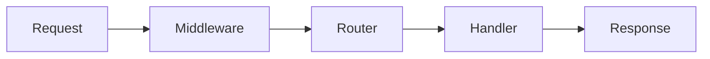

# Write NextRush Docs From Code (Strict)

## Mission

Generate or update **NextRush documentation** that is **fully synchronized with the actual codebase**.

Documentation must be derived from **real implementation**, not assumptions, memory, or old patterns.

Visuals (Mermaid diagrams) must reflect **actual runtime flow**, not imagined architecture.

---

## Scope & Preconditions

This prompt applies when:

* Writing new documentation
* Updating existing documentation
* Refactoring legacy documentation
* Fixing incorrect or outdated docs

### Hard Rules

* ❌ Never write documentation before reviewing the code
* ❌ Never guess API behavior
* ❌ Never blindly follow old documentation
* ❌ Never invent features, defaults, or options
* ❌ Never add diagrams without verifying behavior in code

If required context is missing, **stop and ask for it**.

---

## Required Inputs

* `${input:targetDocPath}` — Path to the documentation file to write or update
* `${input:packageName}` — Target package name (example: `@nextrush/core`)

Optional:

* `${input:focusArea}` — Specific API, feature, or section to focus on

If any required input is missing, request it and halt.

---

## Workflow (Mandatory Order)

Follow **every step in order**. Do not skip steps.

---

### Step 1 — Inspect the Codebase First

1. Locate the package source code:

   * `packages/${packageName}/`
   * `src/` or equivalent internal structure
2. Read:

   * Public exports
   * Function signatures
   * Default values
   * Error handling paths
   * Side effects
3. Identify:

   * What is actually implemented
   * What is configurable
   * What is NOT supported

📌 If behavior is unclear, search deeper or stop.

---

### Step 2 — Review Existing Documentation (`docs-old`)

1. Locate legacy docs under:

   * `docs-old/`
   * or previous documentation folders
2. Treat old docs as:

   * Historical reference only
   * Potentially incorrect
3. Identify:

   * Mismatches with code
   * Deprecated patterns
   * Missing updates
   * Incorrect defaults

📌 Do NOT copy old docs blindly.

---

### Step 3 — Reconcile Code vs Docs

Create a mental diff:

* What the code does now
* What the old docs claim
* What must be corrected
* What should be removed
* What should be added

If discrepancies exist, **the code always wins**.

---

### Step 4 — Decide Whether a Diagram Is Needed (Mermaid Gate)

Before writing diagrams, ask:

* Does this explain **execution flow**, **lifecycle**, or **architecture**?
* Would text alone be slower to understand?
* Is the flow stable and verified in code?

If **no**, do not use Mermaid.

---

### Step 5 — Use Mermaid Correctly (When Needed)

When a diagram improves clarity, use **Mermaid** with these rules:

#### Allowed Use Cases

* Request lifecycle
* Middleware execution order
* Plugin or hook flow
* Adapter / runtime interaction
* High-level architecture overview

#### Forbidden Use Cases

* UI mockups
* Marketing visuals
* Decorative diagrams
* Guessing internal flow

---

### Mermaid Design Rules (Strict)

* Prefer **left-to-right** flow (`graph LR`)
* Keep diagrams **small and readable**
* Use **real component names from code**
* Avoid excessive styling, colors, or icons
* Do not overuse Mermaid features

#### Preferred Diagram Types

* `graph LR` → architecture / flow
* `sequenceDiagram` → request lifecycle
* `stateDiagram-v2` → state transitions (rare)

#### Avoid

* Custom themes
* Excessive labels
* Nested subgraphs without explanation
* Diagrams longer than one screen

---

#### Example (Good)

Explain the diagram **in text before or after**.

---

### Step 6 — Write or Update Documentation

Now — and only now — write documentation that:

* Matches the real API
* Uses exact function names and signatures
* Documents true defaults and behaviors
* Reflects real runtime behavior
* Avoids undocumented features
* Includes diagrams only when justified

Follow all applicable instruction files:

* `docs-site.instructions.md`
* `docs-writing.instructions.md`
* `docs-mdx-ui.instructions.md`
* `docs-api-reference.instructions.md`
* `docs-content-strategy.instructions.md`

---

### Step 7 — Validation Pass

Before finishing, verify:

* [ ] All APIs documented actually exist
* [ ] All examples compile and run
* [ ] All defaults match source code
* [ ] No behavior is implied without code evidence
* [ ] Diagrams match real execution flow
* [ ] No legacy patterns remain unless still supported

If any check fails, revise.

---

## Output Expectations

* Update or create documentation at `${input:targetDocPath}`
* Use Markdown or MDX as appropriate
* Include runnable examples
* Use accurate terminology
* Use Mermaid diagrams **only where they reduce confusion**

If writing API docs, follow the **API reference format strictly**.

---

## Failure Conditions (Stop Immediately)

Stop and ask for clarification if:

* The package source code cannot be found
* The target API is ambiguous
* The old docs conflict heavily with code
* The requested behavior is not implemented
* Required inputs are missing

Do not continue without resolution.

---

## Quality Assurance Checklist

Before responding, confirm:

* [ ] Code was reviewed first
* [ ] Old docs were reviewed second
* [ ] Documentation matches code exactly
* [ ] Diagrams reflect real behavior
* [ ] No assumptions were made
* [ ] Examples reflect real behavior
* [ ] Language is clear and neutral

---

## Final Directive

> **If the documentation or diagram does not match the package code, it is wrong.**

Accuracy is mandatory.
Clarity is expected.
Guessing is forbidden.
