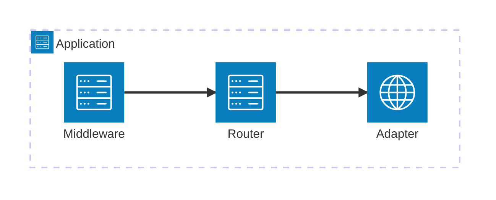
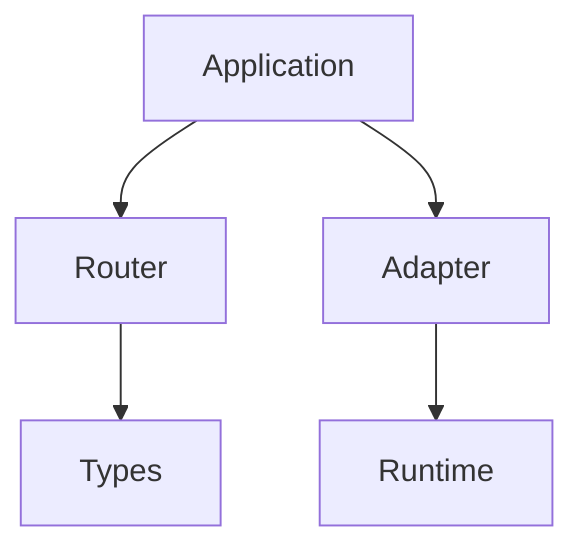

{/*
  ARCHITECTURE PAGE TEMPLATE — deep Diátaxis "explanation". Standard: EDS-010. Flow: EDS-006.
  Audience: engineers who extend, debug, or contribute — NOT API users. This page is an ADR +
  internal design doc: it teaches how the team REASONS, and what must never change. No generic
  "Trade-offs" section — trade-offs live inside each decision. Diagrams carry the load (EDS-012).
*/}
---
title: {{ "___ Architecture" — the system/component }}
description: {{ 120–160 chars — the internal design this covers }}
---

## The architectural problem

{{ Start with the PROBLEM the architecture exists to solve — the coupling, the constraint, the
   cost it removes. Every architecture begins here (EDS-005). Not "the system has layers". }}

## Requirements and constraints

{{ Requirements are not goals. Goals = "fast". Requirements/constraints = "must support Node/Bun/
   Deno/Edge · zero-dependency core · ESM-only · O(k) routing". These EXPLAIN every later decision. }}

## Design principles

{{ The reasoning rules applied throughout: explicit over implicit, composition over inheritance,
   runtime independence, stable public contracts, small core, no hidden magic. Reference them below. }}

## Architecture overview

{{ Pick the PRECISE type per EDS-012 + the `mermaid` skill — NOT a default flowchart. System
   topology → `architecture-beta` or C4; component wiring → block/graph; lifecycle → sequence;
   states → stateDiagram. Example (topology): }}



{{ The system diagram + a paragraph. Build from big picture to detail; one idea per diagram. }}

## Component boundaries

{{ For EACH major component — this prevents architecture drift: }}

### {{ Component }}
- **Owns:** {{ … }}
- **Does NOT own:** {{ … }}
- **Depends on:** {{ … }}
- **Used by:** {{ … }}
- **Owns state:** {{ what request/app state this component holds, if any }}

**Dependency rule:** {{ the legal direction — e.g. "lower packages never import from higher; nothing imports below `types`". }}



## Request lifecycle

```mermaid
sequenceDiagram
  {{ the request/response path — where order matters }}
```

## Component lifecycle

{{ Architecture is about time. The phases and what's valid in each. }}

```text
Create → Configure → Ready → Running → Shutdown
```

## Engineering decisions

{{ THE core of the page. For each major decision, ADR-shaped: }}

### {{ Decision }}
- **Problem:** {{ what forced a choice }}
- **Decision:** {{ what was chosen }}
- **Alternatives:** {{ what else was considered }}
- **Trade-offs:** {{ what this costs }}
- **Consequences:** {{ what it enables / constrains downstream }}

## Architectural invariants

{{ The constitution — rules that must NEVER break. The single most valuable section for
   contributors and reviewers. }}
- {{ e.g. The router is immutable after `ready()`. }}
- {{ e.g. Context is request-scoped and never shared across requests. }}
- {{ e.g. Adapters contain no routing logic. }}
- {{ e.g. The core package imports no runtime API. }}

## Failure scenarios

{{ How the design behaves when things break. }}

| Failure | Detection | Recovery |
| ------- | --------- | -------- |
| {{ plugin throws at boot }} | {{ how it's caught }} | {{ how the system recovers/degrades }} |

## Concurrency model

{{ How concurrent requests share state safely — immutability, request-local state, what is and
   isn't safe to touch across requests. }}

## Performance characteristics

{{ WHY the performance exists — not benchmark numbers. }}
- **Hot path:** {{ what runs per request; allocations avoided }}
- **Cold path:** {{ registration/boot-time work }}
- **Caching / compilation:** {{ what's precomputed once }}

| Operation | Complexity |
| --------- | ---------- |
| {{ lookup }} | {{ O(depth) }} |
| {{ registration }} | {{ O(depth) }} |

## Security boundaries

{{ The trust boundaries, not security tips. Where untrusted input crosses into trusted code, and
   what enforces the boundary. }}

```text
User input → Context → validation → Application
```

## Extensibility

{{ How the architecture is meant to grow — and how it's protected. }}
- **Supported extension points:** {{ middleware · registrars · extensions · adapters }}
- **Forbidden:** {{ what must not be extended, to preserve the invariants above }}

## Rejected alternatives

{{ Its own section — valuable historical record. For each: what and why rejected. }}
### {{ Alternative, e.g. Radix tree }}
{{ Why it was rejected. }}

## Architecture validation

{{ How the design is protected from regression — architecture isn't complete without this. }}
- {{ conformance tests · golden tests · benchmarks · regression tests }}

## Evolution

- **Current:** {{ … }}
- **Near future:** {{ … }}
- **Long term:** {{ … }}

## Future improvements

- {{ candidate direction }} · {{ candidate direction }}

## Related

- [{{ Concept }}](/docs/concepts/{{ slug }}) · [{{ RFC / ADR }}]({{ link }}) · [{{ Reference }}](/docs/reference/{{ slug }})
