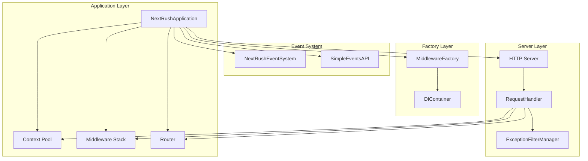
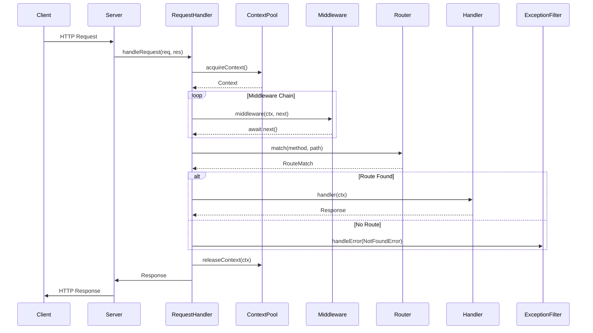
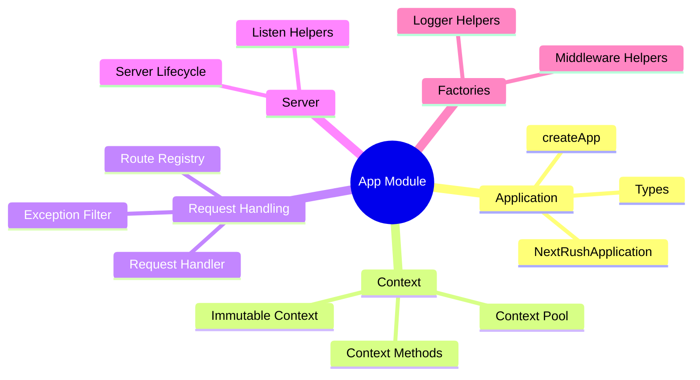
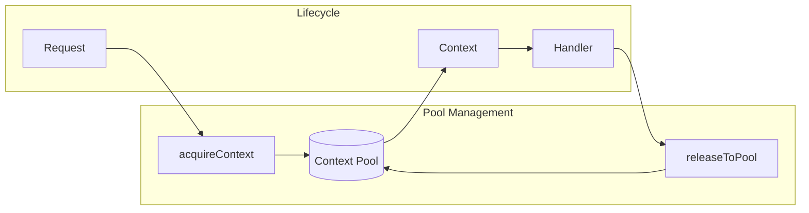
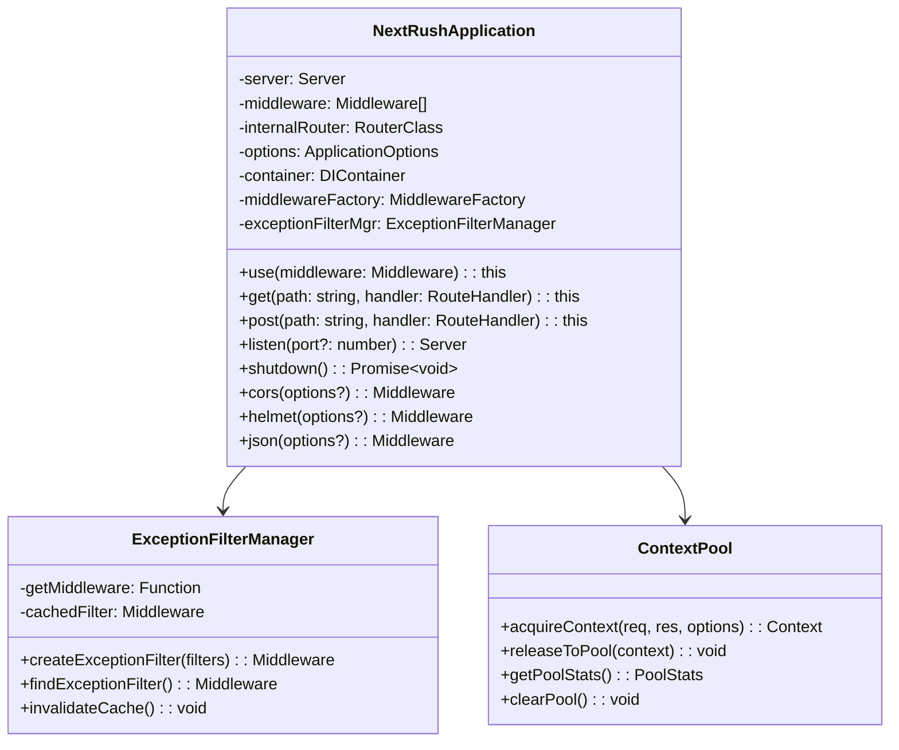
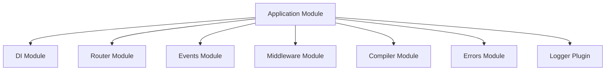

# Application Module

> Core application module for NextRush v2 - high-performance, type-safe HTTP server implementation

## Overview

The Application module is the heart of NextRush v2, providing a Koa-style context-based middleware system with Express-like ergonomics. It orchestrates request handling, middleware execution, routing, and server lifecycle management.

## Architecture

### System Overview



### Request Lifecycle



### Module Structure



## File Structure

```
src/core/app/
├── application.ts          # Main NextRushApplication class (456 lines)
├── types.ts               # TypeScript type definitions (101 lines)
├── index.ts               # Module exports
├── README.md              # This documentation
│
├── context/               # Context-related files
│   ├── index.ts          # Context module exports
│   └── (re-exports from parent)
│
├── server/                # Server lifecycle files
│   ├── index.ts          # Server module exports
│   └── (re-exports from parent)
│
├── helpers/               # Factory and helper utilities
│   ├── index.ts          # Helpers module exports
│   └── (re-exports from parent)
│
├── context.ts             # Context creation and management (182 lines)
├── context-pool.ts        # Object pooling for contexts (125 lines)
├── context-methods.ts     # Reusable context methods (215 lines)
│
├── request-handler.ts     # HTTP request handling (245 lines)
├── server-lifecycle.ts    # Server start/stop management (155 lines)
├── listen-helpers.ts      # Listen method helpers (150 lines)
│
├── route-registry.ts      # Route registration helpers (144 lines)
├── exception-filter-manager.ts # Exception filter handling (126 lines)
├── middleware-helpers.ts  # Middleware factory bindings (85 lines)
└── logger-helpers.ts      # Logger plugin factory (98 lines)
```

### Module Organization

The app module is organized into logical submodules for cleaner imports:

```typescript
// Import from specific submodule
import { acquireContext, releaseToPool } from '@/core/app/context';
import { createRequestHandler, startServer } from '@/core/app/server';
import { createMiddlewareHelpers, createDevLogger } from '@/core/app/helpers';

// Or import everything from main index
import { createApp, acquireContext, createRequestHandler } from '@/core/app';
```

## Key Components

### NextRushApplication

The main application class extending EventEmitter with:

- **Middleware System**: Koa-style async middleware with `app.use()`
- **Routing**: Express-like HTTP method routing (`app.get()`, `app.post()`, etc.)
- **Event System**: Dual API - simple events and advanced CQRS
- **Middleware Factory**: Built-in middleware creation via DI
- **Lifecycle Management**: Graceful startup and shutdown

```typescript
import { createApp } from '@nextrush/core';

const app = createApp({ port: 3000 });

// Middleware
app.use(app.cors());
app.use(app.helmet());
app.use(app.json());

// Routes
app.get('/health', ctx => {
  ctx.res.json({ status: 'ok' });
});

// Start server
app.listen(3000, () => {
  console.log('Server running');
});
```

### Context Pool

High-performance object pooling for contexts:



**Benefits**:
- Reduced GC pressure
- Consistent memory footprint
- O(1) acquire/release operations

### Request Handler

Orchestrates the request lifecycle:

1. **Context Acquisition**: Get context from pool
2. **Request Enhancement**: Apply enhancers
3. **Middleware Execution**: Run middleware chain
4. **Route Matching**: Find matching route
5. **Handler Execution**: Run route handler
6. **Error Handling**: Apply exception filters
7. **Context Release**: Return to pool

### Exception Filter Manager

NestJS-style exception handling:

```typescript
// Register global exception filter
app.use(app.exceptionFilter([
  new ValidationExceptionFilter(),
  new AuthenticationExceptionFilter(),
  new GlobalExceptionFilter()
]));
```

## Class Diagram



## Middleware Factory

Built-in middleware accessible via application instance:

| Method | Description |
|--------|-------------|
| `cors()` | CORS headers middleware |
| `helmet()` | Security headers middleware |
| `json()` | JSON body parser |
| `urlencoded()` | URL-encoded body parser |
| `text()` | Text body parser |
| `compression()` | Response compression |
| `rateLimit()` | Rate limiting |
| `logger()` | Request logging |
| `requestId()` | Request ID generation |
| `timer()` | Response timing |
| `smartBodyParser()` | Auto-detecting body parser |

## Event System

Dual event API for different use cases:

### Simple Events (Express-style)

```typescript
// Emit and listen
app.events.emit('user.created', { userId: '123' });
app.events.on('user.created', data => console.log(data));
```

### Advanced Events (CQRS)

```typescript
// Command/Event pattern
app.eventSystem.dispatch(new CreateUserCommand({ name: 'John' }));
app.eventSystem.subscribe(UserCreatedEvent, handler);
```

## Performance Optimizations

1. **Context Pooling**: Reuses context objects to reduce allocations
2. **Pre-compilation**: Production mode pre-compiles routes and DI
3. **Efficient Middleware**: Stack-based execution without async overhead
4. **Cache-friendly**: Exception filter caching

## Dependencies



## Testing

```bash
# Run application tests
pnpm test src/tests/unit/core/app/

# Run integration tests
pnpm test src/tests/integration/
```

## See Also

- [Router Module](../router/README.md) - Optimized routing
- [DI Module](../di/README.md) - Dependency injection
- [Compiler Module](../compiler/README.md) - Route pre-compilation
- [Middleware Module](../middleware/README.md) - Built-in middleware
