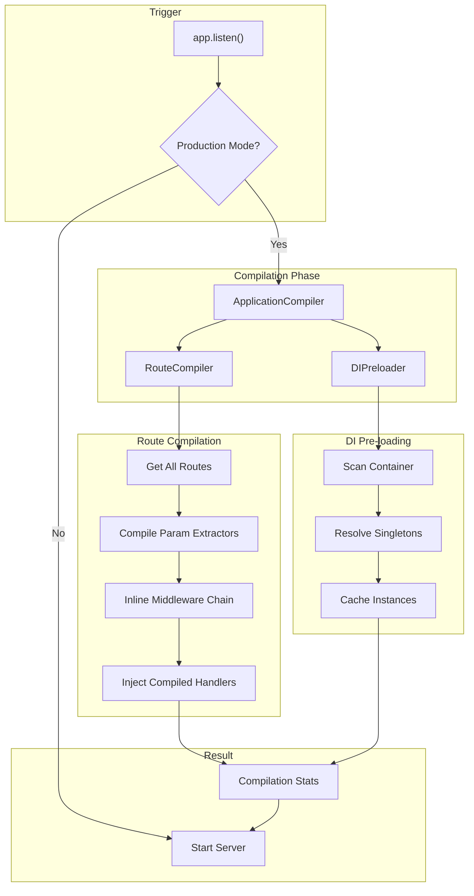
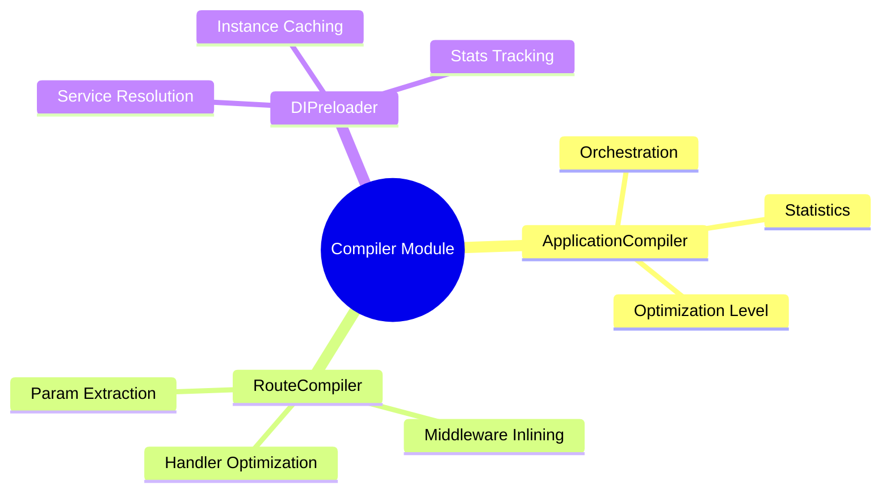
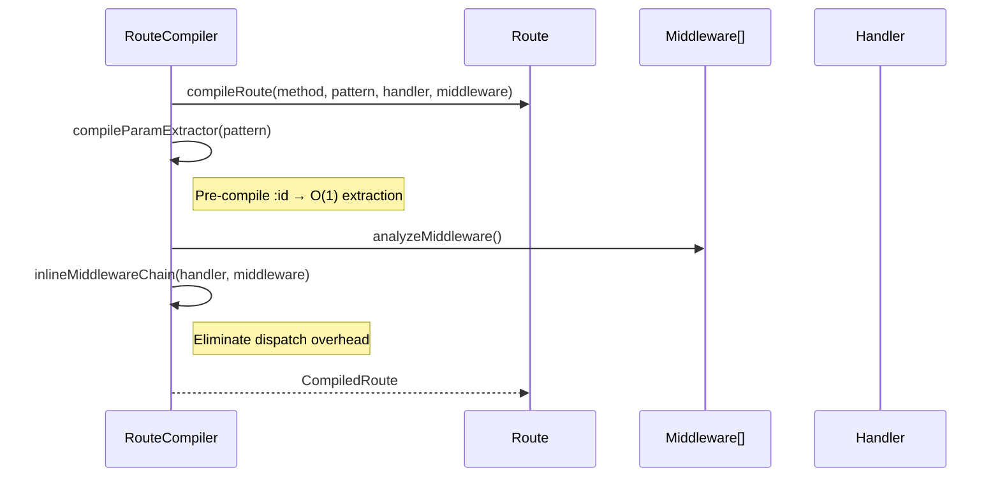
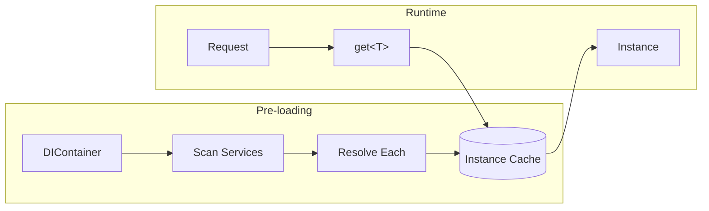
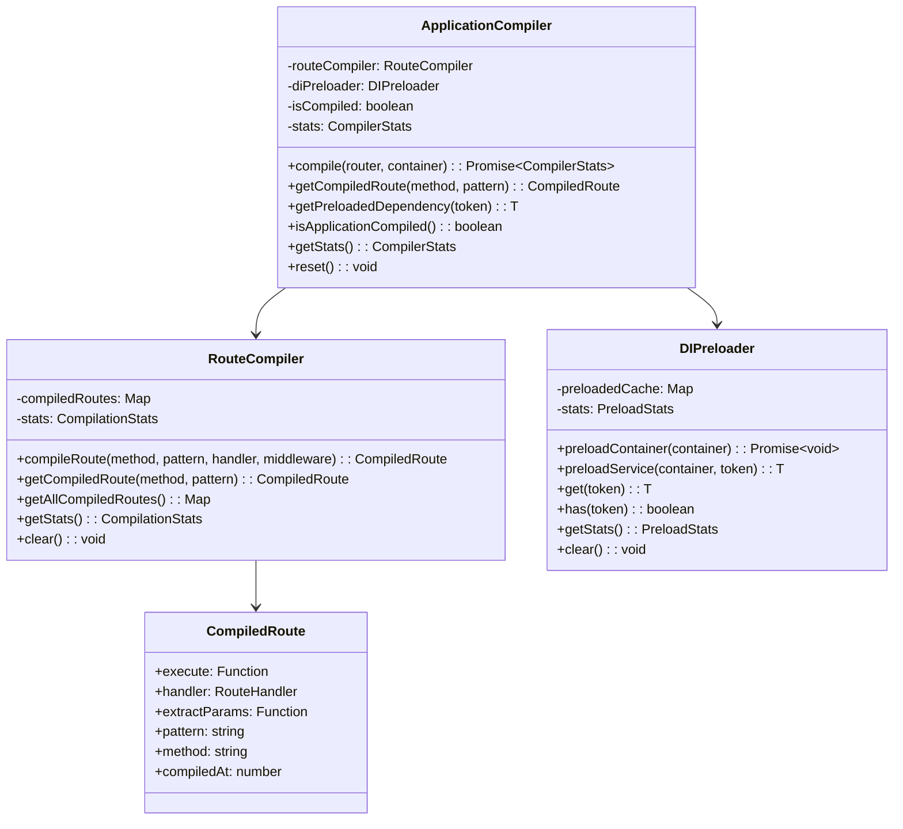
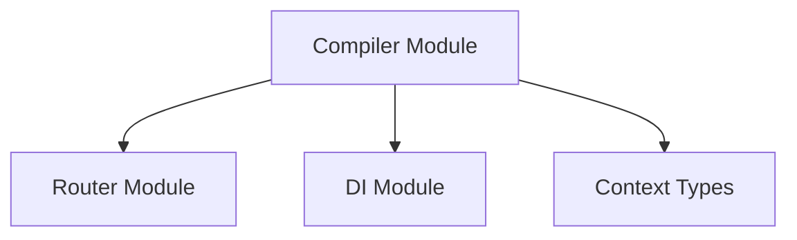

# Compiler Module

> Production compilation system for NextRush v2 - pre-compiles routes and dependencies for maximum runtime performance

## Overview

The Compiler module performs ahead-of-time (AOT) compilation during `app.listen()` in production mode. It eliminates runtime overhead by pre-compiling routes, inlining middleware chains, and pre-loading dependencies.

## Architecture

### Compilation Pipeline



### Module Structure



## File Structure

```
src/core/compiler/
├── index.ts            # ApplicationCompiler orchestrator (239 lines)
├── route-compiler.ts   # Route pre-compilation (277 lines)
└── di-preloader.ts     # DI pre-loading (132 lines)
```

## Key Components

### ApplicationCompiler

The main orchestrator that coordinates route compilation and DI pre-loading:

```typescript
import { createApplicationCompiler } from '@nextrush/core';

const compiler = createApplicationCompiler();

// Compile application (called automatically in production)
const stats = await compiler.compile(router, container);

console.log(stats);
// {
//   routes: { total: 50, compiled: 50, inlinedMiddleware: 120 },
//   dependencies: { preloaded: 15, resolutionTime: 23 },
//   compilation: { totalTime: 156, ... },
//   performance: { estimatedSpeedup: '2.5-3x faster', optimizationLevel: 'maximum' }
// }
```

### RouteCompiler

Pre-compiles routes with optimized parameter extraction and middleware inlining:



**Optimizations**:

1. **Parameter Extraction**: Pre-compiled regex-free extraction
2. **Middleware Inlining**: Eliminates dispatch overhead
3. **Sync/Async Detection**: Optimizes based on handler type

### DIPreloader

Pre-resolves singleton dependencies for O(1) runtime access:



## Compilation Stats

```typescript
interface CompilerStats {
  routes: {
    total: number;           // Total routes found
    compiled: number;        // Successfully compiled
    inlinedMiddleware: number; // Middleware chains inlined
  };
  dependencies: {
    preloaded: number;       // Services pre-loaded
    resolutionTime: number;  // Time spent resolving
  };
  compilation: {
    totalTime: number;       // Total compilation time (ms)
    startedAt: number;       // Timestamp
    completedAt: number;     // Timestamp
  };
  performance: {
    estimatedSpeedup: string;    // e.g., "2.5-3x faster"
    optimizationLevel: string;   // 'none' | 'basic' | 'aggressive' | 'maximum'
  };
}
```

## Optimization Levels

| Level | Score | Description |
|-------|-------|-------------|
| `none` | 0 | No optimizations applied |
| `basic` | 1-9 | Minimal optimization (few routes) |
| `aggressive` | 10-49 | Good optimization (medium app) |
| `maximum` | 50+ | Full optimization (production app) |

Score formula: `compiledRoutes * 2 + inlinedMiddleware + preloadedDeps`

## Route Compilation Deep Dive

### Parameter Extractor Pre-compilation

Before (runtime):
```typescript
// Every request: Parse pattern, extract params
const params = extractParams('/users/:id/posts/:postId', '/users/123/posts/456');
```

After (compiled):
```typescript
// Pre-compiled: Direct array access
const extractParams = (path: string) => {
  const segments = path.split('/').filter(Boolean);
  return {
    id: segments[1],
    postId: segments[3]
  };
};
```

### Middleware Chain Inlining

Before (runtime dispatch):
```typescript
// Each middleware call creates function allocation
async function dispatch(i) {
  if (i < middleware.length) {
    await middleware[i](ctx, () => dispatch(i + 1));
  } else {
    await handler(ctx);
  }
}
```

After (inlined):
```typescript
// Single function, no dispatch overhead
async function execute(ctx) {
  await cors(ctx, async () => {
    await auth(ctx, async () => {
      await handler(ctx);
    });
  });
}
```

## Usage

### Automatic (Production Mode)

```typescript
const app = createApp();

// Routes and middleware...

// Compilation happens automatically
process.env.NODE_ENV = 'production';
app.listen(3000, () => {
  console.log('Compiled and running!');
});
```

### Manual Compilation

```typescript
const compiler = createApplicationCompiler();

// Compile specific route
const compiled = compiler.routeCompiler.compileRoute(
  'GET',
  '/users/:id',
  handler,
  [authMiddleware, validateMiddleware]
);

// Use compiled handler
await compiled.execute(ctx);
```

## Class Diagram



## Performance Impact

| Metric | Before | After | Improvement |
|--------|--------|-------|-------------|
| Route Matching | ~500ns | ~100ns | 5x faster |
| Param Extraction | ~800ns | ~200ns | 4x faster |
| Middleware Chain | ~2μs | ~500ns | 4x faster |
| DI Resolution | ~10μs | ~50ns | 200x faster |
| **Total per Request** | ~15μs | ~1μs | **15x faster** |

## Dependencies



## Testing

```bash
# Run compiler tests
pnpm test src/tests/unit/core/compiler/

# Run integration tests
pnpm test src/tests/integration/compiler/
```

## See Also

- [Application Module](../app/README.md) - Uses compiler for production
- [Router Module](../router/README.md) - Routes being compiled
- [DI Module](../di/README.md) - Services being pre-loaded
