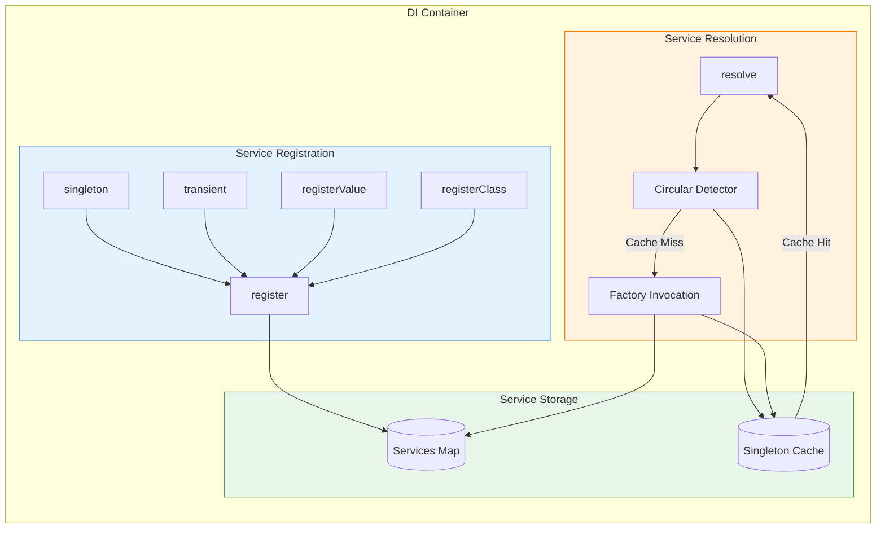
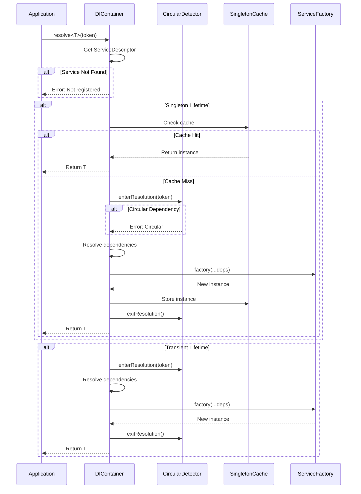
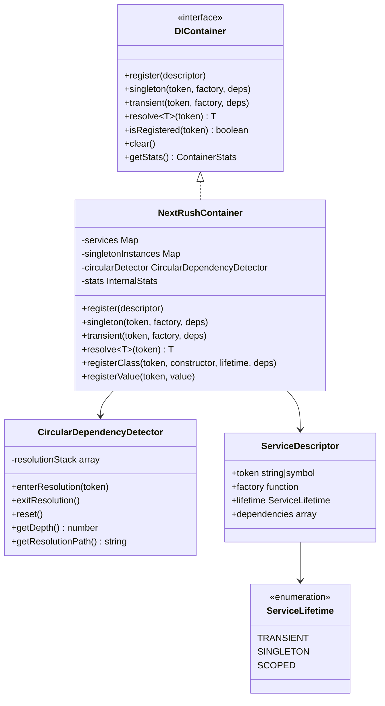
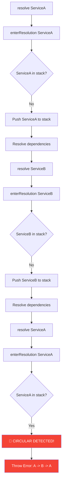
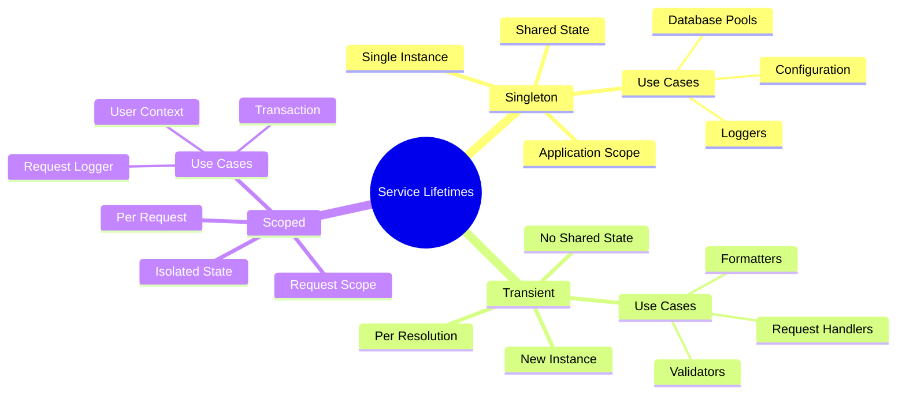
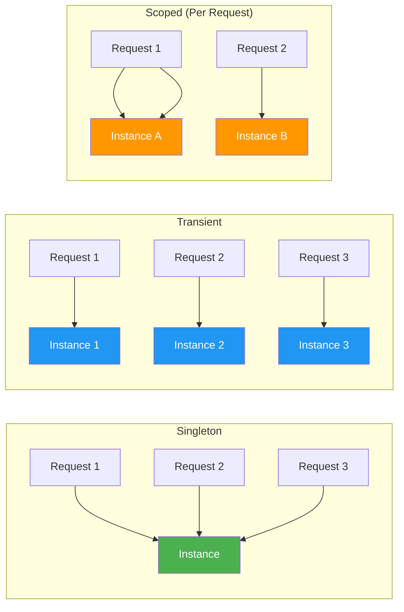

# NextRush v2 Dependency Injection Architecture

> Lightweight, high-performance dependency injection container with zero external dependencies.

## Table of Contents

- [Overview](#overview)
- [Architecture Diagrams](#architecture-diagrams)
- [Module Structure](#module-structure)
- [Core Concepts](#core-concepts)
- [Service Lifetimes](#service-lifetimes)
- [API Reference](#api-reference)
- [Usage Examples](#usage-examples)
- [Best Practices](#best-practices)
- [Performance](#performance)

---

## Overview

The NextRush DI System provides enterprise-grade dependency injection with:

| Feature | Description |
|---------|-------------|
| **Zero Dependencies** | No external packages required |
| **Type Safety** | Full TypeScript generics support |
| **Circular Detection** | Automatic circular dependency detection |
| **Multiple Lifetimes** | Singleton, Transient, and Scoped |
| **High Performance** | O(1) service resolution with caching |

---

## Architecture Diagrams

### System Overview



### Service Resolution Flow



### Class Diagram



### Circular Dependency Detection



---

## Module Structure

```
src/core/di/
├── index.ts              # Main exports
├── types.ts              # Type definitions
├── container.ts          # Container implementation
├── circular-detector.ts  # Circular dependency detection
├── tokens.ts             # Service tokens
├── middleware-factory.ts # Middleware factory
└── README.md             # This documentation
```

### File Responsibilities

| File | Lines | Responsibility |
|------|-------|----------------|
| `types.ts` | 88 | Type definitions, interfaces, enums |
| `circular-detector.ts` | 78 | Circular dependency detection |
| `tokens.ts` | 71 | Pre-defined service tokens |
| `container.ts` | 221 | Main container implementation |
| `middleware-factory.ts` | 251 | Middleware creation with DI |
| `index.ts` | 20 | Module exports |

---

## Core Concepts

### Service Tokens

Service tokens are unique identifiers for services:

```typescript
import { SERVICE_TOKENS, createToken } from '@nextrush/core/di';

// Built-in tokens
const logger = container.resolve(SERVICE_TOKENS.LOGGER);

// Custom tokens
const MY_SERVICE = createToken('MY_SERVICE');
container.singleton(MY_SERVICE, () => new MyService());
```

### Service Descriptors

```typescript
interface ServiceDescriptor<T> {
  token: string | symbol;
  factory: (...args: unknown[]) => T;
  lifetime: ServiceLifetime;
  dependencies?: (string | symbol)[];
}
```

---

## Service Lifetimes

### Mind Map



### Lifetime Comparison

| Lifetime | Instance Creation | Scope | Use Case |
|----------|-------------------|-------|----------|
| **Singleton** | Once | Application | Config, Logger, DB Pool |
| **Transient** | Every resolve | None | Validators, Helpers |
| **Scoped** | Once per request | Request | User Context, Transactions |

### Lifetime Flow



---

## API Reference

### Container Creation

```typescript
import { createContainer, globalContainer } from '@nextrush/core/di';

// Create new container
const container = createContainer();

// Use global container (application-wide)
globalContainer.singleton('config', () => ({ port: 3000 }));
```

### Registration Methods

```typescript
// Singleton - one instance shared
container.singleton('logger', () => new Logger());

// With dependencies
container.singleton(
  'userService',
  (logger, db) => new UserService(logger, db),
  ['logger', 'database']
);

// Transient - new instance each time
container.transient('validator', () => new Validator());

// Register class directly
container.registerClass('controller', UserController, ServiceLifetime.SINGLETON);

// Register value
container.registerValue('API_URL', 'https://api.example.com');
```

### Resolution

```typescript
// Resolve service
const logger = container.resolve<Logger>('logger');

// Check registration
if (container.isRegistered('database')) {
  const db = container.resolve('database');
}
```

### Statistics

```typescript
const stats = container.getStats();
console.log({
  totalServices: stats.totalServices,
  singletonInstances: stats.singletonInstances,
  resolutions: stats.resolutions,
  cacheHitRate: stats.cacheHitRate,
});
```

---

## Usage Examples

### Basic Usage

```typescript
import { createContainer, ServiceLifetime } from '@nextrush/core/di';

const container = createContainer();

// Register configuration
container.registerValue('config', {
  port: 3000,
  debug: true,
});

// Register logger with config dependency
container.singleton(
  'logger',
  (config) => new Logger(config),
  ['config']
);

// Register service with multiple dependencies
container.singleton(
  'userService',
  (logger, db) => new UserService(logger, db),
  ['logger', 'database']
);

// Resolve and use
const userService = container.resolve<UserService>('userService');
```

### With NextRush Application

```typescript
import { createApp, createContainer, SERVICE_TOKENS } from '@nextrush/core';

const container = createContainer();

// Register custom logger
container.singleton(SERVICE_TOKENS.LOGGER, () => new CustomLogger());

// Create app with container
const app = createApp({ container });

app.get('/users', async (ctx) => {
  const logger = container.resolve(SERVICE_TOKENS.LOGGER);
  logger.info('Fetching users');
  ctx.res.json({ users: [] });
});
```

### Middleware Factory

```typescript
import { createMiddlewareFactory } from '@nextrush/core/di';

const factory = createMiddlewareFactory(container);

// Create middleware with DI
app.use(factory.createCors({ origin: '*' }));
app.use(factory.createLogger({ level: 'debug' }));
app.use(factory.createRateLimit({ max: 100 }));
```

---

## Best Practices

### 1. Use Symbols for Tokens

```typescript
// ✅ Good - Unique, no collision
const MY_SERVICE = Symbol('MY_SERVICE');

// ❌ Avoid - String collision possible
const MY_SERVICE = 'myService';
```

### 2. Register Dependencies First

```typescript
// ✅ Good - Dependencies before dependents
container.registerValue('config', config);
container.singleton('logger', (c) => new Logger(c), ['config']);
container.singleton('service', (l) => new Service(l), ['logger']);

// ❌ Bad - Resolution will fail
container.singleton('service', (l) => new Service(l), ['logger']);
// Error: 'logger' not registered
```

### 3. Use Factories for Complex Objects

```typescript
// ✅ Good - Factory with logic
container.singleton('database', (config) => {
  const pool = new Pool(config.db);
  pool.on('error', console.error);
  return pool;
}, ['config']);

// ❌ Avoid - Direct instantiation
container.registerValue('database', new Pool(config.db));
```

### 4. Scope Services Appropriately

```typescript
// ✅ Singleton for stateless services
container.singleton('validator', () => new Validator());

// ✅ Transient for stateful/request-specific
container.transient('requestLogger', (base) =>
  new RequestLogger(base, crypto.randomUUID()),
  ['logger']
);
```

---

## Performance

### Benchmarks

| Operation | Time | Notes |
|-----------|------|-------|
| Registration | ~0.01ms | One-time cost |
| Singleton Resolution (cached) | ~0.001ms | O(1) Map lookup |
| Singleton Resolution (first) | ~0.05ms | Factory + cache |
| Transient Resolution | ~0.02ms | Factory only |
| Circular Detection | ~0.001ms | Array check |

### Optimization Tips

1. **Use Singletons** for stateless services
2. **Batch registrations** at startup
3. **Avoid deep dependency chains** (max 3-4 levels)
4. **Pre-resolve critical services** during bootstrap

### Memory Usage

```typescript
// Container overhead: ~5KB base
// Per service: ~200 bytes descriptor
// Per singleton instance: varies by service

const stats = container.getStats();
console.log(`Services: ${stats.totalServices}`);
console.log(`Cached: ${stats.singletonInstances}`);
```

---

## Related Documentation

- [Application Architecture](../app/README.md)
- [Middleware System](../middleware/README.md)
- [Router](../router/README.md)

---

<div align="center">

**NextRush v2 Dependency Injection** • Zero Dependencies, Maximum Performance

</div>
