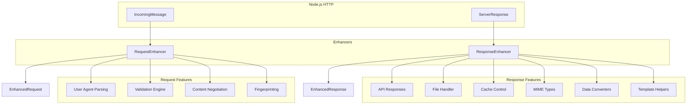
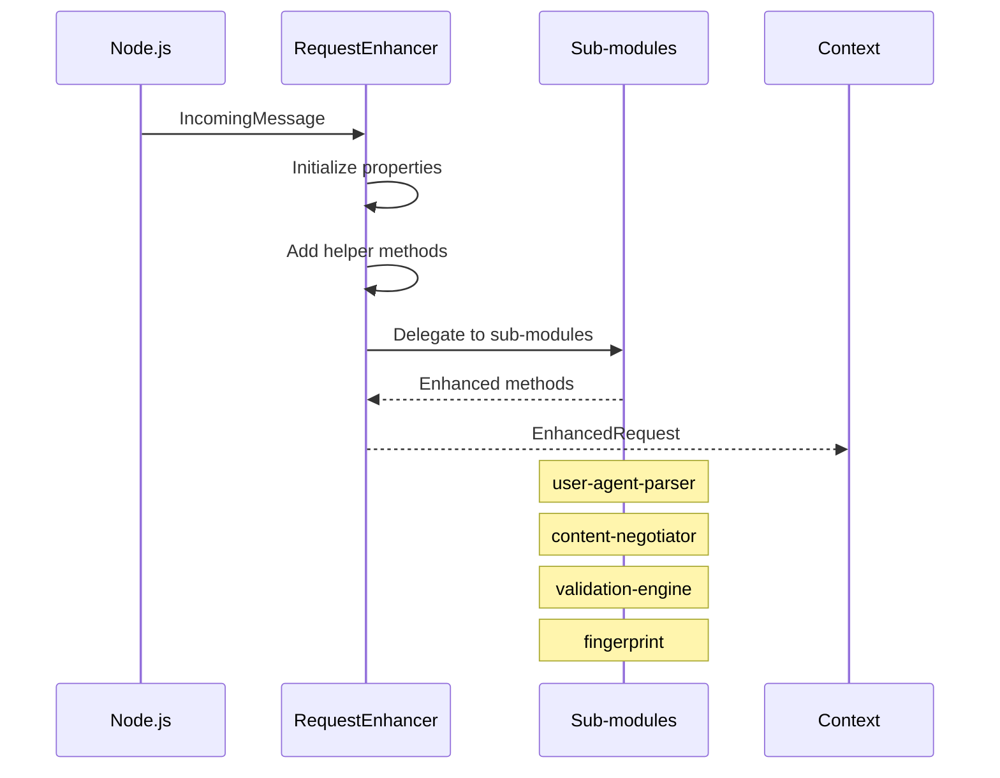
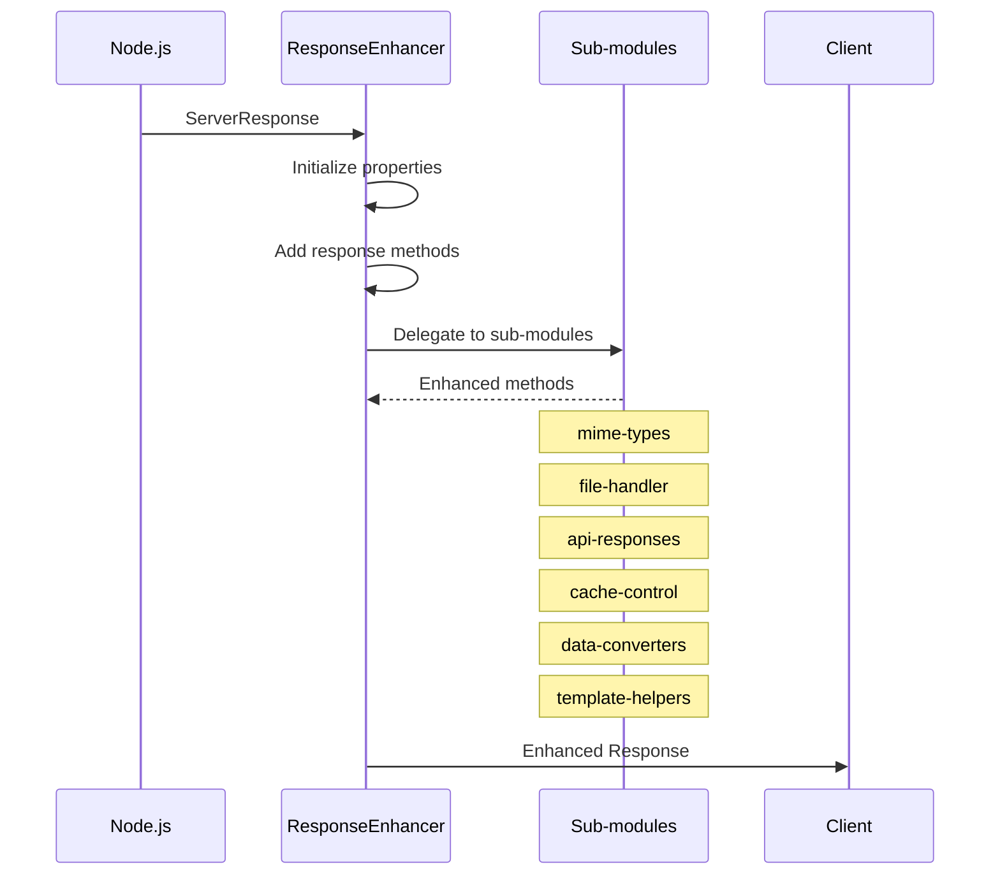
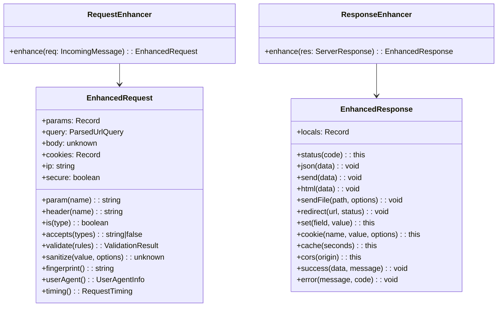
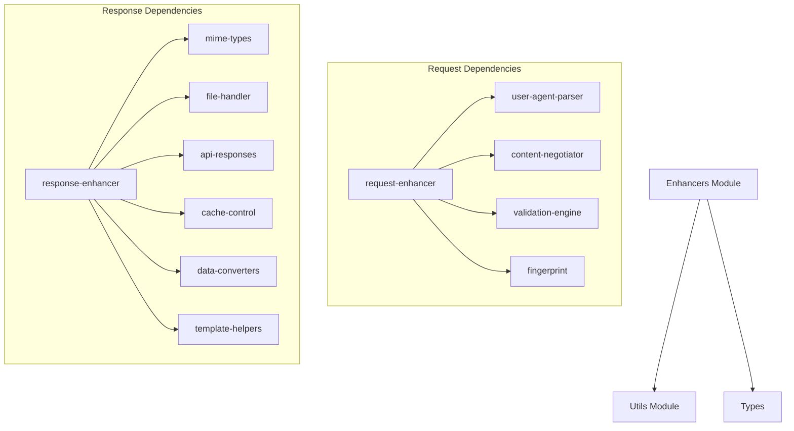

# Enhancers Module

> Request/Response enhancement layer for NextRush v2 - extends Node.js HTTP objects with Express-like features

## Overview

The Enhancers module transforms plain Node.js `IncomingMessage` and `ServerResponse` objects into feature-rich request/response objects with Express-like APIs. It provides validation, content negotiation, user agent parsing, file handling, caching, and more.

## Architecture

### System Overview



### Request Enhancement Flow



### Response Enhancement Flow



## File Structure

```
src/core/enhancers/
├── request-enhancer.ts        # Main request enhancer (300 lines)
├── response-enhancer.ts       # Main response enhancer (550 lines)
│
├── request/                   # Request enhancement modules
│   ├── index.ts              # Request module exports
│   ├── user-agent-parser.ts  # User agent parsing
│   ├── content-negotiator.ts # Content type negotiation
│   ├── validation-engine.ts  # Input validation
│   └── fingerprint.ts        # Request fingerprinting
│
└── response/                  # Response enhancement modules
    ├── index.ts              # Response module exports
    ├── mime-types.ts         # MIME type detection
    ├── file-handler.ts       # File serving
    ├── api-responses.ts      # Standardized API responses
    ├── cache-control.ts      # Cache header management
    ├── data-converters.ts    # Data format conversion
    └── template-helpers.ts   # Template rendering helpers
```

## Request Enhancer

### Core Properties

```typescript
interface EnhancedRequest extends IncomingMessage {
  // Express-like properties
  params: Record<string, string>;     // Route parameters
  query: ParsedUrlQuery;              // Query string
  body: unknown;                      // Parsed body
  pathname: string;                   // URL pathname
  originalUrl: string;                // Original URL
  path: string;                       // Request path
  cookies: Record<string, string>;    // Parsed cookies
  session: Record<string, unknown>;   // Session data
  locals: Record<string, unknown>;    // Request-scoped data
  startTime: number;                  // Request start timestamp

  // Security properties
  ip: string;                         // Client IP (proxy-aware)
  secure: boolean;                    // HTTPS connection
  protocol: string;                   // http or https
}
```

### Request Methods

```typescript
import { RequestEnhancer } from '@/core/enhancers/request-enhancer';

const enhanced = RequestEnhancer.enhance(req);

// Basic helpers
enhanced.param('id');                  // Get route param
enhanced.header('content-type');       // Get header
enhanced.get('authorization');         // Alias for header

// Content negotiation
enhanced.is('json');                   // Check content type
enhanced.accepts(['json', 'html']);    // Check Accept header

// Cookies
enhanced.parseCookies();               // Parse cookie header

// Validation
enhanced.validate({
  email: { type: 'email', required: true },
  age: { type: 'number', min: 0, max: 150 }
});

// Sanitization
enhanced.sanitize(input, { trim: true, escape: true });
enhanced.isValidEmail('user@example.com');
enhanced.isValidUrl('https://example.com');

// Security & Analytics
enhanced.fingerprint();                // Request fingerprint
enhanced.userAgent();                  // Parsed user agent
enhanced.timing();                     // Request timing info
enhanced.rateLimit();                  // Rate limit info
```

### Request Sub-modules

#### User Agent Parser

```typescript
import { parseUserAgent, isMobile, isBot } from '@/core/enhancers/request';

const ua = parseUserAgent(userAgentString);
// {
//   raw: 'Mozilla/5.0...',
//   browser: 'Chrome',
//   os: 'Windows',
//   device: 'Desktop',
//   isMobile: false,
//   isBot: false
// }
```

#### Validation Engine

```typescript
import { validate, sanitize } from '@/core/enhancers/request';

const result = validate(data, {
  username: { type: 'string', required: true, minLength: 3 },
  email: { type: 'email', required: true },
  age: { type: 'number', min: 0, max: 150 }
});
// { valid: true, errors: [], data: {...} }
```

#### Content Negotiator

```typescript
import { acceptsType, isContentType } from '@/core/enhancers/request';

acceptsType(headers, ['json', 'html']);  // 'json' or false
isContentType(headers, 'application/json');  // true/false
```

#### Fingerprint

```typescript
import { generateFingerprint, getRequestTiming } from '@/core/enhancers/request';

const fingerprint = generateFingerprint(headers, ip);
const timing = getRequestTiming(startTime);
// { start: 1234567890, duration: 123, timestamp: '...' }
```

## Response Enhancer

### Response Methods

```typescript
import { ResponseEnhancer } from '@/core/enhancers/response-enhancer';

const enhanced = ResponseEnhancer.enhance(res);

// Status management
enhanced.status(200);

// Core response methods
enhanced.json({ data: 'value' });
enhanced.send('text or buffer or object');
enhanced.html('<h1>Hello</h1>');
enhanced.text('Plain text');
enhanced.xml('<root><item/></root>');
enhanced.csv(dataArray, 'export.csv');
enhanced.stream(readableStream, 'video/mp4');

// File operations
enhanced.sendFile('/path/to/file.pdf');
enhanced.download('/path/to/file.pdf', 'document.pdf');

// Redirects
enhanced.redirect('/new-url');
enhanced.redirect('/new-url', 301);
enhanced.redirectPermanent('/new-url');
enhanced.redirectTemporary('/new-url');

// Headers
enhanced.set('X-Custom', 'value');
enhanced.set({ 'X-One': '1', 'X-Two': '2' });
enhanced.header('X-Custom', 'value');
enhanced.type('application/json');
enhanced.length(1024);
enhanced.etag('"abc123"');
enhanced.lastModified(new Date());

// Cookies
enhanced.cookie('session', 'token123', { httpOnly: true });
enhanced.clearCookie('session');

// Caching
enhanced.cache(3600);              // Cache for 1 hour
enhanced.noCache();                // Disable caching

// Security
enhanced.cors('https://example.com');
enhanced.security();               // Add security headers

// API helpers
enhanced.success(data, 'Operation successful');
enhanced.error('Not found', 404);
enhanced.paginate(items, page, limit, total);

// Template rendering
enhanced.render('<h1>{{title}}</h1>', { title: 'Hello' });
```

### Response Sub-modules

#### MIME Types

```typescript
import { getSmartContentType, getContentTypeFromExtension } from '@/core/enhancers/response';

getSmartContentType('/path/to/file.json');  // 'application/json'
getContentTypeFromExtension('.pdf');         // 'application/pdf'
```

#### File Handler

```typescript
import { sendFile, sendDownload, generateETag } from '@/core/enhancers/response';

sendFile(res, '/path/to/file.txt', { etag: true });
sendDownload(res, '/path/to/file.pdf', 'document.pdf');
generateETag(fileStats);  // '"abc123"'
```

#### API Responses

```typescript
import {
  sendSuccess, sendError, sendPaginated,
  sendNotFound, sendUnauthorized, sendForbidden
} from '@/core/enhancers/response';

sendSuccess(res, { user: userData });
sendError(res, 'Validation failed', 400, errors);
sendPaginated(res, items, { page: 1, limit: 20, total: 100 });
sendNotFound(res, 'User not found');
sendUnauthorized(res, 'Invalid token');
```

#### Cache Control

```typescript
import {
  setCache, setNoCache, setCorsHeaders, setSecurityHeaders
} from '@/core/enhancers/response';

setCache(res, 3600);                    // Cache for 1 hour
setNoCache(res);                        // Disable caching
setCorsHeaders(res, '*');               // CORS for all origins
setSecurityHeaders(res);                // Add security headers
```

#### Data Converters

```typescript
import { convertToCSV, parseCSV } from '@/core/enhancers/response';

const csv = convertToCSV([
  { name: 'John', age: 30 },
  { name: 'Jane', age: 25 }
]);
// "name,age\nJohn,30\nJane,25"

const data = parseCSV(csvString);
```

#### Template Helpers

```typescript
import {
  renderTemplate, getNestedValue, isTruthy, escapeHtmlEntities
} from '@/core/enhancers/response';

const html = renderTemplate('<h1>{{user.name}}</h1>', { user: { name: 'John' } });
const value = getNestedValue(obj, 'user.profile.email');
const escaped = escapeHtmlEntities('<script>alert("xss")</script>');
```

## Class Diagram



## Performance Features

1. **Lazy Evaluation**: Properties computed only when accessed
2. **Cookie Caching**: Parsed cookies cached on request
3. **Fast Header Building**: Optimized header construction
4. **Response Guards**: Prevents double responses

## Usage Example

```typescript
import { createApp } from '@nextrush/core';

const app = createApp();

app.get('/users/:id', async (ctx) => {
  // Request features (via ctx.req)
  const userId = ctx.req.param('id');
  const userAgent = ctx.req.userAgent();
  const fingerprint = ctx.req.fingerprint();

  // Validation
  const validation = ctx.req.validate({
    fields: { type: 'string', optional: true }
  });

  if (!validation.valid) {
    return ctx.res.error('Validation failed', 400, validation.errors);
  }

  // Response features (via ctx.res)
  ctx.res
    .cache(300)
    .security()
    .success({ id: userId, userAgent, fingerprint });
});

app.get('/download/:file', (ctx) => {
  ctx.res.download(`/uploads/${ctx.params.file}`);
});

app.post('/upload', async (ctx) => {
  const data = ctx.body;
  const sanitized = ctx.req.sanitizeObject(data, { trim: true, escape: true });
  ctx.res.success(sanitized);
});
```

## Dependencies



## Testing

```bash
# Run enhancer tests
pnpm test src/tests/unit/core/enhancers/

# Run integration tests
pnpm test src/tests/integration/enhancers/
```

## See Also

- [Application Module](../app/README.md) - Uses enhancers for context
- [Orchestration Module](../orchestration/README.md) - Coordinates enhancement
- [Utils Module](../utils/README.md) - Shared utilities
