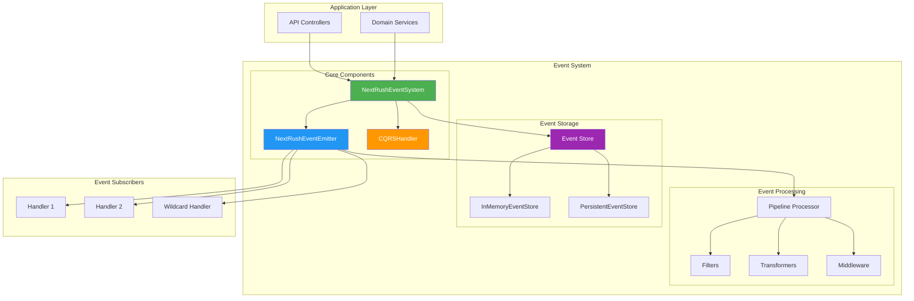
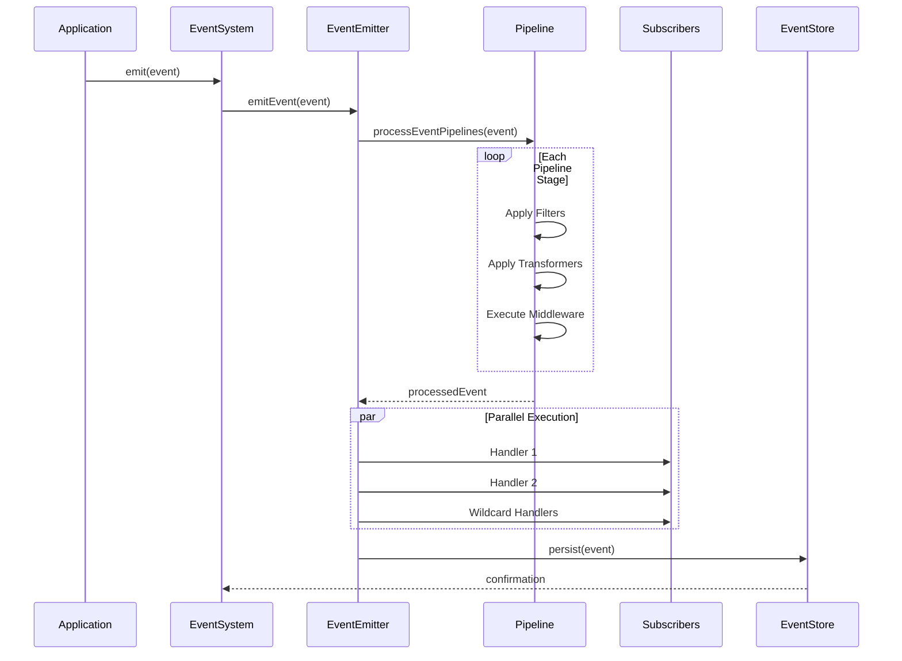
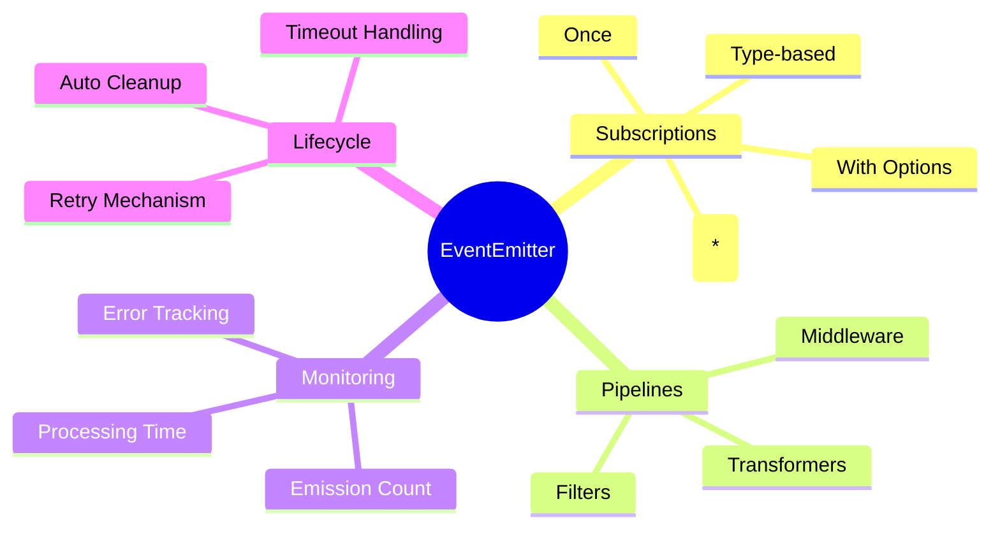
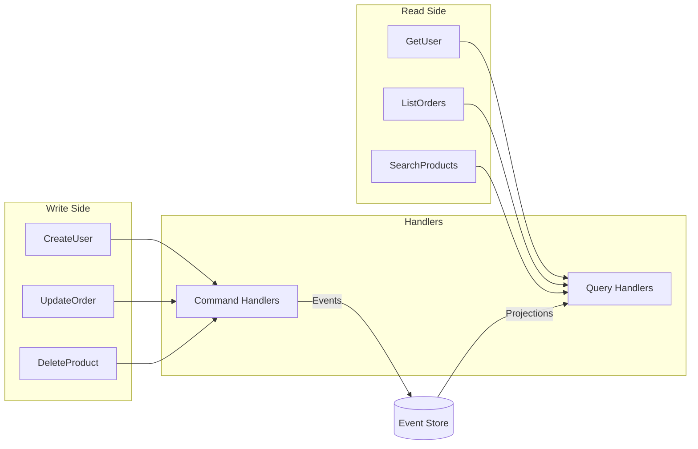
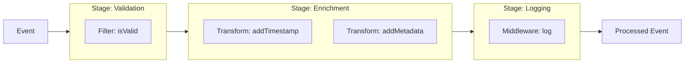
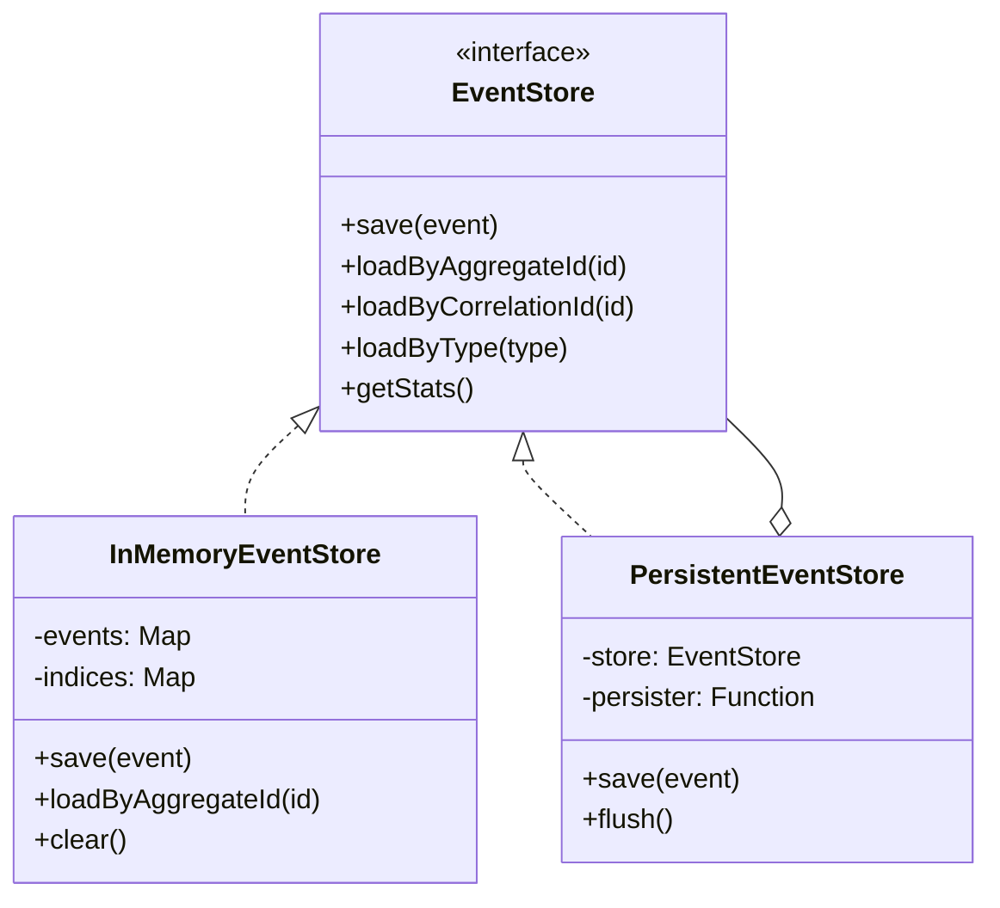

# NextRush v2 Event System Architecture

> A comprehensive, enterprise-grade event-driven architecture with CQRS, Event Sourcing, and pipeline processing capabilities.

## Table of Contents

- [Overview](#overview)
- [Architecture Diagram](#architecture-diagram)
- [Module Structure](#module-structure)
- [Core Concepts](#core-concepts)
- [Quick Start](#quick-start)
- [Event Emitter](#event-emitter)
- [Event System](#event-system)
- [CQRS Pattern](#cqrs-pattern)
- [Event Pipelines](#event-pipelines)
- [Event Store](#event-store)
- [Simple Events API](#simple-events-api)
- [Type Definitions](#type-definitions)
- [Best Practices](#best-practices)

---

## Overview

The NextRush Event System provides a complete event-driven architecture with:

| Feature | Description |
|---------|-------------|
| **Event Emission** | High-performance, type-safe event emission and subscription |
| **CQRS** | Command/Query Responsibility Segregation for clean architecture |
| **Event Sourcing** | Aggregate streams with replay capabilities |
| **Pipelines** | Middleware-based event transformation and filtering |
| **Monitoring** | Built-in metrics and performance tracking |
| **Simple API** | Express-style facade for easy adoption |

---

## Architecture Diagram



---

## Module Structure

```
src/core/events/
├── index.ts                    # Main exports
├── README.md                   # This documentation
│
├── emitter/                    # Event Emission Layer
│   ├── event-emitter.ts        # NextRushEventEmitter class
│   ├── pipeline-processor.ts   # Pipeline execution logic
│   ├── metrics.ts              # MetricsManager class
│   ├── types.ts                # Internal type definitions
│   └── index.ts                # Module exports
│
├── system/                     # High-Level Event System
│   ├── event-system.ts         # NextRushEventSystem class
│   ├── cqrs-handler.ts         # Command/Query handler
│   ├── builder.ts              # EventSystemBuilder
│   ├── simple-events.ts        # SimpleEventsAPI facade
│   ├── types.ts                # System type definitions
│   └── index.ts                # Module exports
│
├── store/                      # Event Persistence
│   ├── in-memory-store.ts      # InMemoryEventStore
│   ├── persistent-store.ts     # PersistentEventStore decorator
│   ├── factory.ts              # EventStoreFactory
│   └── index.ts                # Module exports
│
└── utils/                      # Shared Utilities
    ├── constants.ts            # System constants
    ├── event-helpers.ts        # Helper functions
    └── index.ts                # Module exports
```

---

## Core Concepts

### Event Structure

Every event in NextRush follows this structure:

```typescript
interface Event<TType = string, TData = unknown> {
  readonly type: TType;           // Event type identifier
  readonly data: TData;           // Event payload
  readonly metadata: {
    readonly id: string;          // Unique event ID
    readonly timestamp: number;   // Unix timestamp
    readonly source: string;      // Origin of the event
    readonly version: number;     // Schema version
    readonly correlationId?: string;
    readonly causationId?: string;
  };
}
```

### Event Flow



---

## Quick Start

### Basic Usage

```typescript
import { createEventSystemBuilder } from '@nextrush/core/events';

// Create event system
const eventSystem = createEventSystemBuilder()
  .withEventStore('memory', 10000)
  .withMonitoring()
  .build();

// Subscribe to events
eventSystem.subscribe('user.created', async (event) => {
  console.log('User created:', event.data);
});

// Emit events
await eventSystem.emitEvent('user.created', {
  userId: '123',
  email: 'user@example.com'
});
```

### Using Simple API (Express-style)

```typescript
import { createSimpleEventsAPI } from '@nextrush/core/events';

const events = createSimpleEventsAPI();

// Subscribe with string event names
events.on('user:login', (data) => {
  console.log('User logged in:', data);
});

// Emit events
await events.emit('user:login', { userId: '123' });
```

---

## Event Emitter

The `NextRushEventEmitter` is the core event emission engine.

### Features



### API Reference

```typescript
class NextRushEventEmitter {
  // Subscription
  subscribe<T extends Event>(eventType: string, handler: EventHandler<T>): EventSubscription;
  subscribeWithOptions<T extends Event>(eventType: string, definition: EventHandlerDefinition<T>): EventSubscription;
  unsubscribeAll(eventType: string): Promise<void>;

  // Emission
  emitEvent<T extends Event>(event: T): Promise<void>;

  // Pipelines
  addPipeline<T extends Event>(eventType: string, pipeline: EventPipelineConfig<T>): void;
  removePipeline(eventType: string, pipelineName: string): void;

  // Monitoring
  getMetrics(): EventMetrics;
  setMonitoring(enabled: boolean): void;

  // Lifecycle
  destroy(): void;
}
```

### Subscription Options

```typescript
const subscription = emitter.subscribeWithOptions('order.created', {
  handler: async (event) => {
    await processOrder(event.data);
  },
  priority: 10,           // Higher = executed first
  timeout: 5000,          // Handler timeout in ms
  once: false,            // One-time subscription
  retry: {
    maxAttempts: 3,
    delay: 1000,
    backoffMultiplier: 2
  }
});

// Later: unsubscribe
await subscription.unsubscribe();
```

---

## Event System

The `NextRushEventSystem` provides a complete event-driven architecture.

### Configuration

```typescript
const eventSystem = createEventSystemBuilder()
  .withEventStore('memory', 50000)  // Enable event store
  .withMonitoring()                  // Enable metrics
  .withTimeout(10000)                // Default handler timeout
  .build();

// Or with direct configuration
const eventSystem = new NextRushEventSystem({
  enableEventStore: true,
  eventStoreType: 'memory',
  maxStoredEvents: 50000,
  enableMonitoring: true,
  defaultTimeout: 10000
});
```

### Domain Events

```typescript
// Emit domain events with aggregate information
await eventSystem.emitDomainEvent(
  'order.completed',
  { orderId: '123', total: 99.99 },
  'order-123',           // aggregateId
  'Order',               // aggregateType
  5                      // sequenceNumber
);

// Load aggregate events (Event Sourcing)
const orderEvents = await eventSystem.loadAggregateEvents('order-123');
```

---

## CQRS Pattern

The event system implements CQRS (Command Query Responsibility Segregation).

### Architecture



### Command Handling

```typescript
// Define command type
interface CreateUserCommand extends Command<'CreateUser', {
  email: string;
  name: string;
}> {}

// Register handler
eventSystem.registerCommandHandler<CreateUserCommand, User>(
  'CreateUser',
  async (command) => {
    const user = await userService.create(command.data);

    // Emit domain event
    await eventSystem.emitDomainEvent(
      'user.created',
      { userId: user.id },
      user.id,
      'User',
      1
    );

    return user;
  }
);

// Execute command
const user = await eventSystem.executeCommand({
  type: 'CreateUser',
  data: { email: 'user@example.com', name: 'John' },
  metadata: createEventMetadata({ source: 'api' })
});
```

### Query Handling

```typescript
// Define query type
interface GetUserQuery extends Query<'GetUser', { userId: string }> {}

// Register handler
eventSystem.registerQueryHandler<GetUserQuery, User | null>(
  'GetUser',
  async (query) => {
    return userService.findById(query.data.userId);
  }
);

// Execute query
const user = await eventSystem.executeQuery({
  type: 'GetUser',
  data: { userId: '123' },
  metadata: createEventMetadata({ source: 'api' })
});
```

---

## Event Pipelines

Pipelines provide middleware-based event transformation.

### Pipeline Structure



### Pipeline Configuration

```typescript
eventSystem.addPipeline('order.created', {
  name: 'order-processing-pipeline',
  stages: [
    {
      name: 'validation',
      filters: [
        (event) => event.data.total > 0,
        (event) => !!event.data.customerId
      ]
    },
    {
      name: 'enrichment',
      transformers: [
        (event) => ({
          ...event,
          data: {
            ...event.data,
            processedAt: Date.now()
          }
        })
      ]
    },
    {
      name: 'logging',
      middleware: [
        async (event, next) => {
          console.log('Processing order:', event.data.orderId);
          await next();
          console.log('Order processed');
        }
      ]
    }
  ],
  errorHandling: 'continue' // 'stop' | 'continue' | 'retry'
});
```

### Pipeline Components

| Component | Purpose | Example |
|-----------|---------|---------|
| **Filter** | Gate events based on conditions | `(e) => e.data.amount > 100` |
| **Transformer** | Modify event data | `(e) => ({ ...e, data: {...} })` |
| **Middleware** | Execute side effects | `async (e, next) => { log(e); await next(); }` |

---

## Event Store

The Event Store provides persistence for event sourcing.

### Store Types



### Usage

```typescript
import { createEventStore, EventStoreFactory } from '@nextrush/core/events';

// Using builder
const store = createEventStore()
  .inMemory()
  .withMaxEvents(100000)
  .withPersistence(async (events) => {
    await db.saveEvents(events);
  })
  .build();

// Using factory
const store = EventStoreFactory.create('memory', { maxEvents: 100000 });

// Save events
await store.save(event);

// Load events
const events = await store.loadByAggregateId('order-123', {
  afterSequence: 5,
  limit: 100
});

// Get statistics
const stats = await store.getStats();
console.log(`Total events: ${stats.totalEvents}`);
```

### Event Store Statistics

```typescript
interface EventStoreStats {
  totalEvents: number;
  eventsByType: Record<string, number>;
  oldestEvent: Date | null;
  newestEvent: Date | null;
  memoryUsage: number;
}
```

---

## Simple Events API

A simplified, Express-style API for common use cases.

```typescript
import { createSimpleEventsAPI } from '@nextrush/core/events';

const events = createSimpleEventsAPI();

// Subscribe
events.on('user:created', (data) => console.log(data));
events.once('app:started', (data) => console.log('Started!'));

// Emit
await events.emit('user:created', { userId: '123' });

// Unsubscribe
events.off('user:created');

// Clear all
events.clear();
```

### Comparison

| Feature | SimpleEventsAPI | NextRushEventSystem |
|---------|-----------------|---------------------|
| Type Safety | Basic | Full |
| Pipelines | ❌ | ✅ |
| CQRS | ❌ | ✅ |
| Event Store | ❌ | ✅ |
| Monitoring | ❌ | ✅ |
| Use Case | Simple apps | Enterprise apps |

---

## Type Definitions

### Core Types

```typescript
// Base event
interface Event<TType = string, TData = unknown> {
  readonly type: TType;
  readonly data: TData;
  readonly metadata: BaseEventMetadata;
}

// Domain event (for event sourcing)
interface DomainEvent<TType = string, TData = unknown> extends Event<TType, TData> {
  readonly aggregateId: string;
  readonly aggregateType: string;
  readonly sequenceNumber: number;
}

// System event (framework events)
interface SystemEvent<TType = string, TData = unknown> extends Event<TType, TData> {
  readonly component: string;
  readonly level: 'debug' | 'info' | 'warn' | 'error';
}

// Command (CQRS write side)
interface Command<TType = string, TData = unknown> extends Event<TType, TData> {}

// Query (CQRS read side)
interface Query<TType = string, TData = unknown> extends Event<TType, TData> {}
```

### Handler Types

```typescript
// Basic handler
type EventHandler<T extends Event> = (event: T) => Promise<void> | void;

// Handler with options
interface EventHandlerDefinition<T extends Event> {
  handler: EventHandler<T>;
  priority?: number;
  timeout?: number;
  once?: boolean;
  retry?: {
    maxAttempts: number;
    delay: number;
    backoffMultiplier?: number;
  };
}

// Subscription handle
interface EventSubscription {
  id: string;
  unsubscribe(): Promise<void>;
  isActive(): boolean;
}
```

---

## Best Practices

### 1. Event Naming Convention

```typescript
// Use domain.action format
'user.created'
'order.completed'
'payment.failed'

// Use namespaces for complex domains
'inventory.stock.updated'
'shipping.label.generated'
```

### 2. Event Immutability

```typescript
// ✅ Good: Create new event with modifications
const enrichedEvent = {
  ...event,
  data: { ...event.data, enrichedAt: Date.now() }
};

// ❌ Bad: Mutating event directly
event.data.enrichedAt = Date.now();
```

### 3. Error Handling

```typescript
eventSystem.subscribe('order.created', {
  handler: async (event) => {
    try {
      await processOrder(event.data);
    } catch (error) {
      // Log error but don't throw to prevent blocking other handlers
      logger.error('Order processing failed', { error, event });
    }
  },
  retry: {
    maxAttempts: 3,
    delay: 1000,
    backoffMultiplier: 2
  }
});
```

### 4. Use Domain Events for State Changes

```typescript
// ✅ Good: Emit domain events for aggregate changes
async function completeOrder(orderId: string) {
  const order = await orderRepo.findById(orderId);
  order.complete();

  await eventSystem.emitDomainEvent(
    'order.completed',
    { orderId, total: order.total },
    orderId,
    'Order',
    order.version
  );
}

// ❌ Bad: Direct state changes without events
async function completeOrder(orderId: string) {
  await db.update('orders', { id: orderId }, { status: 'completed' });
}
```

### 5. Pipeline Organization

```typescript
// Separate concerns into different pipelines
eventSystem.addPipeline('order.created', {
  name: 'validation-pipeline',
  stages: [/* validation stages */],
  errorHandling: 'stop'
});

eventSystem.addPipeline('order.created', {
  name: 'notification-pipeline',
  stages: [/* notification stages */],
  errorHandling: 'continue'
});
```

---

## Metrics & Monitoring

```typescript
// Get metrics
const metrics = eventSystem.getMetrics();

console.log('Events emitted:', metrics.eventsEmitted);
console.log('Events processed:', metrics.eventsProcessed);
console.log('Processing errors:', metrics.processingErrors);
console.log('Avg processing time:', metrics.averageProcessingTime);
console.log('Pipeline stats:', metrics.pipelineStats);
console.log('Memory usage:', metrics.memoryUsage);
```

### Metrics Structure

```typescript
interface EventMetrics {
  eventsEmitted: Record<string, number>;
  eventsProcessed: Record<string, number>;
  processingErrors: Record<string, number>;
  averageProcessingTime: Record<string, number>;
  pipelineStats: Record<string, PipelineStats>;
  memoryUsage: {
    heapUsed: number;
    heapTotal: number;
    external: number;
  };
}
```

---

## Performance Considerations

| Aspect | Recommendation |
|--------|----------------|
| **Subscriptions** | Use specific event types over wildcards when possible |
| **Pipelines** | Keep pipeline stages lightweight; move heavy work to handlers |
| **Event Store** | Configure appropriate `maxEvents` to prevent memory issues |
| **Handlers** | Use async handlers and appropriate timeouts |
| **Cleanup** | Call `shutdown()` on application termination |

---

## Related Documentation

- [Application Architecture](../../app/README.md)
- [Middleware System](../../middleware/README.md)
- [Types Reference](../../../types/events.ts)

---

<div align="center">

**NextRush v2 Event System** • Built for Enterprise Scale

</div>
