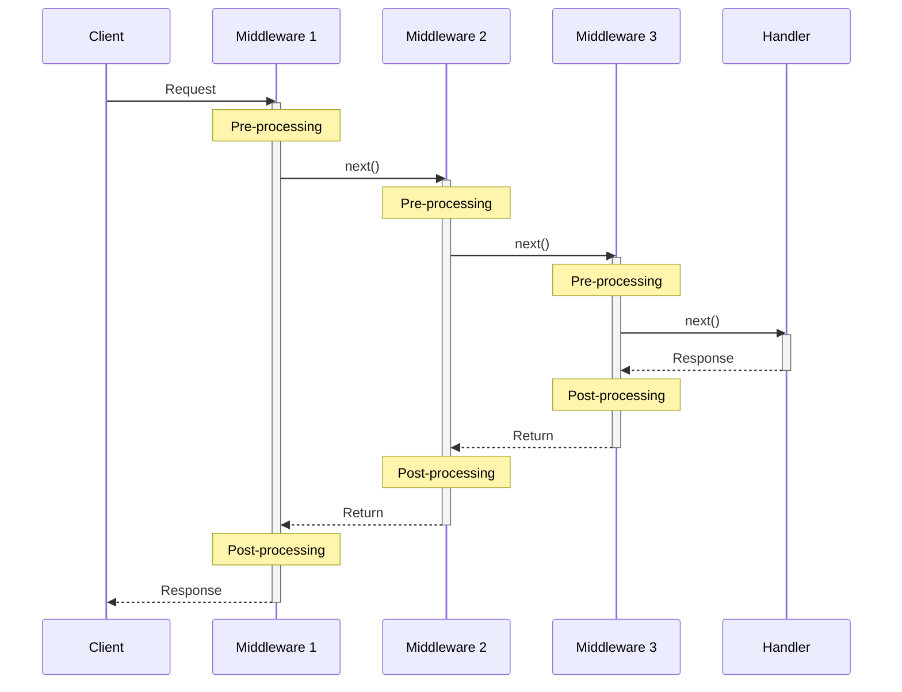
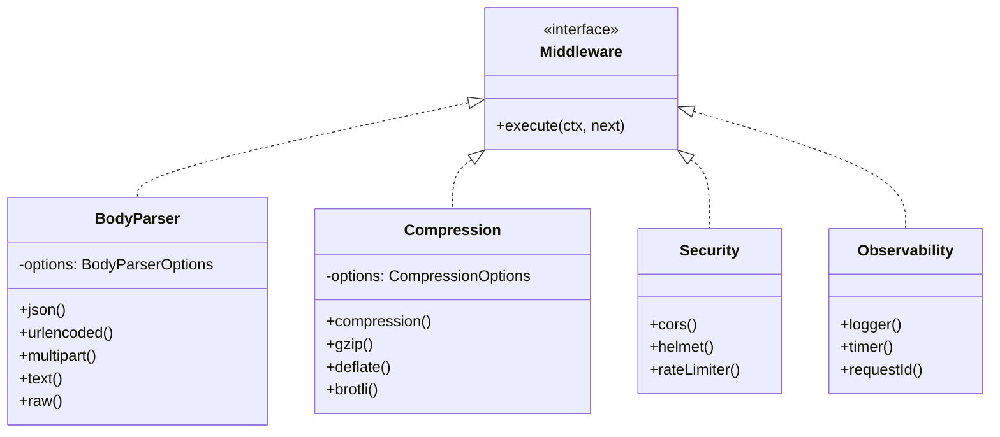
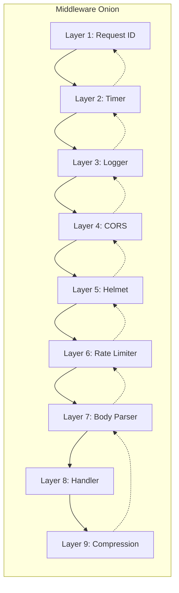
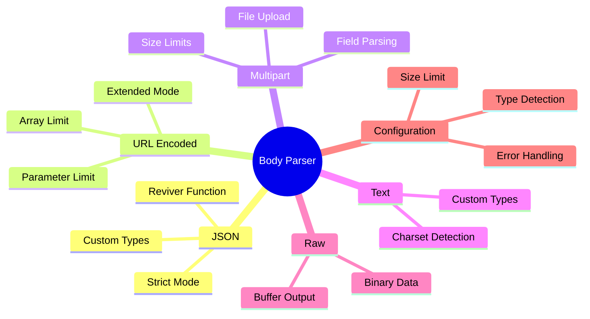
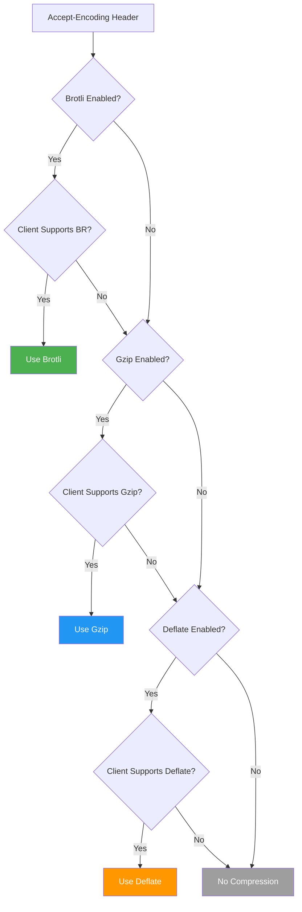
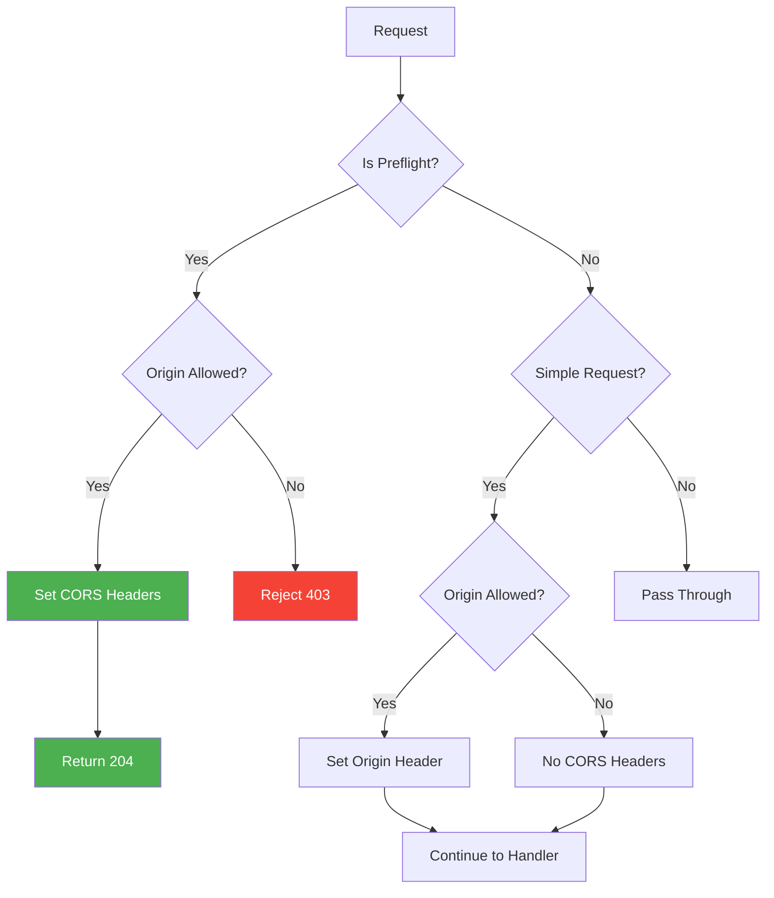
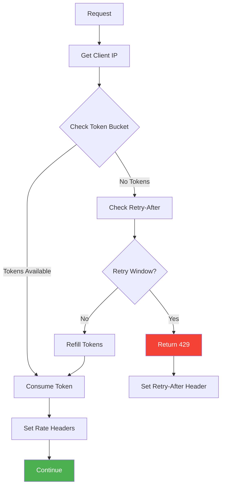
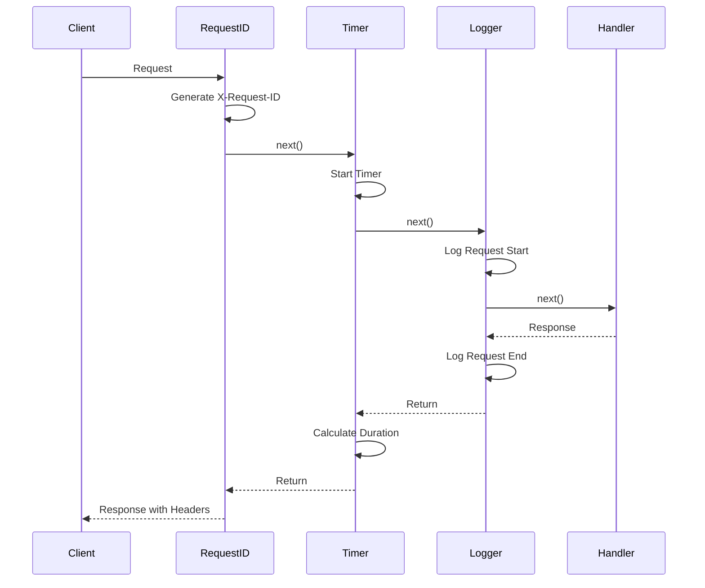

# NextRush v2 Middleware Architecture

> Enterprise-grade middleware system with built-in security, performance, and observability features.

## Table of Contents

- [Overview](#overview)
- [Architecture Diagrams](#architecture-diagrams)
- [Module Structure](#module-structure)
- [Middleware Pipeline](#middleware-pipeline)
- [Built-in Middleware](#built-in-middleware)
- [Body Parser](#body-parser)
- [Compression](#compression)
- [Security Middleware](#security-middleware)
- [Observability Middleware](#observability-middleware)
- [Custom Middleware](#custom-middleware)
- [Best Practices](#best-practices)
- [Performance Considerations](#performance-considerations)

---

## Overview

The NextRush Middleware System provides a comprehensive set of built-in middleware for:

| Category | Middleware | Purpose |
|----------|------------|---------|
| **Parsing** | Body Parser | JSON, URL-encoded, multipart, text, raw |
| **Compression** | Compression | Gzip, Deflate, Brotli |
| **Security** | CORS, Helmet | Cross-origin, security headers |
| **Performance** | Rate Limiter | Request throttling |
| **Observability** | Logger, Timer, Request ID | Logging, metrics, tracing |

---

## Architecture Diagrams

### System Overview

```mermaid
flowchart TB
    subgraph Request["Incoming Request"]
        REQ[HTTP Request]
    end

    subgraph MiddlewarePipeline["Middleware Pipeline"]
        direction TB

        subgraph PreProcessing["Pre-Processing"]
            RID[Request ID]
            TIM[Timer]
            LOG1[Logger Start]
        end

        subgraph Security["Security Layer"]
            CORS[CORS]
            HELM[Helmet]
            RATE[Rate Limiter]
        end

        subgraph Parsing["Body Parsing"]
            JSON[JSON Parser]
            URL[URL Encoded]
            MULT[Multipart]
            TEXT[Text/Raw]
        end

        subgraph Application["Application"]
            ROUTE[Router]
            HAND[Handlers]
        end

        subgraph PostProcessing["Post-Processing"]
            COMP[Compression]
            LOG2[Logger End]
        end
    end

    subgraph Response["Outgoing Response"]
        RES[HTTP Response]
    end

    REQ --> RID
    RID --> TIM
    TIM --> LOG1
    LOG1 --> CORS
    CORS --> HELM
    HELM --> RATE
    RATE --> JSON
    JSON --> URL
    URL --> MULT
    MULT --> TEXT
    TEXT --> ROUTE
    ROUTE --> HAND
    HAND --> COMP
    COMP --> LOG2
    LOG2 --> RES

    style PreProcessing fill:#E3F2FD,stroke:#1976D2
    style Security fill:#FFEBEE,stroke:#C62828
    style Parsing fill:#E8F5E9,stroke:#388E3C
    style Application fill:#FFF3E0,stroke:#F57C00
    style PostProcessing fill:#F3E5F5,stroke:#7B1FA2
```



### Middleware Execution Flow



### Class Hierarchy



---

## Module Structure

```
src/core/middleware/
├── index.ts                 # Main exports
├── types.ts                 # Shared type definitions
├── README.md                # This documentation
│
├── body-parser/             # Request body parsing
│   ├── index.ts             # Module exports & main middleware
│   ├── types.ts             # Body parser types
│   ├── json-parser.ts       # JSON body parsing
│   ├── url-encoded-parser.ts # URL-encoded parsing
│   ├── multipart-parser.ts  # Multipart form parsing
│   ├── text-raw-parsers.ts  # Text and raw body parsing
│   ├── utils.ts             # Shared utilities
│   └── http-error.ts        # HTTP error handling
│
├── compression/             # Response compression
│   ├── index.ts             # Module exports
│   ├── compression.ts       # Main compression middleware
│   ├── stream-wrapper.ts    # Compression stream wrapper
│   ├── utils.ts             # Compression utilities
│   └── types.ts             # Compression types
│
├── cors.ts                  # CORS middleware
├── helmet.ts                # Security headers
├── rate-limiter.ts          # Rate limiting
├── logger.ts                # Request/response logging
├── timer.ts                 # Request timing
└── request-id.ts            # Request ID generation
```

---

## Middleware Pipeline

### Onion Model



### Context Flow

```typescript
// Middleware signature
type Middleware = (ctx: Context, next: () => Promise<void>) => Promise<void>;

// Example middleware
const myMiddleware: Middleware = async (ctx, next) => {
  // Pre-processing (before handler)
  console.log('Before:', ctx.method, ctx.path);

  await next(); // Call next middleware/handler

  // Post-processing (after handler)
  console.log('After:', ctx.status);
};
```

---

## Built-in Middleware

### Quick Reference

```typescript
import {
  bodyParser,
  compression,
  cors,
  helmet,
  rateLimiter,
  logger,
  timer,
  requestId
} from '@nextrush/core/middleware';

const app = createApp();

// Recommended order
app.use(requestId());           // 1. Generate request ID
app.use(timer());               // 2. Start timing
app.use(logger());              // 3. Log requests
app.use(cors());                // 4. Handle CORS
app.use(helmet());              // 5. Security headers
app.use(rateLimiter());         // 6. Rate limiting
app.use(bodyParser());          // 7. Parse body
// ... routes ...
app.use(compression());         // Last: Compress response
```

---

## Body Parser

Parse incoming request bodies in various formats.

### Mind Map



### Usage

```typescript
import { bodyParser, json, urlencoded, multipart } from '@nextrush/core/middleware';

// All-in-one (auto-detects content type)
app.use(bodyParser({
  json: { limit: '1mb', strict: true },
  urlencoded: { extended: true, limit: '1mb' },
  multipart: { maxFileSize: 10 * 1024 * 1024 },
  text: { limit: '1mb' },
  raw: { limit: '5mb' }
}));

// Or use individual parsers
app.use(json({ limit: '100kb' }));
app.use(urlencoded({ extended: true }));
```

### Options

| Option | Type | Default | Description |
|--------|------|---------|-------------|
| `limit` | string/number | '100kb' | Maximum body size |
| `strict` | boolean | true | Only parse arrays and objects |
| `type` | string/string[] | 'application/json' | Content types to parse |
| `reviver` | function | - | JSON.parse reviver |

---

## Compression

Compress response bodies using gzip, deflate, or brotli.

### Algorithm Selection Flow



### Usage

```typescript
import { compression, gzip, brotli } from '@nextrush/core/middleware';

// Auto-select best algorithm
app.use(compression({
  gzip: true,
  brotli: true,
  level: 6,
  threshold: 1024,
  contentType: ['text/*', 'application/json'],
  exclude: ['image/*', 'video/*']
}));

// Specific algorithm
app.use(gzip({ level: 9 }));
app.use(brotli({ level: 4 }));

// Adaptive compression (skip under high CPU)
app.use(compression({
  adaptive: true,
  maxCpuUsage: 80
}));
```

### Options

| Option | Type | Default | Description |
|--------|------|---------|-------------|
| `gzip` | boolean | true | Enable gzip |
| `deflate` | boolean | false | Enable deflate |
| `brotli` | boolean | false | Enable brotli |
| `level` | number | 6 | Compression level (0-9) |
| `threshold` | number | 1024 | Minimum size to compress |
| `adaptive` | boolean | false | Skip under high CPU |
| `maxCpuUsage` | number | 80 | CPU threshold % |

---

## Security Middleware

### CORS



```typescript
import { cors } from '@nextrush/core/middleware';

app.use(cors({
  origin: ['https://example.com', 'https://app.example.com'],
  methods: ['GET', 'POST', 'PUT', 'DELETE'],
  allowedHeaders: ['Content-Type', 'Authorization'],
  credentials: true,
  maxAge: 86400
}));
```

### Helmet

```typescript
import { helmet } from '@nextrush/core/middleware';

app.use(helmet({
  contentSecurityPolicy: {
    directives: {
      defaultSrc: ["'self'"],
      scriptSrc: ["'self'", "'unsafe-inline'"]
    }
  },
  hsts: { maxAge: 31536000, includeSubDomains: true },
  noSniff: true,
  xssFilter: true
}));
```

### Rate Limiter



```typescript
import { rateLimiter } from '@nextrush/core/middleware';

app.use(rateLimiter({
  windowMs: 60000,        // 1 minute
  max: 100,               // 100 requests per window
  keyGenerator: (ctx) => ctx.ip,
  skip: (ctx) => ctx.path === '/health',
  handler: (ctx) => {
    ctx.status = 429;
    ctx.body = { error: 'Too many requests' };
  }
}));
```

---

## Observability Middleware

### Request Lifecycle



### Logger

```typescript
import { logger } from '@nextrush/core/middleware';

app.use(logger({
  format: 'combined',     // 'combined' | 'common' | 'dev' | 'short' | 'tiny'
  skip: (ctx) => ctx.path === '/health',
  stream: process.stdout,
  customTokens: {
    userId: (ctx) => ctx.state.user?.id
  }
}));
```

### Timer

```typescript
import { timer } from '@nextrush/core/middleware';

app.use(timer({
  header: 'X-Response-Time',
  suffix: 'ms',
  digits: 3
}));
```

### Request ID

```typescript
import { requestId } from '@nextrush/core/middleware';

app.use(requestId({
  header: 'X-Request-ID',
  generator: () => crypto.randomUUID(),
  expose: true
}));
```

---

## Custom Middleware

### Creating Middleware

```typescript
import type { Middleware, Context } from '@nextrush/core';

// Simple middleware
const myMiddleware: Middleware = async (ctx, next) => {
  // Pre-processing
  const start = Date.now();

  await next();

  // Post-processing
  const duration = Date.now() - start;
  ctx.res.setHeader('X-Custom-Time', `${duration}ms`);
};

// Middleware factory with options
interface MyOptions {
  enabled?: boolean;
  prefix?: string;
}

function createMyMiddleware(options: MyOptions = {}): Middleware {
  const { enabled = true, prefix = '[My]' } = options;

  return async (ctx, next) => {
    if (!enabled) {
      return next();
    }

    console.log(`${prefix} ${ctx.method} ${ctx.path}`);
    await next();
  };
}
```

### Middleware Composition

```typescript
import { compose } from '@nextrush/core';

// Compose multiple middleware
const combined = compose([
  requestId(),
  timer(),
  logger(),
  cors()
]);

app.use(combined);
```

---

## Best Practices

### 1. Order Matters

```typescript
// ✅ Correct order
app.use(requestId());      // 1. ID for tracing
app.use(timer());          // 2. Timing
app.use(logger());         // 3. Logging
app.use(cors());           // 4. CORS before security
app.use(helmet());         // 5. Security headers
app.use(rateLimiter());    // 6. Rate limiting
app.use(bodyParser());     // 7. Body parsing

// ... routes ...

app.use(compression());    // Last: Compress response

// ❌ Wrong order
app.use(compression());    // Too early!
app.use(bodyParser());     // After compression won't help
```

### 2. Error Handling

```typescript
// Middleware with error handling
const safeMiddleware: Middleware = async (ctx, next) => {
  try {
    await next();
  } catch (error) {
    ctx.state.error = error;
    ctx.status = error.status || 500;
    ctx.body = { error: error.message };
  }
};

// Use at the top of the stack
app.use(safeMiddleware);
```

### 3. Conditional Middleware

```typescript
// Skip middleware conditionally
const conditionalAuth: Middleware = async (ctx, next) => {
  // Skip for public routes
  if (ctx.path.startsWith('/public')) {
    return next();
  }

  // Apply authentication
  const token = ctx.headers['authorization'];
  if (!token) {
    ctx.throw(401, 'Unauthorized');
  }

  await next();
};
```

### 4. Async Safety

```typescript
// ✅ Always await next()
const goodMiddleware: Middleware = async (ctx, next) => {
  console.log('Before');
  await next();  // Wait for downstream
  console.log('After');
};

// ❌ Forgetting await breaks the chain
const badMiddleware: Middleware = async (ctx, next) => {
  console.log('Before');
  next();  // Returns immediately!
  console.log('After');  // Runs before handler completes
};
```

---

## Performance Considerations

### Middleware Overhead

| Middleware | Overhead (ms) | Memory Impact |
|------------|---------------|---------------|
| Request ID | ~0.1 | Minimal |
| Timer | ~0.1 | Minimal |
| Logger | ~0.5-2.0 | Low |
| CORS | ~0.1 | Minimal |
| Helmet | ~0.2 | Minimal |
| Rate Limiter | ~0.5-1.0 | Medium (store) |
| Body Parser | ~1.0-10.0 | High (buffer) |
| Compression | ~5.0-50.0 | High (stream) |

### Optimization Tips

1. **Skip unnecessary middleware** - Use `skip` options
2. **Set appropriate limits** - Body size, rate limits
3. **Use streaming** - For large responses
4. **Cache where possible** - Rate limiter stores, CORS results
5. **Profile in production** - Monitor actual overhead

### Memory Management

```typescript
// Set appropriate body limits
app.use(bodyParser({
  json: { limit: '100kb' },    // Small for API
  multipart: {
    maxFileSize: 10 * 1024 * 1024,  // 10MB files
    maxFiles: 5
  }
}));

// Stream large files instead of buffering
app.post('/upload', async (ctx) => {
  // Use streaming parser for large files
  await handleStreamUpload(ctx.req);
});
```

---

## Type Definitions

### Core Types

```typescript
// Middleware function type
type Middleware = (
  ctx: Context,
  next: () => Promise<void>
) => Promise<void>;

// Middleware options base
interface MiddlewareOptions {
  skip?: (ctx: Context) => boolean;
}

// Context extensions
interface MiddlewareContext {
  requestId?: string;
  startTime?: number;
  logger?: Logger;
}
```

### Configuration Types

```typescript
interface BodyParserOptions {
  json?: JsonOptions;
  urlencoded?: UrlEncodedOptions;
  multipart?: MultipartOptions;
  text?: TextOptions;
  raw?: RawOptions;
}

interface CompressionOptions {
  gzip?: boolean;
  deflate?: boolean;
  brotli?: boolean;
  level?: number;
  threshold?: number;
}

interface CorsOptions {
  origin?: string | string[] | ((origin: string) => boolean);
  methods?: string[];
  allowedHeaders?: string[];
  credentials?: boolean;
  maxAge?: number;
}
```

---

## Related Documentation

- [Application Architecture](../app/README.md)
- [Event System](../events/README.md)
- [Router](../router/README.md)
- [Types Reference](../../types/context.ts)

---

<div align="center">

**NextRush v2 Middleware System** • Built for Enterprise Scale

</div>
