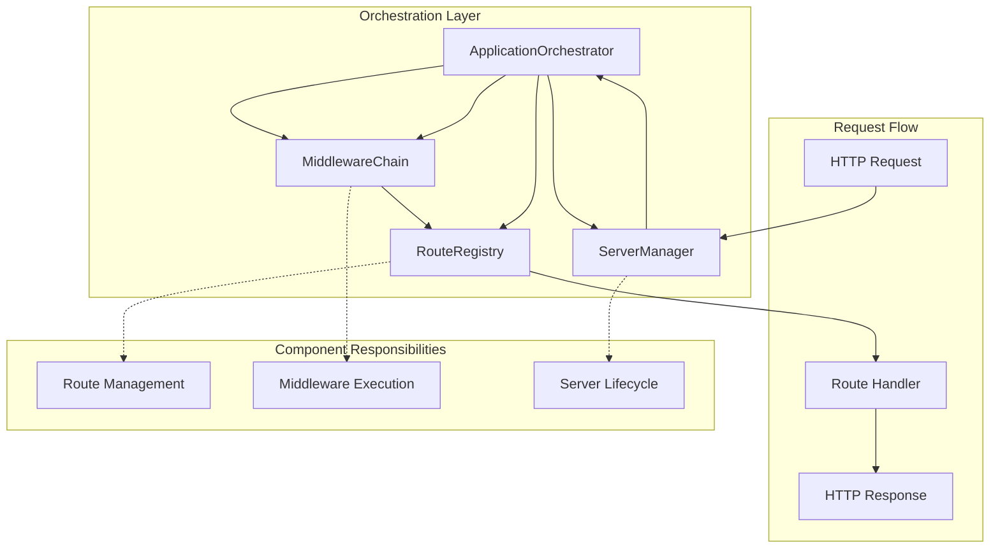
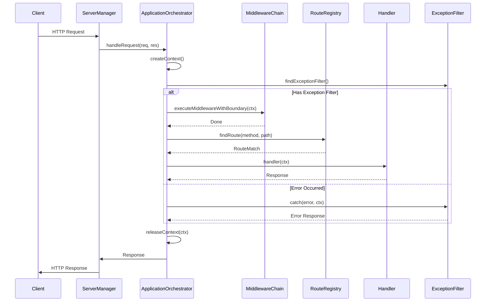
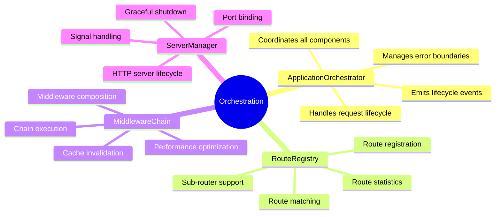
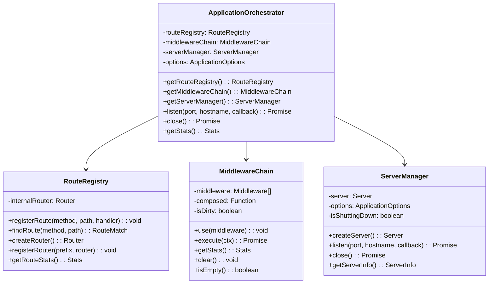
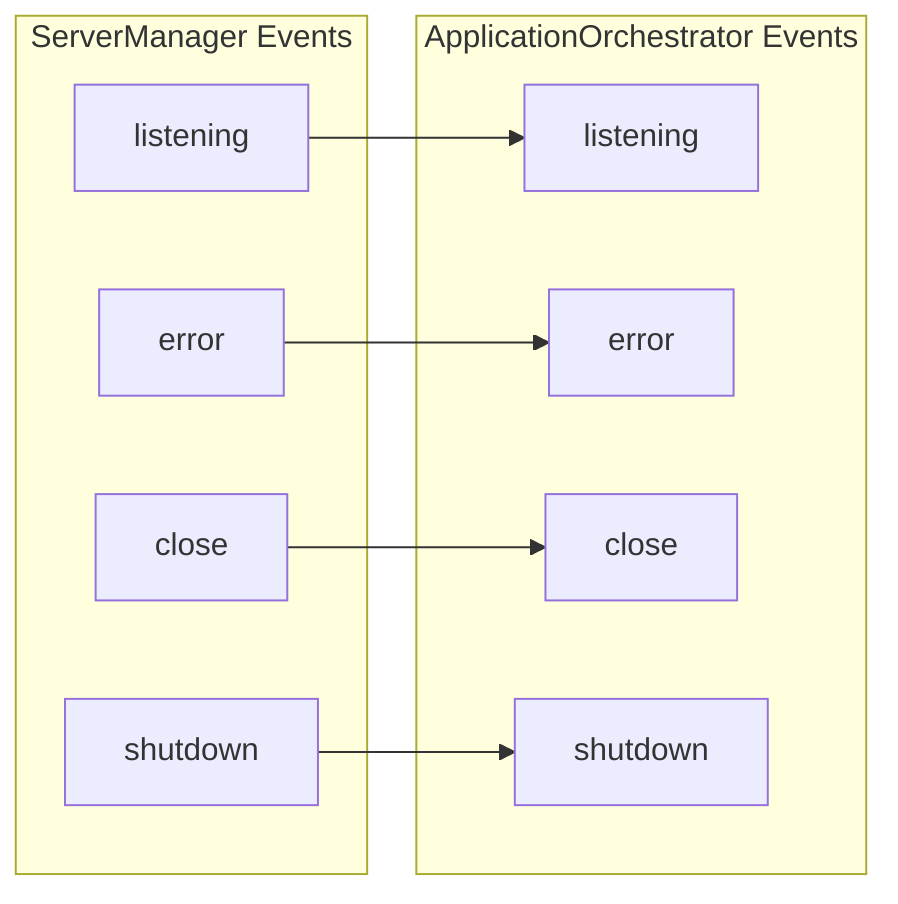
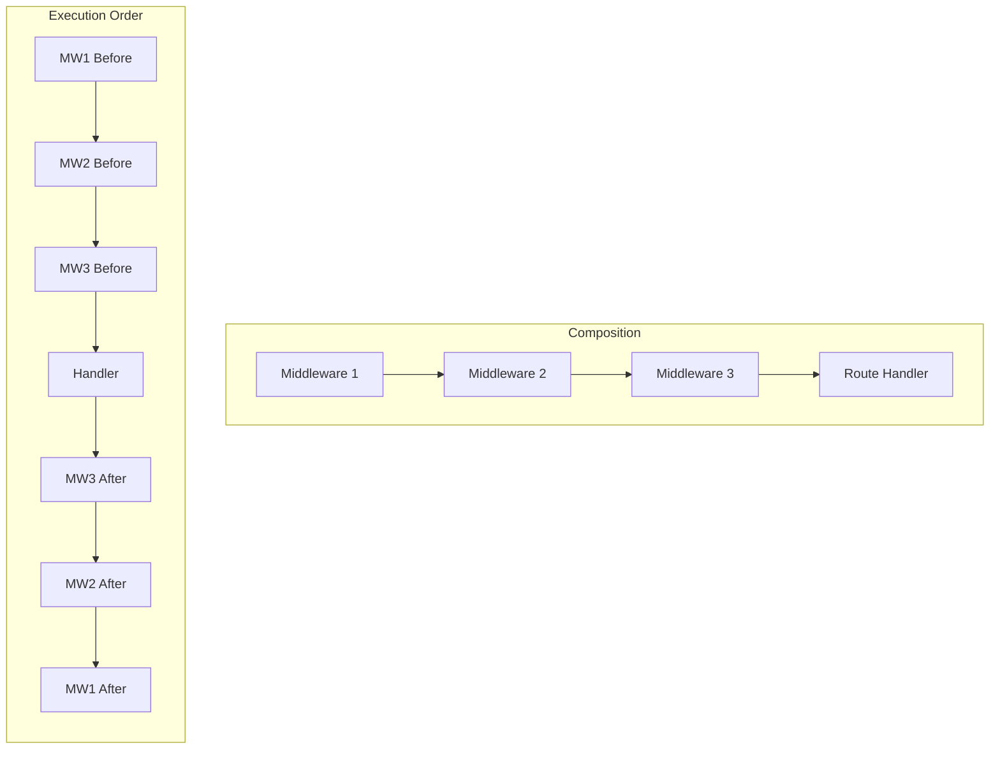
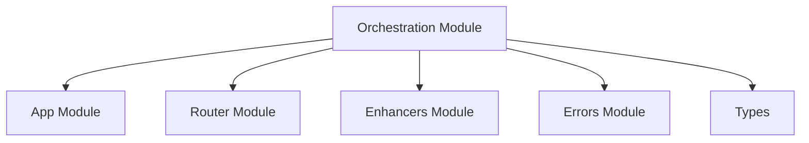

# Orchestration Module

> Application orchestration layer for NextRush v2 - coordinates all application components following Single Responsibility Principle

## Overview

The Orchestration module provides a clean separation of concerns by coordinating between different application components. It implements the Mediator pattern to manage interactions between routes, middleware, server lifecycle, and request handling.

## Architecture

### System Overview



### Request Lifecycle



### Component Relationships



## File Structure

```
src/core/orchestration/
├── index.ts                    # Module exports
├── application-orchestrator.ts # Main orchestrator (200 lines)
├── middleware-chain.ts         # Middleware management (115 lines)
├── route-registry.ts           # Route management (115 lines)
└── server-manager.ts           # Server lifecycle (165 lines)
```

## Key Components

### ApplicationOrchestrator

The central coordinator that ties all components together:

```typescript
import { ApplicationOrchestrator } from '@/core/orchestration';

const orchestrator = new ApplicationOrchestrator(options);

// Access components
const routeRegistry = orchestrator.getRouteRegistry();
const middlewareChain = orchestrator.getMiddlewareChain();
const serverManager = orchestrator.getServerManager();

// Start server
await orchestrator.listen(3000, 'localhost', () => {
  console.log('Server running');
});

// Get statistics
const stats = orchestrator.getStats();
console.log(stats.routes);      // Route statistics
console.log(stats.middleware);  // Middleware statistics
console.log(stats.server);      // Server information
```

**Key Features**:
- Coordinates between RouteRegistry, MiddlewareChain, and ServerManager
- Handles request lifecycle with error boundaries
- Manages context creation and release
- Emits lifecycle events (listening, close, shutdown, error)

### MiddlewareChain

Koa-style middleware composition with caching:

```typescript
import { MiddlewareChain } from '@/core/orchestration';

const chain = new MiddlewareChain();

// Add middleware
chain.use(async (ctx, next) => {
  console.log('Before');
  await next();
  console.log('After');
});

// Execute chain
await chain.execute(ctx);

// Get statistics
console.log(chain.getStats());
// { count: 1, middleware: ['anonymous'] }
```

**Key Features**:
- Lazy composition (only recomposes when chain changes)
- Prevents multiple `next()` calls
- Named middleware tracking
- Performance-optimized execution

### RouteRegistry

Route management with sub-router support:

```typescript
import { RouteRegistry } from '@/core/orchestration';

const registry = new RouteRegistry();

// Register routes
registry.registerRoute('GET', '/users', handler);
registry.registerRoute('POST', '/users', createHandler);
registry.registerRoute('GET', '/users/:id', getByIdHandler);

// Find route
const match = registry.findRoute('GET', '/users/123');
console.log(match?.params);  // { id: '123' }

// Create and mount sub-router
const userRouter = registry.createRouter();
registry.registerRouter('/api', userRouter);
```

**Key Features**:
- HTTP method-based routing
- Dynamic parameter extraction
- Sub-router mounting with prefixes
- Route statistics

### ServerManager

HTTP server lifecycle management:

```typescript
import { ServerManager } from '@/core/orchestration';

const server = new ServerManager(options, requestHandler);

// Start server
await server.listen(3000, 'localhost', () => {
  console.log('Server started');
});

// Get server info
const info = server.getServerInfo();
console.log(info.listening);     // true
console.log(info.port);          // 3000
console.log(info.shuttingDown);  // false

// Graceful shutdown
await server.close();
```

**Key Features**:
- Graceful startup and shutdown
- Signal handling (SIGTERM, SIGINT)
- Connection tracking
- Event emission for lifecycle events

## Class Diagram



## Event Flow



## Middleware Composition



## Usage Example

```typescript
import {
  ApplicationOrchestrator,
  MiddlewareChain,
  RouteRegistry,
  ServerManager
} from '@/core/orchestration';

// Create orchestrator with options
const options = {
  port: 3000,
  host: 'localhost',
  // ... other options
};

const orchestrator = new ApplicationOrchestrator(options);

// Add middleware
orchestrator.getMiddlewareChain().use(async (ctx, next) => {
  const start = Date.now();
  await next();
  console.log(`${ctx.method} ${ctx.path} - ${Date.now() - start}ms`);
});

// Register routes
const registry = orchestrator.getRouteRegistry();
registry.registerRoute('GET', '/', ctx => {
  ctx.body = { message: 'Hello World' };
});

// Start server
await orchestrator.listen(3000, 'localhost', () => {
  console.log('Server running on http://localhost:3000');
});

// Handle graceful shutdown
process.on('SIGTERM', async () => {
  await orchestrator.close();
  process.exit(0);
});
```

## Dependencies



## Design Principles

1. **Single Responsibility**: Each class has one reason to change
2. **Separation of Concerns**: Clear boundaries between components
3. **Event-Driven**: Lifecycle events for extensibility
4. **Lazy Evaluation**: Middleware composed only when changed
5. **Error Boundaries**: Protected execution with exception handling

## Testing

```bash
# Run orchestration tests
pnpm test src/tests/unit/core/orchestration/

# Run integration tests
pnpm test src/tests/integration/orchestration/
```

## See Also

- [Application Module](../app/README.md) - Main application
- [Router Module](../router/README.md) - Route matching
- [Enhancers Module](../enhancers/README.md) - Request/Response enhancement
- [Middleware Module](../middleware/README.md) - Built-in middleware
