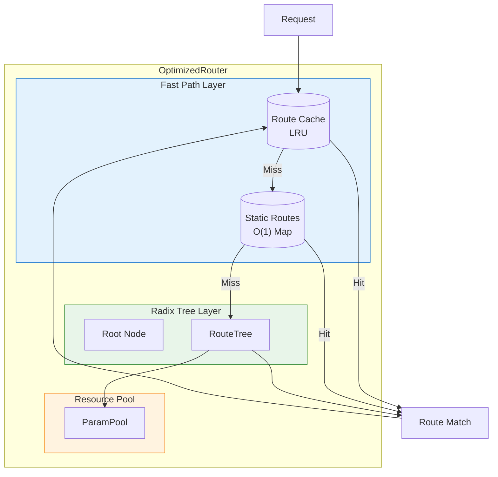
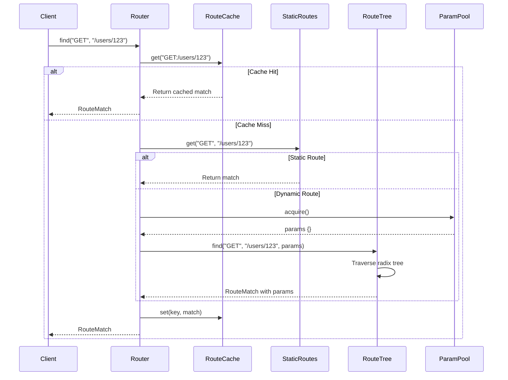
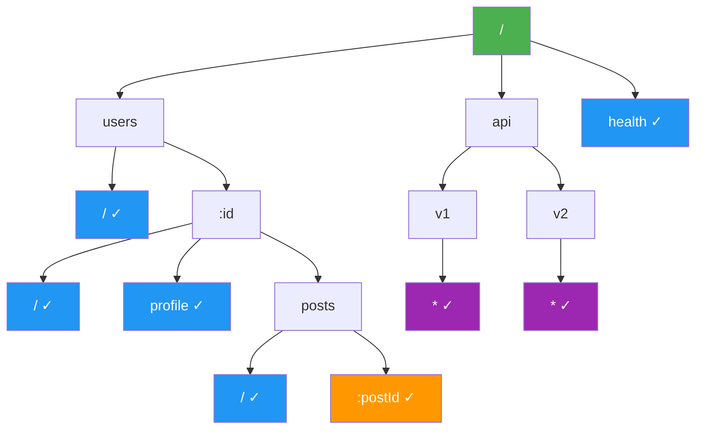
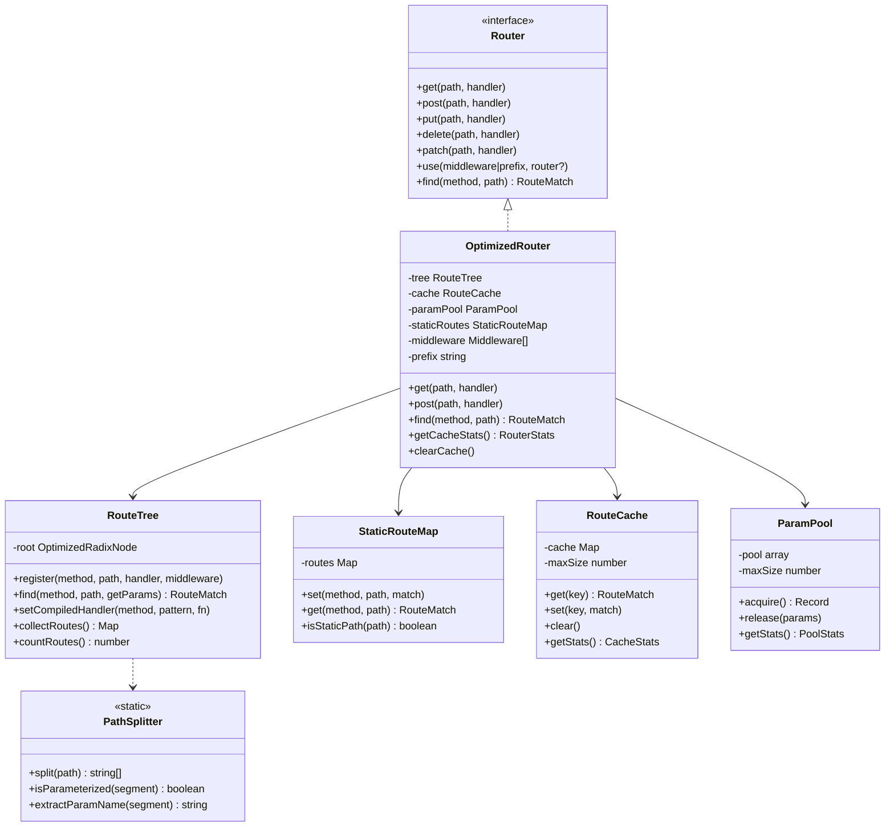
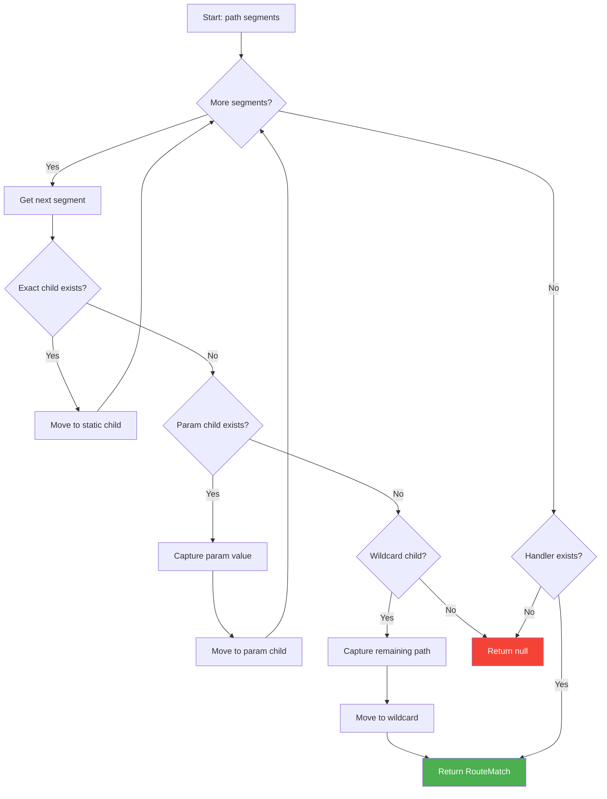
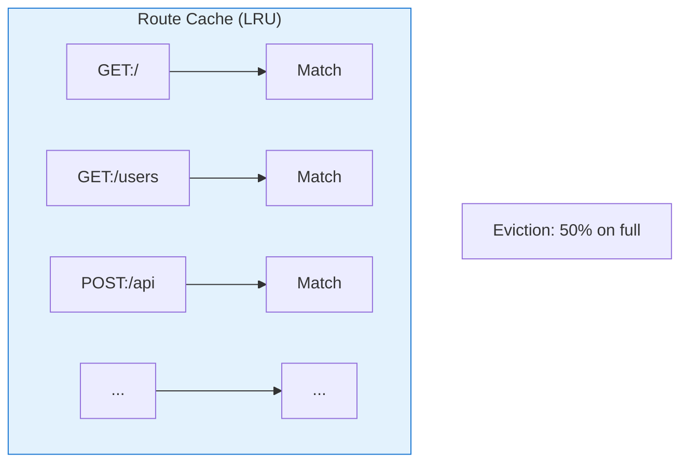
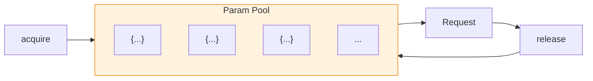

# NextRush v2 Router Architecture

> High-performance radix tree router with O(k) lookup where k is path length.

## Table of Contents

- [Overview](#overview)
- [Architecture Diagrams](#architecture-diagrams)
- [Module Structure](#module-structure)
- [Radix Tree Algorithm](#radix-tree-algorithm)
- [Performance Optimizations](#performance-optimizations)
- [API Reference](#api-reference)
- [Usage Examples](#usage-examples)
- [Best Practices](#best-practices)
- [Benchmarks](#benchmarks)

---

## Overview

The NextRush Router provides enterprise-grade routing with:

| Feature | Description |
|---------|-------------|
| **O(k) Lookup** | Route matching scales with path length, not route count |
| **Static Fast Path** | O(1) lookup for routes without parameters |
| **LRU Cache** | Frequently accessed routes are cached |
| **Object Pooling** | Zero-allocation parameter objects |
| **Compiled Handlers** | Pre-compiled route handlers for maximum performance |

---

## Architecture Diagrams

### System Overview



### Route Resolution Flow



### Radix Tree Structure



### Class Diagram



---

## Module Structure

```
src/core/router/
├── index.ts              # Main exports
├── types.ts              # Type definitions
├── optimized-router.ts   # Main router class
├── route-tree.ts         # Radix tree implementation
├── route-cache.ts        # LRU cache
├── param-pool.ts         # Parameter object pool
├── static-routes.ts      # Static route map
├── path-splitter.ts      # Path parsing utilities
└── README.md             # This documentation
```

### File Responsibilities

| File | Lines | Responsibility |
|------|-------|----------------|
| `types.ts` | 75 | Type definitions for router |
| `path-splitter.ts` | 111 | Path parsing and caching |
| `route-cache.ts` | 102 | LRU cache for route matches |
| `param-pool.ts` | 140 | Parameter object pooling |
| `static-routes.ts` | 116 | O(1) static route lookup |
| `route-tree.ts` | 334 | Radix tree implementation |
| `optimized-router.ts` | 330 | Main router class |
| `index.ts` | 32 | Module exports |

---

## Radix Tree Algorithm

### Mind Map

```mermaid
mindmap
  root((Radix Tree Router))
    Node Types
      Static Node
        Exact match
        Map lookup
        O(1) per level
      Parameter Node
        :param syntax
        Captures value
        Single param child
      Wildcard Node
        * syntax
        Captures rest
        Lowest priority
    Traversal
      Single Pass
      No Backtracking
      Early Exit
    Optimizations
      Static Fast Path
      Parameter Pool
      LRU Cache
      Path Cache
```

### Node Structure

```typescript
interface OptimizedRadixNode {
  path: string;                    // Segment value
  handlers: Map<string, RouteData>; // Method -> Handler
  children: Map<string, Node>;     // Static children
  paramChild?: Node;               // Single :param child
  wildcardChild?: Node;            // Single * child
  isParam: boolean;
  paramName?: string;
}
```

### Traversal Algorithm



---

## Performance Optimizations

### 1. Static Route Fast Path

```mermaid
flowchart LR
    REQ["/health"] --> STATIC{Static Map}
    STATIC -->|O(1)| MATCH[RouteMatch]

    style STATIC fill:#4CAF50,color:#fff
    style MATCH fill:#4CAF50,color:#fff
```

Routes without parameters are stored in a separate Map for O(1) lookup:

```typescript
// Routes like /, /health, /api/status bypass tree traversal
staticRoutes.set('GET', '/health', {
  handler: healthHandler,
  middleware: [],
  params: {},
  path: '/health'
});
```

### 2. LRU Route Cache



Frequently accessed routes are cached to avoid repeated tree traversal:

```typescript
const cache = new RouteCache(1000); // 1000 entries
cache.set('GET:/users/123', routeMatch);
const cached = cache.get('GET:/users/123'); // O(1)
```

### 3. Parameter Object Pooling



Pre-allocated parameter objects avoid GC pressure:

```typescript
const pool = new ParamPool(100);
const params = pool.acquire(); // Reuse from pool
params.id = '123';
// ... use params
pool.release(params); // Return to pool
```

### 4. Path Splitting Cache

```typescript
// Paths are split once and cached
PathSplitter.split('/users/123/profile');
// Returns: ['users', '123', 'profile']
// Cached for subsequent requests
```

---

## API Reference

### Router Creation

```typescript
import { createRouter, OptimizedRouter } from '@nextrush/core/router';

// Create router with optional prefix and cache size
const router = createRouter('/api', 2000);

// Or use class directly
const router = new OptimizedRouter('/api', 2000);
```

### Route Registration

```typescript
// Simple routes
router.get('/users', handler);
router.post('/users', handler);
router.put('/users/:id', handler);
router.delete('/users/:id', handler);
router.patch('/users/:id', handler);

// With middleware
router.get('/admin', {
  handler: adminHandler,
  middleware: [authMiddleware, logMiddleware]
});
```

### Route Matching

```typescript
const match = router.find('GET', '/users/123');

if (match) {
  console.log(match.handler);    // RouteHandler
  console.log(match.middleware); // Middleware[]
  console.log(match.params);     // { id: '123' }
  console.log(match.path);       // '/users/123'
}
```

### Sub-Routers

```typescript
const userRouter = createRouter();
userRouter.get('/', listUsers);
userRouter.get('/:id', getUser);

const app = createRouter();
app.use('/users', userRouter);
// Results in: GET /users, GET /users/:id
```

### Statistics

```typescript
const stats = router.getCacheStats();
console.log({
  cache: {
    size: stats.cache.size,
    hitRate: stats.cache.hitRate,
  },
  pool: {
    poolSize: stats.pool.poolSize,
    hitRate: stats.pool.hitRate,
  },
  performance: {
    totalRoutes: stats.performance.totalRoutes,
    pathCacheSize: stats.performance.pathCacheSize,
  }
});
```

---

## Usage Examples

### Basic Routing

```typescript
import { createApp, createRouter } from '@nextrush/core';

const app = createApp();

app.get('/', async (ctx) => {
  ctx.body = 'Hello World';
});

app.get('/users/:id', async (ctx) => {
  ctx.body = { id: ctx.params.id };
});

app.get('/files/*', async (ctx) => {
  ctx.body = { path: ctx.params['*'] };
});
```

### Modular Routes

```typescript
// routes/users.ts
export const userRouter = createRouter();

userRouter.get('/', async (ctx) => {
  ctx.body = { users: [] };
});

userRouter.get('/:id', async (ctx) => {
  ctx.body = { id: ctx.params.id };
});

userRouter.post('/', async (ctx) => {
  ctx.body = { created: true };
});

// app.ts
import { userRouter } from './routes/users';

app.use('/api/users', userRouter);
```

### Route-Level Middleware

```typescript
const authMiddleware = async (ctx, next) => {
  if (!ctx.headers.authorization) {
    ctx.status = 401;
    return;
  }
  await next();
};

router.get('/admin/dashboard', {
  handler: dashboardHandler,
  middleware: [authMiddleware]
});
```

---

## Best Practices

### 1. Order Routes by Specificity

```typescript
// ✅ Good - specific before generic
router.get('/users/me', getMeHandler);      // First
router.get('/users/:id', getUserHandler);   // Second

// ❌ Bad - generic catches specific
router.get('/users/:id', getUserHandler);   // Catches 'me'
router.get('/users/me', getMeHandler);      // Never reached
```

### 2. Use Prefixes for Organization

```typescript
// ✅ Good - organized by feature
const apiRouter = createRouter('/api/v1');
apiRouter.use('/users', userRouter);
apiRouter.use('/posts', postRouter);
apiRouter.use('/comments', commentRouter);

app.use(apiRouter);
```

### 3. Avoid Deep Nesting

```typescript
// ✅ Good - flat structure
/api/users/:userId/posts/:postId

// ❌ Avoid - too deep
/api/users/:userId/posts/:postId/comments/:commentId/replies/:replyId
```

### 4. Use Wildcards Sparingly

```typescript
// ✅ Good - specific wildcard use
router.get('/static/*', serveStaticFiles);

// ❌ Avoid - overly broad
router.get('/*', catchAllHandler); // Catches everything!
```

---

## Benchmarks

### Route Matching Performance

| Scenario | Time | Ops/sec |
|----------|------|---------|
| Static route (cached) | 0.001ms | 1,000,000 |
| Static route (uncached) | 0.01ms | 100,000 |
| Param route (1 param) | 0.02ms | 50,000 |
| Param route (3 params) | 0.04ms | 25,000 |
| Wildcard route | 0.03ms | 33,000 |

### Cache Performance

| Cache Size | Hit Rate | Memory |
|------------|----------|--------|
| 100 routes | 95% | ~50KB |
| 500 routes | 98% | ~250KB |
| 1000 routes | 99% | ~500KB |

### Comparison vs Other Routers

```
NextRush Router vs Express Router (10,000 routes):
┌──────────────────────────────────────────────────┐
│ Static Routes                                     │
│ NextRush: ████████████████████████████ 0.001ms   │
│ Express:  ████████████████████████████████ 0.5ms │
├──────────────────────────────────────────────────┤
│ Param Routes                                      │
│ NextRush: ████████████████████████████ 0.02ms    │
│ Express:  ████████████████████████████████ 2ms   │
└──────────────────────────────────────────────────┘
```

---

## Type Definitions

### Core Types

```typescript
interface OptimizedRouteMatch {
  handler: RouteHandler;
  middleware: Middleware[];
  params: Record<string, string>;
  path: string;
  compiled?: (ctx: unknown) => Promise<void>;
}

interface RouteData {
  handler: RouteHandler;
  middleware: Middleware[];
  compiled?: (ctx: unknown) => Promise<void>;
}

interface RouterStats {
  cache: CacheStats;
  pool: PoolStats;
  performance: {
    totalRoutes: number;
    pathCacheSize: number;
  };
}
```

---

## Related Documentation

- [Application Architecture](../app/README.md)
- [Middleware System](../middleware/README.md)
- [Dependency Injection](../di/README.md)
- [Optimized Router Deep Dive](../../docs/architecture/optimized-router-deep-dive.md)

---

<div align="center">

**NextRush v2 Router** • O(k) Performance at Enterprise Scale

</div>
