# NextRush Benchmark Report

**Run ID:** `2026-07-31T18-15-15` · **Date:** 2026-08-01T06:11:57.100Z · **Profile:** standard (NOT publishable) · **Tool:** wrk

**Frameworks:** Raw Node.js · NextRush v3 · Fastify · Hono · Koa · Express

> ⚠️ This profile is NOT publishable: host 1-minute load average was 1.04 at run start, above the 1 ceiling for a publishable run — competing work on the same cores inflates run-to-run variance beyond the differences being compared

> Every table and chart below is derived from `results.json` in this directory. Regenerate any of it without re-measuring: `pnpm report:generate --id 2026-07-31T18-15-15`.

## System Information

The device these numbers describe. Different hardware produces different numbers.

| Property | Value |
|---|---|
| Platform | linux |
| Architecture | x64 |
| Node.js | v26.5.1 |
| CPU | Intel(R) Core(TM) i5-8300H CPU @ 2.30GHz |
| CPU cores (logical) | 8 |
| Total memory | 15.46 GB |
| Free memory at start | 12.55 GB |
| Kernel | 7.1.5-201.fc44.x86_64 |
| Host uptime at start | 0h |
| Measured at | 2026-07-31T18:15:21.136Z |
| Load tool version | wrk 4.2.0 |
| CPU pinning | cores 2-7 |

## Load Configuration

6 framework(s) × 13 scenario(s) × 3 concurrency level(s) × 6 run(s) = **1404 timed runs** of 30s each.

**Commit:** `34a17d48bd2c0fff708936213c154b639620a0d3` — **dirty working tree at measurement time**

| Parameter | Value |
|---|---|
| Profile | standard (NOT publishable) |
| Load tool | wrk 4.2.0 |
| Duration | 30s |
| Connections | 1, 64, 256 |
| Runs per configuration | 6 |
| Threads (wrk) | 2 (reduced from 4 to match 2 pinned client CPU(s)) |
| Host load average at start | 1.04 |
| Pipelining | 1 (disabled — one in-flight request per connection) |
| Framework warmup | 10s |
| Per-scenario warmup | 3s |
| Cooldown between frameworks | 3s |
| Pause between tests | 2s |
| CPU pinning | server cores 2-7 |
| Client pinning | client cores 0-1 |
| Framework order | rotated |
| GC tracing | off |
| Accept-queue backlog | 1024 (overrides each framework's own native default — see LISTEN_BACKLOG) |
| NextRush effective timeout | 30000 ms |
| NextRush effective keepAliveTimeout | 5000 ms |

## Frameworks Under Test

| Server | Version | Role | Configuration | Status |
|---|---|---|---|---|
| raw-node | Node v26.5.1 | baseline | Bare http.createServer — zero framework overhead baseline | ✓ measured |
| nextrush-v3 | 4.0.0-beta.0 (workspace) | target | NextRush v3 with router + conditional body parser | ✓ measured |
| fastify | 5.10.0 | comparison | Fastify 5.x — logger disabled, default config | ✓ measured |
| hono | 4.12.30 | comparison | Hono 4.x via @hono/node-server | ✓ measured |
| koa | 3.2.1 | comparison | Koa 3.x with koa-router and koa-bodyparser | ✓ measured |
| express | 5.2.1 | comparison | Express 5.x — minimal middleware | ✓ measured |

Versions recorded at run time.

## Configuration deviations from framework defaults

No server here runs entirely stock. Every deviation below exists to make the comparison measure the same work, and each is listed with who it plausibly helps — including where it costs the framework it applies to. A deviation not declared in `config/deviations.js` fails the disclosure test, so this table cannot silently fall behind the servers.

| Server | Setting | Framework default | This suite | Direction | Why |
|---|---|---|---|---|---|
| raw-node | Static file resolution | n/a — no static serving exists | exact-match on the single fixture path only | ↑ favours this server | the baseline implements no traversal-safe resolver, so it does strictly less work than every framework in the static-file scenario, which is why that scenario is not like-for-like |
| nextrush-v3 | Static serving registration | `app.use()` middleware is the general form | registered as a router route | ↑ favours this server | keeps the application middleware stack at one entry so `compose()` stays on its single-middleware fast path; fastify, hono and koa scope static per-route in this suite too, but Express uses `app.use(path, ...)` because that is its own idiomatic form |
| nextrush-v3 | Diagnostic `/__elu-sample` route | n/a | present (13 routes vs 12 elsewhere) | ↓ costs this server | polled only by scripts/profile.js; never probed by the parity gate and never measured, but it does add one route to the trie |
| fastify | Response schemas (`fast-json-stringify`) | recommended for production; schemas compile a specialised serializer | none declared — falls back to `JSON.stringify` | ↓ costs this server | schema-compiled serialization is a capability no other server in this suite has, so enabling it would stop the serialization scenarios being like-for-like; the cost to Fastify is disclosed rather than hidden |
| fastify | keepAliveTimeout | 72000 ms | 5000 ms (Node’s own default, used by all six servers) | · no measured effect | a 14x deeper idle-socket window is an uncontrolled variable; measured inert under sustained load (native 72 s: 16,953 RPS vs 5 s: 17,347 — inside noise) because sockets are never idle for 5 s while wrk is running |
| fastify | logger | pino, enabled | false (noop logger) | ↑ favours this server | no server in this suite logs per request; with `logger: false` Fastify also skips per-request child-logger creation entirely |
| fastify | bodyLimit (large-post route only) | 1 MB | 5 MB | · no measured effect | the scenario body is ~1.5 MB by design, so every server raises its parser limit for that route rather than riding the boundary of a default |
| hono | `c.json()` content type | `application/json` (no charset) | `application/json; charset=utf-8` via c.json’s own headers argument | ↓ costs this server | the parity gate requires identical content types; passing headers to the real helper costs Hono a small per-request headers object, but hand-rolling `c.body(JSON.stringify(...))` would measure benchmark code instead of Hono’s serializer |
| koa | `router.allowedMethods()` | commonly mounted | not mounted | ↑ favours this server | it made Koa the only server answering a wrong-method request with 405 + `Allow`, so Koa alone paid a per-request layer for a behaviour no scenario exercises and no competitor provides |
| koa | app.silent | false (errors logged to stderr) | true | · no measured effect | no server in this suite logs; Koa has no dedicated error-handler hook, so silencing its built-in handling is the equivalent of the others’ error handlers |
| express | etag | 'weak' — SHA-1 over the full response body on every res.json() | false | ↑ favours this server | no other server computes a response hash; measured cost before disabling was -14% RPS on /json and -13.7% on /large-json, larger than the gaps separating mid-field frameworks |
| express | x-powered-by | enabled | disabled | ↑ favours this server | extra response-header bytes no other server emits, which the header-set parity gate rejects |

## Scenarios Executed

| Scenario | ID | Method | Path | Expected status | Category | Fairness |
|---|---|---|---|---|---|---|
| Hello World | `hello-world` | GET | `/` | 200 | `baseline` | like-for-like |
| JSON Serialization | `json-serialize` | GET | `/json` | 200 | `serialization` | like-for-like |
| Route Parameters | `route-params` | GET | `/users/12345` | 200 | `routing` | like-for-like |
| Query Strings | `query-string` | GET | `/search?q=benchmark&limit=10` | 200 | `parsing` | like-for-like |
| POST JSON | `post-json` | POST | `/users` | 200 | `parsing` | like-for-like |
| Deep Route | `deep-route` | GET | `/api/v1/orgs/123/teams/456/members/789` | 200 | `routing` | like-for-like |
| Middleware Stack | `middleware-stack` | GET | `/middleware` | 200 | `middleware` | ⚠️ idiomatic |
| Error Handling | `error-handling` | GET | `/error` | 500 | `error` | ⚠️ idiomatic |
| Large JSON | `large-json` | GET | `/large-json` | 200 | `serialization` | like-for-like |
| Empty Response | `empty-response` | GET | `/empty` | 204 | `baseline` | like-for-like |
| Send Object | `send-object` | GET | `/send-object` | 200 | `serialization` | like-for-like |
| Static File | `static-file` | GET | `/static/bench.txt` | 200 | `static` | ⚠️ idiomatic |
| Large POST Body | `large-post` | POST | `/large-post` | 200 | `parsing` | like-for-like |

All servers implement every endpoint from the same canonical payloads (`servers/_shared/payloads.js`). `⚠️ idiomatic` marks a scenario where the mechanism differs per framework by design, so it is excluded from the headline score.

`like-for-like` means the **response** is verified identical — status, body bytes, content type, framing and the full header set are byte-compared across servers before any timing. It does not mean the work performed to produce that response is equivalent; where a known asymmetry exists it is named below.

**Known work asymmetries**

- `query-string` — Query parsers are not equivalent: NextRush fully decodes each pair and enforces parameter-count/length limits plus __proto__/constructor/prototype key rejection, raw-node uses URLSearchParams with no limits, and Fastify uses find-my-way’s parser. The least defensive implementation does the least work.
- `post-json` — JSON body parsers are not equivalent: Fastify parses with secure-json-parse (prototype- and constructor-poisoning checks on by default), NextRush uses JSON.parse plus a nesting-depth check, and raw-node uses bare JSON.parse with no protection. Fastify does the most work here and raw-node the least, so this cell rewards the least protected parser.
- `static-file` — raw-node matches only the one literal fixture path and implements no traversal-safe resolver, so the baseline does strictly less work than every framework here — this cell is a mechanism comparison, not a like-for-like one.
- `large-post` — Same body-parser asymmetry as `post-json`. Additionally, `maxConnections` below caps this scenario to the lowest declared concurrency level, so it contributes no cells at the headline levels and is excluded from the points total rather than counted as unreachable points.

## Scoreboard

Every framework is ranked in **each of the 13 scenarios at each of the 3 concurrency levels** (1c, 64c, 256c). A win is worth 6 points, last place 1 point.

- **Overall (like-for-like): 🥇 Raw Node.js** — 105.5/108 pts, 18 scenario win(s)
- **NextRush: #3** — 68.1/108 pts, 0 scenario win(s), average rank 2.8
- **Scored on:** 9 like-for-like scenarios × 2 concurrency levels × 6 frameworks = 108 points available
- **Not scored:** `large-post` — like-for-like, but measured only below the headline concurrency levels (see the per-scenario connection caps), so it contributes no ranked cells and is excluded from the points total rather than counted as points nobody could score

### Overall ranking — like-for-like scenarios only

| Rank | Framework | Points | of max | Scenario wins | Avg rank | @1c | @64c | @256c |
|---|---|---|---|---|---|---|---|---|
| 🥇 | Raw Node.js *(baseline)* | **105.5** | 108 | 18 | 1 | 57 | 52.5 | 53 |
| 🥈 | Fastify | **90.5** | 108 | 5 | 1.7 | 47.6 | 45.5 | 45 |
| 🥉 | NextRush v3 | **68.1** | 108 | 0 | 2.8 | 33.599999999999994 | 34.3 | 33.8 |
| 4 | Hono | **60.1** | 108 | 0 | 3.3 | 35.6 | 29.8 | 30.3 |
| 5 | Koa | **34** | 108 | 0 | 5.1 | 17.4 | 17 | 17 |
| 6 | Express | **20** | 108 | 0 | 5.9 | 19.3 | 10 | 10 |

### Orderings this run could not resolve

18 adjacent headline comparison(s) have a gap smaller than the two frameworks' combined standard deviation. Those orderings reflect measurement noise, not performance — they are scored as the ties they are, and must not be cited as a ranking.

| Frameworks within noise of each other | Cells |
|---|---|
| `hono ~ nextrush-v3` | 9 |
| `fastify ~ raw-node` | 5 |
| `fastify ~ nextrush-v3` | 3 |
| `fastify ~ hono` | 1 |

### Measurement position balance

Every framework occupied every measurement position an equal number of times (6 runs across 6 frameworks). Mean position: raw-node 2.5 · nextrush-v3 2.5 · fastify 2.5 · hono 2.5 · koa 2.5 · express 2.5.

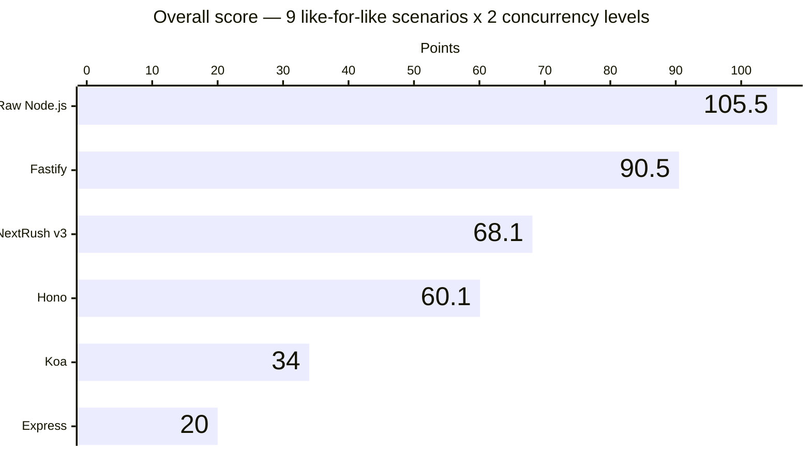
```mermaid
---
config:
  xyChart:
    showDataLabel: true
    width: 900
---
xychart-beta horizontal
    title "Overall score — 9 like-for-like scenarios x 2 concurrency levels"
    x-axis ["Raw Node.js", "Fastify", "NextRush v3", "Hono", "Koa", "Express"]
    y-axis "Points" 0 --> 108
    bar [105.5, 90.5, 68.1, 60.1, 34, 20]
```

### Overall ranking — all 12 scenarios

Includes `middleware-stack` and `error-handling`, which are **not like-for-like** — each framework uses its own mechanism (middleware chain vs. hook vs. manual call). Shown for completeness, not as the headline number.

| Rank | Framework | Points | of max | Scenario wins | Avg rank |
|---|---|---|---|---|---|
| 🥇 | Raw Node.js *(baseline)* | **140.5** | 144 | 24 | 1 |
| 🥈 | Fastify | **120.5** | 144 | 7 | 1.7 |
| 🥉 | NextRush v3 | **87.1** | 144 | 0 | 3 |
| 4 | Hono | **79.1** | 144 | 0 | 3.4 |
| 5 | Koa | **43** | 144 | 0 | 5.2 |
| 6 | Express | **34** | 144 | 0 | 5.5 |

### Shape of the results @ 256 connections

Each axis is one like-for-like scenario, normalized to that scenario's fastest result.

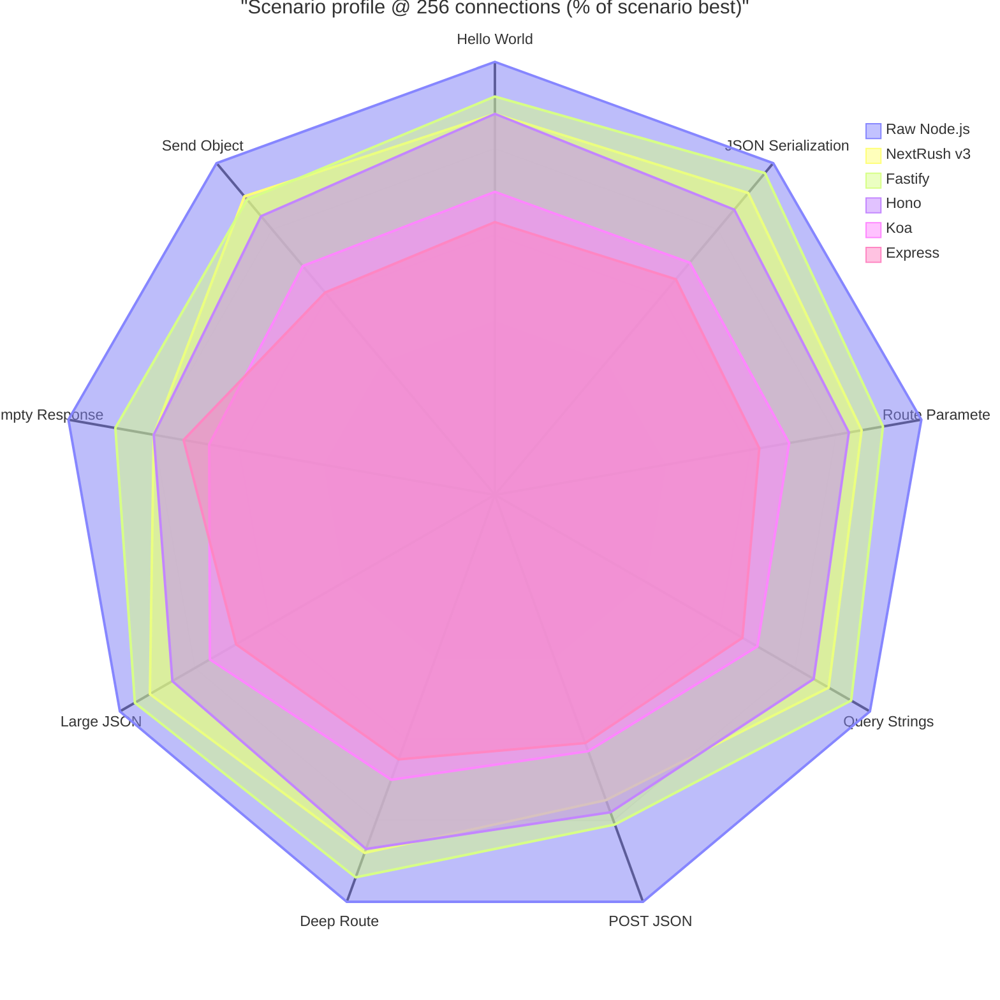
```mermaid
---
config:
  radar:
    width: 700
    height: 700
---
radar-beta
    title "Scenario profile @ 256 connections (% of scenario best)"
    axis hello_world["Hello World"]
    axis json_serialize["JSON Serialization"]
    axis route_params["Route Parameters"]
    axis query_string["Query Strings"]
    axis post_json["POST JSON"]
    axis deep_route["Deep Route"]
    axis large_json["Large JSON"]
    axis empty_response["Empty Response"]
    axis send_object["Send Object"]
    curve raw_node["Raw Node.js"]{100, 100, 100, 100, 100, 100, 100, 100, 100}
    curve nextrush_v3["NextRush v3"]{88, 91, 86, 89, 75, 88, 92, 80, 90}
    curve fastify["Fastify"]{92, 97, 91, 95, 81, 94, 96, 89, 89}
    curve hono["Hono"]{88, 86, 83, 85, 78, 87, 86, 80, 84}
    curve koa["Koa"]{70, 70, 69, 70, 63, 70, 76, 67, 69}
    curve express["Express"]{63, 65, 62, 66, 61, 65, 69, 73, 61}
    graticule polygon
    max 100
    min 0
```

## Scenario winners @ 256 connections

| Scenario | Category | Fairness | Winner | RPS | Runner-up | Lead |
|---|---|---|---|---|---|---|
| Hello World | `baseline` | like-for-like | 🥇 **Raw Node.js** | 35,503 | Fastify | 8.6% |
| JSON Serialization | `serialization` | like-for-like | 🥇 **Raw Node.js** | 34,466 | Fastify | ≈ 2.7% |
| Route Parameters | `routing` | like-for-like | 🥇 **Raw Node.js** | 33,672 | Fastify | 9.5% |
| Query Strings | `parsing` | like-for-like | 🥇 **Raw Node.js** | 27,786 | Fastify | 5.0% |
| POST JSON | `parsing` | like-for-like | 🥇 **Raw Node.js** | 25,420 | Fastify | 24.0% |
| Deep Route | `routing` | like-for-like | 🥇 **Raw Node.js** | 32,669 | Fastify | ≈ 6.2% |
| Middleware Stack | `middleware` | ⚠️ idiomatic | 🥇 **Raw Node.js** | 30,749 | Fastify | ≈ 0.7% |
| Error Handling | `error` | ⚠️ idiomatic | 🥇 **Raw Node.js** | 24,971 | Fastify | 16.0% |
| Large JSON | `serialization` | like-for-like | 🥇 **Raw Node.js** | 22,589 | Fastify | 3.9% |
| Empty Response | `baseline` | like-for-like | 🥇 **Raw Node.js** | 44,818 | Fastify | 12.7% |
| Send Object | `serialization` | like-for-like | 🥇 **Raw Node.js** | 35,329 | NextRush v3 | 11.3% |
| Static File | `static` | ⚠️ idiomatic | 🥇 **Raw Node.js** | 14,759 | Fastify | 34.2% |
| Large POST Body | `parsing` | like-for-like | — | — | — | — |

`≈` marks a gap smaller than the two frameworks' combined standard deviation — the ordering there is not statistically meaningful.

### Winners by concurrency level

Ranked independently at each level. `1c` is a latency probe; `256c` is the throughput regime and backs the headline score.

| Scenario | 1c | 64c | 256c |
|---|---|---|---|
| Hello World | Raw Node.js ≈ | Raw Node.js ≈ | Raw Node.js |
| JSON Serialization | Raw Node.js ≈ | Raw Node.js ≈ | Raw Node.js ≈ |
| Route Parameters | Raw Node.js ≈ | Raw Node.js | Raw Node.js |
| Query Strings | Raw Node.js ≈ | Raw Node.js ≈ | Raw Node.js |
| POST JSON | Raw Node.js | Raw Node.js | Raw Node.js |
| Deep Route | Raw Node.js | Raw Node.js | Raw Node.js ≈ |
| Middleware Stack | Fastify ≈ | Fastify ≈ | Raw Node.js ≈ |
| Error Handling | Raw Node.js | Raw Node.js | Raw Node.js |
| Large JSON | Raw Node.js ≈ | Raw Node.js | Raw Node.js |
| Empty Response | Raw Node.js | Raw Node.js | Raw Node.js |
| Send Object | Raw Node.js | Raw Node.js | Raw Node.js |
| Static File | Raw Node.js | Raw Node.js | Raw Node.js |
| Large POST Body | Raw Node.js ≈ | — | — |

| Level | Wins by framework |
|---|---|
| 1c | Raw Node.js (12) · Fastify (1) |
| 64c | Raw Node.js (11) · Fastify (1) |
| 256c | Raw Node.js (12) |

## Per-scenario rankings

Ranked at **256 connections** — the throughput regime. Every concurrency level is in the collapsed matrix under each scenario.

### 1. Hello World — `hello-world` · like-for-like

_Baseline framework overhead — minimal JSON response_

| Rank | Framework | RPS | CV% | p50 | p99 | vs Raw Node.js | Pts |
|---|---|---|---|---|---|---|---|
| 🥇 | Raw Node.js *(baseline)* | 35,503 ± 564 | 1.59% | 6.86ms | 10.95ms | baseline | 6 |
| 🥈 ≈ | Fastify | 32,703 ± 1,608 | 4.92% | 7.23ms | 11.75ms | -7.9% | 4.5 |
| 🥈 ≈ | NextRush v3 | 31,343 ± 787 | 2.51% | 7.98ms | 10.09ms | -11.7% | 3.8 |
| 🥈 | Hono | 31,073 ± 667 | 2.15% | 8.16ms | 8.68ms | -12.5% | 3.8 |
| 5 | Koa | 24,779 ± 535 | 2.16% | 10.22ms | 11.12ms | -30.2% | 2 |
| 6 | Express | 22,509 ± 656 | 2.91% | 11.17ms | 12.42ms | -36.6% | 1 |

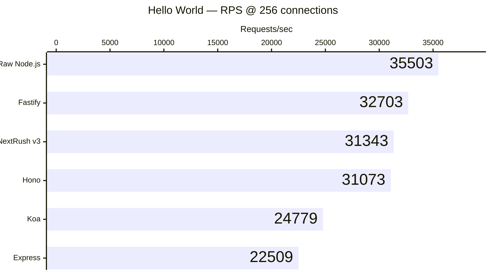
```mermaid
---
config:
  xyChart:
    showDataLabel: true
    width: 900
---
xychart-beta horizontal
    title "Hello World — RPS @ 256 connections"
    x-axis ["Raw Node.js", "Fastify", "NextRush v3", "Hono", "Koa", "Express"]
    y-axis "Requests/sec" 0 --> 39060
    bar [35503, 32703, 31343, 31073, 24779, 22509]
```

<details>
<summary>All concurrency levels — Hello World</summary>

| Framework | 1c — RPS | 64c — RPS | 256c — RPS | Non-2xx |
|---|---|---|---|---|
| Raw Node.js | 26,803 ± 565 🥇 | 36,184 ± 1,569 🥇 | 35,503 ± 564 🥇 | 0 |
| NextRush v3 | 24,302 ± 763 | 31,707 ± 558 | 31,343 ± 787 | 0 |
| Fastify | 26,728 ± 186 🥇 | 34,091 ± 1,622 🥇 | 32,703 ± 1,608 | 0 |
| Hono | 22,692 ± 878 | 31,381 ± 604 | 31,073 ± 667 | 0 |
| Koa | 19,146 ± 577 | 25,118 ± 529 | 24,779 ± 535 | 0 |
| Express | 17,872 ± 905 | 22,593 ± 1,078 | 22,509 ± 656 | 0 |

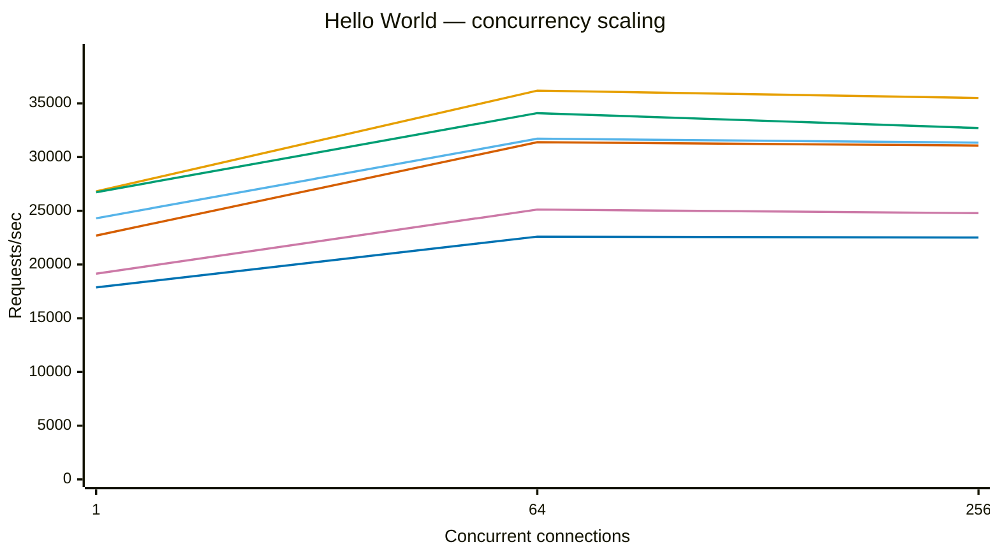
```mermaid
---
config:
  xyChart:
    width: 900
  themeVariables:
    xyChart:
      plotColorPalette: '#E69F00, #56B4E9, #009E73, #D55E00, #CC79A7, #0072B2'
---
xychart-beta
    title "Hello World — concurrency scaling"
    x-axis "Concurrent connections" ["1", "64", "256"]
    y-axis "Requests/sec" 0 --> 39810
    line [26803, 36184, 35503]
    line [24302, 31707, 31343]
    line [26728, 34091, 32703]
    line [22692, 31381, 31073]
    line [19146, 25118, 24779]
    line [17872, 22593, 22509]
```

| Line color | Framework |
|---|---|
| #E69F00 | Raw Node.js |
| #56B4E9 | NextRush v3 |
| #009E73 | Fastify |
| #D55E00 | Hono |
| #CC79A7 | Koa |
| #0072B2 | Express |

</details>

### 2. JSON Serialization — `json-serialize` · like-for-like

_JSON serialization performance with moderate payload (~200 bytes)_

| Rank | Framework | RPS | CV% | p50 | p99 | vs Raw Node.js | Pts |
|---|---|---|---|---|---|---|---|
| 🥇 ≈ | Raw Node.js *(baseline)* | 34,466 ± 810 | 2.35% | 6.89ms | 11.31ms | baseline | 5.5 |
| 🥇 | Fastify | 33,570 ± 790 | 2.35% | 7.32ms | 11.50ms | -2.6% | 5.5 |
| 🥉 | NextRush v3 | 31,242 ± 382 | 1.22% | 8.12ms | 9.05ms | -9.4% | 4 |
| 4 | Hono | 29,515 ± 802 | 2.72% | 8.58ms | 9.52ms | -14.4% | 3 |
| 5 | Koa | 24,224 ± 364 | 1.5% | 10.52ms | 11.50ms | -29.7% | 2 |
| 6 | Express | 22,567 ± 293 | 1.3% | 11.25ms | 12.16ms | -34.5% | 1 |

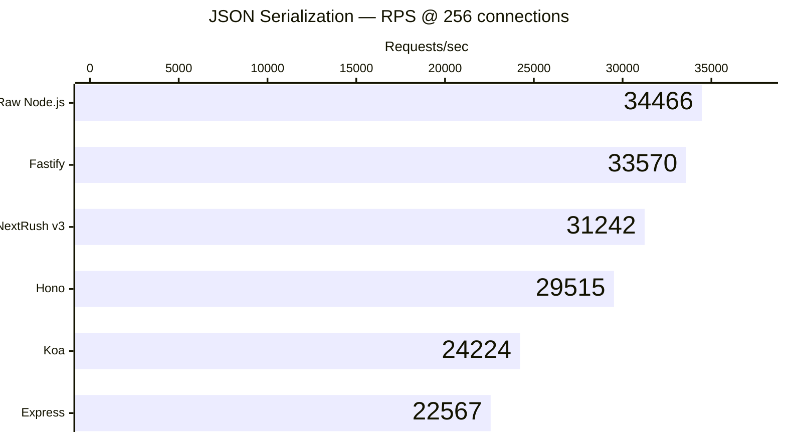
```mermaid
---
config:
  xyChart:
    showDataLabel: true
    width: 900
---
xychart-beta horizontal
    title "JSON Serialization — RPS @ 256 connections"
    x-axis ["Raw Node.js", "Fastify", "NextRush v3", "Hono", "Koa", "Express"]
    y-axis "Requests/sec" 0 --> 37920
    bar [34466, 33570, 31242, 29515, 24224, 22567]
```

<details>
<summary>All concurrency levels — JSON Serialization</summary>

| Framework | 1c — RPS | 64c — RPS | 256c — RPS | Non-2xx |
|---|---|---|---|---|
| Raw Node.js | 26,809 ± 867 🥇 | 35,452 ± 603 🥇 | 34,466 ± 810 🥇 | 0 |
| NextRush v3 | 24,405 ± 855 | 31,774 ± 427 | 31,242 ± 382 | 0 |
| Fastify | 25,961 ± 283 🥇 | 33,996 ± 1,027 🥇 | 33,570 ± 790 🥇 | 0 |
| Hono | 22,746 ± 1,155 | 30,669 ± 586 | 29,515 ± 802 | 0 |
| Koa | 18,289 ± 481 | 24,464 ± 480 | 24,224 ± 364 | 0 |
| Express | 18,405 ± 729 | 22,924 ± 372 | 22,567 ± 293 | 0 |

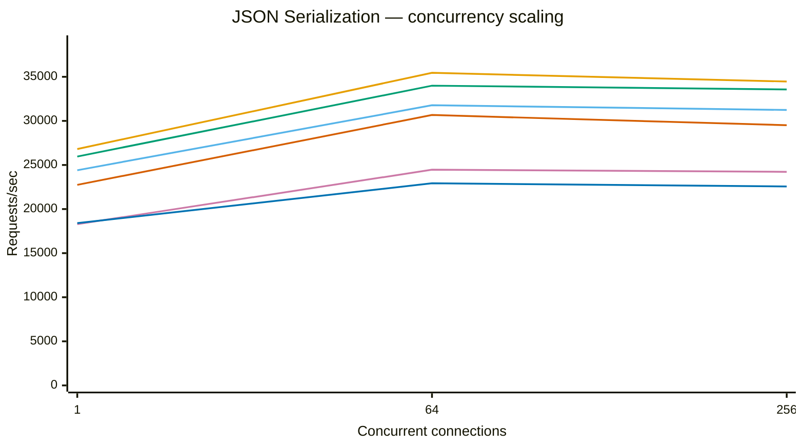
```mermaid
---
config:
  xyChart:
    width: 900
  themeVariables:
    xyChart:
      plotColorPalette: '#E69F00, #56B4E9, #009E73, #D55E00, #CC79A7, #0072B2'
---
xychart-beta
    title "JSON Serialization — concurrency scaling"
    x-axis "Concurrent connections" ["1", "64", "256"]
    y-axis "Requests/sec" 0 --> 39000
    line [26809, 35452, 34466]
    line [24405, 31774, 31242]
    line [25961, 33996, 33570]
    line [22746, 30669, 29515]
    line [18289, 24464, 24224]
    line [18405, 22924, 22567]
```

| Line color | Framework |
|---|---|
| #E69F00 | Raw Node.js |
| #56B4E9 | NextRush v3 |
| #009E73 | Fastify |
| #D55E00 | Hono |
| #CC79A7 | Koa |
| #0072B2 | Express |

</details>

### 3. Route Parameters — `route-params` · like-for-like

_Router parameter extraction_

| Rank | Framework | RPS | CV% | p50 | p99 | vs Raw Node.js | Pts |
|---|---|---|---|---|---|---|---|
| 🥇 | Raw Node.js *(baseline)* | 33,672 ± 786 | 2.33% | 7.28ms | 11.70ms | baseline | 6 |
| 🥈 | Fastify | 30,743 ± 568 | 1.85% | 7.90ms | 12.50ms | -8.7% | 5 |
| 🥉 ≈ | NextRush v3 | 28,847 ± 618 | 2.14% | 8.89ms | 9.51ms | -14.3% | 3.5 |
| 🥉 | Hono | 27,911 ± 593 | 2.12% | 9.18ms | 9.86ms | -17.1% | 3.5 |
| 5 | Koa | 23,217 ± 367 | 1.58% | 10.95ms | 11.93ms | -31.1% | 2 |
| 6 | Express | 20,889 ± 592 | 2.84% | 12.17ms | 13.78ms | -38.0% | 1 |

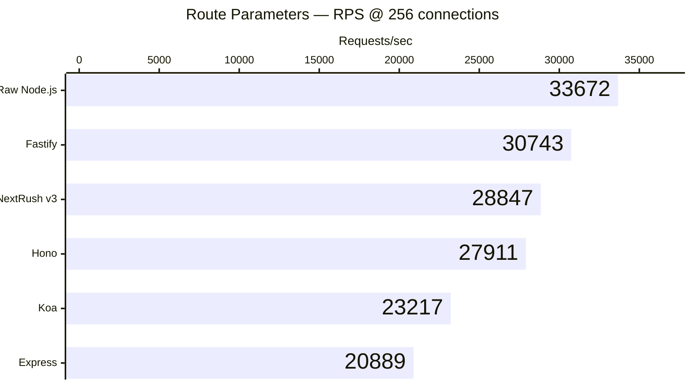
```mermaid
---
config:
  xyChart:
    showDataLabel: true
    width: 900
---
xychart-beta horizontal
    title "Route Parameters — RPS @ 256 connections"
    x-axis ["Raw Node.js", "Fastify", "NextRush v3", "Hono", "Koa", "Express"]
    y-axis "Requests/sec" 0 --> 37040
    bar [33672, 30743, 28847, 27911, 23217, 20889]
```

<details>
<summary>All concurrency levels — Route Parameters</summary>

| Framework | 1c — RPS | 64c — RPS | 256c — RPS | Non-2xx |
|---|---|---|---|---|
| Raw Node.js | 26,032 ± 572 🥇 | 34,428 ± 1,632 🥇 | 33,672 ± 786 🥇 | 0 |
| NextRush v3 | 21,581 ± 1,603 | 29,410 ± 574 | 28,847 ± 618 | 0 |
| Fastify | 24,792 ± 1,025 🥇 | 31,240 ± 1,037 | 30,743 ± 568 | 0 |
| Hono | 21,601 ± 1,034 | 28,009 ± 653 | 27,911 ± 593 | 0 |
| Koa | 18,289 ± 460 | 23,460 ± 320 | 23,217 ± 367 | 0 |
| Express | 17,063 ± 796 | 21,395 ± 372 | 20,889 ± 592 | 0 |

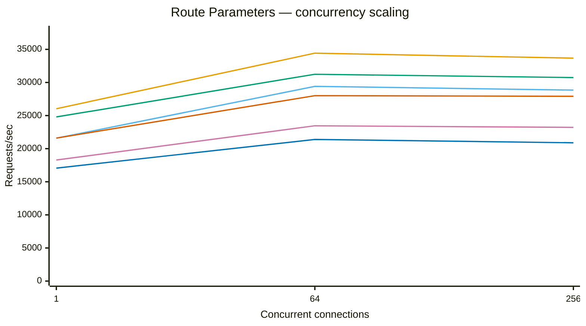
```mermaid
---
config:
  xyChart:
    width: 900
  themeVariables:
    xyChart:
      plotColorPalette: '#E69F00, #56B4E9, #009E73, #D55E00, #CC79A7, #0072B2'
---
xychart-beta
    title "Route Parameters — concurrency scaling"
    x-axis "Concurrent connections" ["1", "64", "256"]
    y-axis "Requests/sec" 0 --> 37880
    line [26032, 34428, 33672]
    line [21581, 29410, 28847]
    line [24792, 31240, 30743]
    line [21601, 28009, 27911]
    line [18289, 23460, 23217]
    line [17063, 21395, 20889]
```

| Line color | Framework |
|---|---|
| #E69F00 | Raw Node.js |
| #56B4E9 | NextRush v3 |
| #009E73 | Fastify |
| #D55E00 | Hono |
| #CC79A7 | Koa |
| #0072B2 | Express |

</details>

### 4. Query Strings — `query-string` · like-for-like

_Query string parsing performance_

| Rank | Framework | RPS | CV% | p50 | p99 | vs Raw Node.js | Pts |
|---|---|---|---|---|---|---|---|
| 🥇 | Raw Node.js *(baseline)* | 27,786 ± 734 | 2.64% | 9.09ms | 9.99ms | baseline | 6 |
| 🥈 | Fastify | 26,452 ± 514 | 1.94% | 9.59ms | 10.44ms | -4.8% | 5 |
| 🥉 | NextRush v3 | 24,652 ± 131 | 0.53% | 10.32ms | 11.29ms | -11.3% | 4 |
| 4 | Hono | 23,542 ± 550 | 2.34% | 10.79ms | 11.63ms | -15.3% | 3 |
| 5 | Koa | 19,530 ± 276 | 1.41% | 13.10ms | 14.29ms | -29.7% | 2 |
| 6 | Express | 18,395 ± 519 | 2.82% | 13.71ms | 15.83ms | -33.8% | 1 |

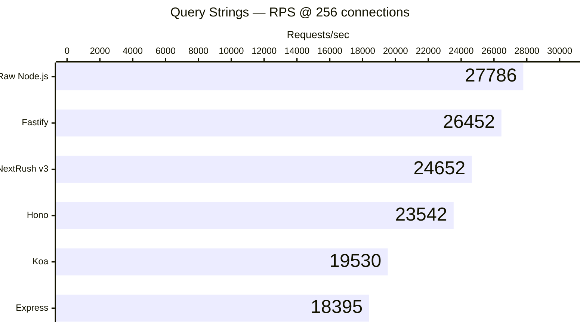
```mermaid
---
config:
  xyChart:
    showDataLabel: true
    width: 900
---
xychart-beta horizontal
    title "Query Strings — RPS @ 256 connections"
    x-axis ["Raw Node.js", "Fastify", "NextRush v3", "Hono", "Koa", "Express"]
    y-axis "Requests/sec" 0 --> 30570
    bar [27786, 26452, 24652, 23542, 19530, 18395]
```

<details>
<summary>All concurrency levels — Query Strings</summary>

| Framework | 1c — RPS | 64c — RPS | 256c — RPS | Non-2xx |
|---|---|---|---|---|
| Raw Node.js | 21,092 ± 428 🥇 | 28,032 ± 673 🥇 | 27,786 ± 734 🥇 | 0 |
| NextRush v3 | 19,679 ± 674 🥇 | 24,804 ± 432 | 24,652 ± 131 | 0 |
| Fastify | 20,226 ± 1,044 🥇 | 26,901 ± 525 🥇 | 26,452 ± 514 | 0 |
| Hono | 19,103 ± 780 🥇 | 24,061 ± 338 | 23,542 ± 550 | 0 |
| Koa | 15,889 ± 839 | 19,866 ± 412 | 19,530 ± 276 | 0 |
| Express | 15,925 ± 652 | 18,732 ± 285 | 18,395 ± 519 | 0 |

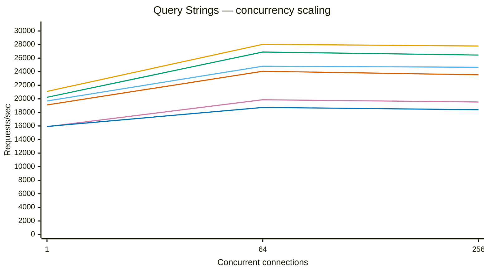
```mermaid
---
config:
  xyChart:
    width: 900
  themeVariables:
    xyChart:
      plotColorPalette: '#E69F00, #56B4E9, #009E73, #D55E00, #CC79A7, #0072B2'
---
xychart-beta
    title "Query Strings — concurrency scaling"
    x-axis "Concurrent connections" ["1", "64", "256"]
    y-axis "Requests/sec" 0 --> 30840
    line [21092, 28032, 27786]
    line [19679, 24804, 24652]
    line [20226, 26901, 26452]
    line [19103, 24061, 23542]
    line [15889, 19866, 19530]
    line [15925, 18732, 18395]
```

| Line color | Framework |
|---|---|
| #E69F00 | Raw Node.js |
| #56B4E9 | NextRush v3 |
| #009E73 | Fastify |
| #D55E00 | Hono |
| #CC79A7 | Koa |
| #0072B2 | Express |

</details>

### 5. POST JSON — `post-json` · like-for-like

_Request body parsing + JSON response_

| Rank | Framework | RPS | CV% | p50 | p99 | vs Raw Node.js | Pts |
|---|---|---|---|---|---|---|---|
| 🥇 | Raw Node.js *(baseline)* | 25,420 ± 537 | 2.11% | 9.96ms | 10.93ms | baseline | 6 |
| 🥈 | Fastify | 20,508 ± 267 | 1.3% | 12.42ms | 13.61ms | -19.3% | 5 |
| 🥉 | Hono | 19,953 ± 155 | 0.78% | 12.72ms | 14.26ms | -21.5% | 4 |
| 4 | NextRush v3 | 19,144 ± 265 | 1.38% | 13.29ms | 14.33ms | -24.7% | 3 |
| 5 | Koa | 16,132 ± 133 | 0.83% | 15.80ms | 16.95ms | -36.5% | 2 |
| 6 | Express | 15,617 ± 279 | 1.79% | 16.22ms | 17.76ms | -38.6% | 1 |

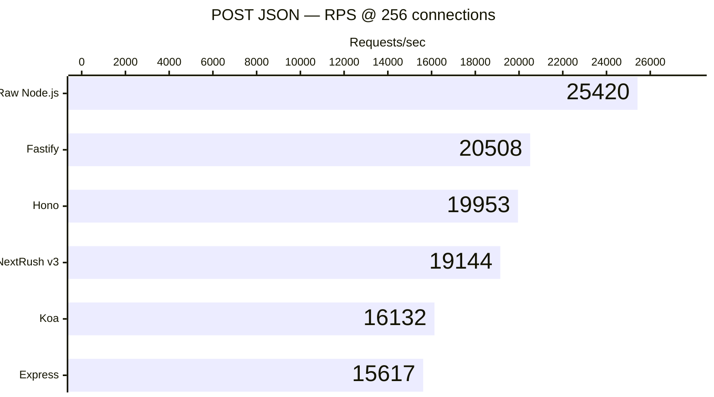
```mermaid
---
config:
  xyChart:
    showDataLabel: true
    width: 900
---
xychart-beta horizontal
    title "POST JSON — RPS @ 256 connections"
    x-axis ["Raw Node.js", "Fastify", "Hono", "NextRush v3", "Koa", "Express"]
    y-axis "Requests/sec" 0 --> 27970
    bar [25420, 20508, 19953, 19144, 16132, 15617]
```

<details>
<summary>All concurrency levels — POST JSON</summary>

| Framework | 1c — RPS | 64c — RPS | 256c — RPS | Non-2xx |
|---|---|---|---|---|
| Raw Node.js | 18,770 ± 909 🥇 | 26,029 ± 592 🥇 | 25,420 ± 537 🥇 | 0 |
| NextRush v3 | 15,204 ± 851 | 19,482 ± 219 | 19,144 ± 265 | 0 |
| Fastify | 16,123 ± 423 | 20,816 ± 270 | 20,508 ± 267 | 0 |
| Hono | 15,833 ± 441 | 20,007 ± 1,162 | 19,953 ± 155 | 0 |
| Koa | 13,524 ± 634 | 16,431 ± 299 | 16,132 ± 133 | 0 |
| Express | 12,822 ± 616 | 15,835 ± 163 | 15,617 ± 279 | 0 |

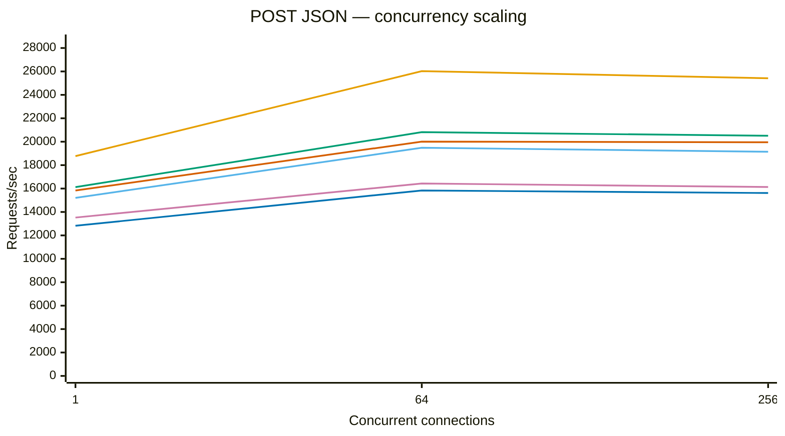
```mermaid
---
config:
  xyChart:
    width: 900
  themeVariables:
    xyChart:
      plotColorPalette: '#E69F00, #56B4E9, #009E73, #D55E00, #CC79A7, #0072B2'
---
xychart-beta
    title "POST JSON — concurrency scaling"
    x-axis "Concurrent connections" ["1", "64", "256"]
    y-axis "Requests/sec" 0 --> 28640
    line [18770, 26029, 25420]
    line [15204, 19482, 19144]
    line [16123, 20816, 20508]
    line [15833, 20007, 19953]
    line [13524, 16431, 16132]
    line [12822, 15835, 15617]
```

| Line color | Framework |
|---|---|
| #E69F00 | Raw Node.js |
| #56B4E9 | NextRush v3 |
| #009E73 | Fastify |
| #D55E00 | Hono |
| #CC79A7 | Koa |
| #0072B2 | Express |

</details>

### 6. Deep Route — `deep-route` · like-for-like

_Deep parameterized route_

| Rank | Framework | RPS | CV% | p50 | p99 | vs Raw Node.js | Pts |
|---|---|---|---|---|---|---|---|
| 🥇 ≈ | Raw Node.js *(baseline)* | 32,669 ± 774 | 2.37% | 7.44ms | 12.01ms | baseline | 5.5 |
| 🥇 | Fastify | 30,776 ± 1,228 | 3.99% | 7.90ms | 12.51ms | -5.8% | 5.5 |
| 🥉 ≈ | NextRush v3 | 28,637 ± 497 | 1.73% | 8.93ms | 9.96ms | -12.3% | 3.5 |
| 🥉 | Hono | 28,521 ± 423 | 1.48% | 8.89ms | 9.73ms | -12.7% | 3.5 |
| 5 | Koa | 22,844 ± 62 | 0.27% | 11.14ms | 12.09ms | -30.1% | 2 |
| 6 | Express | 21,332 ± 291 | 1.37% | 11.99ms | 12.81ms | -34.7% | 1 |

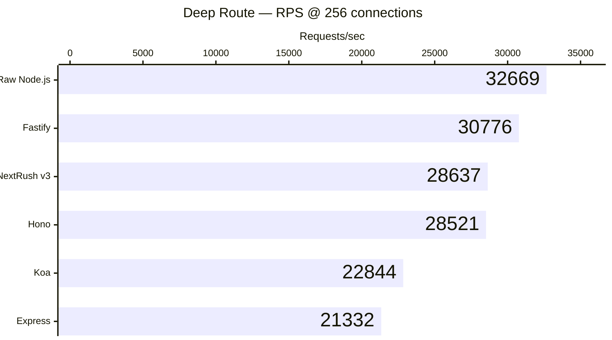
```mermaid
---
config:
  xyChart:
    showDataLabel: true
    width: 900
---
xychart-beta horizontal
    title "Deep Route — RPS @ 256 connections"
    x-axis ["Raw Node.js", "Fastify", "NextRush v3", "Hono", "Koa", "Express"]
    y-axis "Requests/sec" 0 --> 35940
    bar [32669, 30776, 28637, 28521, 22844, 21332]
```

<details>
<summary>All concurrency levels — Deep Route</summary>

| Framework | 1c — RPS | 64c — RPS | 256c — RPS | Non-2xx |
|---|---|---|---|---|
| Raw Node.js | 25,966 ± 305 🥇 | 33,703 ± 736 🥇 | 32,669 ± 774 🥇 | 0 |
| NextRush v3 | 22,316 ± 739 | 29,253 ± 502 | 28,637 ± 497 | 0 |
| Fastify | 25,195 ± 409 | 31,450 ± 895 | 30,776 ± 1,228 🥇 | 0 |
| Hono | 21,962 ± 900 | 28,728 ± 376 | 28,521 ± 423 | 0 |
| Koa | 18,330 ± 576 | 23,251 ± 134 | 22,844 ± 62 | 0 |
| Express | 17,929 ± 432 | 21,713 ± 263 | 21,332 ± 291 | 0 |

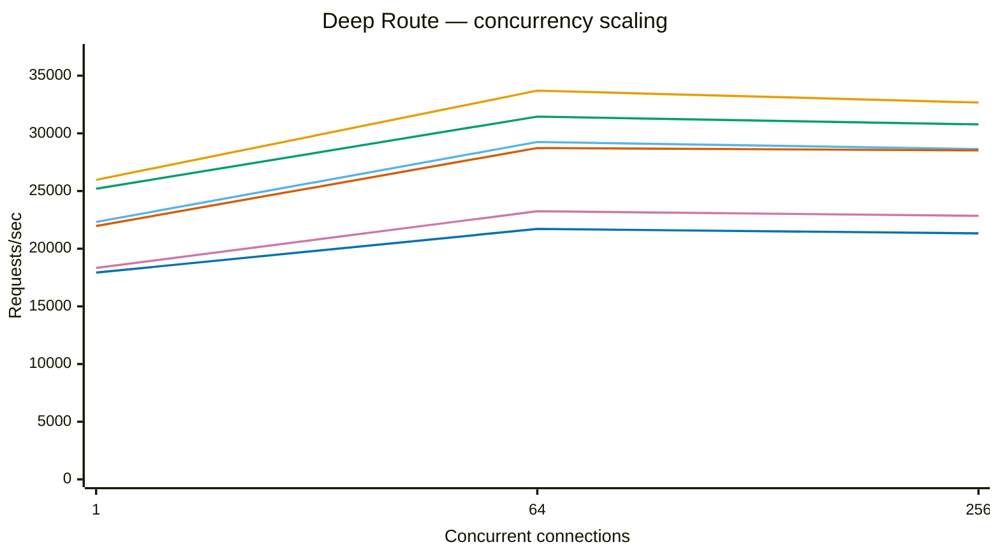
```mermaid
---
config:
  xyChart:
    width: 900
  themeVariables:
    xyChart:
      plotColorPalette: '#E69F00, #56B4E9, #009E73, #D55E00, #CC79A7, #0072B2'
---
xychart-beta
    title "Deep Route — concurrency scaling"
    x-axis "Concurrent connections" ["1", "64", "256"]
    y-axis "Requests/sec" 0 --> 37080
    line [25966, 33703, 32669]
    line [22316, 29253, 28637]
    line [25195, 31450, 30776]
    line [21962, 28728, 28521]
    line [18330, 23251, 22844]
    line [17929, 21713, 21332]
```

| Line color | Framework |
|---|---|
| #E69F00 | Raw Node.js |
| #56B4E9 | NextRush v3 |
| #009E73 | Fastify |
| #D55E00 | Hono |
| #CC79A7 | Koa |
| #0072B2 | Express |

</details>

### 7. Middleware Stack — `middleware-stack` · ⚠️ idiomatic

_5 idiomatic middleware/hook layers, each setting one identical response header. Mechanisms differ per framework (Koa/Express/Hono/NextRush middleware chains, Fastify onRequest hooks, raw-node a manual function chain) — this measures each framework's own 5-layer dispatch cost, NOT an identical mechanism._

| Rank | Framework | RPS | CV% | p50 | p99 | vs Raw Node.js | Pts |
|---|---|---|---|---|---|---|---|
| 🥇 ≈ | Raw Node.js *(baseline)* | 30,749 ± 552 | 1.79% | 8.31ms | 9.05ms | baseline | 5.5 |
| 🥇 | Fastify | 30,527 ± 785 | 2.57% | 8.40ms | 9.04ms | -0.7% | 5.5 |
| 🥉 ≈ | Hono | 24,273 ± 520 | 2.14% | 10.49ms | 11.20ms | -21.1% | 3.5 |
| 🥉 | NextRush v3 | 24,188 ± 568 | 2.35% | 10.47ms | 11.29ms | -21.3% | 3.5 |
| 5 | Koa | 21,964 ± 721 | 3.28% | 11.51ms | 12.42ms | -28.6% | 2 |
| 6 | Express | 20,180 ± 262 | 1.3% | 12.57ms | 13.74ms | -34.4% | 1 |

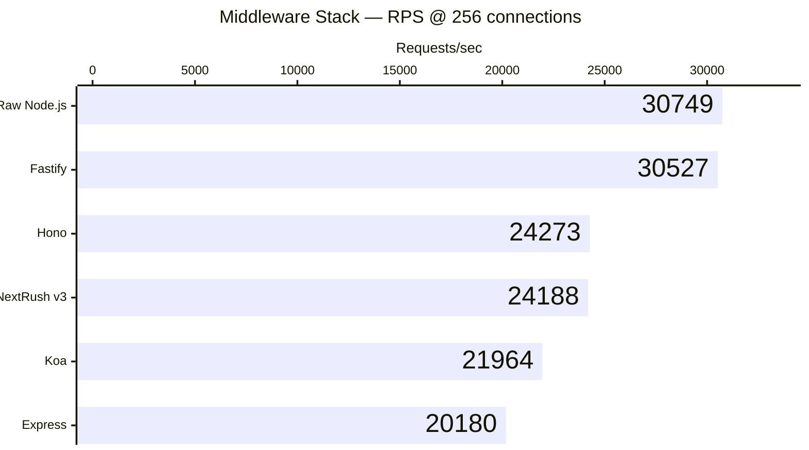
```mermaid
---
config:
  xyChart:
    showDataLabel: true
    width: 900
---
xychart-beta horizontal
    title "Middleware Stack — RPS @ 256 connections"
    x-axis ["Raw Node.js", "Fastify", "Hono", "NextRush v3", "Koa", "Express"]
    y-axis "Requests/sec" 0 --> 33830
    bar [30749, 30527, 24273, 24188, 21964, 20180]
```

<details>
<summary>All concurrency levels — Middleware Stack</summary>

| Framework | 1c — RPS | 64c — RPS | 256c — RPS | Non-2xx |
|---|---|---|---|---|
| Raw Node.js | 23,909 ± 437 🥇 | 31,186 ± 663 🥇 | 30,749 ± 552 🥇 | 0 |
| NextRush v3 | 19,739 ± 392 | 24,765 ± 359 | 24,188 ± 568 | 0 |
| Fastify | 23,940 ± 642 🥇 | 31,193 ± 717 🥇 | 30,527 ± 785 🥇 | 0 |
| Hono | 17,514 ± 868 | 24,555 ± 371 | 24,273 ± 520 | 0 |
| Koa | 16,919 ± 932 | 22,566 ± 315 | 21,964 ± 721 | 0 |
| Express | 16,464 ± 359 | 20,241 ± 592 | 20,180 ± 262 | 0 |

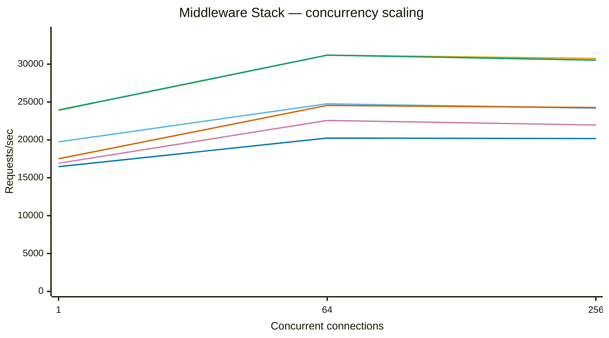
```mermaid
---
config:
  xyChart:
    width: 900
  themeVariables:
    xyChart:
      plotColorPalette: '#E69F00, #56B4E9, #009E73, #D55E00, #CC79A7, #0072B2'
---
xychart-beta
    title "Middleware Stack — concurrency scaling"
    x-axis "Concurrent connections" ["1", "64", "256"]
    y-axis "Requests/sec" 0 --> 34320
    line [23909, 31186, 30749]
    line [19739, 24765, 24188]
    line [23940, 31193, 30527]
    line [17514, 24555, 24273]
    line [16919, 22566, 21964]
    line [16464, 20241, 20180]
```

| Line color | Framework |
|---|---|
| #E69F00 | Raw Node.js |
| #56B4E9 | NextRush v3 |
| #009E73 | Fastify |
| #D55E00 | Hono |
| #CC79A7 | Koa |
| #0072B2 | Express |

</details>

### 8. Error Handling — `error-handling` · ⚠️ idiomatic

_Uncaught throw routed through each framework's idiomatic error handler (raw-node uses a local catch — it has no pipeline). Returns 500. Mechanisms differ._

| Rank | Framework | RPS | CV% | p50 | p99 | vs Raw Node.js | Pts |
|---|---|---|---|---|---|---|---|
| 🥇 | Raw Node.js *(baseline)* | 24,971 ± 482 | 1.93% | 10.27ms | 11.00ms | baseline | 6 |
| 🥈 | Fastify | 21,534 ± 471 | 2.19% | 11.92ms | 12.64ms | -13.8% | 5 |
| 🥉 | Hono | 20,457 ± 329 | 1.61% | 12.54ms | 13.35ms | -18.1% | 4 |
| 4 | NextRush v3 | 19,409 ± 608 | 3.13% | 12.91ms | 14.22ms | -22.3% | 3 |
| 5 ≈ | Koa | 16,763 ± 203 | 1.21% | 15.15ms | 16.41ms | -32.9% | 1.5 |
| 5 | Express | 15,474 ± 1,481 | 9.57% | 15.93ms | 16.92ms | -38.0% | 1.5 |

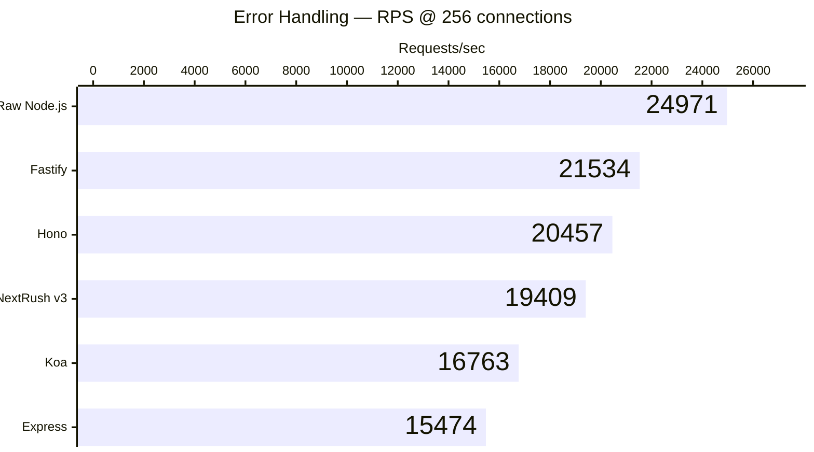
```mermaid
---
config:
  xyChart:
    showDataLabel: true
    width: 900
---
xychart-beta horizontal
    title "Error Handling — RPS @ 256 connections"
    x-axis ["Raw Node.js", "Fastify", "Hono", "NextRush v3", "Koa", "Express"]
    y-axis "Requests/sec" 0 --> 27470
    bar [24971, 21534, 20457, 19409, 16763, 15474]
```

<details>
<summary>All concurrency levels — Error Handling</summary>

| Framework | 1c — RPS | 64c — RPS | 256c — RPS | Non-2xx |
|---|---|---|---|---|
| Raw Node.js | 19,198 ± 970 🥇 | 25,033 ± 542 🥇 | 24,971 ± 482 🥇 | 12,475,040 |
| NextRush v3 | 14,798 ± 938 | 19,866 ± 157 | 19,409 ± 608 | 9,747,896 |
| Fastify | 17,043 ± 980 | 22,129 ± 383 | 21,534 ± 471 | 10,942,182 |
| Hono | 16,700 ± 884 | 20,607 ± 412 | 20,457 ± 329 | 10,412,507 |
| Koa | 14,185 ± 408 | 16,782 ± 275 | 16,763 ± 203 | 8,604,322 |
| Express | 14,529 ± 1,058 | 15,366 ± 1,543 | 15,474 ± 1,481 | 8,177,833 |

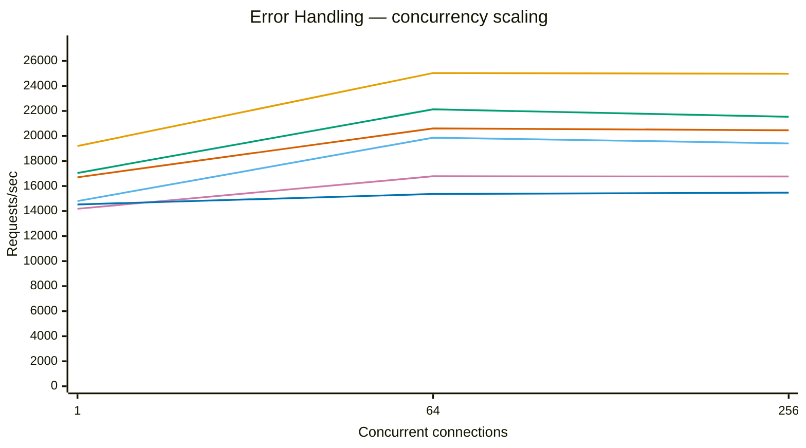
```mermaid
---
config:
  xyChart:
    width: 900
  themeVariables:
    xyChart:
      plotColorPalette: '#E69F00, #56B4E9, #009E73, #D55E00, #CC79A7, #0072B2'
---
xychart-beta
    title "Error Handling — concurrency scaling"
    x-axis "Concurrent connections" ["1", "64", "256"]
    y-axis "Requests/sec" 0 --> 27540
    line [19198, 25033, 24971]
    line [14798, 19866, 19409]
    line [17043, 22129, 21534]
    line [16700, 20607, 20457]
    line [14185, 16782, 16763]
    line [14529, 15366, 15474]
```

| Line color | Framework |
|---|---|
| #E69F00 | Raw Node.js |
| #56B4E9 | NextRush v3 |
| #009E73 | Fastify |
| #D55E00 | Hono |
| #CC79A7 | Koa |
| #0072B2 | Express |

</details>

### 9. Large JSON — `large-json` · like-for-like

_Large payload serialization (~5KB JSON array)_

| Rank | Framework | RPS | CV% | p50 | p99 | vs Raw Node.js | Pts |
|---|---|---|---|---|---|---|---|
| 🥇 | Raw Node.js *(baseline)* | 22,589 ± 516 | 2.29% | 11.23ms | 12.12ms | baseline | 6 |
| 🥈 | Fastify | 21,748 ± 276 | 1.27% | 11.62ms | 12.66ms | -3.7% | 5 |
| 🥉 | NextRush v3 | 20,717 ± 631 | 3.05% | 12.17ms | 13.24ms | -8.3% | 4 |
| 4 | Hono | 19,416 ± 408 | 2.1% | 13.14ms | 13.99ms | -14.0% | 3 |
| 5 | Koa | 17,209 ± 301 | 1.75% | 14.96ms | 16.04ms | -23.8% | 2 |
| 6 | Express | 15,558 ± 338 | 2.17% | 16.10ms | 21.64ms | -31.1% | 1 |

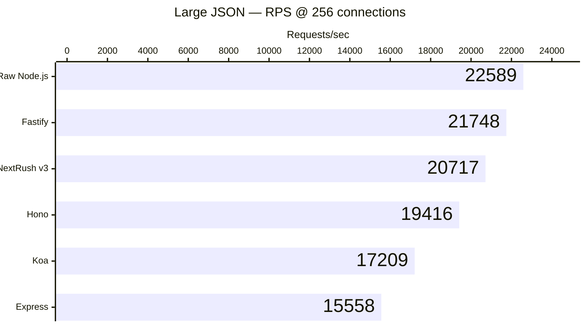
```mermaid
---
config:
  xyChart:
    showDataLabel: true
    width: 900
---
xychart-beta horizontal
    title "Large JSON — RPS @ 256 connections"
    x-axis ["Raw Node.js", "Fastify", "NextRush v3", "Hono", "Koa", "Express"]
    y-axis "Requests/sec" 0 --> 24850
    bar [22589, 21748, 20717, 19416, 17209, 15558]
```

<details>
<summary>All concurrency levels — Large JSON</summary>

| Framework | 1c — RPS | 64c — RPS | 256c — RPS | Non-2xx |
|---|---|---|---|---|
| Raw Node.js | 17,900 ± 734 🥇 | 23,072 ± 543 🥇 | 22,589 ± 516 🥇 | 0 |
| NextRush v3 | 16,537 ± 636 🥇 | 21,054 ± 499 | 20,717 ± 631 | 0 |
| Fastify | 17,014 ± 1,519 🥇 | 21,989 ± 318 | 21,748 ± 276 | 0 |
| Hono | 15,326 ± 1,161 🥇 | 19,796 ± 514 | 19,416 ± 408 | 0 |
| Koa | 14,326 ± 701 🥇 | 17,480 ± 343 | 17,209 ± 301 | 0 |
| Express | 13,106 ± 1,070 🥇 | 15,157 ± 1,018 | 15,558 ± 338 | 0 |

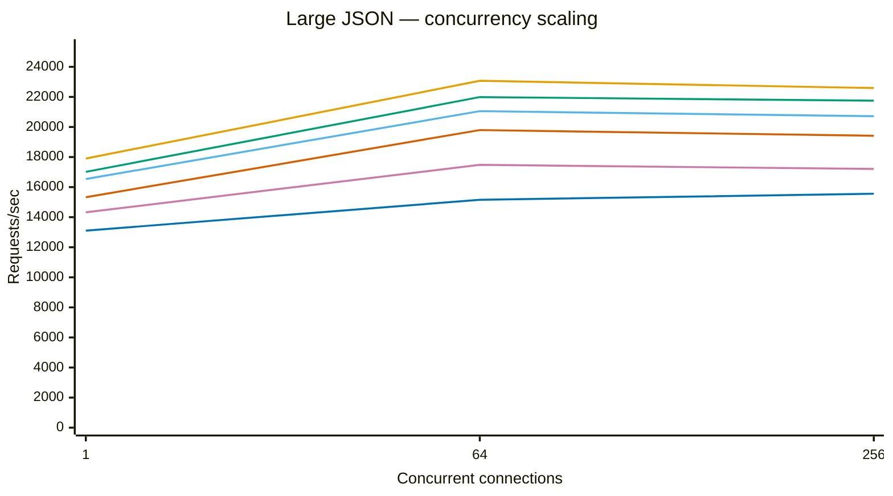
```mermaid
---
config:
  xyChart:
    width: 900
  themeVariables:
    xyChart:
      plotColorPalette: '#E69F00, #56B4E9, #009E73, #D55E00, #CC79A7, #0072B2'
---
xychart-beta
    title "Large JSON — concurrency scaling"
    x-axis "Concurrent connections" ["1", "64", "256"]
    y-axis "Requests/sec" 0 --> 25380
    line [17900, 23072, 22589]
    line [16537, 21054, 20717]
    line [17014, 21989, 21748]
    line [15326, 19796, 19416]
    line [14326, 17480, 17209]
    line [13106, 15157, 15558]
```

| Line color | Framework |
|---|---|
| #E69F00 | Raw Node.js |
| #56B4E9 | NextRush v3 |
| #009E73 | Fastify |
| #D55E00 | Hono |
| #CC79A7 | Koa |
| #0072B2 | Express |

</details>

### 10. Empty Response — `empty-response` · like-for-like

_Absolute minimum — 204 No Content, zero serialization_

| Rank | Framework | RPS | CV% | p50 | p99 | vs Raw Node.js | Pts |
|---|---|---|---|---|---|---|---|
| 🥇 | Raw Node.js *(baseline)* | 44,818 ± 1,407 | 3.14% | 5.56ms | 8.61ms | baseline | 6 |
| 🥈 | Fastify | 39,782 ± 955 | 2.4% | 6.19ms | 10.15ms | -11.2% | 5 |
| 🥉 ≈ | NextRush v3 | 35,778 ± 784 | 2.19% | 6.74ms | 11.14ms | -20.2% | 3.5 |
| 🥉 | Hono | 35,714 ± 1,148 | 3.21% | 6.79ms | 11.14ms | -20.3% | 3.5 |
| 5 | Express | 32,730 ± 704 | 2.15% | 7.82ms | 8.31ms | -27.0% | 2 |
| 6 | Koa | 30,077 ± 710 | 2.36% | 8.57ms | 9.19ms | -32.9% | 1 |

```mermaid
---
config:
  xyChart:
    showDataLabel: true
    width: 900
---
xychart-beta horizontal
    title "Empty Response — RPS @ 256 connections"
    x-axis ["Raw Node.js", "Fastify", "NextRush v3", "Hono", "Express", "Koa"]
    y-axis "Requests/sec" 0 --> 49300
    bar [44818, 39782, 35778, 35714, 32730, 30077]
```

<details>
<summary>All concurrency levels — Empty Response</summary>

| Framework | 1c — RPS | 64c — RPS | 256c — RPS | Non-2xx |
|---|---|---|---|---|
| Raw Node.js | 30,277 ± 168 🥇 | 46,373 ± 1,408 🥇 | 44,818 ± 1,407 🥇 | 0 |
| NextRush v3 | 27,769 ± 349 | 36,584 ± 796 | 35,778 ± 784 | 0 |
| Fastify | 29,472 ± 521 | 40,407 ± 881 | 39,782 ± 955 | 0 |
| Hono | 27,812 ± 390 | 35,693 ± 931 | 35,714 ± 1,148 | 0 |
| Koa | 22,316 ± 926 | 30,579 ± 798 | 30,077 ± 710 | 0 |
| Express | 24,222 ± 556 | 33,358 ± 519 | 32,730 ± 704 | 0 |

```mermaid
---
config:
  xyChart:
    width: 900
  themeVariables:
    xyChart:
      plotColorPalette: '#E69F00, #56B4E9, #009E73, #D55E00, #CC79A7, #0072B2'
---
xychart-beta
    title "Empty Response — concurrency scaling"
    x-axis "Concurrent connections" ["1", "64", "256"]
    y-axis "Requests/sec" 0 --> 51020
    line [30277, 46373, 44818]
    line [27769, 36584, 35778]
    line [29472, 40407, 39782]
    line [27812, 35693, 35714]
    line [22316, 30579, 30077]
    line [24222, 33358, 32730]
```

| Line color | Framework |
|---|---|
| #E69F00 | Raw Node.js |
| #56B4E9 | NextRush v3 |
| #009E73 | Fastify |
| #D55E00 | Hono |
| #CC79A7 | Koa |
| #0072B2 | Express |

</details>

### 11. Send Object — `send-object` · like-for-like

_Dispatches a plain object through each framework's own response-serialization helper (not a pre-serialized string) — the general object-dispatch code path named by the performance reconciliation report's Rec 11 / F-09_

| Rank | Framework | RPS | CV% | p50 | p99 | vs Raw Node.js | Pts |
|---|---|---|---|---|---|---|---|
| 🥇 | Raw Node.js *(baseline)* | 35,329 ± 693 | 1.96% | 6.99ms | 10.79ms | baseline | 6 |
| 🥈 ≈ | NextRush v3 | 31,751 ± 756 | 2.38% | 8.07ms | 8.71ms | -10.1% | 4.5 |
| 🥈 | Fastify | 31,456 ± 754 | 2.4% | 7.64ms | 12.30ms | -11.0% | 4.5 |
| 4 | Hono | 29,849 ± 576 | 1.93% | 8.52ms | 9.27ms | -15.5% | 3 |
| 5 | Koa | 24,201 ± 429 | 1.77% | 10.50ms | 11.39ms | -31.5% | 2 |
| 6 | Express | 21,570 ± 720 | 3.34% | 11.79ms | 12.71ms | -38.9% | 1 |

```mermaid
---
config:
  xyChart:
    showDataLabel: true
    width: 900
---
xychart-beta horizontal
    title "Send Object — RPS @ 256 connections"
    x-axis ["Raw Node.js", "NextRush v3", "Fastify", "Hono", "Koa", "Express"]
    y-axis "Requests/sec" 0 --> 38870
    bar [35329, 31751, 31456, 29849, 24201, 21570]
```

<details>
<summary>All concurrency levels — Send Object</summary>

| Framework | 1c — RPS | 64c — RPS | 256c — RPS | Non-2xx |
|---|---|---|---|---|
| Raw Node.js | 26,611 ± 1,062 🥇 | 35,255 ± 1,160 🥇 | 35,329 ± 693 🥇 | 0 |
| NextRush v3 | 23,878 ± 500 | 32,490 ± 417 | 31,751 ± 756 | 0 |
| Fastify | 25,318 ± 177 | 31,846 ± 1,034 | 31,456 ± 754 | 0 |
| Hono | 22,807 ± 1,044 | 30,154 ± 611 | 29,849 ± 576 | 0 |
| Koa | 18,840 ± 950 | 24,469 ± 619 | 24,201 ± 429 | 0 |
| Express | 17,581 ± 520 | 21,962 ± 289 | 21,570 ± 720 | 0 |

```mermaid
---
config:
  xyChart:
    width: 900
  themeVariables:
    xyChart:
      plotColorPalette: '#E69F00, #56B4E9, #009E73, #D55E00, #CC79A7, #0072B2'
---
xychart-beta
    title "Send Object — concurrency scaling"
    x-axis "Concurrent connections" ["1", "64", "256"]
    y-axis "Requests/sec" 0 --> 38870
    line [26611, 35255, 35329]
    line [23878, 32490, 31751]
    line [25318, 31846, 31456]
    line [22807, 30154, 29849]
    line [18840, 24469, 24201]
    line [17581, 21962, 21570]
```

| Line color | Framework |
|---|---|
| #E69F00 | Raw Node.js |
| #56B4E9 | NextRush v3 |
| #009E73 | Fastify |
| #D55E00 | Hono |
| #CC79A7 | Koa |
| #0072B2 | Express |

</details>

### 12. Static File — `static-file` · ⚠️ idiomatic

_Serves a small static file through each framework's own static-file middleware. Header-set divergence across frameworks (accept-ranges, cache-control, etag, last-modified are present in some servers and not others) means this is each framework's own idiomatic mechanism, not verified byte-identical work — like `middleware-stack` and `error-handling`, it is scored separately rather than folded into the headline score._

| Rank | Framework | RPS | CV% | p50 | p99 | vs Raw Node.js | Pts |
|---|---|---|---|---|---|---|---|
| 🥇 | Raw Node.js *(baseline)* | 14,759 ± 476 | 3.22% | 17.38ms | 21.35ms | baseline | 6 |
| 🥈 ≈ | Fastify | 11,000 ± 186 | 1.69% | 24.15ms | 28.03ms | -25.5% | 4.5 |
| 🥈 | Express | 10,996 ± 309 | 2.81% | 24.19ms | 28.32ms | -25.5% | 4.5 |
| 4 | NextRush v3 | 9,238 ± 70 | 0.76% | 28.06ms | 34.39ms | -37.4% | 3 |
| 5 | Hono | 7,922 ± 155 | 1.96% | 31.50ms | 41.77ms | -46.3% | 2 |
| 6 | Koa | 6,556 ± 225 | 3.43% | 39.65ms | 54.65ms | -55.6% | 1 |

```mermaid
---
config:
  xyChart:
    showDataLabel: true
    width: 900
---
xychart-beta horizontal
    title "Static File — RPS @ 256 connections"
    x-axis ["Raw Node.js", "Fastify", "Express", "NextRush v3", "Hono", "Koa"]
    y-axis "Requests/sec" 0 --> 16240
    bar [14759, 11000, 10996, 9238, 7922, 6556]
```

<details>
<summary>All concurrency levels — Static File</summary>

| Framework | 1c — RPS | 64c — RPS | 256c — RPS | Non-2xx |
|---|---|---|---|---|
| Raw Node.js | 8,641 ± 168 🥇 | 15,118 ± 267 🥇 | 14,759 ± 476 🥇 | 0 |
| NextRush v3 | 6,047 ± 128 | 9,244 ± 238 | 9,238 ± 70 | 0 |
| Fastify | 7,620 ± 125 | 11,245 ± 149 | 11,000 ± 186 | 0 |
| Hono | 6,383 ± 146 | 8,355 ± 245 | 7,922 ± 155 | 0 |
| Koa | 5,366 ± 56 | 7,490 ± 100 | 6,556 ± 225 | 0 |
| Express | 7,331 ± 124 | 10,663 ± 488 | 10,996 ± 309 | 0 |

```mermaid
---
config:
  xyChart:
    width: 900
  themeVariables:
    xyChart:
      plotColorPalette: '#E69F00, #56B4E9, #009E73, #D55E00, #CC79A7, #0072B2'
---
xychart-beta
    title "Static File — concurrency scaling"
    x-axis "Concurrent connections" ["1", "64", "256"]
    y-axis "Requests/sec" 0 --> 16630
    line [8641, 15118, 14759]
    line [6047, 9244, 9238]
    line [7620, 11245, 11000]
    line [6383, 8355, 7922]
    line [5366, 7490, 6556]
    line [7331, 10663, 10996]
```

| Line color | Framework |
|---|---|
| #E69F00 | Raw Node.js |
| #56B4E9 | NextRush v3 |
| #009E73 | Fastify |
| #D55E00 | Hono |
| #CC79A7 | Koa |
| #0072B2 | Express |

</details>

### 13. Large POST Body — `large-post` · like-for-like

_A request body at or above 1MB — measures body-parsing/response cost at a size distinct from the existing smaller `post-json` scenario (Rec 11)_

No data for this scenario in this run.

## Latency @ 256 connections

| Framework (p99) | Hello World | JSON Serialization | Route Parameters | Query Strings | POST JSON | Deep Route | Middleware Stack | Error Handling | Large JSON | Empty Response | Send Object | Static File | Large POST Body |
|---|---|---|---|---|---|---|---|---|---|---|---|---|---|
| Raw Node.js | 10.95ms | 11.31ms | 11.70ms | 9.99ms | 10.93ms | 12.01ms | 9.05ms | 11.00ms | 12.12ms | 8.61ms | 10.79ms | 21.35ms | — |
| NextRush v3 | 10.09ms | 9.05ms | 9.51ms | 11.29ms | 14.33ms | 9.96ms | 11.29ms | 14.22ms | 13.24ms | 11.14ms | 8.71ms | 34.39ms | — |
| Fastify | 11.75ms | 11.50ms | 12.50ms | 10.44ms | 13.61ms | 12.51ms | 9.04ms | 12.64ms | 12.66ms | 10.15ms | 12.30ms | 28.03ms | — |
| Hono | 8.68ms | 9.52ms | 9.86ms | 11.63ms | 14.26ms | 9.73ms | 11.20ms | 13.35ms | 13.99ms | 11.14ms | 9.27ms | 41.77ms | — |
| Koa | 11.12ms | 11.50ms | 11.93ms | 14.29ms | 16.95ms | 12.09ms | 12.42ms | 16.41ms | 16.04ms | 9.19ms | 11.39ms | 54.65ms | — |
| Express | 12.42ms | 12.16ms | 13.78ms | 15.83ms | 17.76ms | 12.81ms | 13.74ms | 16.92ms | 21.64ms | 8.31ms | 12.71ms | 28.32ms | — |

```mermaid
---
config:
  xyChart:
    showDataLabel: true
    width: 900
---
xychart-beta horizontal
    title "Hello World — p99 latency @ 256 connections"
    x-axis ["Hono", "NextRush v3", "Raw Node.js", "Koa", "Fastify", "Express"]
    y-axis "p99 latency (ms) — lower is better" 0 --> 20
    bar [8.68, 10.09, 10.95, 11.12, 11.75, 12.42]
```

### Throughput against latency

Positions are relative to the frameworks in this run — the axes are normalized to the run's own minimum and maximum, so a point moving between runs means the field changed, not that absolute performance did.

```mermaid
quadrantChart
    title Hello World — throughput vs p99 latency @ 256 connections
    x-axis Lower throughput --> Higher throughput
    y-axis Higher p99 latency --> Lower p99 latency
    quadrant-1 Fast and responsive
    quadrant-2 Responsive but slower
    quadrant-3 Slower and less responsive
    quadrant-4 High throughput, higher latency
    Raw Node.js: [0.9, 0.41]
    Fastify: [0.73, 0.24]
    NextRush v3: [0.64, 0.6]
    Hono: [0.63, 0.9]
    Koa: [0.24, 0.38]
    Express: [0.1, 0.1]
```

## Resource Usage

Sampled from `/proc` every 0.5s for the server process only — the load generator runs in a separate process and is not counted.

| Framework | RSS peak | RSS avg | CPU avg | CPU peak | Sample coverage | GC events | GC pause total |
|---|---|---|---|---|---|---|---|
| Raw Node.js | 247.0 MB | 110.8 MB | 84.26666666666667% | 142.13333333333333% | 99.89999999999999% | — | — |
| NextRush v3 | 317.3 MB | 123.5 MB | 87.06666666666666% | 148.61666666666667% | 99.89999999999999% | — | — |
| Fastify | 331.3 MB | 120.6 MB | 84.96666666666665% | 158.28333333333333% | 99.89999999999999% | — | — |
| Hono | 327.5 MB | 126.9 MB | 88.76666666666665% | 189.13333333333333% | 99.89999999999999% | — | — |
| Koa | 327.0 MB | 136.7 MB | 89.8% | 175.61666666666667% | 99.89999999999999% | — | — |
| Express | 308.3 MB | 144.2 MB | 89.28333333333335% | 154.95000000000002% | 99.89999999999999% | — | — |

### Raw Node.js

| Metric | Value |
|---|---|
| RSS peak | 247.0 MB |
| RSS avg | 110.8 MB |
| RSS min / max | 83.5 MB / 233.2 MB |
| CPU avg / peak | 84.26666666666667% / 142.13333333333333% |
| Samples | 2359 |
| Sample coverage | 99.89999999999999% |
| GC events | not traced (enable with --trace-gc) |
| GC pause | — |

### NextRush v3

| Metric | Value |
|---|---|
| RSS peak | 317.3 MB |
| RSS avg | 123.5 MB |
| RSS min / max | 89.6 MB / 315.4 MB |
| CPU avg / peak | 87.06666666666666% / 148.61666666666667% |
| Samples | 2358.8333333333335 |
| Sample coverage | 99.89999999999999% |
| GC events | not traced (enable with --trace-gc) |
| GC pause | — |

### Fastify

| Metric | Value |
|---|---|
| RSS peak | 331.3 MB |
| RSS avg | 120.6 MB |
| RSS min / max | 91.2 MB / 295.8 MB |
| CPU avg / peak | 84.96666666666665% / 158.28333333333333% |
| Samples | 2358.8333333333335 |
| Sample coverage | 99.89999999999999% |
| GC events | not traced (enable with --trace-gc) |
| GC pause | — |

### Hono

| Metric | Value |
|---|---|
| RSS peak | 327.5 MB |
| RSS avg | 126.9 MB |
| RSS min / max | 92.4 MB / 314.2 MB |
| CPU avg / peak | 88.76666666666665% / 189.13333333333333% |
| Samples | 2358.6666666666665 |
| Sample coverage | 99.89999999999999% |
| GC events | not traced (enable with --trace-gc) |
| GC pause | — |

### Koa

| Metric | Value |
|---|---|
| RSS peak | 327.0 MB |
| RSS avg | 136.7 MB |
| RSS min / max | 93.8 MB / 312.5 MB |
| CPU avg / peak | 89.8% / 175.61666666666667% |
| Samples | 2358.8333333333335 |
| Sample coverage | 99.89999999999999% |
| GC events | not traced (enable with --trace-gc) |
| GC pause | — |

### Express

| Metric | Value |
|---|---|
| RSS peak | 308.3 MB |
| RSS avg | 144.2 MB |
| RSS min / max | 91.5 MB / 268.4 MB |
| CPU avg / peak | 89.28333333333335% / 154.95000000000002% |
| Samples | 2358.6666666666665 |
| Sample coverage | 99.89999999999999% |
| GC events | not traced (enable with --trace-gc) |
| GC pause | — |

## Efficiency — Hello World throughput vs. whole-run CPU/RSS

| Framework | RPS | CPU avg | RPS per CPU% | RSS peak | RPS per MB |
|---|---|---|---|---|---|
| Raw Node.js | 35,503 | 84.26666666666667% | 421 | 247.0 MB | 144 |
| NextRush v3 | 31,343 | 87.06666666666666% | 360 | 317.3 MB | 99 |
| Fastify | 32,703 | 84.96666666666665% | 385 | 331.3 MB | 99 |
| Hono | 31,073 | 88.76666666666665% | 350 | 327.5 MB | 95 |
| Koa | 24,779 | 89.8% | 276 | 327.0 MB | 76 |
| Express | 22,509 | 89.28333333333335% | 252 | 308.3 MB | 73 |

RPS is Hello World's figure at 256 connections; CPU and RSS are a **whole-run aggregate** from the `/proc` sampler, covering only the share of the run reported as *Sample coverage* in **Resource Usage** — not scoped to this one scenario, and not necessarily continuous. CPU can exceed 100% — it is summed across cores. RSS peak includes heap V8 has not yet reclaimed. Treat both ratio columns as an order-of-magnitude comparison across mismatched measurement windows, not a precise per-scenario cost model.

## Raw results per framework

<details>
<summary>Raw Node.js — all scenarios and concurrency levels</summary>

| Scenario | Conn | RPS | CV% | p50 | p99 | Valid runs | Non-2xx |
|---|---|---|---|---|---|---|---|
| Hello World | 1 | 26,803 ± 565 | 2.11% | 0.03ms | 0.08ms | 6 | 0 |
| Hello World | 64 | 36,184 ± 1,569 | 4.34% | 1.66ms | 2.76ms | 6 | 0 |
| Hello World | 256 | 35,503 ± 564 | 1.59% | 6.86ms | 10.95ms | 6 | 0 |
| JSON Serialization | 1 | 26,809 ± 867 | 3.23% | 0.03ms | 0.07ms | 6 | 0 |
| JSON Serialization | 64 | 35,452 ± 603 | 1.7% | 1.68ms | 2.81ms | 6 | 0 |
| JSON Serialization | 256 | 34,466 ± 810 | 2.35% | 6.89ms | 11.31ms | 6 | 0 |
| Route Parameters | 1 | 26,032 ± 572 | 2.2% | 0.04ms | 0.06ms | 6 | 0 |
| Route Parameters | 64 | 34,428 ± 1,632 | 4.74% | 1.76ms | 2.91ms | 6 | 0 |
| Route Parameters | 256 | 33,672 ± 786 | 2.33% | 7.28ms | 11.70ms | 6 | 0 |
| Query Strings | 1 | 21,092 ± 428 | 2.03% | 0.04ms | 0.08ms | 6 | 0 |
| Query Strings | 64 | 28,032 ± 673 | 2.4% | 2.23ms | 2.53ms | 6 | 0 |
| Query Strings | 256 | 27,786 ± 734 | 2.64% | 9.09ms | 9.99ms | 6 | 0 |
| POST JSON | 1 | 18,770 ± 909 | 4.84% | 0.05ms | 0.07ms | 6 | 0 |
| POST JSON | 64 | 26,029 ± 592 | 2.27% | 2.42ms | 2.79ms | 6 | 0 |
| POST JSON | 256 | 25,420 ± 537 | 2.11% | 9.96ms | 10.93ms | 6 | 0 |
| Deep Route | 1 | 25,966 ± 305 | 1.18% | 0.04ms | 0.06ms | 6 | 0 |
| Deep Route | 64 | 33,703 ± 736 | 2.18% | 1.80ms | 2.92ms | 6 | 0 |
| Deep Route | 256 | 32,669 ± 774 | 2.37% | 7.44ms | 12.01ms | 6 | 0 |
| Middleware Stack | 1 | 23,909 ± 437 | 1.83% | 0.04ms | 0.07ms | 6 | 0 |
| Middleware Stack | 64 | 31,186 ± 663 | 2.13% | 2.05ms | 2.26ms | 6 | 0 |
| Middleware Stack | 256 | 30,749 ± 552 | 1.79% | 8.31ms | 9.05ms | 6 | 0 |
| Error Handling | 1 | 19,198 ± 970 | 5.05% | 0.05ms | 0.08ms | 6 | 3,467,216 |
| Error Handling | 64 | 25,033 ± 542 | 2.17% | 2.53ms | 3.22ms | 6 | 4,507,984 |
| Error Handling | 256 | 24,971 ± 482 | 1.93% | 10.27ms | 11.00ms | 6 | 4,499,840 |
| Large JSON | 1 | 17,900 ± 734 | 4.1% | 0.05ms | 0.09ms | 6 | 0 |
| Large JSON | 64 | 23,072 ± 543 | 2.35% | 2.78ms | 3.14ms | 6 | 0 |
| Large JSON | 256 | 22,589 ± 516 | 2.29% | 11.23ms | 12.12ms | 6 | 0 |
| Empty Response | 1 | 30,277 ± 168 | 0.56% | 0.03ms | 0.05ms | 6 | 0 |
| Empty Response | 64 | 46,373 ± 1,408 | 3.04% | 1.35ms | 2.08ms | 6 | 0 |
| Empty Response | 256 | 44,818 ± 1,407 | 3.14% | 5.56ms | 8.61ms | 6 | 0 |
| Send Object | 1 | 26,611 ± 1,062 | 3.99% | 0.03ms | 0.05ms | 6 | 0 |
| Send Object | 64 | 35,255 ± 1,160 | 3.29% | 1.72ms | 2.79ms | 6 | 0 |
| Send Object | 256 | 35,329 ± 693 | 1.96% | 6.99ms | 10.79ms | 6 | 0 |
| Static File | 1 | 8,641 ± 168 | 1.94% | 0.10ms | 0.27ms | 6 | 0 |
| Static File | 64 | 15,118 ± 267 | 1.76% | 4.20ms | 6.93ms | 6 | 0 |
| Static File | 256 | 14,759 ± 476 | 3.22% | 17.38ms | 21.35ms | 6 | 0 |
| Large POST Body | 1 | 186 ± 11 | 5.75% | 5.47ms | 6.15ms | 6 | 0 |

</details>

<details>
<summary>NextRush v3 — all scenarios and concurrency levels</summary>

| Scenario | Conn | RPS | CV% | p50 | p99 | Valid runs | Non-2xx |
|---|---|---|---|---|---|---|---|
| Hello World | 1 | 24,302 ± 763 | 3.14% | 0.04ms | 0.07ms | 6 | 0 |
| Hello World | 64 | 31,707 ± 558 | 1.76% | 1.96ms | 3.08ms | 6 | 0 |
| Hello World | 256 | 31,343 ± 787 | 2.51% | 7.98ms | 10.09ms | 6 | 0 |
| JSON Serialization | 1 | 24,405 ± 855 | 3.5% | 0.04ms | 0.06ms | 6 | 0 |
| JSON Serialization | 64 | 31,774 ± 427 | 1.34% | 1.97ms | 2.27ms | 6 | 0 |
| JSON Serialization | 256 | 31,242 ± 382 | 1.22% | 8.12ms | 9.05ms | 6 | 0 |
| Route Parameters | 1 | 21,581 ± 1,603 | 7.43% | 0.04ms | 0.08ms | 6 | 0 |
| Route Parameters | 64 | 29,410 ± 574 | 1.95% | 2.13ms | 2.41ms | 6 | 0 |
| Route Parameters | 256 | 28,847 ± 618 | 2.14% | 8.89ms | 9.51ms | 6 | 0 |
| Query Strings | 1 | 19,679 ± 674 | 3.43% | 0.05ms | 0.08ms | 6 | 0 |
| Query Strings | 64 | 24,804 ± 432 | 1.74% | 2.54ms | 3.49ms | 6 | 0 |
| Query Strings | 256 | 24,652 ± 131 | 0.53% | 10.32ms | 11.29ms | 6 | 0 |
| POST JSON | 1 | 15,204 ± 851 | 5.6% | 0.06ms | 0.09ms | 6 | 0 |
| POST JSON | 64 | 19,482 ± 219 | 1.12% | 3.21ms | 4.07ms | 6 | 0 |
| POST JSON | 256 | 19,144 ± 265 | 1.38% | 13.29ms | 14.33ms | 6 | 0 |
| Deep Route | 1 | 22,316 ± 739 | 3.31% | 0.04ms | 0.07ms | 6 | 0 |
| Deep Route | 64 | 29,253 ± 502 | 1.72% | 2.17ms | 2.50ms | 6 | 0 |
| Deep Route | 256 | 28,637 ± 497 | 1.73% | 8.93ms | 9.96ms | 6 | 0 |
| Middleware Stack | 1 | 19,739 ± 392 | 1.99% | 0.05ms | 0.10ms | 6 | 0 |
| Middleware Stack | 64 | 24,765 ± 359 | 1.45% | 2.54ms | 2.94ms | 6 | 0 |
| Middleware Stack | 256 | 24,188 ± 568 | 2.35% | 10.47ms | 11.29ms | 6 | 0 |
| Error Handling | 1 | 14,798 ± 938 | 6.34% | 0.06ms | 0.09ms | 6 | 2,672,553 |
| Error Handling | 64 | 19,866 ± 157 | 0.79% | 3.18ms | 3.61ms | 6 | 3,577,398 |
| Error Handling | 256 | 19,409 ± 608 | 3.13% | 12.91ms | 14.22ms | 6 | 3,497,945 |
| Large JSON | 1 | 16,537 ± 636 | 3.85% | 0.05ms | 0.09ms | 6 | 0 |
| Large JSON | 64 | 21,054 ± 499 | 2.37% | 2.95ms | 3.55ms | 6 | 0 |
| Large JSON | 256 | 20,717 ± 631 | 3.05% | 12.17ms | 13.24ms | 6 | 0 |
| Empty Response | 1 | 27,769 ± 349 | 1.26% | 0.03ms | 0.05ms | 6 | 0 |
| Empty Response | 64 | 36,584 ± 796 | 2.17% | 1.65ms | 2.75ms | 6 | 0 |
| Empty Response | 256 | 35,778 ± 784 | 2.19% | 6.74ms | 11.14ms | 6 | 0 |
| Send Object | 1 | 23,878 ± 500 | 2.09% | 0.04ms | 0.06ms | 6 | 0 |
| Send Object | 64 | 32,490 ± 417 | 1.28% | 1.95ms | 2.22ms | 6 | 0 |
| Send Object | 256 | 31,751 ± 756 | 2.38% | 8.07ms | 8.71ms | 6 | 0 |
| Static File | 1 | 6,047 ± 128 | 2.12% | 0.15ms | 0.31ms | 6 | 0 |
| Static File | 64 | 9,244 ± 238 | 2.58% | 7.10ms | 9.35ms | 6 | 0 |
| Static File | 256 | 9,238 ± 70 | 0.76% | 28.06ms | 34.39ms | 6 | 0 |
| Large POST Body | 1 | 141 ± 4 | 2.8% | 6.62ms | 9.66ms | 6 | 0 |

</details>

<details>
<summary>Fastify — all scenarios and concurrency levels</summary>

| Scenario | Conn | RPS | CV% | p50 | p99 | Valid runs | Non-2xx |
|---|---|---|---|---|---|---|---|
| Hello World | 1 | 26,728 ± 186 | 0.7% | 0.04ms | 0.06ms | 6 | 0 |
| Hello World | 64 | 34,091 ± 1,622 | 4.76% | 1.77ms | 2.85ms | 6 | 0 |
| Hello World | 256 | 32,703 ± 1,608 | 4.92% | 7.23ms | 11.75ms | 6 | 0 |
| JSON Serialization | 1 | 25,961 ± 283 | 1.09% | 0.04ms | 0.10ms | 6 | 0 |
| JSON Serialization | 64 | 33,996 ± 1,027 | 3.02% | 1.80ms | 2.85ms | 6 | 0 |
| JSON Serialization | 256 | 33,570 ± 790 | 2.35% | 7.32ms | 11.50ms | 6 | 0 |
| Route Parameters | 1 | 24,792 ± 1,025 | 4.13% | 0.04ms | 0.06ms | 6 | 0 |
| Route Parameters | 64 | 31,240 ± 1,037 | 3.32% | 1.92ms | 3.11ms | 6 | 0 |
| Route Parameters | 256 | 30,743 ± 568 | 1.85% | 7.90ms | 12.50ms | 6 | 0 |
| Query Strings | 1 | 20,226 ± 1,044 | 5.16% | 0.04ms | 0.09ms | 6 | 0 |
| Query Strings | 64 | 26,901 ± 525 | 1.95% | 2.30ms | 2.93ms | 6 | 0 |
| Query Strings | 256 | 26,452 ± 514 | 1.94% | 9.59ms | 10.44ms | 6 | 0 |
| POST JSON | 1 | 16,123 ± 423 | 2.63% | 0.06ms | 0.09ms | 6 | 0 |
| POST JSON | 64 | 20,816 ± 270 | 1.3% | 3.02ms | 3.49ms | 6 | 0 |
| POST JSON | 256 | 20,508 ± 267 | 1.3% | 12.42ms | 13.61ms | 6 | 0 |
| Deep Route | 1 | 25,195 ± 409 | 1.62% | 0.04ms | 0.06ms | 6 | 0 |
| Deep Route | 64 | 31,450 ± 895 | 2.85% | 1.93ms | 3.05ms | 6 | 0 |
| Deep Route | 256 | 30,776 ± 1,228 | 3.99% | 7.90ms | 12.51ms | 6 | 0 |
| Middleware Stack | 1 | 23,940 ± 642 | 2.68% | 0.04ms | 0.06ms | 6 | 0 |
| Middleware Stack | 64 | 31,193 ± 717 | 2.3% | 2.03ms | 2.34ms | 6 | 0 |
| Middleware Stack | 256 | 30,527 ± 785 | 2.57% | 8.40ms | 9.04ms | 6 | 0 |
| Error Handling | 1 | 17,043 ± 980 | 5.75% | 0.05ms | 0.08ms | 6 | 3,076,359 |
| Error Handling | 64 | 22,129 ± 383 | 1.73% | 2.86ms | 3.16ms | 6 | 3,986,317 |
| Error Handling | 256 | 21,534 ± 471 | 2.19% | 11.92ms | 12.64ms | 6 | 3,879,506 |
| Large JSON | 1 | 17,014 ± 1,519 | 8.93% | 0.05ms | 0.09ms | 6 | 0 |
| Large JSON | 64 | 21,989 ± 318 | 1.45% | 2.84ms | 3.31ms | 6 | 0 |
| Large JSON | 256 | 21,748 ± 276 | 1.27% | 11.62ms | 12.66ms | 6 | 0 |
| Empty Response | 1 | 29,472 ± 521 | 1.77% | 0.03ms | 0.05ms | 6 | 0 |
| Empty Response | 64 | 40,407 ± 881 | 2.18% | 1.52ms | 2.55ms | 6 | 0 |
| Empty Response | 256 | 39,782 ± 955 | 2.4% | 6.19ms | 10.15ms | 6 | 0 |
| Send Object | 1 | 25,318 ± 177 | 0.7% | 0.04ms | 0.06ms | 6 | 0 |
| Send Object | 64 | 31,846 ± 1,034 | 3.25% | 1.88ms | 3.04ms | 6 | 0 |
| Send Object | 256 | 31,456 ± 754 | 2.4% | 7.64ms | 12.30ms | 6 | 0 |
| Static File | 1 | 7,620 ± 125 | 1.64% | 0.12ms | 0.22ms | 6 | 0 |
| Static File | 64 | 11,245 ± 149 | 1.32% | 5.81ms | 6.86ms | 6 | 0 |
| Static File | 256 | 11,000 ± 186 | 1.69% | 24.15ms | 28.03ms | 6 | 0 |
| Large POST Body | 1 | 168 ± 5 | 2.99% | 5.93ms | 6.52ms | 6 | 0 |

</details>

<details>
<summary>Hono — all scenarios and concurrency levels</summary>

| Scenario | Conn | RPS | CV% | p50 | p99 | Valid runs | Non-2xx |
|---|---|---|---|---|---|---|---|
| Hello World | 1 | 22,692 ± 878 | 3.87% | 0.04ms | 0.08ms | 6 | 0 |
| Hello World | 64 | 31,381 ± 604 | 1.93% | 2.01ms | 2.23ms | 6 | 0 |
| Hello World | 256 | 31,073 ± 667 | 2.15% | 8.16ms | 8.68ms | 6 | 0 |
| JSON Serialization | 1 | 22,746 ± 1,155 | 5.08% | 0.04ms | 0.07ms | 6 | 0 |
| JSON Serialization | 64 | 30,669 ± 586 | 1.91% | 2.05ms | 2.50ms | 6 | 0 |
| JSON Serialization | 256 | 29,515 ± 802 | 2.72% | 8.58ms | 9.52ms | 6 | 0 |
| Route Parameters | 1 | 21,601 ± 1,034 | 4.79% | 0.04ms | 0.09ms | 6 | 0 |
| Route Parameters | 64 | 28,009 ± 653 | 2.33% | 2.26ms | 2.95ms | 6 | 0 |
| Route Parameters | 256 | 27,911 ± 593 | 2.12% | 9.18ms | 9.86ms | 6 | 0 |
| Query Strings | 1 | 19,103 ± 780 | 4.08% | 0.05ms | 0.08ms | 6 | 0 |
| Query Strings | 64 | 24,061 ± 338 | 1.4% | 2.63ms | 2.93ms | 6 | 0 |
| Query Strings | 256 | 23,542 ± 550 | 2.34% | 10.79ms | 11.63ms | 6 | 0 |
| POST JSON | 1 | 15,833 ± 441 | 2.78% | 0.06ms | 0.09ms | 6 | 0 |
| POST JSON | 64 | 20,007 ± 1,162 | 5.81% | 3.10ms | 3.87ms | 6 | 0 |
| POST JSON | 256 | 19,953 ± 155 | 0.78% | 12.72ms | 14.26ms | 6 | 0 |
| Deep Route | 1 | 21,962 ± 900 | 4.1% | 0.04ms | 0.09ms | 6 | 0 |
| Deep Route | 64 | 28,728 ± 376 | 1.31% | 2.21ms | 2.47ms | 6 | 0 |
| Deep Route | 256 | 28,521 ± 423 | 1.48% | 8.89ms | 9.73ms | 6 | 0 |
| Middleware Stack | 1 | 17,514 ± 868 | 4.96% | 0.05ms | 0.09ms | 6 | 0 |
| Middleware Stack | 64 | 24,555 ± 371 | 1.51% | 2.59ms | 2.87ms | 6 | 0 |
| Middleware Stack | 256 | 24,273 ± 520 | 2.14% | 10.49ms | 11.20ms | 6 | 0 |
| Error Handling | 1 | 16,700 ± 884 | 5.29% | 0.05ms | 0.09ms | 6 | 3,015,894 |
| Error Handling | 64 | 20,607 ± 412 | 2% | 3.08ms | 3.39ms | 6 | 3,710,648 |
| Error Handling | 256 | 20,457 ± 329 | 1.61% | 12.54ms | 13.35ms | 6 | 3,685,965 |
| Large JSON | 1 | 15,326 ± 1,161 | 7.57% | 0.06ms | 0.10ms | 6 | 0 |
| Large JSON | 64 | 19,796 ± 514 | 2.6% | 3.20ms | 3.65ms | 6 | 0 |
| Large JSON | 256 | 19,416 ± 408 | 2.1% | 13.14ms | 13.99ms | 6 | 0 |
| Empty Response | 1 | 27,812 ± 390 | 1.4% | 0.03ms | 0.05ms | 6 | 0 |
| Empty Response | 64 | 35,693 ± 931 | 2.61% | 1.67ms | 2.78ms | 6 | 0 |
| Empty Response | 256 | 35,714 ± 1,148 | 3.21% | 6.79ms | 11.14ms | 6 | 0 |
| Send Object | 1 | 22,807 ± 1,044 | 4.58% | 0.04ms | 0.06ms | 6 | 0 |
| Send Object | 64 | 30,154 ± 611 | 2.03% | 2.11ms | 2.40ms | 6 | 0 |
| Send Object | 256 | 29,849 ± 576 | 1.93% | 8.52ms | 9.27ms | 6 | 0 |
| Static File | 1 | 6,383 ± 146 | 2.28% | 0.14ms | 0.94ms | 6 | 0 |
| Static File | 64 | 8,355 ± 245 | 2.93% | 7.14ms | 13.45ms | 6 | 0 |
| Static File | 256 | 7,922 ± 155 | 1.96% | 31.50ms | 41.77ms | 6 | 0 |
| Large POST Body | 1 | 176 ± 4 | 2.35% | 5.40ms | 8.56ms | 6 | 0 |

</details>

<details>
<summary>Koa — all scenarios and concurrency levels</summary>

| Scenario | Conn | RPS | CV% | p50 | p99 | Valid runs | Non-2xx |
|---|---|---|---|---|---|---|---|
| Hello World | 1 | 19,146 ± 577 | 3.01% | 0.05ms | 0.11ms | 6 | 0 |
| Hello World | 64 | 25,118 ± 529 | 2.11% | 2.50ms | 2.90ms | 6 | 0 |
| Hello World | 256 | 24,779 ± 535 | 2.16% | 10.22ms | 11.12ms | 6 | 0 |
| JSON Serialization | 1 | 18,289 ± 481 | 2.63% | 0.05ms | 0.16ms | 6 | 0 |
| JSON Serialization | 64 | 24,464 ± 480 | 1.96% | 2.58ms | 2.92ms | 6 | 0 |
| JSON Serialization | 256 | 24,224 ± 364 | 1.5% | 10.52ms | 11.50ms | 6 | 0 |
| Route Parameters | 1 | 18,289 ± 460 | 2.52% | 0.05ms | 0.08ms | 6 | 0 |
| Route Parameters | 64 | 23,460 ± 320 | 1.36% | 2.69ms | 3.08ms | 6 | 0 |
| Route Parameters | 256 | 23,217 ± 367 | 1.58% | 10.95ms | 11.93ms | 6 | 0 |
| Query Strings | 1 | 15,889 ± 839 | 5.28% | 0.06ms | 0.13ms | 6 | 0 |
| Query Strings | 64 | 19,866 ± 412 | 2.07% | 3.14ms | 3.67ms | 6 | 0 |
| Query Strings | 256 | 19,530 ± 276 | 1.41% | 13.10ms | 14.29ms | 6 | 0 |
| POST JSON | 1 | 13,524 ± 634 | 4.69% | 0.07ms | 0.11ms | 6 | 0 |
| POST JSON | 64 | 16,431 ± 299 | 1.82% | 3.85ms | 4.54ms | 6 | 0 |
| POST JSON | 256 | 16,132 ± 133 | 0.83% | 15.80ms | 16.95ms | 6 | 0 |
| Deep Route | 1 | 18,330 ± 576 | 3.14% | 0.05ms | 0.08ms | 6 | 0 |
| Deep Route | 64 | 23,251 ± 134 | 0.58% | 2.72ms | 3.05ms | 6 | 0 |
| Deep Route | 256 | 22,844 ± 62 | 0.27% | 11.14ms | 12.09ms | 6 | 0 |
| Middleware Stack | 1 | 16,919 ± 932 | 5.51% | 0.05ms | 0.08ms | 6 | 0 |
| Middleware Stack | 64 | 22,566 ± 315 | 1.39% | 2.79ms | 3.16ms | 6 | 0 |
| Middleware Stack | 256 | 21,964 ± 721 | 3.28% | 11.51ms | 12.42ms | 6 | 0 |
| Error Handling | 1 | 14,185 ± 408 | 2.88% | 0.07ms | 0.10ms | 6 | 2,561,838 |
| Error Handling | 64 | 16,782 ± 275 | 1.64% | 3.76ms | 4.22ms | 6 | 3,021,799 |
| Error Handling | 256 | 16,763 ± 203 | 1.21% | 15.15ms | 16.41ms | 6 | 3,020,685 |
| Large JSON | 1 | 14,326 ± 701 | 4.9% | 0.06ms | 0.10ms | 6 | 0 |
| Large JSON | 64 | 17,480 ± 343 | 1.96% | 3.63ms | 4.00ms | 6 | 0 |
| Large JSON | 256 | 17,209 ± 301 | 1.75% | 14.96ms | 16.04ms | 6 | 0 |
| Empty Response | 1 | 22,316 ± 926 | 4.15% | 0.04ms | 0.06ms | 6 | 0 |
| Empty Response | 64 | 30,579 ± 798 | 2.61% | 2.10ms | 2.39ms | 6 | 0 |
| Empty Response | 256 | 30,077 ± 710 | 2.36% | 8.57ms | 9.19ms | 6 | 0 |
| Send Object | 1 | 18,840 ± 950 | 5.04% | 0.05ms | 0.07ms | 6 | 0 |
| Send Object | 64 | 24,469 ± 619 | 2.53% | 2.58ms | 2.91ms | 6 | 0 |
| Send Object | 256 | 24,201 ± 429 | 1.77% | 10.50ms | 11.39ms | 6 | 0 |
| Static File | 1 | 5,366 ± 56 | 1.04% | 0.17ms | 1.15ms | 6 | 0 |
| Static File | 64 | 7,490 ± 100 | 1.34% | 7.85ms | 15.51ms | 6 | 0 |
| Static File | 256 | 6,556 ± 225 | 3.43% | 39.65ms | 54.65ms | 6 | 0 |
| Large POST Body | 1 | 176 ± 3 | 1.5% | 5.68ms | 6.18ms | 6 | 0 |

</details>

<details>
<summary>Express — all scenarios and concurrency levels</summary>

| Scenario | Conn | RPS | CV% | p50 | p99 | Valid runs | Non-2xx |
|---|---|---|---|---|---|---|---|
| Hello World | 1 | 17,872 ± 905 | 5.06% | 0.05ms | 0.10ms | 6 | 0 |
| Hello World | 64 | 22,593 ± 1,078 | 4.77% | 2.75ms | 3.15ms | 6 | 0 |
| Hello World | 256 | 22,509 ± 656 | 2.91% | 11.17ms | 12.42ms | 6 | 0 |
| JSON Serialization | 1 | 18,405 ± 729 | 3.96% | 0.05ms | 0.08ms | 6 | 0 |
| JSON Serialization | 64 | 22,924 ± 372 | 1.62% | 2.76ms | 3.08ms | 6 | 0 |
| JSON Serialization | 256 | 22,567 ± 293 | 1.3% | 11.25ms | 12.16ms | 6 | 0 |
| Route Parameters | 1 | 17,063 ± 796 | 4.67% | 0.05ms | 0.08ms | 6 | 0 |
| Route Parameters | 64 | 21,395 ± 372 | 1.74% | 2.96ms | 3.33ms | 6 | 0 |
| Route Parameters | 256 | 20,889 ± 592 | 2.84% | 12.17ms | 13.78ms | 6 | 0 |
| Query Strings | 1 | 15,925 ± 652 | 4.09% | 0.06ms | 0.09ms | 6 | 0 |
| Query Strings | 64 | 18,732 ± 285 | 1.52% | 3.35ms | 4.25ms | 6 | 0 |
| Query Strings | 256 | 18,395 ± 519 | 2.82% | 13.71ms | 15.83ms | 6 | 0 |
| POST JSON | 1 | 12,822 ± 616 | 4.81% | 0.07ms | 0.10ms | 6 | 0 |
| POST JSON | 64 | 15,835 ± 163 | 1.03% | 3.99ms | 4.50ms | 6 | 0 |
| POST JSON | 256 | 15,617 ± 279 | 1.79% | 16.22ms | 17.76ms | 6 | 0 |
| Deep Route | 1 | 17,929 ± 432 | 2.41% | 0.05ms | 0.08ms | 6 | 0 |
| Deep Route | 64 | 21,713 ± 263 | 1.21% | 2.92ms | 3.27ms | 6 | 0 |
| Deep Route | 256 | 21,332 ± 291 | 1.37% | 11.99ms | 12.81ms | 6 | 0 |
| Middleware Stack | 1 | 16,464 ± 359 | 2.18% | 0.06ms | 0.08ms | 6 | 0 |
| Middleware Stack | 64 | 20,241 ± 592 | 2.93% | 3.07ms | 3.94ms | 6 | 0 |
| Middleware Stack | 256 | 20,180 ± 262 | 1.3% | 12.57ms | 13.74ms | 6 | 0 |
| Error Handling | 1 | 14,529 ± 1,058 | 7.28% | 0.06ms | 0.10ms | 6 | 2,622,601 |
| Error Handling | 64 | 15,366 ± 1,543 | 10.04% | 3.94ms | 4.31ms | 6 | 2,767,011 |
| Error Handling | 256 | 15,474 ± 1,481 | 9.57% | 15.93ms | 16.92ms | 6 | 2,788,221 |
| Large JSON | 1 | 13,106 ± 1,070 | 8.16% | 0.07ms | 0.29ms | 6 | 0 |
| Large JSON | 64 | 15,157 ± 1,018 | 6.71% | 3.94ms | 6.49ms | 6 | 0 |
| Large JSON | 256 | 15,558 ± 338 | 2.17% | 16.10ms | 21.64ms | 6 | 0 |
| Empty Response | 1 | 24,222 ± 556 | 2.3% | 0.04ms | 0.06ms | 6 | 0 |
| Empty Response | 64 | 33,358 ± 519 | 1.56% | 1.91ms | 2.16ms | 6 | 0 |
| Empty Response | 256 | 32,730 ± 704 | 2.15% | 7.82ms | 8.31ms | 6 | 0 |
| Send Object | 1 | 17,581 ± 520 | 2.96% | 0.05ms | 0.13ms | 6 | 0 |
| Send Object | 64 | 21,962 ± 289 | 1.31% | 2.87ms | 3.41ms | 6 | 0 |
| Send Object | 256 | 21,570 ± 720 | 3.34% | 11.79ms | 12.71ms | 6 | 0 |
| Static File | 1 | 7,331 ± 124 | 1.69% | 0.13ms | 0.22ms | 6 | 0 |
| Static File | 64 | 10,663 ± 488 | 4.57% | 6.04ms | 7.19ms | 6 | 0 |
| Static File | 256 | 10,996 ± 309 | 2.81% | 24.19ms | 28.32ms | 6 | 0 |
| Large POST Body | 1 | 184 ± 8 | 4.48% | 5.36ms | 6.01ms | 6 | 0 |

</details>

---

## Fairness and methodology

- **Tool:** wrk (C-based, separate process)
- **Pipelining:** disabled (pipelining=1)
- **Statistical rigor:** 6 run(s); mean ± stddev and CV reported per data point
- **Warmup:** framework-level (root) plus per-scenario path warmup before measurement
- **Invalid-run handling:** any non-2xx in a success scenario excludes that run from the mean/stddev (not merely flagged)
- **Latency:** median of each percentile across valid runs, not a single run
- **Parity:** validated — response bodies AND `Content-Type` confirmed byte-identical across servers before timing (`scripts/validate-parity.js`)
- **Ranking point:** 256 connections — the highest level in this run. The lowest level (often 1 connection) measures per-request latency, not throughput, so it is reported but not used as the headline.
- **Scenario fairness:** 10 scenarios do byte-identical work. `Middleware Stack`, `Error Handling`, `Static File` use each framework's own idiomatic mechanism and are **excluded from the headline score** — reported separately and tagged ⚠️ idiomatic.
- **What "identical" means:** the parity gate proves the RESPONSE is identical (status, body bytes, content type, framing, full header set). It does not prove equivalent work — see *Known work asymmetries* under Scenarios Executed.
- **Handler shape:** no scenario handler reads request state, raw `req`/`res`, or accumulates middleware state, so a framework that builds those lazily never pays for them here while an eager one does. That favours lazy-context designs relative to a real application handler, which typically touches them.

## Reproduce this

```bash
cd apps/benchmark
pnpm bench:validate                         # prove the servers do identical work
pnpm bench:compare --profile standard   # re-measure (hours)
pnpm report:generate --id 2026-07-31T18-15-15   # re-derive every artifact (seconds)
```

Performance varies by hardware. The only numbers that matter for your capacity planning are the ones you measure on your own machine.
