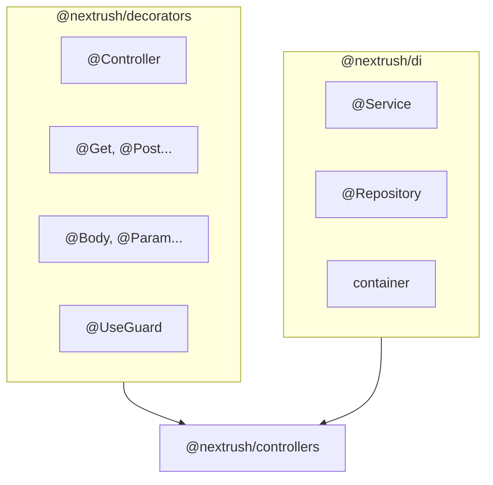

NextRush provides a dependency injection system and decorator-based metadata for building structured, testable applications.

---

## Package Overview



| Package                                                   | Purpose                         |
| --------------------------------------------------------- | ------------------------------- |
| [@nextrush/di](/docs/api-reference/di/di)                 | Dependency injection container  |
| [@nextrush/decorators](/docs/api-reference/di/decorators) | Controller and route decorators |

---

## How They Work Together

The DI system and decorators are designed to work together:

1. **@Service** / **@Repository** — Mark classes for DI registration
2. **@Controller** — Mark classes as HTTP controllers
3. **@Get** / **@Post** — Define route handlers
4. **@Body** / **@Param** — Extract request data
5. **Container** — Resolve dependencies automatically

---

## Quick Example

```typescript
import { createApp, createRouter, listen } from 'nextrush';
import { controllersPlugin, Service, Controller, Get, Post, Body, Param } from 'nextrush/class';

// Service with DI
@Service()
class UserService {
  private users = [{ id: '1', name: 'Alice' }];

  findAll() {
    return this.users;
  }

  create(data: { name: string }) {
    const user = { id: Date.now().toString(), ...data };
    this.users.push(user);
    return user;
  }
}

// Controller with injected service
@Controller('/users')
class UserController {
  constructor(private userService: UserService) {}

  @Get()
  list() {
    return this.userService.findAll();
  }

  @Post()
  create(@Body() data: { name: string }) {
    return this.userService.create(data);
  }
}

// Bootstrap
const app = createApp();
const router = createRouter();
await app.plugin(
  controllersPlugin({
    router,
    root: './src',
    prefix: '/api',
  })
);
app.route('/', router);
await listen(app, 3000);
```

---

## When to Use

Choose the paradigm that fits your application:

<Tabs items={['Decorators + DI', 'Functional Style']}>
  <Tab value="Decorators + DI">
    - Building REST APIs with multiple endpoints - Need dependency injection for services - Want
    structured, testable code - Team prefers class-based patterns - Larger codebases with shared services
  </Tab>
  <Tab value="Functional Style">
    - Building simple APIs - Prototyping - You want minimal moving parts - Prefer functional
    programming
  </Tab>
</Tabs>

---

## Setup Requirements

<Callout type="info" title="Auto-Import with nextrush">
  The `nextrush` meta-package auto-imports `reflect-metadata`. If you use `nextrush`, no manual
  setup is needed beyond these `tsconfig.json` settings.
</Callout>

If using individual `@nextrush/*` packages, install `reflect-metadata` separately:

<PackageInstall packages={['reflect-metadata']} />

```ts
// main.ts - FIRST LINE (only needed without the nextrush meta-package)
import 'reflect-metadata';

import { createApp } from '@nextrush/core';
// ... rest of imports
```

Enable decorators in `tsconfig.json`:

```json
{
  "compilerOptions": {
    "experimentalDecorators": true,
    "emitDecoratorMetadata": true
  }
}
```

---

## Next Steps

- [@nextrush/di](/docs/api-reference/di/di) — Learn the DI container
- [@nextrush/decorators](/docs/api-reference/di/decorators) — Explore all decorators
