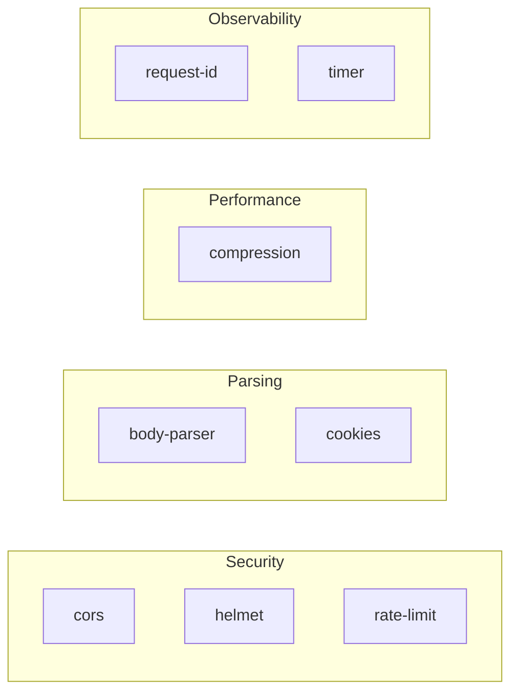

NextRush provides first-party middleware packages for common HTTP concerns. Each package is independently installable and designed for production use.

---

## Available Middleware



---

## Quick Reference

| Package                                                        | Purpose               | Common Use Case        |
| -------------------------------------------------------------- | --------------------- | ---------------------- |
| [@nextrush/cors](/docs/api-reference/middleware/cors)               | Cross-origin requests | Browser API access     |
| [@nextrush/helmet](/docs/api-reference/middleware/helmet)           | Security headers      | Production hardening   |
| [@nextrush/body-parser](/docs/api-reference/middleware/body-parser) | Request body parsing  | JSON/form APIs         |
| [@nextrush/rate-limit](/docs/api-reference/middleware/rate-limit)   | Request throttling    | API protection         |
| [@nextrush/compression](/docs/api-reference/middleware/compression) | Response compression  | Bandwidth reduction    |
| [@nextrush/cookies](/docs/api-reference/middleware/cookies)         | Cookie handling       | Session management     |
| [@nextrush/request-id](/docs/api-reference/middleware/request-id)   | Request tracking      | Logging/debugging      |
| [@nextrush/timer](/docs/api-reference/middleware/timer)             | Response timing       | Performance monitoring |

---

## Installation

Install only what you need — each package is independent.

<PackageInstall packages={['@nextrush/cors', '@nextrush/helmet']} />

Add more as needed:

<PackageInstall
  packages={['@nextrush/body-parser', '@nextrush/rate-limit', '@nextrush/compression']}
/>

---

## Usage Pattern

All middleware follow the same usage pattern:

```ts
import { createApp } from '@nextrush/core';
import { cors } from '@nextrush/cors';
import { helmet } from '@nextrush/helmet';
import { json } from '@nextrush/body-parser';

const app = createApp();

// Security first
app.use(helmet());
app.use(cors({ origin: 'https://example.com' }));

// Then parsing
app.use(json());

// Then your routes
app.use(async (ctx) => {
  ctx.json({ data: ctx.body });
});
```

---

## Middleware Order

<Callout type="warn" title="Order matters">
  Security middleware must run before body parsing. Observability middleware should run first to
  capture the full request lifecycle.
</Callout>

Recommended sequence:

```ts
// 1. Observability (earliest)
app.use(requestId());
app.use(timer());

// 2. Security headers
app.use(helmet());

// 3. CORS (before body parsing)
app.use(cors());

// 4. Rate limiting
app.use(rateLimit());

// 5. Body parsing
app.use(json());
app.use(urlencoded());

// 6. Compression (before response)
app.use(compression());

// 7. Your application routes
app.route('/', router);
```

---

## Class-Based Middleware

All middleware work with both functional and class-based patterns:

```ts
import { Controller, Get, UseMiddleware } from '@nextrush/decorators';
import { cors } from '@nextrush/cors';
import { rateLimit } from '@nextrush/rate-limit';

// Apply to specific controller
@UseMiddleware(cors())
@UseMiddleware(rateLimit({ max: 100 }))
@Controller('/api')
class ApiController {
  @Get('/data')
  getData() {
    return { data: [] };
  }
}
```

---

## Creating Custom Middleware

Follow the middleware signature:

```ts
import type { Middleware } from '@nextrush/types';

// Factory function pattern (recommended)
function myMiddleware(options = {}): Middleware {
  return async (ctx) => {
    // Before handler
    const start = Date.now();

    await ctx.next();

    // After handler
    const duration = Date.now() - start;
    ctx.set('X-Custom-Header', String(duration));
  };
}

// Usage
app.use(myMiddleware({ option: 'value' }));
```

---

## Next Steps

Explore individual middleware documentation:

- [CORS](/docs/api-reference/middleware/cors) — Enable cross-origin requests
- [Helmet](/docs/api-reference/middleware/helmet) — Set security headers
- [Body Parser](/docs/api-reference/middleware/body-parser) — Parse request bodies
- [Rate Limit](/docs/api-reference/middleware/rate-limit) — Throttle requests
