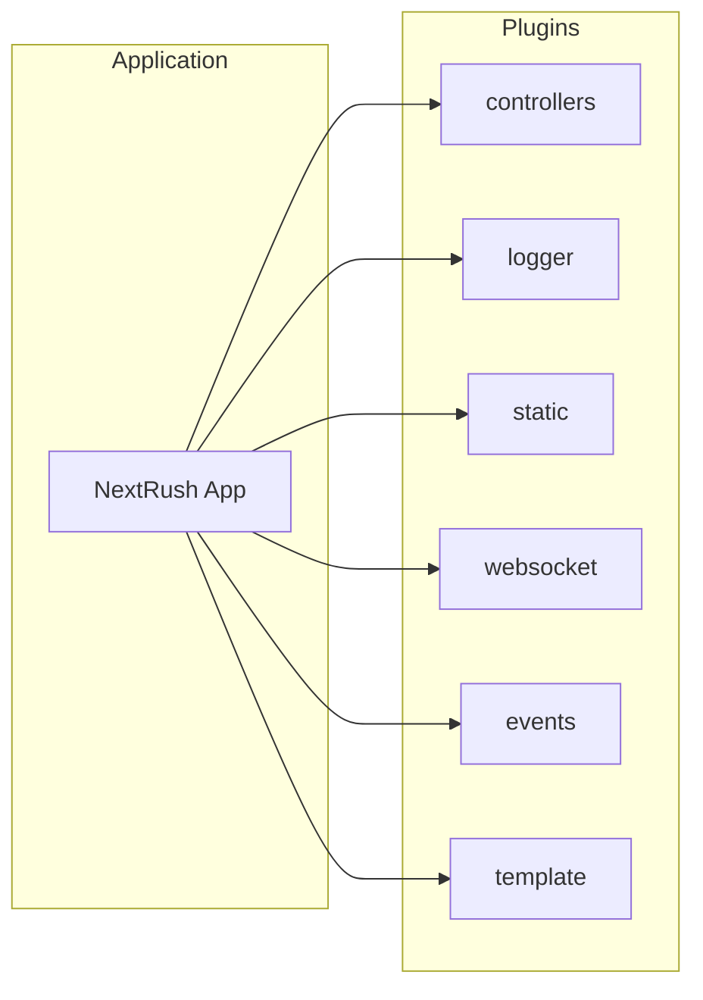

NextRush plugins extend your application with additional capabilities. Each plugin integrates with the core application through the standardized plugin interface.

---

## Available Plugins



---

## Quick Reference

| Package                                                     | Purpose                     | Use Case                   |
| ----------------------------------------------------------- | --------------------------- | -------------------------- |
| [@nextrush/controllers](/docs/api-reference/plugins/controllers) | Decorator-based controllers | Structured REST APIs       |
| [@nextrush/logger](/docs/api-reference/plugins/logger)           | Request logging             | Observability, debugging   |
| [@nextrush/static](/docs/api-reference/plugins/static)           | Static file serving         | Frontend assets, downloads |
| [@nextrush/websocket](/docs/api-reference/plugins/websocket)     | Real-time communication     | Chat, live updates         |
| [@nextrush/events](/docs/api-reference/plugins/events)           | Event emitter               | Decoupled architecture     |
| [@nextrush/template](/docs/api-reference/plugins/template)       | HTML rendering              | Server-side pages          |

---

## Installation

Install plugins as needed:

<PackageInstall packages={['@nextrush/controllers', '@nextrush/logger']} />

---

## Plugin Interface

All NextRush plugins implement a consistent interface:

```typescript
interface Plugin {
  name: string;
  version?: string;
  install(app: Application): void | Promise<void>;
  destroy?(): void | Promise<void>;
}
```

### Using Plugins

```typescript
import { createApp } from '@nextrush/core';
import { createRouter } from '@nextrush/router';
import { controllersPlugin } from '@nextrush/controllers';
import { eventsPlugin } from '@nextrush/events';

const app = createApp();
const router = createRouter();

// Register plugins
app.plugin(controllersPlugin({ router, controllers: [UserController] }));
app.plugin(eventsPlugin());
```

---

## Plugin Categories

### Architecture Plugins

These plugins add structural patterns:

- **Controllers** — Class-based route handlers with decorators
- **Events** — Decoupled communication between components

### Feature Plugins

These plugins add capabilities:

- **Logger** — Request/response logging
- **Static** — File serving
- **WebSocket** — Real-time communication
- **Template** — HTML rendering

---

## Combining Plugins

<Callout type="warn">
  Plugin registration order matters. Middleware plugins (logger, static) should be registered before
  route-handling plugins (controllers).
</Callout>

Plugins work together:

```typescript
import { createApp } from '@nextrush/core';
import { createRouter } from '@nextrush/router';
import { controllersPlugin } from '@nextrush/controllers';
import { logger } from '@nextrush/logger';
import { serveStatic } from '@nextrush/static';

const app = createApp();
const router = createRouter();

// Request logging
app.use(logger());

// Static files
app.use(serveStatic({ root: './public' }));

// API controllers
app.plugin(
  controllersPlugin({
    router,
    controllers: [UserController, ProductController],
  })
);
```

---

## Creating Custom Plugins

Build your own plugins:

```typescript
import type { Plugin } from '@nextrush/types';

const myPlugin: Plugin = {
  name: 'my-plugin',
  version: '1.0.0',

  install(app) {
    // Add middleware
    app.use(async (ctx) => {
      ctx.state.myValue = 'hello';
      await ctx.next();
    });
  },

  destroy() {
    // Cleanup on shutdown
  },
};

app.plugin(myPlugin);
```

---

## Next Steps

Explore individual plugin documentation:

- [Controllers](/docs/api-reference/plugins/controllers) — Structured APIs with decorators
- [Logger](/docs/api-reference/plugins/logger) — Request logging
- [Static](/docs/api-reference/plugins/static) — File serving
- [WebSocket](/docs/api-reference/plugins/websocket) — Real-time features
