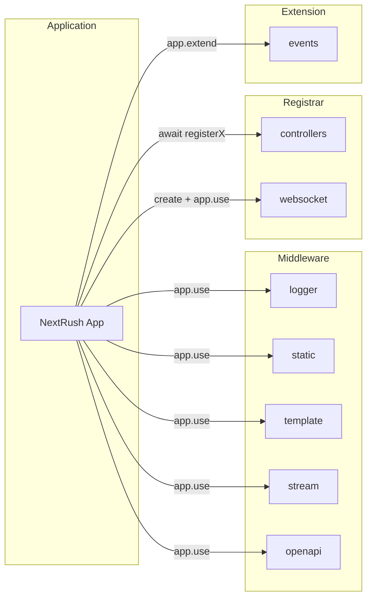

NextRush has no `Plugin` interface and no `app.plugin()`. Capability is added through three idioms — middleware, registrars, and Extensions — covered in depth in [Extending NextRush](/docs/concepts/plugins). This page is the catalog of packages that use those idioms.

---

## Available Packages


```mermaid
graph LR
    subgraph Application
        app[NextRush App]
    end

    subgraph Middleware
        log[logger]
        static[static]
        tpl[template]
        stream[stream]
        openapi[openapi]
    end

    subgraph Registrar
        ctrl[controllers]
        ws[websocket]
    end

    subgraph Extension
        events[events]
    end

    app -->|app.use| log
    app -->|app.use| static
    app -->|app.use| tpl
    app -->|app.use| stream
    app -->|app.use| openapi
    app -->|await registerX| ctrl
    app -->|create + app.use| ws
    app -->|app.extend| events
```

---

## Quick Reference

| Package                                                          | Purpose                     | Idiom      | Use Case                   |
| ----------------------------------------------------------------- | ---------------------------- | ---------- | --------------------------- |
| [@nextrush/controllers](/docs/api-reference/plugins/controllers) | Decorator-based controllers | Registrar  | Structured REST APIs       |
| [@nextrush/logger](/docs/api-reference/plugins/logger)           | Request logging             | Middleware | Observability, debugging   |
| [@nextrush/static](/docs/api-reference/plugins/static)           | Static file serving         | Middleware | Frontend assets, downloads |
| [@nextrush/websocket](/docs/api-reference/plugins/websocket)     | Real-time communication     | Registrar | Chat, live updates |
| [@nextrush/events](/docs/api-reference/plugins/events)           | Event emitter               | Extension  | Decoupled architecture     |
| [@nextrush/template](/docs/api-reference/plugins/template)       | HTML rendering               | Middleware | Server-side pages          |
| [@nextrush/stream](/docs/api-reference/plugins/stream)           | Response streaming (SSE/NDJSON) | Middleware | AI/agentic token streaming |
| [@nextrush/openapi](/docs/api-reference/plugins/openapi)         | OpenAPI 3.1 generation      | Middleware | API documentation          |

---

## Installation

Install packages as needed:

<PackageInstall packages={['@nextrush/controllers', '@nextrush/logger']} />

---

## Using These Packages

Most packages here are middleware — register with `app.use()`. `@nextrush/controllers` is a registrar — call and `await` it directly. `@nextrush/events` is an Extension — register with `app.extend()` then boot with `app.ready()`.

```typescript
import { createApp, listen } from 'nextrush';
import { registerControllers } from 'nextrush/class';
import { events } from '@nextrush/events';
import { logger } from '@nextrush/logger';

const app = createApp();

// Middleware
app.use(logger());

// Extension — queued now, booted at ready()
app.extend(events());

// Registrar — awaited before the server starts
await registerControllers(app, { root: './src', prefix: '/api' });

await listen(app, 8080); // adapters call app.ready() for you
```

---

## Choosing the Right Idiom

<Callout type="info" title="Reach for middleware by default">
  ~99% of what you'll ever add is middleware. Registrars and Extensions exist for the narrow
  cases middleware genuinely can't express — see [Extending NextRush](/docs/concepts/plugins) for
  the full breakdown and decision guide.
</Callout>

- **Middleware** — Logging, static files, templates, streaming, OpenAPI docs. Anything that runs per request.
- **Registrar** — Wiring class-based controllers (`registerControllers`), creating a WebSocket server (`createWebSocket`). A plain function, called once at startup.
- **Extension** — Long-lived, app-scoped services with a boot phase and a teardown phase. `events()` is the only current example.

---

## Combining Packages

<Callout type="warn">
  Middleware registration order matters. Logging and static-file middleware should typically be
  registered before route-handling packages.
</Callout>

Packages work together:

```typescript
import { createApp, listen } from 'nextrush';
import { registerControllers } from 'nextrush/class';
import { logger } from '@nextrush/logger';
import { serveStatic } from '@nextrush/static';

const app = createApp();

// Request logging
app.use(logger());

// Static files
app.use(serveStatic({ root: './public' }));

// API controllers (registrar — must be awaited before listen())
await registerControllers(app, { root: './src', prefix: '/api' });

await listen(app, 8080);
```

---

## Writing Your Own Extension Point

Most custom capability should be written as plain middleware first:

```typescript
app.use(async (ctx, next) => {
  ctx.state.myValue = 'hello';
  await next();
});
```

Only reach for `app.extend()` when you have state that must outlive a single request, boot before the server starts serving traffic, and clean up on shutdown — see [Writing an Extension](/docs/concepts/plugins#writing-an-extension) for the full pattern.

---

## Next Steps

Explore individual package documentation:

- [Controllers](/docs/api-reference/plugins/controllers) — Structured APIs with decorators
- [Logger](/docs/api-reference/plugins/logger) — Request logging
- [Static](/docs/api-reference/plugins/static) — File serving
- [WebSocket](/docs/api-reference/plugins/websocket) — Real-time features
- [Stream](/docs/api-reference/plugins/stream) — AI/agentic response streaming (SSE, NDJSON)
- [OpenAPI](/docs/api-reference/plugins/openapi) — Generate API docs from route metadata
- [Extending NextRush](/docs/concepts/plugins) — The full middleware/registrar/Extension taxonomy
