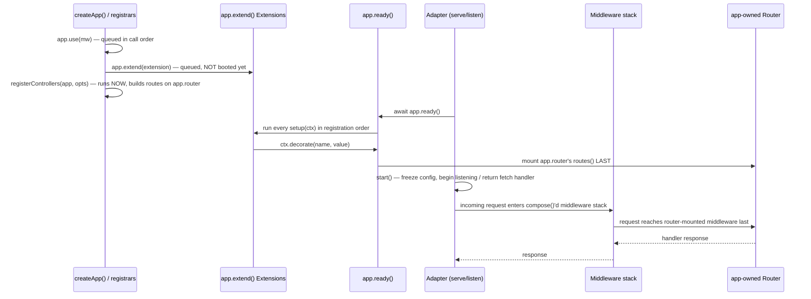

NextRush has no `Plugin` interface and no `app.plugin()`. Capability is added through four
distinct idioms, each solving a different composition problem, and each verified against real
source rather than a single unifying abstraction that would blur the differences between them:
**middleware**, **registrar**, **Extension**, and **adapter**.

## The four idioms

| Idiom | Frequency | Registration | Runs | Example |
| --- | --- | --- | --- | --- |
| Middleware | ~99% | `app.use(mw)` | Per request, in registration order | `cors()`, `helmet()`, `json()` |
| Registrar | ~0.9% | Called directly, once | At call time (synchronous or one `await`) | `registerControllers()`, `createWebSocketExtension()`'s caller |
| Extension | ~0.1% | `app.extend(ext)` | `setup()` once at `app.ready()`; `destroy()` once at `app.close()` | `createWebSocketExtension()`, `events()` |
| Adapter | One per runtime | `serve(app)` / `createHandler(app)` / `createFetchHandler(app)` | Owns (or hands back) the actual request/response cycle | `@nextrush/adapter-node`, `-bun`, `-deno`, `-edge` |

Reach for middleware first — it covers nearly everything: logging, parsing, security headers,
static files, streaming, template rendering. Only fall back to a registrar or an Extension when
middleware genuinely can't express what you need — see the decision criteria below, which mirror
[Extensions](/docs/concepts/extensions)'s consumer-facing framing but ground it in real package
source rather than restating the taxonomy in the abstract.

## Why four idioms instead of one

Each idiom answers a different structural question a single `Plugin` interface would conflate:

- **Middleware** answers *"what runs on every request, in what order?"* — a `Middleware` is just
  `(ctx, next) => Promise<void>` (or the modern `ctx.next()` form); composing two middlewares is
  composing two functions. No lifecycle, no state beyond `ctx`.
- **Registrar** answers *"what needs to run once, at startup, to wire something up?"* — a plain
  function, not a class implementing an interface. `registerControllers(app, options)`
  (`packages/class/src/registrar/registrar.ts`) is the canonical example: it walks a discovery
  source, builds routes on `app.router`, and returns — no `setup`/`destroy` pair, because
  controller registration has no ongoing lifecycle to manage after routes exist.
- **Extension** answers *"what needs to exist for the app's whole lifetime, boot asynchronously,
  and clean up on shutdown?"* — the one idiom with a real lifecycle contract
  (see [Contracts](/docs/architecture/contracts)).
- **Adapter** answers *"how does a Web-standard-shaped `Application` become a real running
  server (or fetch handler) on this specific runtime?"* — the one idiom that touches the actual
  network layer, and the one place runtime identity is allowed to matter at all.

Collapsing these into one `Plugin.setup()` would force every middleware author to write a
lifecycle object for something that's actually just a function, and would force every registrar
to accept a `destroy()` it will never use.

## A concrete example: `@nextrush/websocket` uses two idioms in one package

`packages/extensions/websocket/src/index.ts` demonstrates why "idiom" is a per-registration
choice, not a per-package one. `createWebSocketExtension()` returns a real `Extension`:

```typescript
export function createWebSocketExtension(
  options?: WebSocketOptions
): Extension<{ wss: WebSocketServer }> {
  const wss = new WebSocketServer(options);
  return {
    name: 'websocket',
    setup(ctx: ExtensionContext): void {
      ctx.decorate('wss', wss);
    },
    destroy(): void {
      wss.close();
    },
  };
}
```

Registered with `app.extend(createWebSocketExtension())` — because a `WebSocketServer` is
exactly the case an Extension exists for: it must outlive any single request, needs to attach
itself to the app as `app.wss`, and must close its sockets on shutdown. The same package's
middleware for upgrading individual connections is ordinary per-request middleware, registered
with `app.use()`. One package, two idioms, because it has two different composition problems.

## How the four idioms compose into one request path



Three ordering guarantees fall out of this, all verified against `Application` in
`packages/core/src/application.ts`:

1. **Registrars run synchronously at call time** — before `ready()` exists at all, from the
   registrar's caller's point of view. `registerControllers()` has already built every route on
   `app.router` by the time `await registerControllers(...)` returns.
2. **Extensions boot at `ready()`, not at `extend()`.** `app.extend(x)` only queues; `x.setup()`
   runs later, in registration order, when `ready()` is awaited — which every adapter's
   `serve()`/`listen()` does for you before it starts accepting connections.
   `app.wss` does not exist until `ready()` has resolved.
3. **The router is mounted last**, after every Extension's `setup()` has pushed its own
   middleware (if any). Route handlers therefore always run after Extension middleware,
   regardless of whether `app.extend()` was called before or after `app.get()`/`app.route()`.

## Choosing an idiom for new capability

<Callout type="info" title="Default to middleware">
  If you're not sure, it's middleware. Reach for a registrar only when the work is genuinely
  one-time setup with no ongoing app-lifetime state; reach for an Extension only when that state
  must survive across requests and needs an explicit teardown. Never write an adapter unless
  you're adding support for a new runtime.
</Callout>

| Ask | If yes → |
| --- | --- |
| Does it run per request? | Middleware |
| Is it one-time setup with no lasting state after it runs? | Registrar |
| Does it hold state that must outlive a single request, need async boot, or need explicit cleanup? | Extension |
| Are you connecting `Application` to a new runtime's request/response primitives? | Adapter |

## Related

<Cards>
  <Card title="Contracts" href="/docs/architecture/contracts">
    The exact `Extension` and `ServerAdapter`/`FetchAdapter` interfaces this page's idioms implement.
  </Card>
  <Card title="Extensions (concepts)" href="/docs/concepts/extensions">
    The consumer-facing guide — when to write your own Extension vs. reach for middleware.
  </Card>
  <Card title="Package Hierarchy" href="/docs/architecture/package-hierarchy">
    Where each idiom's defining types live in the dependency graph.
  </Card>
</Cards>
