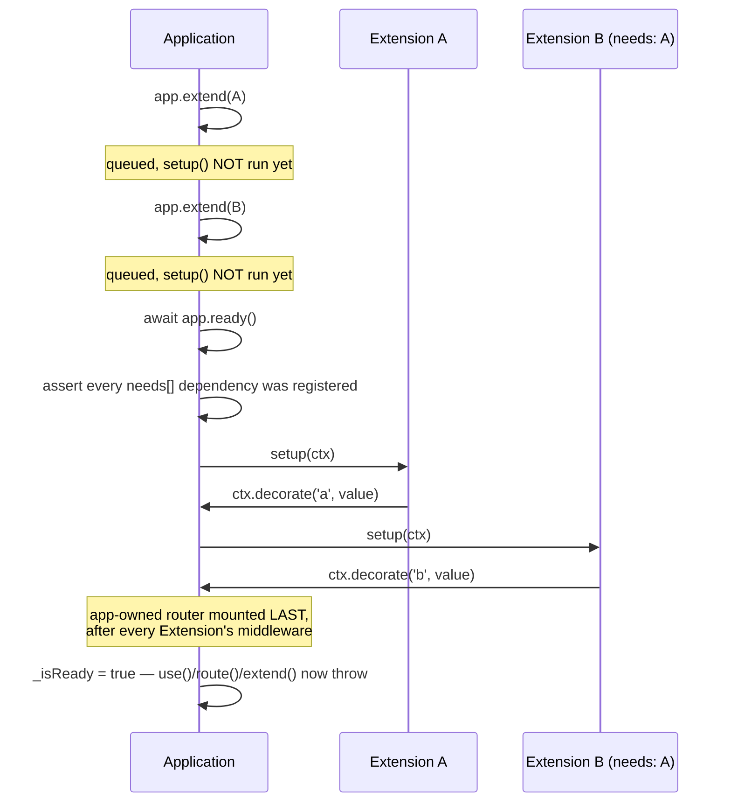

NextRush has exactly two contracts that framework-level authors — not application authors —
implement against: the **Extension API**, for long-lived app-scoped services, and the
**Adapter Contract**, for connecting `Application` to a runtime's HTTP primitives. Both live in
`@nextrush/types` (`packages/types/src/extension.ts` and `packages/types/src/adapter.ts`) so they
can be depended on without pulling in `@nextrush/core` — the same reason `@nextrush/types` sits
at the bottom of the [package hierarchy](/docs/architecture/package-hierarchy).

If you're registering *existing* capability (`app.use(cors())`, `app.extend(events())`), you
don't need this page — see [Extensions](/docs/concepts/extensions) for the consumer-facing view.
This page is for authoring a new Extension or a new runtime adapter.

## Extension API contract

An Extension is the rare (~0.1%) case: a long-lived, app-scoped service that needs async boot
and/or a teardown phase — an event bus, a database pool, a WebSocket server. Most capability is
middleware or a plain registrar function; see
[Capability Composition](/docs/architecture/capability-composition) for how the framework decides
which idiom a given feature should use.

### `Extension<TDecorated>`

```typescript
import type { ExtensionContext } from '@nextrush/types';

interface Extension<TDecorated = Record<string, never>> {
  readonly name: string;
  readonly needs?: readonly string[];
  setup(ctx: ExtensionContext): void | Promise<void>;
  destroy?(): void | Promise<void>;
}
```

| Member | Contract |
| --- | --- |
| `name` | Unique across the app. `app.extend()` throws on a duplicate name — this is the app's only collision detection for Extensions. |
| `needs` | Names of other Extensions that must already be registered before this one. Asserted at `app.ready()`, in registration order — **not auto-sorted**; you register dependencies before dependents yourself. |
| `setup(ctx)` | Runs once, at `app.ready()`, in registration order. May be async — `ready()` awaits each `setup()` before starting the next. |
| `destroy()` | Optional. Runs at `app.close()`, in **reverse** registration order, isolated from every other teardown unit's failure — one throwing/hanging `destroy()` never strands the rest. |

`TDecorated` is a phantom generic — never read at runtime, only carried through the type system
so `app.extend(events<MyEvents>())` returns `this & { events: EventEmitter<MyEvents> }`, giving
static `app.events` inference with zero `declare module` augmentation. TypeScript trusts the
generic; it does not verify that `setup()` actually calls `ctx.decorate()` with a matching shape —
keep the two in sync by hand.

### `ExtensionContext`

The argument passed to `setup()` — a context object rather than the bare `Application`, so future
fields are additive and never break existing Extensions:

```typescript
import type { ExtensionHost, Logger, Container } from '@nextrush/types';

interface ExtensionContext {
  readonly app: ExtensionHost;
  readonly logger: Logger;
  readonly container?: Container;
  readonly env: 'development' | 'production' | 'test';
  readonly name: string;
  decorate(name: string, value: unknown): void;
}
```

`decorate()` is the only way to attach a value to the app (e.g. `app.events`) — there is
intentionally no public `app.decorate()`. It throws if `name` is already decorated by another
Extension or collides with an existing `Application` member.

`ExtensionHost` — the structural subset of `Application` an Extension's `setup()` can see — is
deliberately narrow (`use()` and `hasDecorator()` today) so `ExtensionContext` can live in
`@nextrush/types` without importing `@nextrush/core`.

### Registration and boot order (verified against `Application`, `packages/core/src/application.ts`)



Two invariants worth naming because a new Extension author will hit them:

- **`extend()` only queues.** `setup()` doesn't run until `ready()` — calling `app.events` before
  `await app.ready()` fails, because the decoration doesn't exist yet.
- **The router mounts last.** `ready()` pushes the app-owned router's middleware onto the stack
  only after every Extension's `setup()` has run, so Extension-registered middleware always runs
  before route handlers — regardless of `extend()` call order relative to `get()`/`post()`/etc.

Teardown runs the reverse: `close()` destroys every Extension (plus every `onClose()` hook) in
one combined, reverse-of-registration-order pass, each isolated from the others' failures.

## Adapter Contract

An adapter connects the runtime-agnostic `Application` to a specific platform's HTTP primitives —
Node's `http.createServer`, Bun's `Bun.serve`, Deno's `Deno.serve`, or a Web-standard
`fetch` handler for edge/serverless. The contract is generic over the concrete application type
because `@nextrush/types` sits below `@nextrush/core` and must not import `Application` directly;
each adapter binds `App = Application` when it `satisfies` the shape.

### `ServerAdapter` — server-style runtimes (Node, Bun, Deno)

```typescript
import type { ServerHandle, HandlerOptions } from '@nextrush/types';

interface ServerAdapter<App = unknown, Opts = unknown, Instance extends ServerHandle = ServerHandle> {
  serve(app: App, options?: Opts): Promise<Instance>;
  createHandler(app: App, options?: HandlerOptions): unknown;
}
```

- `serve()` starts and owns a real listening server, returning a `ServerHandle`.
- `createHandler()` builds only the request-handling function, for embedding into a host server
  the adapter doesn't own (e.g. mounting inside an existing Express/Node HTTP server).

### `FetchAdapter` — fetch-style runtimes (edge)

```typescript
import type { FetchHandlerOptions } from '@nextrush/types';

interface FetchAdapter<App = unknown, Exec = unknown> {
  createFetchHandler(app: App, options?: FetchHandlerOptions): FetchHandler<Exec>;
}

type FetchHandler<Exec = unknown> = (request: Request, executionContext?: Exec) => Response | Promise<Response>;
```

Edge runtimes have no server to `serve()` — the platform itself calls the exported `fetch`
handler per request. `Exec` is the runtime's execution-context type (e.g. an edge platform's
`waitUntil` context), defaulted to `unknown` so the contract doesn't assume one exists.

### `ServerHandle` and `ServerAddress`

Every server adapter's `serve()` resolves to the same handle shape, so application code that
needs to read the bound address or close the server doesn't need per-runtime branching:

```typescript
interface ServerHandle {
  address(): ServerAddress;
  close(): Promise<void>;
}

interface ServerAddress {
  readonly port: number;
  readonly host: string; // canonical key
  /** @deprecated use `host` — kept for Bun/Deno's historical `{ port, hostname }` shape */
  readonly hostname?: string;
}
```

`host` is the one canonical key across all adapters; `hostname` is a deprecated alias retained
only so Bun/Deno adapters that historically returned `{ port, hostname }` keep working during
migration.

### What the contract does — and does not — guarantee

The `ServerAdapter`/`FetchAdapter` interfaces are a **compile-time shape check** (each adapter's
export `satisfies` the contract), not a behavioral guarantee. Cross-adapter behavioral parity —
"a request handled identically by every adapter" — is enforced separately by
`packages/adapters/conformance`'s shared test suite, not by these type signatures. See
[Adapter Internals](/docs/architecture/adapters) for what that suite actually checks.

## Related

<Cards>
  <Card title="Capability Composition" href="/docs/architecture/capability-composition">
    How middleware, registrars, Extensions, and adapters compose into one running app.
  </Card>
  <Card title="Extensions (concepts)" href="/docs/concepts/extensions">
    The consumer-facing guide to choosing and using middleware, registrars, and Extensions.
  </Card>
  <Card title="Adapter Internals" href="/docs/architecture/adapters">
    What the cross-adapter conformance suite enforces beyond the type contract.
  </Card>
</Cards>
