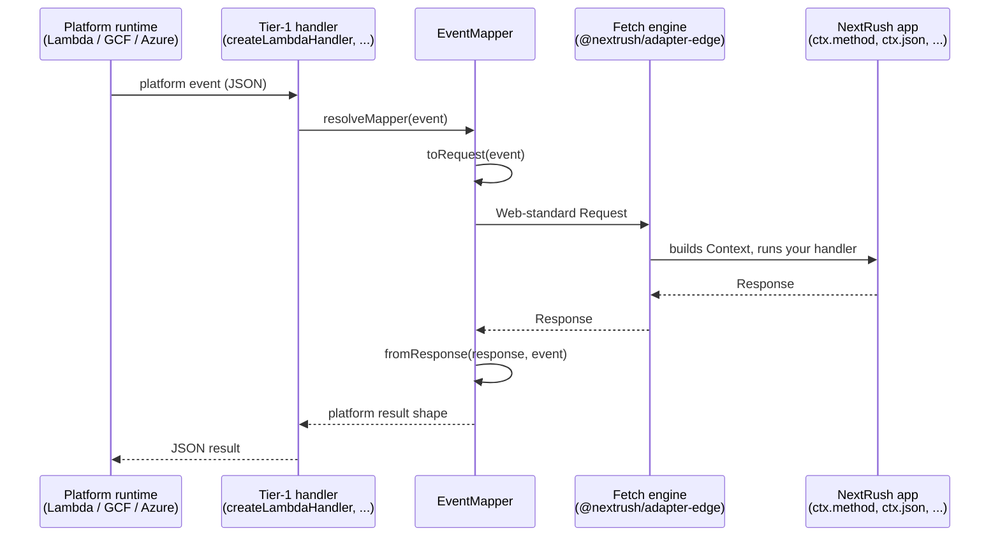
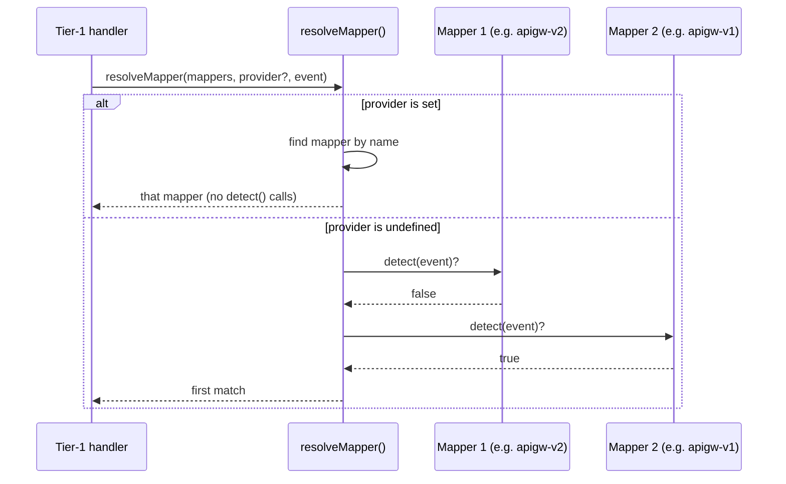

## The problem

Every NextRush adapter ultimately hands your route handler the same `Context` — but each platform
hands the adapter something different to build that `Context` from. Node gets a raw
`http.IncomingMessage`. Cloudflare Workers gets a Fetch API `Request`. AWS Lambda gets a JSON
object shaped nothing like either — `{ rawPath, rawQueryString, requestContext: { http: { method
} }, body, isBase64Encoded }` for a Function URL invocation, a completely different JSON shape for
API Gateway REST API, and yet another shape again for Google Cloud Functions or Azure Functions.
Without a translation layer, every serverless platform NextRush supports would need its own
hand-written bridge — exactly the kind of hand-rolled glue this framework exists to eliminate
(see [Framework Philosophy](https://github.com/0xTanzim/nextRush/blob/main/AGENTS.md), §1), and
exactly the kind of bridge that silently corrupts binary bodies when someone forgets a platform's
base64-encoding rule (see [Binary bodies](#binary-bodies-the-part-most-hand-written-bridges-get-wrong) below).

## The solution

`@nextrush/adapter-serverless` closes that gap with an `EventMapper`: a small, named translation
unit that turns one platform's event into a Web-standard `Request`, and turns the `Response` your
app produces back into that platform's expected result shape. Every platform gets its own mapper;
none of them know the others exist. This page is the mental model for how that translation works
end to end, and why it's structured as a plugin rather than a provider `switch`.

## How a request actually moves through it



Your route handler only ever sees the middle of this diagram — `ctx.method`, `ctx.json(...)`,
exactly like on Node or Cloudflare Workers. Everything left and right of the fetch engine is the
mapper's job, and it happens on every single invocation, not once at cold start.

## The mapper contract

An `EventMapper` is three functions and a name — nothing else knows about the platform's shape:

```ts
interface EventMapper<Event, Result, Ctx = unknown> {
  readonly name: string;
  toRequest(event: Event, platformCtx?: Ctx): Request;
  fromResponse(response: Response, event: Event): Result | Promise<Result>;
  detect?(event: Event): boolean;
}
```

`toRequest` builds the same `Request` object `@nextrush/adapter-edge`'s fetch engine already
knows how to run — this is the actual mechanism behind `createLambdaHandler`, `createGoogleHandler`,
and `createAzureHandler` all being built on the edge adapter underneath (see [AWS Lambda
deployment](/docs/production/deployment/aws-lambda)). `fromResponse` does the reverse: it reads
the `Response` your app returned and produces whatever shape that platform's runtime expects back
— a JSON result object for Lambda, an Express-style `res` call for Google Cloud Functions.

`detect` is optional and answers one question: "does this event look like mine?" It's what lets
`createLambdaHandler` accept Lambda Function URL events, API Gateway HTTP API events, and API
Gateway REST API events with no configuration — each has its own mapper, and each mapper's
`detect` recognizes its own shape.

## Choosing a mapper: explicit first, then detection

Every invocation resolves to exactly one mapper:



The rule in words: an explicitly configured `provider` name wins and is used every time.
Otherwise, each registered mapper's `detect(event)` runs against the incoming event, and the
first one that returns `true` is used.

This is why the Tier-1 handlers you actually call — `createLambdaHandler`, `createGoogleHandler`,
`createAzureHandler` — never ask you to name a provider: each one wires its own fixed mapper (or,
for Lambda, a small set of mappers it can tell apart) at construction time, so detection or an
explicit choice already happened before your code runs. You only see `provider` if you're
building a handler for a platform NextRush doesn't ship — see [Serverless adapter
reference](/docs/reference/platforms/serverless) for the Tier-3 `EventMapper` API.

Two real mappers, side by side, show how `detect` tells genuinely similar AWS event shapes apart:

```ts
// API Gateway v2 / HTTP API (payload format 2.0)
detect: (event) => event.version === '2.0';

// API Gateway v1 / REST API (payload format 1.0)
detect: (event) => typeof event.httpMethod === 'string' && event.multiValueHeaders !== undefined;
```

Neither mapper needs to know the other exists — `resolveMapper` tries each `detect` in turn
and stops at the first match. Adding a mapper for a platform NextRush doesn't ship yet (Oracle
Cloud Functions, Fly.io, OpenFaaS) means writing one more object with these three functions, never
adding a branch to existing adapter code.

## What actually gets translated

`toRequest` has to reconstruct a faithful `Request` from whatever fields the platform's event
happens to expose — method, path, query string, headers, cookies, and body all arrive in
different shapes per platform (a Lambda Function URL event has `rawPath`/`rawQueryString`; a GCF
event exposes `req.path`/`req.query` directly).

### Binary bodies — the part most hand-written bridges get wrong

```ts
const bodilessMethod = method === 'GET' || method === 'HEAD';
let body: BodyInit | undefined;
if (!bodilessMethod && event.body !== undefined) {
  body = event.isBase64Encoded === true ? base64ToBytes(event.body) : event.body;
}
```

Lambda and API Gateway base64-encode a request body whenever it isn't text (`isBase64Encoded:
true`) — a mapper that always treated `event.body` as a plain string would silently corrupt
binary uploads. The reverse direction applies the same rule going out: `fromResponse` inspects the
`Response`'s `Content-Type` header to decide whether the body is text or needs base64-encoding
before it fits back into the platform's JSON result shape.

## Why a plugin, not a `switch`

`@nextrush/adapter-serverless` never branches on a platform name internally — every platform is
"add one more `EventMapper`," which is the same principle
[Runtime compatibility](/docs/concepts/runtime-compatibility) applies one layer up (capability
negotiation over runtime branching). Supporting a new serverless platform never means editing
existing, already-shipped mapper code; it means writing a new mapper object and passing it to
`createServerlessAdapter({ mappers: [...] })`.

## What this means for your route handlers

Nothing — and that's the point. Your route handlers read `ctx.method`, `ctx.path`, `ctx.query`,
`ctx.body`, exactly like they would on Node or Cloudflare Workers. The event mapper's entire job
is making sure that `Context` is built from a real `Request` object by the time your handler ever
sees it, regardless of whether that `Request` came from a raw socket, a `fetch` invocation, or a
Lambda event three translation steps removed from either.

## Related

- [AWS Lambda deployment](/docs/production/deployment/aws-lambda) — `createLambdaHandler`'s mappers in a real deployment.
- [Serverless runtime tutorial](/docs/start/runtime/serverless) — the getting-started walkthrough for the platforms this page's mappers serve.
- [Serverless adapter reference](/docs/reference/platforms/serverless) — the full `EventMapper` API for platforms NextRush doesn't ship a handler for.
- [Runtime compatibility](/docs/concepts/runtime-compatibility) — the same capability-negotiation principle one layer up, across Node/Bun/Deno/Edge.
