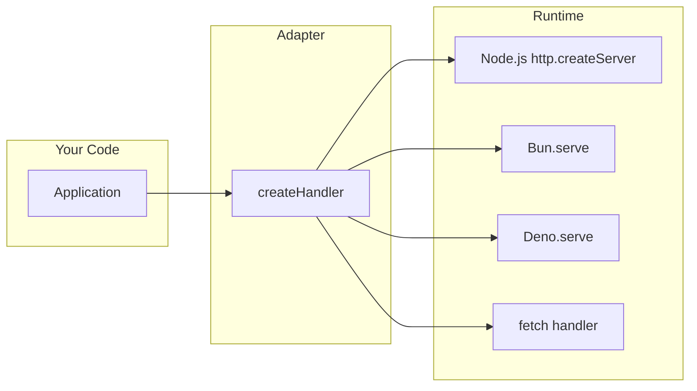

# Runtime Adapters

Adapters connect your NextRush application to the underlying runtime's HTTP server.

## Why Adapters?

NextRush's core is runtime-agnostic. The `Application` class doesn't know about HTTP servers—it only knows about middleware and context objects.

Adapters bridge this gap:



Each adapter:
1. Creates a platform-specific request handler
2. Converts native requests to `Context` objects
3. Converts context responses back to native responses
4. Manages server lifecycle (start, stop, graceful shutdown)

## Available Adapters

| Package | Runtime | Install Separately? |
|---------|---------|---------------------|
| [`@nextrush/adapter-node`](/docs/packages/adapters/node) | Node.js | Included in `nextrush` |
| [`@nextrush/adapter-bun`](/docs/packages/adapters/bun) | Bun | Yes |
| [`@nextrush/adapter-deno`](/docs/packages/adapters/deno) | Deno | Yes |
| [`@nextrush/adapter-edge`](/docs/packages/adapters/edge) | Edge (Cloudflare, Vercel) | Yes |

## Quick Comparison

### Node.js (Default)

```typescript
import { createApp, createRouter, listen } from 'nextrush';

const app = createApp();
const router = createRouter();

router.get('/', (ctx) => ctx.json({ runtime: 'node' }));

app.use(router.routes());
listen(app, 3000);
```

### Bun

```typescript
import { createApp } from '@nextrush/core';
import { createRouter } from '@nextrush/router';
import { serve } from '@nextrush/adapter-bun';

const app = createApp();
const router = createRouter();

router.get('/', (ctx) => ctx.json({ runtime: 'bun' }));

app.use(router.routes());
serve(app, { port: 3000 });
```

### Deno

```typescript
import { createApp } from '@nextrush/core';
import { createRouter } from '@nextrush/router';
import { serve } from '@nextrush/adapter-deno';

const app = createApp();
const router = createRouter();

router.get('/', (ctx) => ctx.json({ runtime: 'deno' }));

app.use(router.routes());
await serve(app, { port: 3000 });
```

### Edge (Cloudflare Workers)

```typescript
import { createApp } from '@nextrush/core';
import { createRouter } from '@nextrush/router';
import { createHandler } from '@nextrush/adapter-edge';

const app = createApp();
const router = createRouter();

router.get('/', (ctx) => ctx.json({ runtime: 'edge' }));

app.use(router.routes());

export default {
  fetch: createHandler(app),
};
```

## Common API

All adapters export similar functions:

| Function | Description |
|----------|-------------|
| `serve(app, options)` | Start HTTP server |
| `listen(app, port)` | Shorthand with default logging |
| `createHandler(app)` | Create request handler function |

## Choosing an Adapter

| Runtime | Best For |
|---------|----------|
| **Node.js** | General purpose, existing Node.js deployments, compatibility |
| **Bun** | Maximum performance, drop-in Node.js replacement |
| **Deno** | Security-focused, TypeScript-first, permissions model |
| **Edge** | Serverless, low latency, global distribution |

## Runtime Capabilities

Different runtimes have different capabilities:

| Capability | Node.js | Bun | Deno | Edge |
|------------|---------|-----|------|------|
| File System | ✅ | ✅ | ✅ | ❌ |
| WebSocket | ✅ | ✅ | ✅ | ✅ |
| Native Fetch | ✅ | ✅ | ✅ | ✅ |
| Worker Threads | ✅ | ✅ | ✅ | ⚠️ |
| Node.js APIs | ✅ | ✅ | ⚠️ | ❌ |
| Cold Start | ~150ms | ~10ms | ~50ms | ~5ms |

## Same Code, Any Runtime

Write your application logic once:

```typescript title="app.ts"
import { createApp } from '@nextrush/core';
import { createRouter } from '@nextrush/router';

export const app = createApp();
export const router = createRouter();

router.get('/health', (ctx) => {
  ctx.json({ status: 'healthy' });
});

app.use(router.routes());
```

Then deploy anywhere:

```typescript title="node.ts"
import { app } from './app';
import { listen } from '@nextrush/adapter-node';
listen(app, 3000);
```

```typescript title="bun.ts"
import { app } from './app';
import { serve } from '@nextrush/adapter-bun';
serve(app, { port: 3000 });
```

```typescript title="worker.ts"
import { app } from './app';
import { createHandler } from '@nextrush/adapter-edge';
export default { fetch: createHandler(app) };
```

## Detailed Documentation

<Cards>
  <Card title="@nextrush/adapter-node" href="/docs/packages/adapters/node">
    Node.js HTTP adapter (included in nextrush).
  </Card>
  <Card title="@nextrush/adapter-bun" href="/docs/packages/adapters/bun">
    Bun runtime adapter for maximum performance.
  </Card>
  <Card title="@nextrush/adapter-deno" href="/docs/packages/adapters/deno">
    Deno runtime adapter with TypeScript-first support.
  </Card>
  <Card title="@nextrush/adapter-edge" href="/docs/packages/adapters/edge">
    Edge runtime adapter for Cloudflare and Vercel.
  </Card>
</Cards>
