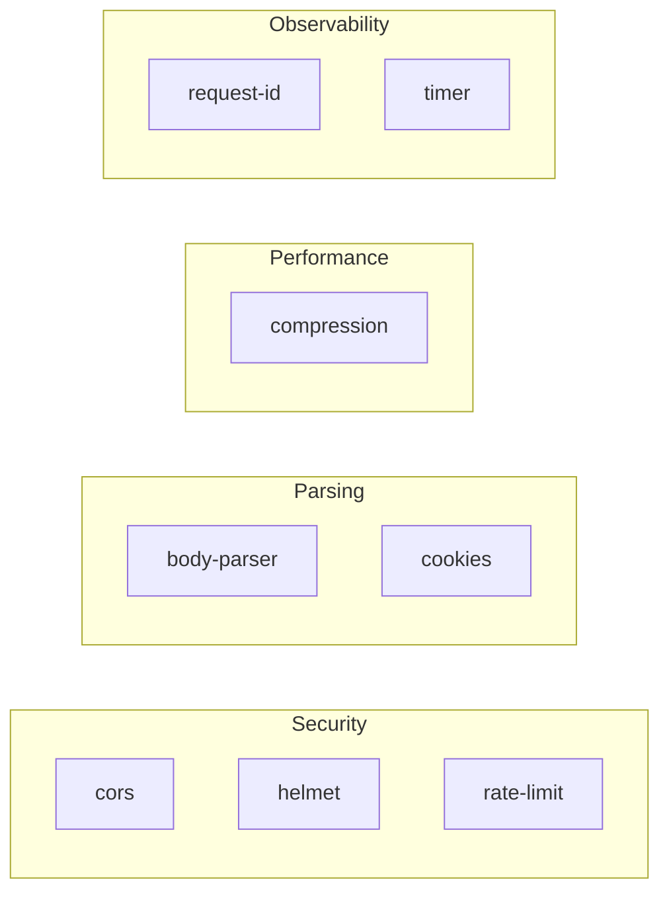

# Middleware Packages

NextRush provides first-party middleware packages for common HTTP concerns. Each package is independently installable and designed for production use.

---

## Available Middleware



---

## Quick Reference

| Package | Purpose | Common Use Case |
|---------|---------|-----------------|
| [@nextrush/cors](/docs/packages/middleware/cors) | Cross-origin requests | Browser API access |
| [@nextrush/helmet](/docs/packages/middleware/helmet) | Security headers | Production hardening |
| [@nextrush/body-parser](/docs/packages/middleware/body-parser) | Request body parsing | JSON/form APIs |
| [@nextrush/rate-limit](/docs/packages/middleware/rate-limit) | Request throttling | API protection |
| [@nextrush/compression](/docs/packages/middleware/compression) | Response compression | Bandwidth reduction |
| [@nextrush/cookies](/docs/packages/middleware/cookies) | Cookie handling | Session management |
| [@nextrush/request-id](/docs/packages/middleware/request-id) | Request tracking | Logging/debugging |
| [@nextrush/timer](/docs/packages/middleware/timer) | Response timing | Performance monitoring |

---

## Installation Pattern

Install only what you need:

```bash tab="Individual"
pnpm add @nextrush/cors @nextrush/helmet
```

```bash tab="All Middleware"
pnpm add @nextrush/cors @nextrush/helmet @nextrush/body-parser @nextrush/rate-limit
```

---

## Usage Pattern

All middleware follow the same usage pattern:

```typescript
import { createApp } from '@nextrush/core';
import { cors } from '@nextrush/cors';
import { helmet } from '@nextrush/helmet';
import { json } from '@nextrush/body-parser';

const app = createApp();

// Security first
app.use(helmet());
app.use(cors({ origin: 'https://example.com' }));

// Then parsing
app.use(json());

// Then your routes
app.use(async (ctx) => {
  ctx.json({ data: ctx.body });
});
```

---

## Middleware Order

Order matters. Recommended sequence:

```typescript
// 1. Observability (earliest)
app.use(requestId());
app.use(timer());

// 2. Security headers
app.use(helmet());

// 3. CORS (before body parsing)
app.use(cors());

// 4. Rate limiting
app.use(rateLimit());

// 5. Body parsing
app.use(json());
app.use(urlencoded());

// 6. Compression (before response)
app.use(compression());

// 7. Your application routes
app.use(router.routes());
```

---

## Class-Based Middleware

All middleware work with both functional and class-based patterns:

```typescript
import { Controller, Get, UseMiddleware } from '@nextrush/decorators';
import { cors } from '@nextrush/cors';
import { rateLimit } from '@nextrush/rate-limit';

// Apply to specific controller
@UseMiddleware(cors())
@UseMiddleware(rateLimit({ max: 100 }))
@Controller('/api')
class ApiController {
  @Get('/data')
  getData() {
    return { data: [] };
  }
}
```

---

## Creating Custom Middleware

Follow the middleware signature:

```typescript
import type { Middleware } from '@nextrush/types';

// Factory function pattern (recommended)
function myMiddleware(options = {}): Middleware {
  return async (ctx) => {
    // Before handler
    const start = Date.now();

    await ctx.next();

    // After handler
    const duration = Date.now() - start;
    ctx.set('X-Custom-Header', String(duration));
  };
}

// Usage
app.use(myMiddleware({ option: 'value' }));
```

---

## Design Philosophy

NextRush middleware packages follow these principles:

1. **Single Responsibility** — Each package does one thing well
2. **Zero Config Defaults** — Works out of the box with secure defaults
3. **Full Customization** — Every behavior can be overridden
4. **Type Safety** — Full TypeScript support with inference
5. **Tree Shakeable** — Import only what you use

---

## Next Steps

Explore individual middleware documentation:

- [CORS](/docs/packages/middleware/cors) — Enable cross-origin requests
- [Helmet](/docs/packages/middleware/helmet) — Set security headers
- [Body Parser](/docs/packages/middleware/body-parser) — Parse request bodies
- [Rate Limit](/docs/packages/middleware/rate-limit) — Throttle requests
