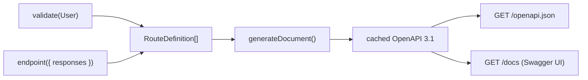

## Why This Package Exists

Most OpenAPI tooling makes you describe your data twice: once for runtime validation, once for the docs (decorators on every field, hand-written JSON Schema). The two drift apart, and teams stop maintaining the spec.

NextRush's router already knows your routes and their schemas — when a route uses `validate(User)`, the router records that `User` is the request body via the Route Metadata System (`endpoint()` and `validate()` both contribute to `router.getRoutes()`). `@nextrush/openapi` reads what's already there and renders it. Nothing is restated.



## Installation

<PackageInstall packages={['@nextrush/openapi']} />

## Minimal Usage

```ts
import { createApp, createRouter, endpoint, serve } from 'nextrush';
import { validate } from '@nextrush/validation';
import { openapi } from '@nextrush/openapi';
import { z } from 'zod';

const User = z.object({ name: z.string().min(1), email: z.string() });

const app = createApp();
const router = createRouter();

router.post(
  '/users',
  validate(User),
  endpoint({ summary: 'Create a user', responses: { 201: User } }),
  (ctx) => {
    ctx.status = 201;
    ctx.json(ctx.body);
  }
);

app.route('/', router);
app.use(openapi({ router })); // GET /openapi.json + GET /docs
serve(app, { port: 3000 });
```

Visit `http://localhost:3000/docs` for Swagger UI, or `GET /openapi.json` for the raw document.

<Callout type="info">
  `endpoint()` is re-exported from `nextrush` so it sits next to `createRouter` — no need to import
  from `@nextrush/router` directly.
</Callout>

## `openapi(options)`

Create the OpenAPI plugin.

**Signature:**

```ts
function openapi(options: OpenApiOptions): Middleware;
```

<TypeTable
  title="OpenApiOptions"
  types={{
    router: { type: 'Pick<Router, "getRoutes">', description: 'The router whose routes to document. Only getRoutes() is read, and only once — never on the request path.' },
    info: { type: 'OpenApiInfo', description: 'Document info block.', optional: true, default: "{ title: 'API', version: '1.0.0' }" },
    path: { type: 'string', description: 'Path serving the JSON spec.', default: "'/openapi.json'" },
    docs: { type: 'string | false', description: 'Path serving the docs UI. Pass false to disable.', default: "'/docs'" },
    exclude: { type: 'readonly string[]', description: 'Path prefixes to omit from the spec.', optional: true },
    enabled: { type: 'boolean', description: 'Whether the spec is served at all.', default: 'true' },
    toJsonSchema: { type: '(schema: StandardSchemaV1) => unknown', description: 'Override schema-to-JSON-Schema conversion.', optional: true },
  }}
/>

**Behavior:** the document is generated lazily on the **first** request to the spec route — by which point every route and plugin has already registered, so installation order never matters — then cached in memory for the process lifetime. Route dispatch never touches the generator.

## What Gets Documented

| Source | Becomes |
| --- | --- |
| `validate(schema)` request body | `requestBody` (`application/json`) |
| `validate({ query })` | query `parameters`, decomposed from the schema's properties |
| `validate({ params })` or the path pattern | path `parameters` (`/users/:id` → `/users/{id}`) |
| `endpoint({ responses })` | `responses` by status code |
| `endpoint({ summary, description, tags, deprecated })` | operation metadata |
| `endpoint({ visibility: 'internal' })` | omitted from the spec entirely |

Routes with no metadata still appear as untyped operations — nothing silently disappears from the spec.

## Schema Conversion

There is no universal Standard Schema → JSON Schema converter, so `@nextrush/openapi` vendor-dispatches on the schema's `~standard.vendor`:

| Library | Converter used | Requirement |
| --- | --- | --- |
| Zod | `z.toJSONSchema` | **Zod 4+** — Zod 3.24 implements Standard Schema (so `validate()` works) but has no JSON Schema export |
| Valibot | `@valibot/to-json-schema` | Loaded as an optional peer dependency |
| ArkType | `schema.toJsonSchema()` | Method on the schema itself |
| Anything else | — | Renders as untyped (`{}`) unless you supply `toJsonSchema` |

Converter packages are loaded via dynamic `import()` and never bundled — their absence is caught and falls through to the untyped `{}` shape rather than failing document generation.

## Security

<Callout type="warn" title="The spec is public by default">
  Anyone who can reach `/openapi.json` can read your entire route surface, including field names and
  types. Gate it in production if that's sensitive: `openapi({ router, enabled: process.env.NODE_ENV
  !== 'production' })`.
</Callout>

- `endpoint({ visibility: 'internal' })` keeps a single route out of the spec without touching route registration.
- `exclude` drops path prefixes (e.g. `/internal`) without decorating every route under them.
- The Swagger UI page loads `swagger-ui-dist` from the `unpkg` CDN — self-host the bundle if your CSP disallows third-party scripts.

## Runtime Compatibility

Zero runtime dependencies beyond `@nextrush/types`. Runs anywhere NextRush runs: Node.js 22+, Bun, Deno, Cloudflare Workers, Vercel Edge.

## Programmatic API

The document generator that powers `openapi()` is exported directly — use it
if you need the raw OpenAPI document without mounting the middleware (e.g.
to write it to a file at build time, or feed it to a different serving
mechanism).

```ts
function generateDocument(
  routes: readonly RouteDefinition[],
  options: Pick<OpenApiOptions, 'info' | 'exclude' | 'toJsonSchema'>
): Promise<OpenApiDocument>;
```

```ts
import { generateDocument } from '@nextrush/openapi';

const doc = await generateDocument(router.getRoutes(), {
  info: { title: 'My API', version: '2.0.0' },
});
```

This is a pure transform — no I/O, no router coupling, no caching. `openapi()`
calls it once (lazily, on first request) and caches the result; calling it
yourself runs the full conversion every time.

Two small path-pattern helpers `generateDocument` uses internally are also
exported, for cases where you're building custom OpenAPI tooling on top of
NextRush's route metadata:

```ts
function toOpenApiPath(path: string): string;
function extractPathParams(path: string): string[];
```

```ts
toOpenApiPath('/users/:id'); // '/users/{id}'
extractPathParams('/users/:id/posts/:postId'); // ['id', 'postId']
```

## Related

- [`@nextrush/validation`](/docs/reference/validation) — the middleware that contributes request schemas to route metadata
- [Routing](/docs/concepts/routing) — how the router matches and registers routes
- [`@nextrush/stream`](/docs/reference/stream) — streaming routes are not represented in OpenAPI; there is no schema for a token stream
