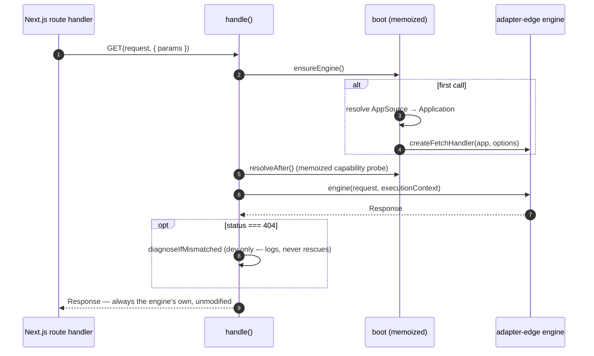

Bridge a NextRush `Application` into the seven exports a Next.js App Router `route.ts` needs —
one function, zero request rewriting.

<Callout type="info" title="Source & internals">
  [README](https://github.com/0xTanzim/nextRush/blob/main/packages/adapters/nextjs/README.md) ·
  [ARCHITECTURE](https://github.com/0xTanzim/nextRush/blob/main/packages/adapters/nextjs/ARCHITECTURE.md) ·
  see also [Adapter Contract](/docs/architecture/adapters)
</Callout>

| | |
| --- | --- |
| **Package** | `@nextrush/adapter-nextjs` |
| **Status** | Beta 🚧 |
| **Support tier** | Public — stable surface once out of beta ([ADR-0014](https://github.com/0xTanzim/nextRush/blob/main/docs/adr/ADR-0014-adapter-nextjs-prepend-only.md)) |
| **Included in `nextrush`?** | ✅ Yes — re-exported as `nextrush/nextjs` (optional peer, functional installs skip it) |
| **Runtime** | Universal — Node · Bun · Deno · Cloudflare (via OpenNext) — anywhere Next.js itself runs |
| **Requires** | Node `>=22` · Next.js `>=14.0.0` (App Router only) · TypeScript `>=5.x` |

<Callout type="warn" title="App Router only">
  The Pages Router is a permanent non-goal — it hands `(req, res)`, not a `Request`, and
  supporting it would pull Node-specific code into what is otherwise a fully Web-standard
  package. Migrate the route to `app/api/[[...route]]/route.ts`. See{' '}
  <a href="#rejected-alternatives">rejected alternatives</a> for the full reasoning.
</Callout>

---

## Installation

<PackageInstall packages={['@nextrush/adapter-nextjs']} />

Already using `nextrush`? Import from `nextrush/nextjs` instead — same package, re-exported as an
optional peer. A functional-only `pnpm add nextrush` never resolves it or `next`.

---

## Quick reference

```typescript
// src/server/app.ts
import { createApp, createRouter } from 'nextrush';

const app = createApp();
const api = createRouter();
api.get('/hello', (ctx) => ctx.json({ message: 'Hello Next.js!' }));
app.route('/api', api);

export { app };
```

```typescript
// app/api/[[...route]]/route.ts
import { app } from '@/server/app';
import { handle } from 'nextrush/nextjs';

export const { GET, POST, PUT, PATCH, DELETE, HEAD, OPTIONS } = handle(app);
```

For the full walkthrough — project structure, class-based apps, the Next 14 caching caveat — see
the [Next.js tutorial](/docs/start/frameworks/nextjs).

---

## API reference

### `handle(app, options?)`

Mounts an `Application` and returns all seven Next.js App Router HTTP-method exports.

```typescript
import { handle } from 'nextrush/nextjs';

export const { GET, POST, PUT, PATCH, DELETE, HEAD, OPTIONS } = handle(app);
```

Also accepts a factory — sync or async — for apps that need to build asynchronously (class-based
apps registering modules, for example). `AppModule` is an ordinary `@Module` class — see the
[modules concept](/docs/concepts/modules) for how `@Module`/`@Controller`/`@Service` compose, and
the [Next.js tutorial](/docs/start/frameworks/nextjs) for the full, runnable version of this
example:

<Callout type="warn" title="Requires enabling legacy decorators in tsconfig.json">
  `@nextrush/class` needs `experimentalDecorators` + `emitDecoratorMetadata` — Next.js's SWC
  compiler supports both (reading them from `tsconfig.json`), but a fresh Next.js project doesn't
  enable them by default. This class-based path has not yet been run through a real `next build`
  in this project's own verification (unlike the plain functional path, verified against Next
  14/15/16) — see the [tutorial's full caveat](/docs/start/frameworks/nextjs) before relying on it.
</Callout>

```typescript
import { createApp } from 'nextrush';
import { registerModule } from 'nextrush/class';
import { AppModule } from '@/server/app.module';

export const { GET, POST } = handle(async () => {
  const app = createApp();
  await registerModule(app, AppModule, { prefix: '/api' });
  return app;
});
```

<TypeTable
  title="NextHandlerOptions"
  types={{
    timeout: {
      type: 'number',
      description:
        'Per-request timeout in milliseconds, raced against the handler. Returns a 504 Gateway Timeout on expiry. Pass-through to the underlying @nextrush/adapter-edge engine.',
      default: '24000 (the edge engine default)',
      optional: true,
    },
    onError: {
      type: '(error: Error, ctx: EdgeContext) => Response | Promise<Response>',
      description: 'Custom error → Response mapping. Pass-through to the underlying engine\'s default 500 handler.',
      optional: true,
    },
  }}
/>

### `type AppSource`

An `Application`, or a (possibly async) factory producing one:

```typescript
type AppSource = Application | (() => Application | Promise<Application>);
```

### `type NextRouteHandlers`

The shape `handle()` returns — exactly the seven methods Next.js route handlers support:

```typescript
type NextRouteHandlers = {
  GET: RouteHandlerFn;
  POST: RouteHandlerFn;
  PUT: RouteHandlerFn;
  PATCH: RouteHandlerFn;
  DELETE: RouteHandlerFn;
  HEAD: RouteHandlerFn;
  OPTIONS: RouteHandlerFn;
};
```

### `type NextRouteContext`

The structural shape of Next's second handler argument — matches Next's own generated
`RouteContext` type (`params` as a `Promise`, per Next 15+'s async-params convention):

```typescript
type NextRouteContext = {
  params: Promise<Record<string, string | string[] | undefined>>;
};
```

---

## Options

| Option | Type | Required | Default | Description |
| ------ | ---- | -------- | ------- | ----------- |
| `timeout` | `number` | No | `24000` (the edge engine's default) | Per-request timeout in ms, raced to a `504` |
| `onError` | `(error, ctx) => Response \| Promise<Response>` | No | the engine's default 500 handler | Custom error → `Response` mapping |

Both options are pass-throughs to `@nextrush/adapter-edge`'s `createFetchHandler` — this package
adds no timeout or error-handling logic of its own (see [Mental model](#mental-model) below).

---

## Mental model

`handle()` resolves the `Application` once (memoized for the life of the module instance), builds
one `createFetchHandler` engine over it, and returns seven functions that all dispatch through
that same engine. It adds no execution model, no context type, and no error handling of its own —
every one of those is inherited from `@nextrush/adapter-edge` unmodified.



**Invariant:** the request forwarded to the engine is never modified — no `Request`
reconstruction, ever. Mount prefixes are declared by the application (`app.route()`), never
inferred or configured by this package.

---

## `ctx.waitUntil()` and `after()`

Next.js supplies no execution context of its own the way Cloudflare or Vercel Edge do — without
this adapter, `ctx.waitUntil()` silently no-ops under a hand-rolled bridge. `handle()` resolves
Next's `after()` export as a capability probe (once, process-lifetime) and wires
`ctx.waitUntil()` to it automatically when available:

```typescript
app.use(async (ctx) => {
  ctx.waitUntil(
    fetch('https://analytics.example.com/track', {
      method: 'POST',
      body: JSON.stringify({ path: ctx.path }),
    })
  );

  ctx.json({ ok: true });
});
```

<Callout type="warn" title="A synchronous throw from after() itself is swallowed">
  `EdgeContext.waitUntil` is documented to never throw from the caller's perspective, and this
  package preserves that contract even if the underlying `after()` implementation violates it
  (e.g. Next's own "called outside a request scope" error). This is intentional, not a bug.
</Callout>

---

## Compatibility

**Requirements**

| Requirement | Version |
| ----------- | ------- |
| NextRush | `4.x` |
| Next.js | `>=14.0.0` (App Router only) |
| Node.js | `>=22` |
| TypeScript | `>=5.x` |

**Runtimes**

| Runtime | Supported | Notes |
| ------- | --------- | ----- |
| Node.js `>=22` | ✅ | Next's default runtime |
| Bun / Deno / Cloudflare (OpenNext) | ✅ | The package imports no runtime-specific API — verified by `packages/adapters/conformance`'s `nextjs` driver |

**Integration**
- **Peer dependencies:** `next >=14.0.0` (optional, resolved lazily)
- **Depends on:** [`@nextrush/adapter-edge`](/docs/reference/platforms/edge) — reuses its fetch engine, unmodified
- **Works with:** any NextRush middleware/class-runtime package — the mounted app is an ordinary `Application`
- **Incompatible with:** the Pages Router — see [rejected alternatives](#rejected-alternatives)

---

## Rejected alternatives

Recorded here because each was seriously considered during design — not obvious in hindsight:

<details>
<summary><strong>Stripping the mount prefix by rewriting the request</strong></summary>

Rejected on correctness grounds. `@nextrush/runtime`'s context base computes `url`/`path`/`query`
eagerly from `request.url` in its constructor, so a rewritten request makes the mount prefix
permanently unrecoverable inside the handler — breaking relative redirects and any generated
OpenAPI paths. The earlier design mitigated this with an `x-forwarded-prefix` header and a
`getMountPath()` helper; both were deleted once prepend was adopted, because there was nothing
left to undo.

</details>

<details>
<summary><strong>Supporting the Pages Router</strong></summary>

Rejected because it's the only reason this package would need `node:*` or a dependency on
`@nextrush/adapter-node` — Pages hands `(req, res)`, not a `Request`. Supporting it would force a
two-subpath split to keep that dependency out of Web-runtime bundles.

</details>

<details>
<summary><strong>The adapter injecting the mount prefix at boot</strong></summary>

Rejected because `@nextrush/core`'s application boot mounts the app-owned router once — an app
shared between a Next route file and a standalone `listen()` call would then route differently
depending on which host booted it first. Mount configuration belongs to the application, never
to the adapter serving it.

</details>

Full design history: [RFC-024](https://github.com/0xTanzim/nextRush/blob/main/docs/RFC/runtime-adapters/024-adapter-nextjs.md),
[ADR-0014](https://github.com/0xTanzim/nextRush/blob/main/docs/adr/ADR-0014-adapter-nextjs-prepend-only.md).

---

## Related

- [Next.js tutorial](/docs/start/frameworks/nextjs) — the full walkthrough: installation, project
  structure for a real API, class-based apps, and the Next 14 caching caveat.
- [Platforms overview](/docs/reference/platforms) — understanding runtime adapters generally.
- [@nextrush/adapter-edge](/docs/reference/platforms/edge) — the fetch-handler engine this package
  builds on, unmodified.
- [@nextrush/adapter-serverless](/docs/reference/platforms/serverless) — for AWS Lambda/GCF/Azure
  Functions deployments with no Next.js involved.
