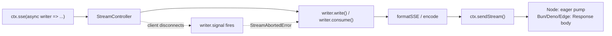

## Why This Package Exists

LLM responses arrive as a sequence of tokens, not a single value. Streaming them correctly means solving four problems at once:

- **SSE framing has several rules a hand-rolled implementation tends to miss.** Multi-line `data:` fields need per-line escaping, `event:`/`id:`/`retry:` fields must precede `data:`, and the terminating blank line is a common omission.
- **Streaming code isn't portable across runtimes.** Node's `ServerResponse.write()` and the Fetch `Response`/`ReadableStream` model used by Bun, Deno, and edge runtimes are different APIs.
- **Cancellation is usually missing.** When a client disconnects mid-response, nothing tells the handler to stop — the upstream LLM call keeps running and costing tokens nobody will read.
- **Bypassing the Context API breaks the framework's contract.** Without a streaming primitive, the only escape hatch is `ctx.raw.res`.

`@nextrush/stream` provides `ctx.stream()`, `ctx.sse()`, and `ctx.ndjson()` — wired into the platform adapters — so handlers never touch a raw response object.

<Callout type="info" title="Already installed">
  `@nextrush/stream` is a dependency of every `@nextrush/adapter-*` package. If you installed
  `nextrush` or any adapter directly, `ctx.stream()` / `ctx.sse()` / `ctx.ndjson()` are already
  available — no separate install needed unless you import the package's types or errors directly.
</Callout>

## Installation

<PackageInstall packages={['@nextrush/stream']} />

## Minimal Usage

Each method takes a callback that receives a protocol-specific writer. Write until done — the connection closes automatically when the callback resolves.

```ts
import { createApp, createRouter, listen } from 'nextrush';

const app = createApp();
const router = createRouter();

router.get('/chat', async (ctx) => {
  await ctx.sse(async (writer) => {
    for (const token of ['Hello', ', ', 'world', '!']) {
      await writer.write({ data: token });
    }
  });
});

app.route('/', router);
listen(app, 8080);
```

## Mental Model



`StreamController` owns cancellation, backpressure, and source normalization exactly once per response. `TextWriter`, `SSEWriter`, and `NDJSONWriter` are thin formatters on top of it — each knows one wire format and nothing else.

## The Three Protocols

<TypeTable
  title="Context Methods"
  types={{
    'ctx.stream()': { type: '(run: StreamRun<TextStreamWriter>) => Promise<void>', description: 'Raw text/byte chunks. Content-Type: text/plain.' },
    'ctx.sse()': { type: '(run: StreamRun<SSEStreamWriter>) => Promise<void>', description: 'Server-Sent Events. Content-Type: text/event-stream, sets Cache-Control: no-cache.' },
    'ctx.ndjson()': { type: '(run: StreamRun<NDJSONStreamWriter>) => Promise<void>', description: 'Newline-delimited JSON. Content-Type: application/x-ndjson.' },
  }}
/>

`StreamRun<W>` is `(writer: W) => Promise<void>` — your callback.

### Text Streaming

```ts
router.get('/export', async (ctx) => {
  await ctx.stream(async (writer) => {
    await writer.write('id,name\n');
    for (const row of rows) {
      await writer.write(`${row.id},${row.name}\n`);
    }
  });
});
```

`TextStreamWriter.write()` accepts `string | Uint8Array`.

### Server-Sent Events

```ts
router.get('/chat', async (ctx) => {
  await ctx.sse(async (writer) => {
    for await (const token of llmStream) {
      await writer.write({ data: token });
    }
    await writer.write({ event: 'done', data: '' });
  });
});
```

`SSEStreamWriter.write()` accepts an `SSEEvent`:

<TypeTable
  title="SSEEvent"
  types={{
    data: { type: 'string | unknown', description: 'Payload. Objects are JSON.stringify-ed; strings are sent verbatim.' },
    event: { type: 'string', description: 'Named event type.', optional: true },
    id: { type: 'string', description: 'Event ID, exposed to the client as lastEventId.', optional: true },
    retry: { type: 'number', description: 'Reconnection time in ms, suggested to the client.', optional: true },
  }}
/>

`formatSSE()` handles multi-line `data` fields (one `data:` line per source line) and strips `\r`/`\n` from `event`/`id` to prevent field injection — a handler cannot corrupt the stream by writing attacker-controlled strings into these fields.

### NDJSON

```ts
router.get('/trace', async (ctx) => {
  await ctx.ndjson(async (writer) => {
    for await (const step of agentSteps) {
      await writer.write(step); // any JSON-serializable value
    }
  });
});
```

Each `write()` call emits one `JSON.stringify(value)` followed by `\n`.

## Consuming an Existing Async Iterable

All three writers share `consume(source)` — pass an `AsyncIterable` or Web `ReadableStream` directly instead of writing a manual loop:

```ts
router.get('/chat', async (ctx) => {
  const completion = await openai.chat.completions.create({ stream: true, ... });
  await ctx.sse(async (writer) => {
    await writer.consume(mapToSSEEvents(completion));
  });
});
```

`consume()` normalizes the source once (`StreamController.normalize()`), stops immediately if the client disconnects, and calls `iterator.return()` for cleanup — no dangling generators.

## Cancellation

Every writer exposes `signal: AbortSignal` and `aborted: boolean`, sourced from the client's disconnect:

```ts
await ctx.sse(async (writer) => {
  for await (const token of llmStream) {
    if (writer.aborted) break; // stop pulling from the upstream LLM call
    await writer.write({ data: token });
  }
});
```

Pass `writer.signal` directly to an AI SDK's own `abortSignal` option so the upstream HTTP call actually stops when the client disconnects — the entire reason this package treats cancellation as a first-class concern rather than an afterthought.

Writing after disconnect throws `StreamAbortedError` rather than silently dropping data:

```ts
import { StreamAbortedError } from '@nextrush/stream';

try {
  await ctx.sse(async (writer) => {
    await writer.write({ data: 'first' });
    await writer.write({ data: 'second' });
  });
} catch (err) {
  if (err instanceof StreamAbortedError) {
    // Client disconnected mid-stream — already handled internally, rarely
    // needs a catch at the call site.
  }
}
```

`ctx.stream()`/`ctx.sse()`/`ctx.ndjson()` catch `StreamAbortedError` at their own boundary and close cleanly — it is never logged as a failure and never propagates to your route handler unless you explicitly re-throw it.

## Backpressure

`StreamController.enqueue()` checks the underlying stream's `desiredSize`. If the consumer's buffer is full, the write waits until the next `pull()` before continuing — a slow client cannot cause unbounded memory growth from a fast producer.

## API Reference

### `StreamController`

Owns lifecycle for one streaming response: abort tracking, enqueue, backpressure, and source normalization. Constructed internally by `ctx.stream()`/`ctx.sse()`/`ctx.ndjson()` — most code never instantiates it directly.

<TypeTable
  title="Methods"
  types={{
    'enqueue(chunk)': { type: '(chunk: Uint8Array) => Promise<void>', description: 'Enqueue raw bytes with backpressure. Throws StreamAbortedError if disconnected.' },
    'enqueueText(text)': { type: '(text: string) => Promise<void>', description: 'UTF-8 encode and enqueue.' },
    'normalize(source)': { type: '(source: AsyncIterable<T> | ReadableStream<T>) => AsyncIterator<T>', description: 'The single place that branches on source shape.' },
    'onAbort(fn)': { type: '(fn: () => void) => void', description: 'Register a cleanup callback fired once on disconnect.' },
  }}
/>

### `formatSSE(event)`

```ts
function formatSSE(event: SSEEvent): string;
```

Formats one `SSEEvent` into its wire-format string. Exported for callers that need the raw framing without going through `ctx.sse()` (for example, testing).

### `StreamAbortedError`

```ts
class StreamAbortedError extends Error {}
```

Thrown by a writer's `write()`/`consume()` once the client has disconnected. A control-flow signal, not an HTTP error — nothing is sent because the client is already gone.

## Runtime Compatibility

Zero runtime dependencies beyond `@nextrush/types`. Built entirely on Web-standard `ReadableStream` and `AbortSignal`.

| Runtime | Delivery model |
| --- | --- |
| Node.js 22+ | Eager pump via `ctx.raw.res.write()`, backpressure via the `drain` event |
| Bun, Deno, Cloudflare Workers, Vercel Edge | Lazy — the `ReadableStream` becomes the `Response` body directly |

## Common Mistakes

<Callout type="warn">
  Writing to a stream after the client disconnects throws `StreamAbortedError`. Check
  `writer.aborted` inside long-running loops (especially ones pulling from an upstream LLM) instead
  of relying on the exception to stop expensive work you could have skipped.
</Callout>

- **Awaiting the streaming call incorrectly.** `ctx.sse(callback)` returns a `Promise<void>` that resolves when the callback finishes — always `await` it, or the handler returns before the response completes.
- **Ignoring `writer.signal`.** If the callback drives an external API call (LLM, upstream service), forward the signal so cancellation stops the call instead of only stopping local writes.
- **Sending non-serializable values to `ctx.ndjson()`.** Each `write()` runs `JSON.stringify()`; a value containing a circular reference throws.

## Related

- [`@nextrush/openapi`](/docs/reference/plugins/openapi) — documents regular JSON routes; streaming routes are not represented in OpenAPI (no schema for a token stream)
- [Request Lifecycle](/docs/concepts/request-lifecycle) — where response streaming fits relative to middleware and adapters
- [Context](/docs/concepts/context) — the unified request/response API this package extends
