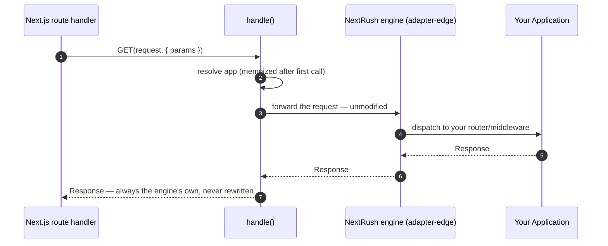

<DocHero eyebrow="Framework integration · App Router">

Next.js already owns the process — there's no `listen()` to call, and your route handler only
ever sees a `Request`, not the `(req, res)` pair most API frameworks expect. `@nextrush/adapter-nextjs`
solves exactly one problem: bridge a real NextRush `Application` — routers, middleware, services,
however many files it grows into — into the seven exports `route.ts` needs, in one line, without
rewriting the request or dropping background work.

<div className="not-prose mt-5 flex flex-wrap gap-2">
  <DocHeroPill>~15 min</DocHeroPill>
  <DocHeroPill>Beginner</DocHeroPill>
  <DocHeroPill>App Router only</DocHeroPill>
</div>

</DocHero>

<Callout type="info" title="Not sure this is what you need?">
  This page is for mounting NextRush **inside an existing or new Next.js app** — you already
  have (or are creating) a Next.js project and want a real API layer inside `app/api/`. If you're
  choosing a JS runtime to deploy a standalone NextRush app to (no Next.js involved), see the
  [runtime decision guide](/docs/start/runtime/decision-guide) instead — Next.js is a framework
  choice, not a runtime choice, and this adapter runs on whichever runtime Next.js itself uses.
</Callout>

## Finished project

By the end you'll have a NextRush application — one route to start — mounted inside a Next.js App
Router project and answering real requests, plus the file layout to grow it into a full API
without ever touching the route file again:

<DocStatStrip>
  <DocStat label="Framework" value="Next.js" hint="App Router — 14, 15, or 16" />
  <DocStat label="Bridge cost" value="1 line" hint="handle(app) — seven methods, one call" />
  <DocStat label="Outcome" value="1 route" hint="Mounted and answering JSON" />
</DocStatStrip>

```bash
curl http://localhost:3000/api/hello
# → {"message":"Hello Next.js!"}
```

## Prerequisites

- **Required:** a terminal, a package manager, and either an existing Next.js App Router project
  or a fresh one from `create-next-app` — this package deliberately does not scaffold a Next.js
  project for you (Next's own `create-next-app` is the correct, maintained source for that; see
  [FAQ](#faq) below).
- **Assumed:** you already know how to run `next dev`. This page starts from "I have an
  `app/` directory," not from "how do I install Next.js."
- **Difficulty · time:** Beginner · ~15 minutes

<Steps>

### Step 1 of 5 — Install NextRush and the Next.js adapter

**Why now:** like every other runtime target, the `nextrush` meta-package does not bundle the
Next.js bridge by default — it's an optional peer, so a functional-only install never resolves
`next` or this adapter onto disk.

**Do:**

<PackageInstall packages={['nextrush', '@nextrush/adapter-nextjs']} />

**Why it worked:** `createApp` and `createRouter` come from `nextrush` — identical to every other
runtime. `handle`, the one function this page is built around, is re-exported as `nextrush/nextjs`
once `@nextrush/adapter-nextjs` is installed alongside it. If you're not using the `nextrush`
meta-package at all, `@nextrush/adapter-nextjs` also installs standalone and accepts any
`@nextrush/core` `Application` directly.

### Step 2 of 5 — Build the app in its own file, not in `route.ts`

**Why now:** the single most common mistake is writing the whole API inside
`app/api/.../route.ts` — one giant file per route segment, no shared middleware, no router. Build
the application as an ordinary NextRush app first; the route file's only job is the bridge.

**Do:**

```ts title="src/server/app.ts"
import { createApp, createRouter } from 'nextrush';

const app = createApp();

const api = createRouter();
api.get('/hello', (ctx) => ctx.json({ message: 'Hello Next.js!' }));
app.route('/api', api);

export { app };
```

**Why it worked:** this is a completely ordinary NextRush application — nothing about it knows or
cares that it's about to run inside Next.js. The same file would boot unchanged under `listen()`,
`@nextrush/adapter-edge`, or any other adapter. `app.route('/api', api)` also does real work here:
it's the mount prefix, and it must match the route file's folder in Step 3 exactly — that pairing
is the one thing to get right (see [Troubleshooting](#troubleshooting) if it doesn't).

### Step 3 of 5 — Mount it with `handle()`

**Why now:** this is the entire bridge. One import, one function call, seven exports — the route
file never grows past this regardless of how large `src/server/app.ts` becomes.

**Do:**

```ts title="app/api/[[...route]]/route.ts"
import { app } from '@/server/app';
import { handle } from 'nextrush/nextjs';

export const { GET, POST, PUT, PATCH, DELETE, HEAD, OPTIONS } = handle(app);
```

**Why it worked:** `handle(app)` resolves the application once, builds one request-handling
engine over it, and returns all seven HTTP methods Next.js route handlers can export — you don't
pick which ones to wire, all seven forward to the same NextRush app. The `[[...route]]` catch-all
segment is what lets one route file answer every path under `app/api/` instead of one file per
endpoint; the mount prefix your app actually answers to (`/api`, from Step 2) is still decided by
`app.route()`, not by this file or by Next's routing.

<Callout type="warn" title="Don't reach for createFetchHandler directly">
  `export const GET = createFetchHandler(app)` fails `next build`'s type check — Next's generated
  route context type isn't assignable to `createFetchHandler`'s second parameter. `handle()` is
  what solves exactly this mismatch; use it instead of the lower-level edge-adapter function.
</Callout>

### Step 4 of 5 — Run it and confirm the bridge works

**Do:**

```bash
next dev
```

**Expected output:**

```bash
curl -i http://localhost:3000/api/hello
# → HTTP/1.1 200 OK
# → {"message":"Hello Next.js!"}
```

**Why it worked:** the request never gets rewritten anywhere in this path — `ctx.path`, `ctx.url`,
and `ctx.raw.req` inside your handler are the true, original request, exactly as they'd be under
`listen()`. That's a deliberate design choice (see [Mental model](#mental-model)), not an
accident of this particular route working: no mount-prefix magic exists here to silently break
later.

### Step 5 of 5 — Know the two things that are genuinely different in Next.js

**What's genuinely different, and why:** Next.js provides no `listen()` — the process is already
running before your route handler is ever invoked, and it's Next's `after()` API, not a
long-running event loop, that background work hooks into. `handle()` wires `ctx.waitUntil()` to
`after()` automatically when it's available; without this adapter, `ctx.waitUntil()` silently
no-ops under a hand-rolled bridge, because Next supplies no execution context of its own the way
Cloudflare or Vercel Edge do.

The second difference only matters on **Next.js 14**: `GET` route handlers are cached statically
by default (this changed to dynamic-by-default starting in 15.0.0-RC), so a mounted API can look
like it's returning the same stale response on every request. One export fixes it:

```ts title="app/api/[[...route]]/route.ts"
export const dynamic = 'force-dynamic';
```

**What's identical:** everything else. The Context API (`ctx.json`, `ctx.params`, `ctx.query`,
`ctx.set`, middleware, error handling) behaves exactly as it does under Node's `listen()` — there
is no Next.js-specific context shape to learn.

<Callout type="warn" title="Decorators need one tsconfig change — and this path isn't build-verified yet">
  `@nextrush/class` compiles with TypeScript's **legacy decorators**
  (`experimentalDecorators` + `emitDecoratorMetadata`), the same ones `reflect-metadata` needs.
  Next.js's SWC compiler does support this — it reads both flags from your `tsconfig.json` and
  maps them to its own decorator transform — but you have to turn them on yourself; a fresh
  `create-next-app` project doesn't set them:

  ```json title="tsconfig.json"
  {
    "compilerOptions": {
      "experimentalDecorators": true,
      "emitDecoratorMetadata": true
    }
  }
  ```

  Being honest about the rest: SWC's decorator transform is its own reimplementation of
  TypeScript's, not TypeScript's actual compiler — and unlike the plain functional path (verified
  against three real Next 14/15/16 `next build`s), this class-based path has not yet been run
  through an equivalent real build in this project's own verification. It should work with the
  `tsconfig.json` change above; treat it as reasonably likely rather than proven until you've
  confirmed `next build` succeeds for your own project.
</Callout>

<Callout type="info" title="Class-based apps (DI, modules, guards) work too">
  `handle()` also accepts a factory instead of a plain app — useful when your app needs an async
  boot step like `await registerModule(...)`. `AppModule` here isn't a special type this adapter
  provides — it's an ordinary `@Module` class, exactly like in a standalone NextRush app:

  ```ts title="src/server/app.module.ts"
  import { Module, Controller, Get, Service } from 'nextrush/class';

  @Service()
  class UserService {
    findAll() {
      return [{ id: 1, name: 'Alice' }];
    }
  }

  @Controller('/users')
  class UserController {
    constructor(private users: UserService) {}
    @Get() findAll() { return this.users.findAll(); }
  }

  @Module({
    controllers: [UserController],
    providers: [UserService],
  })
  export class AppModule {}
  ```

  ```ts title="app/api/[[...route]]/route.ts"
  import { createApp } from 'nextrush';
  import { registerModule } from 'nextrush/class';
  import { handle } from 'nextrush/nextjs';
  import { AppModule } from '@/server/app.module';

  export const { GET, POST } = handle(async () => {
    const app = createApp();
    await registerModule(app, AppModule, { prefix: '/api' });
    return app;
  });
  ```

  `registerModule` walks `AppModule`'s `controllers`/`providers` (and any `imports` it declares),
  registers everything into the DI container, then wires `UserController`'s route — the same
  pipeline `registerControllers` uses for a non-module app. `handle()`'s factory form exists
  specifically so this `await` has somewhere to run before the app is used — a plain `Application`
  passed directly to `handle()` can't await anything first. See the [modules
  concept](/docs/concepts/modules) for composing several feature modules together with `imports`.
</Callout>

</Steps>

## Checkpoint

Confirm the route answers before moving on:

```bash
curl -i http://localhost:3000/api/hello
# → HTTP/1.1 200 OK
# → {"message":"Hello Next.js!"}
```

Your project now looks like:

```text
my-app/
├── app/
│   └── api/
│       └── [[...route]]/
│           └── route.ts       # the bridge — handle(app), nothing else
└── src/
    └── server/
        └── app.ts             # the real NextRush application
```

**🎉 That's a real NextRush app running inside Next.js**, with a route file that will never need
to change again no matter how large `src/server/app.ts` grows.

## Mental model

The request is never touched. `handle()` forwards it, unmodified, through the same
request-handling engine every edge/serverless target already uses:



**Rule:** mount prefixes belong to your application (`app.route(prefix, router)`) — this package
never infers or strips one. That's why Step 2's `app.route('/api', api)` and Step 3's folder
(`app/api/[[...route]]/`) both had to agree: nothing reconciles a mismatch between them
automatically (see [Troubleshooting](#troubleshooting)).

## Growing past one route — project structure for a real API

A real API is more than one route file. `app.route(prefix, router)` composes the same way
regardless of file count — split by feature, keep business logic out of route handlers, and mount
everything once in `src/server/app.ts`. This is the shape [Hono](https://hono.dev) popularized,
applied to NextRush:

```text
src/
├── server/
│   ├── app.ts                 # composes every feature router — the ONLY export route.ts imports
│   ├── routes/
│   │   ├── users.route.ts     # HTTP concerns only: params, status, calling into services
│   │   └── posts.route.ts
│   └── services/
│       ├── users.service.ts   # business logic, data access — no ctx, no Request/Response
│       └── posts.service.ts
app/
└── api/
    └── [[...route]]/
        └── route.ts           # the bridge — nothing else lives here, ever
```

<Tabs items={['users.service.ts', 'users.route.ts', 'app.ts']}>
  <Tab value="users.service.ts">
    ```ts title="src/server/services/users.service.ts"
    // Pure business logic, no framework types — no ctx, no Request/Response.
    export async function findUser(id: string) {
      return db.user.findUnique({ where: { id } }); // whatever your data layer is
    }
    ```
  </Tab>
  <Tab value="users.route.ts">
    ```ts title="src/server/routes/users.route.ts"
    // HTTP concerns only — delegates to the service, doesn't contain business logic.
    import { createRouter } from 'nextrush';
    import { findUser } from '../services/users.service';

    export const usersRouter = createRouter();

    usersRouter.get('/:id', async (ctx) => {
      const user = await findUser(ctx.params.id);
      if (!user) return ctx.throw(404, 'User not found');
      ctx.json(user);
    });
    ```
  </Tab>
  <Tab value="app.ts">
    ```ts title="src/server/app.ts"
    // The one place every router gets mounted.
    import { createApp } from 'nextrush';
    import { usersRouter } from './routes/users.route';
    import { postsRouter } from './routes/posts.route';

    const app = createApp();
    app.route('/api/users', usersRouter);
    app.route('/api/posts', postsRouter);

    export { app };
    ```
  </Tab>
</Tabs>

`app/api/[[...route]]/route.ts` stays exactly as it was in Step 3, no matter how large
`src/server/app.ts` grows — that's the entire point of the bridge. The identical `src/server/app.ts`
also boots unchanged under `listen()` or `@nextrush/adapter-edge`; it never knows it's running
inside Next.js.

## Troubleshooting

<details>
<summary><strong>404 for every route, even ones I declared</strong></summary>

**Cause:** the mount prefix in your route file's folder doesn't match your `app.route()` call —
the one pairing this package deliberately never reconciles automatically (see
[Mental model](#mental-model)).

**Fix:** in development, check the server log — a mismatch logs an actionable hint naming both
halves and the exact `app.route()` call to add.

```ts
// app/api/[[...route]]/route.ts mounts at /api — the app must declare it too:
app.route('/api', api); // not app.route('/', api)
```

</details>

<details>
<summary><strong>`GET` returns the same response every time (Next.js 14 only)</strong></summary>

**Cause:** Next 14 statically caches `GET` route handlers by default (changed to dynamic-by-default
starting in 15.0.0-RC) — this is Next's own caching, not something this adapter does.

**Fix:** add one export, as covered in [Step 5](#step-5-of-5--know-the-two-things-that-are-genuinely-different-in-nextjs).

```ts
export const dynamic = 'force-dynamic';
```

</details>

<details>
<summary><strong>`export const GET = createFetchHandler(app)` fails `next build`'s type check</strong></summary>

**Cause:** that mismatch is exactly the problem `@nextrush/adapter-nextjs` exists to solve — Next's
generated route context type (`{ params: Promise<...> }`) isn't assignable to the lower-level
edge adapter's second parameter.

**Fix:** use `handle(app)` (Step 3) instead of calling `createFetchHandler` directly.

</details>

## FAQ

**Does `create-nextrush` scaffold a Next.js project for me?**
No, deliberately. Use Next's own `create-next-app` for a new project, or your existing app — this
package documents how to wire NextRush into it, not how to generate a Next.js project.

**Can I use this without the `nextrush` meta-package?**
Yes — install `@nextrush/adapter-nextjs` directly and pass any `@nextrush/core` `Application` to
`handle()`.

**Does it work on Bun, Deno, or Cloudflare (via OpenNext), or is it Node-only?**
Yes. The package is fully Web-standard — no `node:*`, `process`, `Buffer`, or runtime global — so
it runs on every host Next.js itself runs on, verified by the shared conformance suite's `nextjs`
driver.

**Does Next.js support decorators for the class-based path?**
Its SWC compiler does — it reads `experimentalDecorators`/`emitDecoratorMetadata` from your
`tsconfig.json` and maps them to its own decorator transform, no Babel needed. You have to enable
both yourself (a fresh Next.js project doesn't). See [Step 5](#step-5-of-5--know-the-two-things-that-are-genuinely-different-in-nextjs)'s
callout for the exact setting and the honest caveat: unlike the plain functional path, this route
hasn't been proven against a real `next build` in this project's own verification yet.

**Does it support the Pages Router?**
No, deliberately — App Router only. The Pages Router hands `(req, res)`, not a `Request`, and
supporting it would pull in Node-specific code paths this package is built to avoid. Migrate the
route to `app/api/[[...route]]/route.ts`.

## What you learned

- **The bridge is one function, `handle()`, with no configuration for the common path** — it
  returns all seven Next.js route-handler exports from one NextRush `Application`, and never
  rewrites the request.
- **Mount prefixes are your application's own** (`app.route(prefix, router)`) — this package
  never infers or strips one, which is also the one thing to keep in sync when something 404s.
- **A real API is multiple files, not one `route.ts`** — routers, services, and the composing
  `app.ts` grow independently of the bridge, the same shape Hono popularized.
- **`ctx.waitUntil()` needs this adapter to actually work under Next.js** — without it, background
  work silently no-ops instead of running after the response is sent.

## Next steps

<Callout type="info" title="🚀 Build a Task API — recommended · ~20 min">
  Not using Next.js? Go through the same routing/middleware/error-handling ground on a
  standalone NextRush app. [Start the tutorial →](/docs/start/quick-start)
</Callout>

<Cards>
  <Card title="@nextrush/adapter-nextjs reference" href="/docs/reference/platforms/nextjs">
    The full API surface — `handle()`, `NextHandlerOptions`, `AppSource`, and the types Next's
    route context requires.
  </Card>
  <Card title="Class-based apps (DI, modules, guards)" href="/docs/concepts/class-runtime">
    Build the mounted app with `@Controller`, `@Service`, and `registerModule` instead of the
    functional API — `handle()`'s factory form supports the async boot this needs.
  </Card>
</Cards>

## Continue learning

<Cards>
  <Card title="Runtime decision guide" href="/docs/start/runtime/decision-guide">
    Choosing a JS runtime for a standalone NextRush app — a different question from framework
    integration, answered on its own page.
  </Card>
  <Card title="@nextrush/adapter-edge" href="/docs/reference/platforms/edge">
    The fetch-handler engine `@nextrush/adapter-nextjs` builds on, unmodified — useful if you're
    also deploying edge functions outside of Next.js.
  </Card>
  <Card title="Runs on any runtime" href="/docs/concepts/runtime-compatibility">
    Why the exact same `src/server/app.ts` from this page also boots under `listen()` or any
    other adapter, unchanged.
  </Card>
</Cards>
