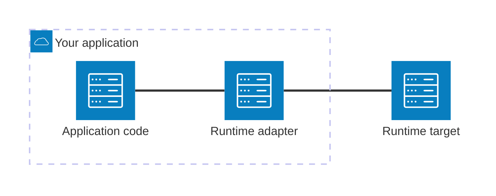

<DocHero eyebrow="The framework map">

NextRush is a Node.js HTTP framework built around one idea: you should be able to read the code and
know exactly what happens on every request — no hidden middleware, no auto-wired magic, no runtime
you didn't ask for.

This is the whole framework on one page, told in five acts: **Why**, **How**, **Building**,
**Running**, and **Learning**. Every chapter follows the same loop — the idea, the picture, code you
can run, and what to remember — so by the end you'll recognize **70–80% of NextRush's core ideas**
and know exactly which page to open next for depth.

<div className="not-prose mt-5 flex flex-wrap gap-2">
  <DocHeroPill>Beginner</DocHeroPill>
  <DocHeroPill>15–20 min read</DocHeroPill>
  <DocHeroPill>Node · Bun · Deno · Edge</DocHeroPill>
  <DocHeroPill>TypeScript</DocHeroPill>
</div>

</DocHero>

The one line every request walks — the recurring motif you'll see broken down below:

<MentalModelFlow steps={['Request', 'Application', 'Middleware', 'Router', 'Handler', 'Response']} />

<Callout type="info" title="What you'll walk away with">
A picture you can redraw on a whiteboard, working code for every idea, and a map of where each piece
lives in depth. This page teaches the **shape** of the framework — each chapter links to its concept
page for the full detail. It's the map; the concept pages are the territory.
</Callout>

Five acts, in order — **Why** it exists, **How** it works, what you'd spend most of your time on
**Building**, where it ends up **Running**, and **Learning** where to go next:

<MentalModelFlow steps={['Why', 'How', 'Building', 'Running', 'Learning']} />

<DocSectionEyebrow>Act 1 · Why</DocSectionEyebrow>

Before any piece of the framework, the reasoning behind all of them: what building an API without
NextRush actually feels like, and the four commitments NextRush makes instead.

## Why NextRush exists

Picture the last time you started a plain Express API. Routes are wired by hand, request bodies come
in untyped until you add and configure a parser, and nothing stops a `req.user` from being `undefined`
at 2am in production. Reach for Fastify and the throughput problem is solved, but you're Node-only and
writing JSON-Schema by hand for every route. Reach for NestJS and the structure problem is solved, but
now you're learning decorators, modules, and an Angular-shaped runtime before your first `GET` even
exists.

Every one of those frameworks is *good* at what it optimizes for. The problem is that each one asks
you to accept a real cost to get there — an ecosystem you wire by hand, a runtime you're locked into,
or a framework you have to learn before you can use it. **NextRush is what happens when none of those
costs are treated as the price of entry.** Strict types from the first route, structure that's
optional instead of mandatory, a core small enough to read start to finish in one sitting, and the
same application code running on four different runtimes.

That's the shape of the bet this framework makes. The head-to-head comparison against Express,
Fastify, Koa, NestJS, and Hono lives on the
[Introduction](/docs/start#where-other-frameworks-trade-off); the rest of this page is about how
NextRush itself thinks once you're inside it.

## The philosophy

Four commitments explain nearly every design decision in the framework. Hold these and the rest
follows:

<HighlightGrid>
  <HighlightItem
    icon="layers"
    title="Small core"
    description="The functional core is a few thousand lines you can read end to end. Less framework to learn, less to hide a surprise in."
  />
  <HighlightItem
    icon="code"
    title="Explicit wiring"
    description="Nothing runs that you didn't add. Middleware, routes, and extensions are wired by you, so reading the code tells you the whole behavior."
  />
  <HighlightItem
    icon="puzzle"
    title="Capability composition"
    description="One package per capability. You install validation, CORS, or WebSocket when you need them — the base stays small."
  />
  <HighlightItem
    icon="globe"
    title="Runtime independence"
    description="The request path speaks web standards, so the same app runs on Node, Bun, Deno, and the edge behind an adapter."
  />
</HighlightGrid>

<Callout type="info" title="Remember">
NextRush trades nothing to get small, typed, and portable: a small core you can finish reading, wiring
you can see in the code, capability you add one package at a time, and one codebase across runtimes.
Everything from here on is those four ideas made concrete.
</Callout>

<DocSectionEyebrow>Act 2 · How</DocSectionEyebrow>

The philosophy explains *why*. This act shows *how* — one request, traced through every piece it
touches, starting with the single diagram the rest of the page keeps pointing back to.

## The framework on one diagram

This is the picture to redraw from memory. Every chapter after it explains **one node** on it. A
request enters the Application, flows down the Middleware pipeline, the Router picks a handler —
written either as a plain function or as a class controller — and both read from and write to the
same Context before a Response goes back out.

<Mermaid
  chart="
flowchart TB
    Req([Incoming request]) --> App[Application]
    App --> MW[Middleware pipeline]
    MW --> Router[Router]
    Router --> Fn[Functional handler]
    Router --> Cls[Class controller]
    Fn --> Ctx[Context]
    Cls --> Ctx
    Ctx --> Res([Response])
"
/>

The two handler shapes converge on one Context and one Response — that convergence is the point:
functional and class are two ways to write the *same* pipeline, not two frameworks.

## Application

<p className="text-sm text-[var(--text-muted)]">📍 We are here — the first node after a request arrives.</p>

**Why a separate piece at all?** Because something has to own the pipeline before any request logic
runs — a place to register middleware and mount routers once, instead of re-wiring them on every
request. That's all the **Application** is: the entry point and orchestrator. It doesn't match routes
or handle requests itself — it owns the pieces that do and hands each request down the chain.

Run this and it answers a request — nothing else has been added yet:

```ts
import { createApp, createRouter, listen } from 'nextrush';

const app = createApp(); // owns the chain; nothing runs until you add to it
const router = createRouter();

router.get('/', (ctx) => ctx.json({ status: 'ok' }));

app.route('/', router);
await listen(app, 8080); // curl localhost:8080/ → {"status":"ok"}
```

| The Application owns | What that means |
| --- | --- |
| The middleware chain | The ordered list every request passes through |
| Mounted routers | Where routes attach (`app.route('/', router)`) |
| Extensions | Long-lived, app-scoped services booted at `app.ready()` |
| The lifecycle | Startup, readiness, and graceful shutdown |

<Callout type="warn" title="Common mistake">
Calling `createApp()` more than once per process. One `app` owns one middleware chain — if you find
yourself creating a second `Application`, you probably want a second *router* mounted at a different
prefix instead.
</Callout>

<details>
<summary>Why is `createApp()` a function and not a class you extend?</summary>

Extending a class ties your app to whatever that class's constructor does — you inherit its
internals, not only its behavior. A factory function returns a plain object with a known, closed
surface: you compose behavior by *calling* `app.use()`/`app.route()`, never by overriding a method the
framework calls internally. That keeps "reading the code tells you the whole behavior" true even for
the Application itself.

</details>

Full detail: [Application](/docs/concepts/application).

## Middleware

<p className="text-sm text-[var(--text-muted)]">📍 We are here — the pipeline a request flows through before the Router.</p>

**Why not put auth and logging straight in the handler?** Because then every handler re-implements
them, and a change to how you log means editing every route. **Middleware** wraps that behavior around
a handler like layers of an onion — one place for auth, body parsing, and logging — instead of one
copy per route. Each layer runs *before* the handler, calls `ctx.next()`, and then runs again *after*
on the way back out. The rule that trips people up: **order of registration is order of execution.**

<Mermaid
  chart="
sequenceDiagram
    participant Outer as Middleware A
    participant Inner as Middleware B
    participant H as Handler
    Outer->>Inner: before, then ctx.next()
    Inner->>H: before, then ctx.next()
    H-->>Inner: return
    Inner-->>Outer: after
    Outer-->>Outer: after — response is now yours to shape
"
/>

A middleware you can register right now — timing every request:

```ts
app.use(async (ctx) => {
  const start = Date.now();
  await ctx.next(); // before this line: on the way in. after it: on the way out.
  console.log(`${ctx.method} ${ctx.path} — ${Date.now() - start}ms`);
});
```

<Callout type="warn" title="Common mistake">
Registering a body parser *after* the router. `ctx.body` stays empty in every handler, because
middleware runs in registration order and the parser never got a chance to run first.
</Callout>

<details>
<summary>What happens if a middleware never calls `ctx.next()`?</summary>

The chain stops there — nothing downstream of it runs, including the router and the handler. That's
not a bug to guard against; it's how you short-circuit a request on purpose (an auth check that
responds `401` and returns, without calling `next()`, is exactly this).

</details>

Full detail: [Middleware](/docs/concepts/middleware).

## Router

<p className="text-sm text-[var(--text-muted)]">📍 We are here — where the pipeline hands off to your code.</p>

**Why not check the URL yourself in one big handler?** Because that turns into an unmaintainable
chain of `if` statements the moment you have more than a few routes. The **Router** maps a request's
path to the one handler responsible for it. It's backed by a **segment trie**, so lookup cost tracks
how many segments a URL has, not how many routes you've registered. It captures parameters
(`/users/:id`) and supports grouping and mounting sub-routers under a prefix.

<Mermaid
  chart="
flowchart TD
    root(( / )) --> users[users]
    users --> uid[:id]
    root --> tasks[tasks]
    tasks --> tid[:id]
"
/>

That tree is the structure a request walks segment by segment. Here it is as real routes:

```ts
const router = createRouter();

router.get('/users/:id', (ctx) => ctx.json({ id: ctx.params.id }));
router.get('/tasks/:id', (ctx) => ctx.json({ id: ctx.params.id }));
// GET /users/42 → { "id": "42" } — :id is captured as a string
```

<Callout type="warn" title="Common mistake">
Comparing `ctx.params.id` to a number with `===`. Route params are always strings — `ctx.params.id
=== 42` is `false` even when the URL is `/users/42`. Convert first: `Number(ctx.params.id) === 42`.
</Callout>

<details>
<summary>Check yourself</summary>

**Which piece decides *which handler* runs for a given path — Middleware or Router?**

<details>
<summary>Show answer</summary>

The **Router**. Middleware runs for every request that reaches it regardless of path; the Router is
the one piece that looks at the path and picks a single handler for it.

</details>
</details>

Full detail: [Router](/docs/concepts/routing).

## Context

<p className="text-sm text-[var(--text-muted)]">📍 We are here — what every node above actually reads from and writes to.</p>

**Why one object instead of the raw request and response?** Because juggling `req` and `res`
separately means remembering two APIs, two mutation points, and — across runtimes — two different
underlying types. **Context** (`ctx`) is the one per-request object every step reads from and writes
to instead. You never touch the raw `req`/`res` directly — `ctx` carries the request in and the
response out, and it's fresh per request so nothing leaks between concurrent ones.

```ts
router.post('/tasks', (ctx) => {
  const body = ctx.body as { title: string }; // in: parsed by a body-parser middleware
  ctx.status = 201; // out: status
  ctx.json({ id: 1, title: body.title }); // out: JSON response
});
```

| Reads input | Writes output | Shares state |
| --- | --- | --- |
| `ctx.params`, `ctx.query` | `ctx.json(...)`, `ctx.send(...)` | `ctx.state` between middleware |
| `ctx.body`, `ctx.headers` | `ctx.status`, `ctx.set(...)` | `ctx.next()` to continue the chain |

<Callout type="warn" title="Common mistake">
Reading `ctx.body` in a route with no body-parser middleware registered. It stays `undefined` —
`Context` doesn't parse bodies itself; a middleware like `@nextrush/body-parser`'s `json()` does that
and puts the result on `ctx.body`.
</Callout>

<details>
<summary>Why does `ctx.state` exist if middleware can mutate `ctx` directly anyway?</summary>

You *can* attach anything to `ctx` directly, but `ctx.state` is the one place every middleware author
agrees to look — a shared namespace, not a free-for-all on the object's other properties. It's a
convention that keeps two unrelated middleware from ever colliding on the same property name.

</details>

Full detail: [Context](/docs/concepts/context).

<Callout type="info" title="Remember">
One request walks four nodes in a fixed order: the Application owns the chain, Middleware wraps the
handler before and after, the Router picks which handler runs, and Context is the one object all of
them read from and write to. That's the diagram above — nothing more.
</Callout>

<details>
<summary>You now understand — Act 2 checklist</summary>

- ✓ Why the Application exists as a separate piece from the router
- ✓ Why middleware order is execution order, and what skipping `ctx.next()` does
- ✓ Why the router is backed by a trie instead of a list of `if` statements
- ✓ Why `ctx` replaces raw `req`/`res`, and what `ctx.state` is for

</details>

<DocSectionEyebrow>Act 3 · Building</DocSectionEyebrow>

You now know how one request flows. This act is about writing the code that handles it: what you
install, which syntax you write it in, and how to add capability beyond a single request.

## Packages

**Why does this come before you've even written a route?** Because it's one of NextRush's core
differences from a batteries-included framework, and it shapes every decision after this point: you
never install more than the request you're building actually needs. The `nextrush` **meta-package**
gives you the core — `createApp`, `createRouter`, `listen`, the Context API, and the error classes. It
does not bundle validation, CORS, security headers, or WebSocket support. You add each capability as
its own package, so your install stays as small as your app.

```ts
import { createApp, listen } from 'nextrush';
import { cors } from '@nextrush/cors'; // added because this API is called cross-origin
import { json } from '@nextrush/body-parser'; // added because a route reads a JSON body

const app = createApp();
app.use(cors());
app.use(json());
await listen(app, 8080);
```

Decide what to install by what the request needs, not by habit:

| You need | Install | Then |
| --- | --- | --- |
| JSON / form bodies | `@nextrush/body-parser` | `app.use(json())` |
| Cross-origin requests | `@nextrush/cors` | `app.use(cors())` |
| Security headers | `@nextrush/helmet` | `app.use(helmet())` |
| Request validation | `@nextrush/validation` | validate against a schema |
| WebSocket | `@nextrush/websocket` | attach the WebSocket handler |

<Callout type="warn" title="Common mistake">
Installing `@nextrush/cors` or `@nextrush/helmet` in a project that never actually needs cross-origin
requests or those headers "in case it's needed later." Every package you add is code that ships and a decision
someone has to understand later — install the ones the request in front of you actually needs.
</Callout>

<details>
<summary>Why is DI the one exception to "zero external dependencies"?</summary>

The functional core has no external runtime dependencies at all — `createApp`, `createRouter`, and
`listen` are built entirely on internal `@nextrush/*` packages. `nextrush/class` is the one exception:
its dependency injection container is built on `reflect-metadata` and `tsyringe`, two real external
packages. Stay on the functional path and neither one touches your `node_modules`; import
`nextrush/class` and they come with it. That's a deliberate trade, not an oversight — building a DI
container from scratch would mean maintaining decorator metadata handling in-house for a feature only
the class runtime needs.

</details>

Full detail: [packages reference](/docs/reference).

## Two programming styles

**Why does the framework support two ways to write the same thing?** Because "small service" and
"large team" want different amounts of structure, and forcing one style onto both means either
over-engineering the small service or under-structuring the large one. NextRush gives you two ways to
write the same pipeline, and you can mix them in one project. Both compile to identical routing and
middleware — **same engine, different syntax**, no performance trade-off.

<Tabs items={['Functional', 'Class-based']}>
  <Tab value="Functional">

Plain functions and `createApp()` / `createRouter()` — the fewest moving parts.

```ts
import { createApp, createRouter, listen } from 'nextrush';

const app = createApp();
const router = createRouter();

router.get('/users/:id', (ctx) => ctx.json({ id: ctx.params.id }));

app.route('/', router);
await listen(app, 8080);
```

  </Tab>
  <Tab value="Class-based">

`@Controller` classes with dependency injection, from `nextrush/class` — structure for larger apps.

```ts
import { Controller, Get, Param } from 'nextrush/class';

@Controller('/users')
class UserController {
  @Get('/:id')
  findOne(@Param('id') id: string) {
    return { id };
  }
}
```

  </Tab>
</Tabs>

<Callout type="warn" title="Common mistake">
Picking class-based for a two-route script because it "looks more professional." Class controllers
add real ceremony — decorators, DI registration, a container — that pays off with guards and
constructor-injected services at team scale, not on a handful of routes.
</Callout>

Full detail: [Application](/docs/concepts/application) (functional) and
[dependency injection](/docs/concepts/dependency-injection) (class-based).

## Extensions

<p className="text-sm text-[var(--text-muted)]">📍 We are here — capability that lives beyond a single request.</p>

**Why isn't everything middleware, if middleware handles 99% of capability?** Because some things
aren't per-request at all — a database connection pool or an event bus needs to boot once and live for
the app's lifetime, not run on every request. NextRush gives you three mechanisms, and which one you
reach for is a decision, not a guess:

| Need | Reach for | Because |
| --- | --- | --- |
| Auth, logging, parsing — runs on every request | **Middleware** (`app.use(...)`) | It's per-request behavior — ~99% of capability is this |
| Wiring a subsystem once at startup | **Registrar** (a plain function, e.g. `registerControllers`) | It runs once, not per request, but needs no lifetime after that |
| A stateful service that lives for the app's whole lifetime | **Extension** (`app.extend(...)`, booted at `app.ready()`) | It needs boot *and* teardown — an event bus, a connection pool |

```ts
import { events } from '@nextrush/events';

const app = createApp().extend(events()); // boots once, lives for the app's lifetime
await app.ready();
```

<Callout type="warn" title="Common mistake">
Reaching for an Extension when a Registrar would do. If your code runs once at startup and needs no
teardown, it's a registrar — wrapping it in `app.extend()` for a lifecycle it doesn't need is the
~0.1%-mechanism doing a ~0.9%-mechanism's job.
</Callout>

This is capability composition in practice: the base stays small, and you add exactly the mechanism a
feature needs. Full detail: [Extensions](/docs/concepts/extensions).

## Errors

<p className="text-sm text-[var(--text-muted)]">📍 We are here — what happens when a handler can't finish normally.</p>

**Why throw instead of returning an error object?** Because a thrown error can't be silently ignored
the way a returned value can — forgetting to check a return value is a real, common bug; forgetting to
catch a throw is not, since the framework catches it for you either way. You **throw a typed error
class**, and the framework maps it to the right status and JSON body. You describe *what went wrong*,
not *how to format it* — and internal stack traces never leak in production.

<Mermaid
  chart="
sequenceDiagram
    participant H as Handler
    participant FW as Framework
    participant Fmt as Error formatter
    participant Client
    H->>FW: throw new NotFoundError('...')
    FW->>Fmt: catch, map HttpError → status + body
    Fmt-->>Client: 404 + JSON error
"
/>

```ts
import { NotFoundError } from 'nextrush';

router.get('/tasks/:id', (ctx) => {
  const task = tasks.get(Number(ctx.params.id));
  if (!task) throw new NotFoundError('Task not found'); // → 404, formatted for you
  ctx.json(task);
});
```

<Callout type="warn" title="Common mistake">
Returning `ctx.json(null)` with a `200` for a missing resource instead of throwing. A client can't
tell "found, and it's empty" apart from "not found" — throw `NotFoundError` so the status carries the
meaning.
</Callout>

<details>
<summary>You now understand — Act 3 checklist</summary>

- ✓ Why packages are per-capability, and what installing for "later, maybe" costs
- ✓ Why functional and class are the same engine with different syntax, and when each fits
- ✓ The decision — middleware, registrar, or extension — and why each exists
- ✓ Why thrown errors beat returned error objects

</details>

<DocSectionEyebrow>Act 4 · Running</DocSectionEyebrow>

You've built something. This act is about where it actually runs — the runtimes NextRush targets, the
seam that makes that possible, and what the server does across its whole lifetime, not only one
request.

## One app, every runtime

**Why should switching runtimes cost this little?** Because the request path speaks only web-standard
`Request`/`Response`, so your application code — routes, middleware, controllers — doesn't change
when you move it. Only the entry adapter does.

<Cards>
  <Card title="Node.js" href="/docs/start/runtime/node" description="The baseline every other runtime is measured against." />
  <Card title="Bun" href="/docs/start/runtime/bun" description="Runs on Bun.serve()." />
  <Card title="Deno" href="/docs/start/runtime/deno" description="Runs on Deno.serve(), with its permission model." />
  <Card title="Edge" href="/docs/start/runtime/edge" description="Cloudflare Workers and Vercel Edge — no long-running server." />
  <Card title="Serverless" href="/docs/start/runtime/serverless" description="AWS Lambda, Google Cloud Functions, Azure Functions." />
</Cards>

Full detail: [runtime compatibility](/docs/concepts/runtime-compatibility).

## Adapters

**Why doesn't the framework target Node only and call it done?** Because the moment it hard-codes
Node's APIs anywhere in the request path, "one app, every runtime" stops being true. An **adapter** is
the bridge between your application and a runtime's native server — the same `app` from every chapter
above, unchanged, handed to a different `listen`-equivalent per runtime.



```ts
// The same app — only the adapter import changes per runtime
import { createApp, createRouter } from 'nextrush';
import { listen } from '@nextrush/adapter-node'; // swap for @nextrush/adapter-bun, etc.

const app = createApp();
// ...routes, middleware — identical on every runtime
await listen(app, 8080);
```

<Callout type="warn" title="Common mistake">
Importing `node:fs`, `process`, or another Node-only API directly inside a route handler or
middleware. It works on Node and silently breaks the moment that same code runs on the edge — runtime
APIs belong behind the adapter, never inline in application code.
</Callout>

That single adapter seam — the only layer that changes — is what makes "one app, every runtime" true
rather than aspirational. The runtime target is any of the five above (Node, Bun, Deno, Edge, or
Serverless).

## The request lifecycle

**Why look at the whole server instead of one request?** Because a request handled correctly can still
be dropped if the server exits mid-response — correctness at the request level isn't enough without
correctness at the process level too. The Application starts, becomes ready, handles requests, and —
on a shutdown signal — drains in-flight work before exiting. Readiness and draining are what let it
deploy behind an orchestrator without dropping requests.

<Mermaid
  chart="
stateDiagram-v2
    [*] --> Starting
    Starting --> Ready: app.ready()
    Ready --> Handling: request accepted
    Handling --> Ready: response sent
    Ready --> Draining: SIGTERM / SIGINT
    Handling --> Draining: SIGTERM / SIGINT
    Draining --> [*]: in-flight done or timeout
"
/>

```ts
import { createApp } from 'nextrush';
import { serve } from '@nextrush/adapter-node';

const app = createApp();
await serve(app, { port: 8080, gracefulShutdown: true }); // drains on SIGTERM/SIGINT before exiting
```

<Callout type="warn" title="Common mistake">
Deploying behind an orchestrator (Kubernetes, ECS) without graceful shutdown enabled. The platform
sends `SIGTERM` and expects in-flight requests to finish before the process exits — without draining,
those requests get cut off mid-response during every rolling deploy.
</Callout>

Full detail: [request lifecycle](/docs/concepts/request-lifecycle).

<details>
<summary>You now understand — Act 4 checklist</summary>

- ✓ Why the same application code runs on five different runtimes
- ✓ What the adapter seam is, and why runtime APIs never belong in application code
- ✓ The four states a running server moves through, and why draining matters on shutdown

</details>

<DocSectionEyebrow>Act 5 · Learning</DocSectionEyebrow>

You have the map. This last act is about what it's actually for — the services it's built to produce,
and exactly where to go to turn this understanding into a running application.

## What you can build

The pieces above combine into real services. A few shapes NextRush is built for:

<HighlightGrid>
  <HighlightItem icon="globe" title="REST APIs" description="Typed params, query, and body from one Context — either style." />
  <HighlightItem icon="zap" title="Streaming & SSE" description="Server-Sent Events and NDJSON responses, built for AI and agentic apps." />
  <HighlightItem icon="puzzle" title="Real-time servers" description="WebSocket connections alongside your HTTP routes." />
  <HighlightItem icon="gauge" title="Edge & serverless APIs" description="The same handlers on Workers, Vercel Edge, or Lambda." />
  <HighlightItem icon="package" title="Microservices" description="A small core keeps each service's footprint honest." />
  <HighlightItem icon="layers" title="Class-based apps" description="Guards, interceptors, and request-scoped DI for larger teams." />
</HighlightGrid>

## Your learning path

You have the map. Here's the order the rest of the docs are meant to be read in — each stage assumes
the one before it:

<Mermaid
  chart="
flowchart LR
    A[This page<br/>the mental map] --> B[Tutorial]
    B --> C[Concepts]
    C --> D[Guides]
    D --> E[Reference]
    E --> F[Architecture]
"
/>

<Cards>
  <Card
    title="Build a Task API"
    description="The hands-on tutorial — POST a task, read it back, return a real 404."
    href="/docs/start/quick-start"
  />
  <Card
    title="Core Concepts"
    description="Every node on the map, taught in full: Application, Middleware, Router, Context, and more."
    href="/docs/concepts"
  />
  <Card
    title="Install NextRush"
    description="Scaffold a project or install by hand, then verify a running server."
    href="/docs/start/installation"
  />
  <Card
    title="Reference"
    description="Exact signatures and options, grouped by capability, once you know what you're after."
    href="/docs/reference"
  />
</Cards>
