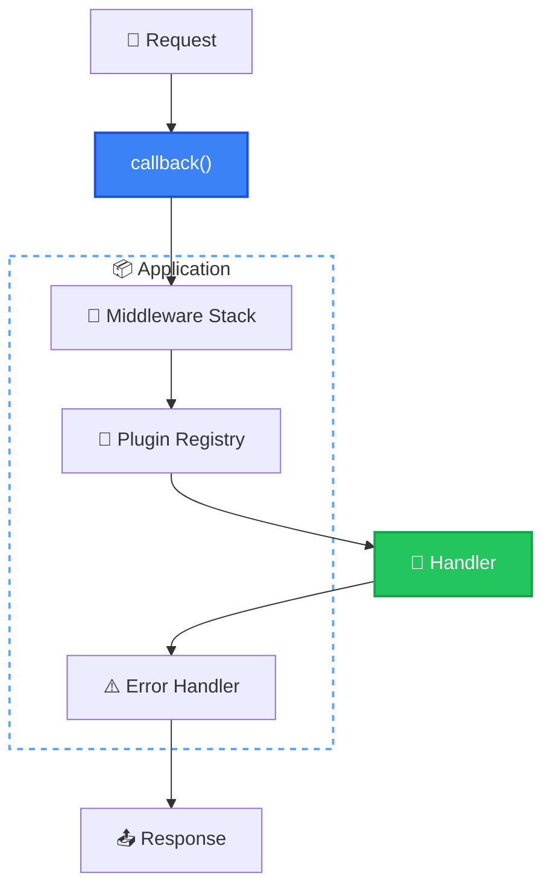
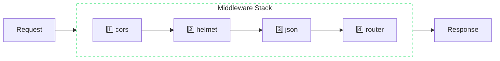

# Application

> The Application class is the heart of NextRush. It orchestrates middleware, plugins, and request handling.

## The Problem

Building a web server involves juggling multiple concerns:
- Registering middleware in the correct order
- Managing plugin lifecycles
- Handling errors consistently
- Adapting to different runtimes

Without a central orchestrator, you'd wire these together manually for every project.

## How NextRush Approaches This

The `Application` class provides a **single entry point** that:

1. **Manages middleware** — Registers and composes middleware in order
2. **Installs plugins** — Provides a typed plugin system with lifecycle hooks
3. **Handles errors** — Catches errors and provides configurable error handling
4. **Generates callbacks** — Creates the request handler for adapters



## Mental Model

Think of Application as a **conductor** orchestrating an orchestra:

- **Middleware** are the musicians — each plays their part in order
- **Plugins** are the instruments — they add capabilities
- **Error handler** is the safety net — catches wrong notes
- **callback()** is the performance — turns it all into music

The Application doesn't process requests itself. It builds the pipeline and hands it to adapters.

## Creating an Application

```typescript
import { createApp } from '@nextrush/core';

// Factory function (recommended)
const app = createApp();

// With options
const app = createApp({
  env: 'production',
  proxy: true,
});
```

## Application Options

| Option | Type | Default | Description |
|--------|------|---------|-------------|
| `env` | `'development' \| 'production' \| 'test'` | `process.env.NODE_ENV` or `'development'` | Environment mode |
| `proxy` | `boolean` | `false` | Trust proxy headers (X-Forwarded-For, X-Forwarded-Proto) |

### Environment Mode

```typescript
// Development: verbose errors, stack traces exposed
const app = createApp({ env: 'development' });

// Production: minimal error info, no stack traces
const app = createApp({ env: 'production' });

// Test: for running tests
const app = createApp({ env: 'test' });
```

### Proxy Mode

Enable when running behind a reverse proxy (nginx, AWS ALB, Cloudflare):

```typescript
const app = createApp({ proxy: true });

// Now ctx.ip uses X-Forwarded-For header
app.use((ctx) => {
  console.log(ctx.ip); // Real client IP, not proxy IP
});
```

## Application Properties

```typescript
app.isProduction;    // boolean — true if env === 'production'
app.isRunning;       // boolean — true after server starts
app.middlewareCount; // number — count of registered middleware
app.options;         // ApplicationOptions — readonly config
```

## Middleware Registration

### Basic Registration

```typescript
// Single middleware
app.use(async (ctx) => {
  console.log(`${ctx.method} ${ctx.path}`);
  await ctx.next();
});

// Multiple middleware at once
app.use(cors(), helmet(), json());

// Method chaining
app.use(cors())
   .use(helmet())
   .use(json())
   .use(router.routes());
```

### Middleware Order

Middleware executes in registration order (onion model):



```typescript
app.use(async (ctx) => {
  console.log('1: before');
  await ctx.next();
  console.log('1: after');
});

app.use(async (ctx) => {
  console.log('2: before');
  await ctx.next();
  console.log('2: after');
});

// Output:
// 1: before
// 2: before
// 2: after
// 1: after
```

### Validation

```typescript
// ❌ Throws TypeError
app.use('not a function');
app.use(null);

// ✅ Must be a function
app.use(async (ctx) => { /* ... */ });
```

## Plugin System

Plugins extend the application without modifying core.

### Installing Plugins

```typescript
// Synchronous plugin
app.plugin(loggerPlugin({ level: 'info' }));

// Async plugin (database connections, etc.)
await app.pluginAsync(databasePlugin({ uri: '...' }));

// Check if installed
if (app.hasPlugin('logger')) {
  console.log('Logger is active');
}

// Get plugin instance
const logger = app.getPlugin<LoggerPlugin>('logger');
```

### Plugin Installation Rules

```typescript
// ❌ Duplicate plugin throws error
app.plugin(loggerPlugin());
app.plugin(loggerPlugin()); // Error: Plugin "logger" is already installed

// ❌ Async plugin with sync method throws
app.plugin(asyncPlugin); // Error: Use app.pluginAsync() instead
```

See [Plugins](/concepts/plugins) for detailed plugin documentation.

## Error Handling

### Custom Error Handler

```typescript
app.onError((error, ctx) => {
  // Log the error
  console.error('Request failed:', error);

  // Set response based on error type
  if (error.status) {
    ctx.status = error.status;
  } else {
    ctx.status = 500;
  }

  // Send error response
  ctx.json({
    error: error.message,
    code: error.code || 'UNKNOWN_ERROR',
    // Include stack in development only
    ...(app.options.env === 'development' && { stack: error.stack }),
  });
});
```

### Default Error Behavior

Without a custom handler:

| Environment | Error Message | Stack Trace | Console Log |
|-------------|---------------|-------------|-------------|
| `development` | Full message | Hidden | Logged |
| `production` | "Internal Server Error" | Hidden | Hidden |

### HTTP Error Classes

```typescript
import {
  HttpError,
  NotFoundError,
  BadRequestError,
  UnauthorizedError,
  ForbiddenError,
  InternalServerError,
} from '@nextrush/core';

app.use(async (ctx) => {
  // These set status automatically
  throw new NotFoundError('User not found');      // 404
  throw new BadRequestError('Invalid email');     // 400
  throw new UnauthorizedError('Token expired');   // 401
  throw new ForbiddenError('Admin only');         // 403
});
```

## Request Handler

The `callback()` method returns the function adapters use to handle requests:

```typescript
const handler = app.callback();

// Used internally by adapters
// handler(ctx) is called for each request
```

### Manual Integration

```typescript
import http from 'node:http';
import { createApp } from '@nextrush/core';
// Import adapter context creation (internal)

const app = createApp();
app.use((ctx) => ctx.json({ ok: true }));

// Low-level: create HTTP server manually
// (Use adapters instead for production)
const server = http.createServer(/* adapter logic */);
server.listen(3000);
```

::: tip Use Adapters
For production, use the official adapters instead of `callback()` directly:

```typescript
import { serve } from '@nextrush/adapter-node';
serve(app, { port: 3000 });
```
:::

## Lifecycle

### Starting

Adapters call `app.start()` when the server begins listening:

```typescript
app.start();
console.log(app.isRunning); // true
```

### Graceful Shutdown

Call `app.close()` for graceful shutdown:

```typescript
await app.close();

// This:
// 1. Sets isRunning = false
// 2. Calls destroy() on plugins (reverse order)
// 3. Clears plugin registry
```

### Shutdown Hook Example

```typescript
process.on('SIGTERM', async () => {
  console.log('Shutting down...');
  await app.close();
  process.exit(0);
});
```

## Common Patterns

### Full Application Setup

```typescript
import { createApp } from '@nextrush/core';
import { createRouter } from '@nextrush/router';
import { serve } from '@nextrush/adapter-node';
import { cors } from '@nextrush/cors';
import { helmet } from '@nextrush/helmet';
import { json } from '@nextrush/body-parser';

const app = createApp({
  env: process.env.NODE_ENV as 'production' | 'development',
  proxy: true,
});

// Error handler first
app.onError((error, ctx) => {
  console.error(error);
  ctx.status = error.status || 500;
  ctx.json({ error: error.message });
});

// Security middleware
app.use(helmet());
app.use(cors());

// Body parsing
app.use(json());

// Logging
app.use(async (ctx) => {
  const start = Date.now();
  await ctx.next();
  console.log(`${ctx.method} ${ctx.path} ${ctx.status} ${Date.now() - start}ms`);
});

// Routes
const router = createRouter();
router.get('/health', (ctx) => ctx.json({ status: 'healthy' }));
app.use(router.routes());

// Start server
serve(app, {
  port: 3000,
  onListen: ({ port }) => console.log(`Server on port ${port}`),
});
```

### Conditional Middleware

```typescript
const app = createApp();

// Add debug middleware only in development
if (process.env.NODE_ENV === 'development') {
  app.use(async (ctx) => {
    console.log(`DEBUG: ${ctx.method} ${ctx.path}`);
    await ctx.next();
  });
}
```

## Common Mistakes

### Forgetting to Mount Router

```typescript
// ❌ Router defined but not mounted
const router = createRouter();
router.get('/users', handler);
// Missing: app.use(router.routes())

// ✅ Mount the router
app.use(router.routes());
```

### Wrong Middleware Order

```typescript
// ❌ Error handler after routes (can't catch route errors)
app.use(router.routes());
app.use(errorHandler);

// ✅ Error handler first (catches all errors)
app.use(errorHandler);
app.use(router.routes());
```

### Async Plugin with Sync Method

```typescript
// ❌ Throws error
app.plugin(databasePlugin()); // If install() is async

// ✅ Use pluginAsync for async plugins
await app.pluginAsync(databasePlugin());
```

### Not Awaiting Close

```typescript
// ❌ Plugins may not clean up properly
app.close();
process.exit(0);

// ✅ Wait for cleanup
await app.close();
process.exit(0);
```

## TypeScript Types

```typescript
import { createApp, Application } from '@nextrush/core';
import type {
  ApplicationOptions,
  ErrorHandler,
  ListenCallback,
} from '@nextrush/core';

// Create typed application
const app: Application = createApp();

// Type error handler
const errorHandler: ErrorHandler = (error, ctx) => {
  ctx.status = 500;
  ctx.json({ error: error.message });
};

app.onError(errorHandler);
```

## See Also

- [Context](/concepts/context) — The request/response object
- [Middleware](/concepts/middleware) — How middleware works
- [Plugins](/concepts/plugins) — Extending the application
- [@nextrush/core](/packages/core) — Full API reference
