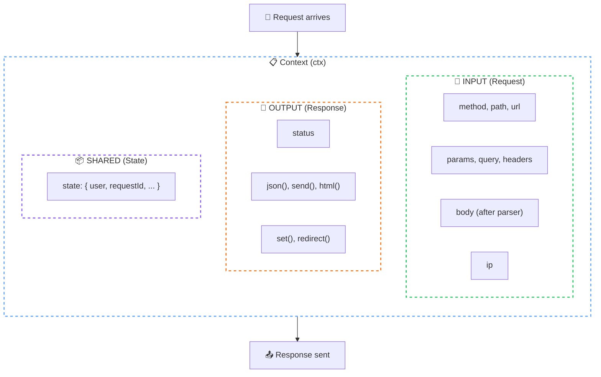

# Context API

> The `ctx` object provides unified access to request and response in every middleware and handler.

## The Problem

Traditional Node.js frameworks split request and response into separate objects (`req`, `res`). This creates patterns like:

```javascript
// Express pattern
app.get('/users/:id', (req, res) => {
  const id = req.params.id;         // From req
  const query = req.query;          // From req
  res.json({ id, query });          // To res
});
```

When you need to share data between middleware, you mutate `req`:

```javascript
// Express middleware pattern - mutating req
app.use((req, res, next) => {
  req.user = { id: 123 };  // Add to req
  next();
});
```

This works, but it's unclear what properties exist on `req` at any point in the pipeline.

## How NextRush Approaches This

NextRush combines request data and response methods into a single **Context** object:

```typescript
app.get('/users/:id', (ctx) => {
  const id = ctx.params.id;         // Request data
  const query = ctx.query;          // Request data
  ctx.json({ id, query });          // Response method
});
```

For sharing data, use the typed `state` bag:

```typescript
// Auth middleware
app.use(async (ctx) => {
  ctx.state.user = { id: 123 };
  await ctx.next();
});

// Handler accesses state
app.get('/profile', (ctx) => {
  ctx.json({ user: ctx.state.user });
});
```

## Mental Model

Think of Context as a **request envelope** that travels through your middleware pipeline:



## Request Properties

### `ctx.method`

The HTTP method of the request.

```typescript
ctx.method; // 'GET' | 'POST' | 'PUT' | 'DELETE' | 'PATCH' | 'HEAD' | 'OPTIONS'
```

### `ctx.path`

The request path without query string.

```typescript
// Request: GET /users/123?include=posts
ctx.path; // '/users/123'
```

### `ctx.url`

The full URL including query string.

```typescript
// Request: GET /users/123?include=posts
ctx.url; // '/users/123?include=posts'
```

### `ctx.params`

Route parameters extracted by the router.

```typescript
// Route: /users/:id
// Request: GET /users/123
ctx.params; // { id: '123' }
ctx.params.id; // '123'
```

### `ctx.query`

Parsed query string parameters.

```typescript
// Request: GET /users?page=2&limit=10
ctx.query; // { page: '2', limit: '10' }
ctx.query.page; // '2'
```

### `ctx.headers`

Request headers (case-insensitive access).

```typescript
ctx.headers['content-type']; // 'application/json'
ctx.headers.authorization;    // 'Bearer xxx'
```

### `ctx.body`

Request body (populated by body parser middleware).

```typescript
import { json } from '@nextrush/body-parser';

app.use(json());

app.post('/users', (ctx) => {
  const { name, email } = ctx.body as { name: string; email: string };
});
```

::: warning Body requires parser
`ctx.body` is `undefined` until a body parser middleware runs. Always add a body parser before accessing `ctx.body`.
:::

### `ctx.ip`

Client IP address.

```typescript
ctx.ip; // '192.168.1.1'
```

When `proxy: true` is set in app options, this respects `X-Forwarded-For`.

### `ctx.get(header)`

Get a request header value (case-insensitive).

```typescript
ctx.get('Content-Type');    // 'application/json'
ctx.get('Authorization');   // 'Bearer xxx'
ctx.get('x-request-id');    // 'abc-123'
```

## Response Methods

### `ctx.json(data)`

Send a JSON response.

```typescript
ctx.json({ users: [] });
ctx.json({ error: 'Not found' });
```

**Behavior:**
- Sets `Content-Type: application/json`
- Serializes data with `JSON.stringify()`
- Sets status to 200 if not already set

### `ctx.send(data)`

Send a response body (text, buffer, or stream).

```typescript
ctx.send('Hello World');              // text/plain
ctx.send(Buffer.from([0x48, 0x69]));  // application/octet-stream
ctx.send(readableStream);             // pipes stream
```

### `ctx.html(content)`

Send an HTML response.

```typescript
ctx.html('<h1>Hello World</h1>');
```

Sets `Content-Type: text/html; charset=utf-8`.

### `ctx.redirect(url, status?)`

Redirect to another URL.

```typescript
ctx.redirect('/login');           // 302 Found
ctx.redirect('/new-page', 301);   // 301 Moved Permanently
ctx.redirect('https://example.com');
```

### `ctx.set(header, value)`

Set a response header.

```typescript
ctx.set('X-Request-Id', 'abc-123');
ctx.set('Cache-Control', 'no-store');
```

### `ctx.status`

Get or set the response status code.

```typescript
ctx.status = 201;        // Set status
console.log(ctx.status); // Get status
```

## Error Helpers

### `ctx.throw(status, message?)`

Throw an HTTP error that stops the pipeline.

```typescript
ctx.throw(404);                    // Not Found
ctx.throw(404, 'User not found');  // With custom message
ctx.throw(401, 'Invalid token');
```

### `ctx.assert(condition, status, message?)`

Assert a condition or throw.

```typescript
const user = await getUser(id);
ctx.assert(user, 404, 'User not found');
ctx.assert(user.isAdmin, 403, 'Forbidden');
```

Equivalent to:

```typescript
if (!user) {
  ctx.throw(404, 'User not found');
}
```

## Middleware Flow

### `ctx.next()`

Call the next middleware in the chain.

```typescript
app.use(async (ctx) => {
  console.log('Before');
  await ctx.next();       // Call next middleware
  console.log('After');
});
```

::: tip Two Syntaxes
Both syntaxes work identically:

```typescript
// Modern: ctx.next()
app.use(async (ctx) => {
  await ctx.next();
});

// Koa-style: next parameter
app.use(async (ctx, next) => {
  await next();
});
```
:::

### `ctx.state`

A mutable object for sharing data between middleware.

```typescript
// Auth middleware
app.use(async (ctx) => {
  const token = ctx.get('Authorization');
  if (token) {
    ctx.state.user = await verifyToken(token);
  }
  await ctx.next();
});

// Handler
app.get('/profile', (ctx) => {
  ctx.json({ user: ctx.state.user });
});
```

## Platform Access

### `ctx.raw`

Access platform-specific request/response objects.

```typescript
// Node.js
ctx.raw.req;  // http.IncomingMessage
ctx.raw.res;  // http.ServerResponse

// Bun/Deno/Edge
ctx.raw.req;  // Web Request object
```

::: warning Escape Hatch
Use `ctx.raw` only when you need platform-specific features. Prefer NextRush's cross-platform API for compatibility.
:::

### `ctx.runtime`

Detect the current runtime.

```typescript
ctx.runtime; // 'node' | 'bun' | 'deno' | 'edge'

if (ctx.runtime === 'edge') {
  // Edge-specific logic
}
```

## Common Patterns

### Request Logging

```typescript
app.use(async (ctx) => {
  const start = Date.now();
  console.log(`→ ${ctx.method} ${ctx.path}`);

  await ctx.next();

  const ms = Date.now() - start;
  console.log(`← ${ctx.status} (${ms}ms)`);
});
```

### Request ID Propagation

```typescript
app.use(async (ctx) => {
  const requestId = ctx.get('X-Request-Id') || crypto.randomUUID();
  ctx.state.requestId = requestId;
  ctx.set('X-Request-Id', requestId);
  await ctx.next();
});
```

### Authentication

```typescript
app.use(async (ctx) => {
  const token = ctx.get('Authorization')?.replace('Bearer ', '');

  if (token) {
    try {
      ctx.state.user = await verifyJWT(token);
    } catch {
      // Invalid token - continue without user
    }
  }

  await ctx.next();
});
```

## Common Mistakes

### Forgetting await on next()

```typescript
// ❌ Wrong: Response may be sent before downstream completes
app.use(async (ctx) => {
  ctx.next();  // Missing await!
  ctx.set('X-After', 'value');
});

// ✅ Correct
app.use(async (ctx) => {
  await ctx.next();
  ctx.set('X-After', 'value');
});
```

### Multiple Responses

```typescript
// ❌ Wrong: Two responses
app.use((ctx) => {
  ctx.json({ step: 1 });
  ctx.json({ step: 2 });  // Error or ignored
});

// ✅ Correct: One response
app.use((ctx) => {
  ctx.json({ steps: [1, 2] });
});
```

### Accessing Body Without Parser

```typescript
// ❌ Wrong: body is undefined
app.post('/users', (ctx) => {
  console.log(ctx.body);  // undefined!
});

// ✅ Correct: Add body parser first
import { json } from '@nextrush/body-parser';
app.use(json());
app.post('/users', (ctx) => {
  console.log(ctx.body);  // { name: 'Alice', ... }
});
```

## TypeScript Types

Import context types for type annotations:

```typescript
import type { Context, ContextState } from '@nextrush/types';

const handler = (ctx: Context) => {
  ctx.json({ ok: true });
};

// Extend state type
interface AppState extends ContextState {
  user?: { id: string; email: string };
  requestId: string;
}
```

## See Also

- [Middleware](/concepts/middleware) — Request/response pipeline
- [Routing](/concepts/routing) — Route patterns and parameters
- [@nextrush/core](/packages/core) — Full API reference
