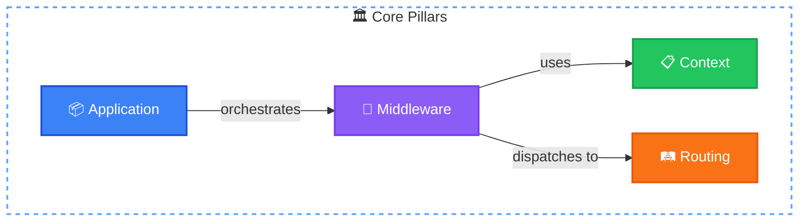
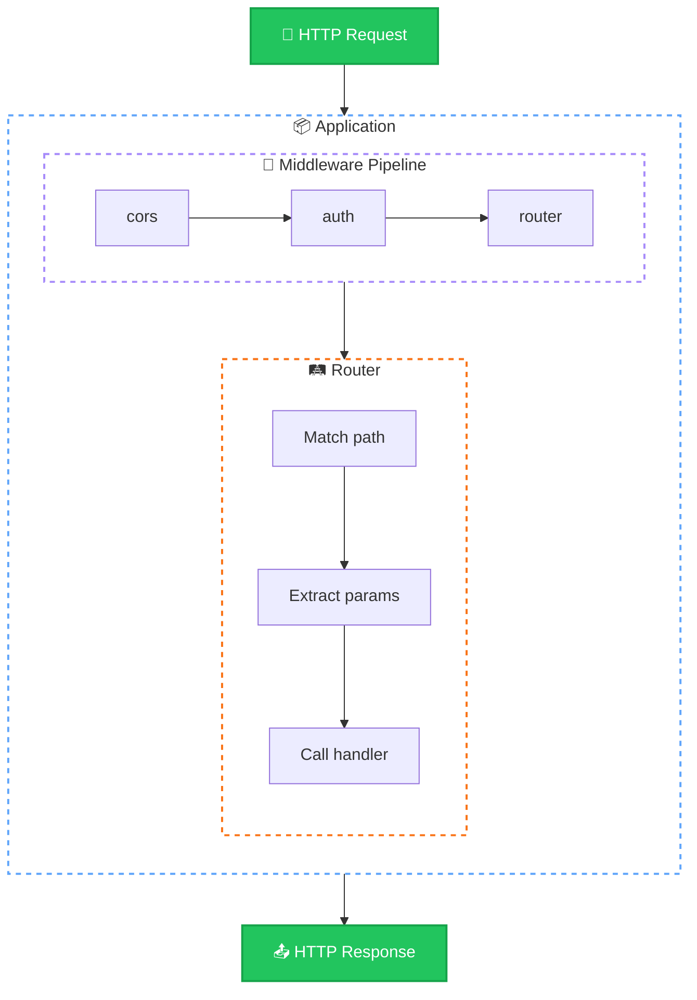

# Core Concepts

Before diving into code, understand the mental models behind NextRush.

## The Four Pillars

NextRush is built on four core concepts:



### 1. Application

The **Application** is the entry point of NextRush. It orchestrates middleware, manages plugins, and handles errors.

```typescript
const app = createApp();
app.use(middleware);
app.plugin(loggerPlugin());
```

[Learn about Application →](/concepts/application)

### 2. Context

Every request creates a **Context** (`ctx`) object that travels through your middleware pipeline. It contains:

- **Request data**: method, path, params, query, headers, body
- **Response methods**: json(), send(), html(), redirect()
- **Shared state**: a mutable bag for passing data between middleware

[Learn about Context →](/concepts/context)

### 3. Middleware

Middleware are functions that process requests in a **pipeline**. Each middleware can:

- Run code before the handler (authentication, logging)
- Pass control to the next middleware with `await ctx.next()`
- Run code after the handler (response timing, cleanup)

[Learn about Middleware →](/concepts/middleware)

### 4. Routing

The router matches URLs to handlers using a **radix tree** for O(k) performance. Features include:

- Route parameters (`:id`)
- Wildcards (`/*`)
- Groups and prefixes
- Per-route middleware

[Learn about Routing →](/concepts/routing)

## How They Work Together



**Request Flow:**

1. HTTP request arrives at the adapter
2. Adapter creates **Context** object
3. **Application** passes context through **Middleware** pipeline
4. **Router** middleware matches the path and extracts params
5. Handler executes and writes response to context
6. Response flows back through middleware (post-processing)
7. Adapter sends HTTP response

## Functional vs Class-Based

NextRush supports two programming styles:

### Functional Style

```typescript
import { createApp } from '@nextrush/core';
import { createRouter } from '@nextrush/router';

const app = createApp();
const router = createRouter();

router.get('/users/:id', async (ctx) => {
  const user = await db.users.findById(ctx.params.id);
  ctx.json({ user });
});

app.use(router.routes());
```

**Best for**: Small APIs, microservices, developers who prefer functions.

### Class-Based Style

```typescript
import { Controller, Get, ParamProp, Service } from '@nextrush/decorators';
import { controllersPlugin } from '@nextrush/controllers';

@Service()
class UserService {
  async findById(id: string) {
    return db.users.findById(id);
  }
}

@Controller('/users')
class UserController {
  constructor(private users: UserService) {}

  @Get(':id')
  async getUser(@ParamProp('id') id: string) {
    return { user: await this.users.findById(id) };
  }
}

app.plugin(controllersPlugin({
  controllers: [UserController],
}));
```

**Best for**: Large applications, teams, developers who prefer structure and DI.

::: tip Choose Your Path
Start with functional style for simplicity. Migrate to class-based when your project needs more structure. Both work together — you can mix them in the same application.
:::

## Extension Points

Beyond the core pillars, NextRush provides extension mechanisms:

### Plugins

Add features without modifying core:

```typescript
app.plugin(loggerPlugin({ level: 'info' }));
app.plugin(eventsPlugin());
await app.pluginAsync(databasePlugin(connectionString));
```

[Learn about Plugins →](/concepts/plugins)

### Error Handling

Customize how errors are handled:

```typescript
app.onError((error, ctx) => {
  console.error(error);
  ctx.status = error.status || 500;
  ctx.json({ error: error.message });
});
```

## Next Steps

Dive deeper into each concept:

<div class="vp-card-grid">

- **[Application →](/concepts/application)**

  Entry point, middleware registration, plugin system

- **[Context →](/concepts/context)**

  Deep dive into the ctx object

- **[Middleware →](/concepts/middleware)**

  Understand the pipeline

- **[Routing →](/concepts/routing)**

  Route patterns and performance

- **[Plugins →](/concepts/plugins)**

  Extending NextRush

</div>
