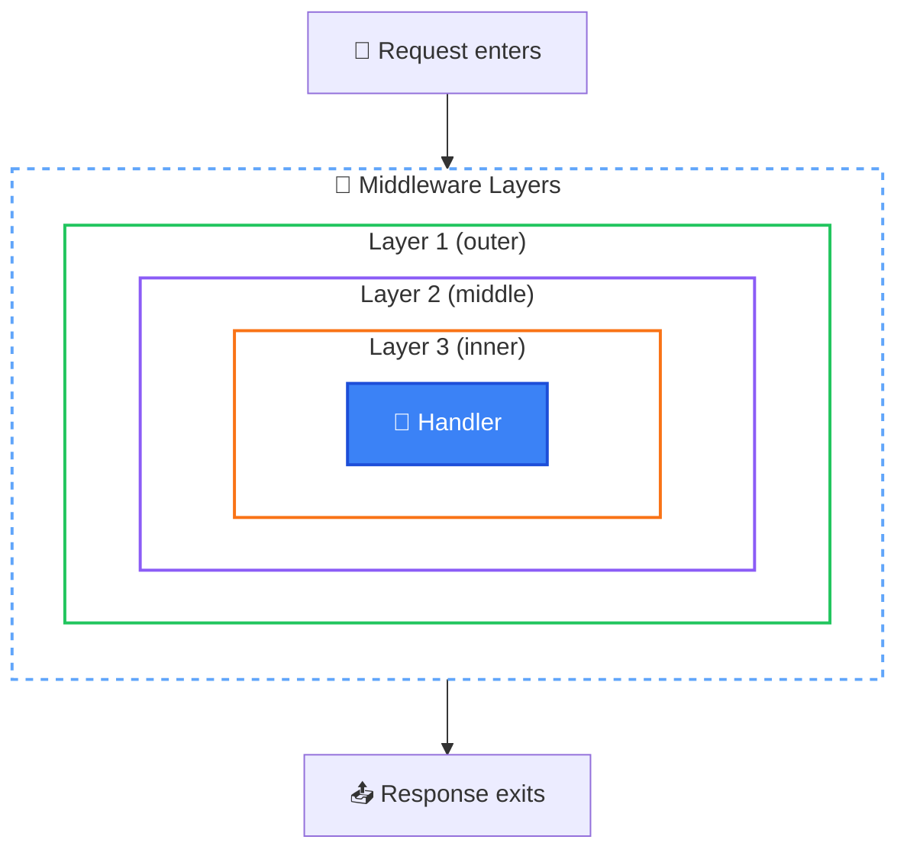

# Middleware

> Middleware are functions that process requests before and after your route handlers.

## The Problem

HTTP request processing often requires multiple steps:
1. Parse the request body
2. Authenticate the user
3. Validate permissions
4. Log the request
5. Handle the actual logic
6. Add response headers
7. Log the response

Without middleware, you'd repeat this logic in every route handler.

## How NextRush Approaches This

NextRush uses the **onion model** (also called Koa-style middleware):

```
Request → [MW 1 before] → [MW 2 before] → [Handler] → [MW 2 after] → [MW 1 after] → Response
```

Each middleware can:
1. Do something **before** calling `next()`
2. Call `await next()` to pass control downstream
3. Do something **after** `next()` returns

## Mental Model

Think of middleware as **layers of an onion**:



The request flows **inward** through each layer, reaches the handler, then the response flows **outward** back through each layer.

## Basic Usage

### Registering Middleware

```typescript
import { createApp } from '@nextrush/core';

const app = createApp();

// Single middleware
app.use(async (ctx) => {
  console.log('Before');
  await ctx.next();
  console.log('After');
});

// Multiple at once
app.use(middleware1, middleware2, middleware3);

// Chainable
app.use(cors())
   .use(helmet())
   .use(json());
```

### Execution Order

```typescript
app.use(async (ctx) => {
  console.log('1: Start');
  await ctx.next();
  console.log('1: End');
});

app.use(async (ctx) => {
  console.log('2: Start');
  await ctx.next();
  console.log('2: End');
});

app.use(async (ctx) => {
  console.log('3: Handler');
  ctx.json({ ok: true });
});

// Request produces:
// 1: Start
// 2: Start
// 3: Handler
// 2: End
// 1: End
```

### Two Syntax Styles

Both work identically — use whichever you prefer:

```typescript
// Modern: ctx.next()
app.use(async (ctx) => {
  console.log('Before');
  await ctx.next();
  console.log('After');
});

// Koa-style: next parameter
app.use(async (ctx, next) => {
  console.log('Before');
  await next();
  console.log('After');
});
```

## Common Patterns

### Timing Middleware

Measure request duration:

```typescript
app.use(async (ctx) => {
  const start = Date.now();
  await ctx.next();
  const ms = Date.now() - start;
  ctx.set('X-Response-Time', `${ms}ms`);
});
```

### Logging Middleware

Log requests and responses:

```typescript
app.use(async (ctx) => {
  const start = Date.now();
  console.log(`→ ${ctx.method} ${ctx.path}`);

  await ctx.next();

  const ms = Date.now() - start;
  console.log(`← ${ctx.status} (${ms}ms)`);
});
```

### Authentication Middleware

Add user to context state:

```typescript
app.use(async (ctx) => {
  const token = ctx.get('Authorization')?.replace('Bearer ', '');

  if (token) {
    try {
      ctx.state.user = await verifyToken(token);
    } catch {
      // Invalid token - continue without user
    }
  }

  await ctx.next();
});
```

### Error Handling Middleware

Catch errors from downstream:

```typescript
app.use(async (ctx) => {
  try {
    await ctx.next();
  } catch (error) {
    console.error('Error:', error);

    ctx.status = error.status || 500;
    ctx.json({
      error: error.message,
      code: error.code || 'INTERNAL_ERROR',
    });
  }
});
```

## Early Termination

Don't call `next()` to stop the pipeline:

```typescript
app.use(async (ctx) => {
  if (!ctx.get('Authorization')) {
    ctx.status = 401;
    ctx.json({ error: 'Unauthorized' });
    return; // Pipeline stops here
  }
  await ctx.next();
});
```

## Conditional Execution

Skip logic based on conditions:

```typescript
app.use(async (ctx) => {
  // Skip expensive logging for health checks
  if (ctx.path === '/health') {
    return ctx.next();
  }

  const start = Date.now();
  await ctx.next();
  console.log(`${ctx.path}: ${Date.now() - start}ms`);
});
```

## Middleware Composition

### compose()

Combine multiple middleware into one:

```typescript
import { compose } from '@nextrush/core';

// Create a security stack
const security = compose([
  cors(),
  helmet(),
  rateLimit({ max: 100 }),
]);

// Use as single middleware
app.use(security);
```

### Utilities

```typescript
import { isMiddleware, flattenMiddleware } from '@nextrush/core';

// Type guard
if (isMiddleware(fn)) {
  app.use(fn);
}

// Flatten nested arrays
const flat = flattenMiddleware([
  mw1,
  [mw2, mw3],
  [[mw4]],
]);
// Result: [mw1, mw2, mw3, mw4]
```

## Built-in Middleware Packages

NextRush provides common middleware as separate packages:

### Body Parsing

```typescript
import { json, urlencoded } from '@nextrush/body-parser';

app.use(json());        // Parse JSON bodies
app.use(urlencoded());  // Parse form bodies
```

### Security

```typescript
import { cors } from '@nextrush/cors';
import { helmet } from '@nextrush/helmet';
import { rateLimit } from '@nextrush/rate-limit';

app.use(cors());
app.use(helmet());
app.use(rateLimit({ max: 100, window: '15m' }));
```

### Utilities

```typescript
import { compression } from '@nextrush/compression';
import { requestId } from '@nextrush/request-id';
import { timer } from '@nextrush/timer';

app.use(compression());
app.use(requestId());
app.use(timer());
```

## Creating Custom Middleware

### Function-Based

```typescript
import type { Middleware } from '@nextrush/types';

const logger: Middleware = async (ctx) => {
  console.log(`${ctx.method} ${ctx.path}`);
  await ctx.next();
};

app.use(logger);
```

### Factory Pattern

Create configurable middleware:

```typescript
interface LoggerOptions {
  level: 'info' | 'debug';
  prefix?: string;
}

function logger(options: LoggerOptions): Middleware {
  return async (ctx) => {
    const message = `${options.prefix || ''} ${ctx.method} ${ctx.path}`;

    if (options.level === 'debug') {
      console.debug(message);
    } else {
      console.info(message);
    }

    await ctx.next();
  };
}

app.use(logger({ level: 'info', prefix: '[API]' }));
```

### Async Initialization

```typescript
async function createDbMiddleware(connectionString: string): Promise<Middleware> {
  const db = await connectToDatabase(connectionString);

  return async (ctx) => {
    ctx.state.db = db;
    await ctx.next();
  };
}

// Usage
app.use(await createDbMiddleware(process.env.DATABASE_URL));
```

## Common Mistakes

### Forgetting await on next()

```typescript
// ❌ Wrong: Downstream runs concurrently
app.use(async (ctx) => {
  ctx.next();  // Missing await!
  ctx.set('X-After', 'value');  // May run before downstream completes
});

// ✅ Correct
app.use(async (ctx) => {
  await ctx.next();
  ctx.set('X-After', 'value');
});
```

### Wrong Middleware Order

```typescript
// ❌ Wrong: Error handler can't catch body parser errors
app.use(json());
app.use(errorHandler);

// ✅ Correct: Error handler wraps everything
app.use(errorHandler);
app.use(json());
```

### Calling next() Multiple Times

```typescript
// ❌ Wrong: Downstream runs twice
app.use(async (ctx) => {
  await ctx.next();
  await ctx.next();  // Don't do this!
});

// ✅ Correct: Call next() once
app.use(async (ctx) => {
  await ctx.next();
});
```

### Not Handling Errors

```typescript
// ❌ Wrong: Errors crash the server
app.use(async (ctx) => {
  await ctx.next();
});

// ✅ Correct: Always have error handling at the top
app.use(async (ctx) => {
  try {
    await ctx.next();
  } catch (error) {
    ctx.status = 500;
    ctx.json({ error: 'Internal server error' });
  }
});
```

## TypeScript Types

```typescript
import type { Middleware, Context, Next } from '@nextrush/types';

// Function signature
type Middleware = (ctx: Context, next?: Next) => Promise<void> | void;

// Next function
type Next = () => Promise<void>;
```

## See Also

- [Context](/concepts/context) — The `ctx` object
- [Routing](/concepts/routing) — Route-specific middleware
- [@nextrush/core](/packages/core) — Full middleware API
- [Middleware Packages](/packages/middleware/) — Available middleware
