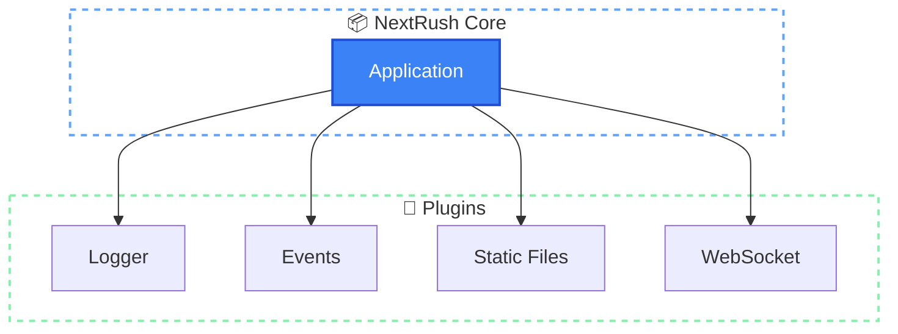
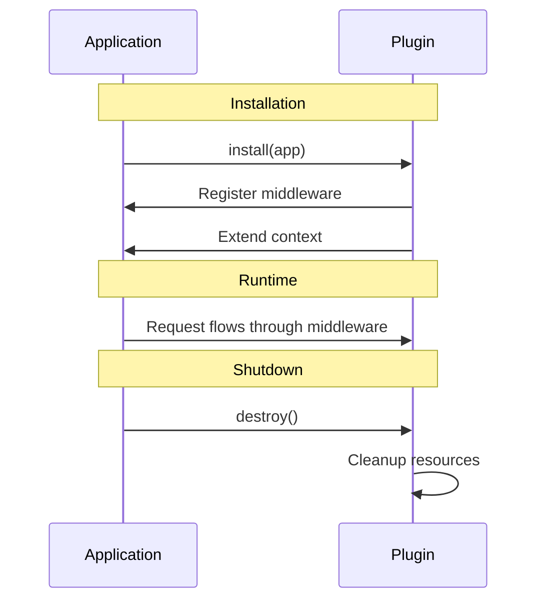

# Plugins

> Plugins are the extension mechanism for NextRush. Add features without modifying core.

## The Problem

Frameworks face a dilemma:
- **Include everything**: Bloated core, unused code, slow cold starts
- **Include nothing**: Every project reinvents common patterns

Neither approach serves developers well.

## How NextRush Approaches This

NextRush uses a **plugin system** that keeps the core minimal while enabling powerful extensions:

1. **Core stays small** — Only middleware composition and plugin management
2. **Plugins add features** — Logging, events, static files, WebSocket
3. **Typed contracts** — Plugins implement a defined interface
4. **Lifecycle hooks** — Plugins can hook into request/response/error cycles



## Mental Model

Think of plugins like **USB devices** for your computer:

- The computer (core) provides ports (plugin interface)
- Devices (plugins) add capabilities (keyboard, mouse, storage)
- Each device declares what it needs (install)
- Unplugging triggers cleanup (destroy)

The core doesn't know about specific plugins. Plugins don't modify core internals.

## Plugin Interface

Every plugin implements this interface:

```typescript
interface Plugin {
  // Required: Unique identifier
  readonly name: string;

  // Optional: Semantic version
  readonly version?: string;

  // Required: Called when app.plugin() is invoked
  install(app: ApplicationLike): void | Promise<void>;

  // Optional: Called during app.close()
  destroy?(): void | Promise<void>;
}
```

## Creating a Plugin

### Basic Plugin

```typescript
import type { Plugin, ApplicationLike } from '@nextrush/types';

const timerPlugin: Plugin = {
  name: 'timer',
  version: '1.0.0',

  install(app: ApplicationLike) {
    app.use(async (ctx, next) => {
      const start = Date.now();
      await next();
      ctx.set('X-Response-Time', `${Date.now() - start}ms`);
    });
  },
};

// Usage
app.plugin(timerPlugin);
```

### Plugin Factory (Recommended)

Create configurable plugins with a factory function:

```typescript
interface LoggerOptions {
  level: 'debug' | 'info' | 'warn' | 'error';
  prefix?: string;
}

function loggerPlugin(options: LoggerOptions): Plugin {
  return {
    name: 'logger',
    version: '1.0.0',

    install(app) {
      const log = (level: string, message: string) => {
        if (shouldLog(level, options.level)) {
          console.log(`${options.prefix || ''} [${level}] ${message}`);
        }
      };

      app.use(async (ctx, next) => {
        log('info', `→ ${ctx.method} ${ctx.path}`);
        await next();
        log('info', `← ${ctx.status}`);
      });
    },
  };
}

// Usage
app.plugin(loggerPlugin({ level: 'info', prefix: '[API]' }));
```

### Plugin with Cleanup

```typescript
function databasePlugin(connectionString: string): Plugin {
  let connection: DatabaseConnection | null = null;

  return {
    name: 'database',
    version: '1.0.0',

    async install(app) {
      // Connect on startup
      connection = await connect(connectionString);

      // Make available via middleware
      app.use(async (ctx, next) => {
        ctx.state.db = connection;
        await next();
      });
    },

    async destroy() {
      // Clean up on shutdown
      if (connection) {
        await connection.close();
        connection = null;
      }
    },
  };
}
```

## Using Plugins

### Synchronous Plugins

```typescript
import { createApp } from '@nextrush/core';

const app = createApp();

// Install plugin
app.plugin(loggerPlugin({ level: 'info' }));
app.plugin(eventsPlugin());

// Chainable
app.plugin(plugin1)
   .plugin(plugin2)
   .plugin(plugin3);
```

### Asynchronous Plugins

Plugins with async `install()` must use `pluginAsync()`:

```typescript
// ✅ Correct: await async plugins
await app.pluginAsync(databasePlugin('postgres://...'));
await app.pluginAsync(cachePlugin('redis://...'));

// ❌ Wrong: throws error
app.plugin(databasePlugin('postgres://...'));
// Error: Plugin "database" has async install(). Use app.pluginAsync() instead.
```

### Checking Plugin Status

```typescript
// Check if installed
if (app.hasPlugin('logger')) {
  console.log('Logger is active');
}

// Get plugin instance
const logger = app.getPlugin<LoggerPlugin>('logger');
if (logger) {
  // Access plugin methods/properties
}
```

## Plugin Lifecycle



### Installation Phase

When `app.plugin()` or `app.pluginAsync()` is called:

1. Check if plugin name is already registered (throws if duplicate)
2. Call `plugin.install(app)`
3. Store plugin in registry

### Runtime Phase

Middleware registered by plugins executes with every request.

### Shutdown Phase

When `app.close()` is called:

1. Set `isRunning = false`
2. Call `destroy()` on each plugin in **reverse order**
3. Clear plugin registry

Reverse order ensures dependent plugins are destroyed before their dependencies.

## Advanced Plugins

### Plugin with Lifecycle Hooks

For deeper integration, implement `PluginWithHooks`:

```typescript
interface PluginWithHooks extends Plugin {
  onRequest?(ctx: Context): void | Promise<void>;
  onResponse?(ctx: Context): void | Promise<void>;
  onError?(error: Error, ctx: Context): void | Promise<void>;
  extendContext?(ctx: Context): void;
}
```

```typescript
const metricsPlugin: PluginWithHooks = {
  name: 'metrics',

  install(app) {
    // Register middleware or setup
  },

  onRequest(ctx) {
    ctx.state.requestStart = Date.now();
  },

  onResponse(ctx) {
    const duration = Date.now() - ctx.state.requestStart;
    recordMetric('http_request_duration', duration, {
      method: ctx.method,
      path: ctx.path,
      status: ctx.status,
    });
  },

  onError(error, ctx) {
    recordMetric('http_errors', 1, {
      method: ctx.method,
      path: ctx.path,
      error: error.name,
    });
  },
};
```

### Plugin Dependencies

Check for required plugins:

```typescript
function authPlugin(): Plugin {
  return {
    name: 'auth',

    install(app) {
      // Require session plugin
      if (!app.getPlugin('session')) {
        throw new Error('auth plugin requires session plugin');
      }

      app.use(async (ctx, next) => {
        // Use session from dependency
        const session = ctx.state.session;
        // ... auth logic
        await next();
      });
    },
  };
}

// Usage: install dependencies first
app.plugin(sessionPlugin());
app.plugin(authPlugin()); // Now works
```

### Context Extension

Plugins can add properties to context:

```typescript
function requestIdPlugin(): Plugin {
  return {
    name: 'request-id',

    install(app) {
      app.use(async (ctx, next) => {
        const id = ctx.get('X-Request-Id') || crypto.randomUUID();
        ctx.state.requestId = id;
        ctx.set('X-Request-Id', id);
        await next();
      });
    },
  };
}

// Access in handlers
app.get('/test', (ctx) => {
  ctx.json({ requestId: ctx.state.requestId });
});
```

## Common Patterns

### Environment-Based Configuration

```typescript
const loggingPlugin = (env: string): Plugin => ({
  name: 'logging',

  install(app) {
    if (env === 'production') {
      app.use(productionLogger);
    } else {
      app.use(developmentLogger);
    }
  },
});

app.plugin(loggingPlugin(process.env.NODE_ENV || 'development'));
```

### Plugin Composition

Combine multiple plugins into one:

```typescript
function securityBundle(): Plugin {
  return {
    name: 'security-bundle',

    install(app) {
      // Install sub-plugins
      app.plugin(helmetPlugin());
      app.plugin(corsPlugin());
      app.plugin(rateLimitPlugin());
    },
  };
}

// One call installs all security middleware
app.plugin(securityBundle());
```

### State Initialization

```typescript
function cachePlugin(): Plugin {
  const cache = new Map<string, unknown>();

  return {
    name: 'cache',

    install(app) {
      app.use(async (ctx, next) => {
        ctx.state.cache = {
          get: (key: string) => cache.get(key),
          set: (key: string, value: unknown) => cache.set(key, value),
          delete: (key: string) => cache.delete(key),
        };
        await next();
      });
    },

    destroy() {
      cache.clear();
    },
  };
}
```

## Official Plugins

NextRush provides official plugins for common use cases:

| Plugin | Package | Description |
|--------|---------|-------------|
| Logger | `@nextrush/logger` | Structured request logging |
| Events | `@nextrush/events` | Event emitter for app events |
| Static | `@nextrush/static` | Serve static files |
| WebSocket | `@nextrush/websocket` | WebSocket support |
| Controllers | `@nextrush/controllers` | Decorator-based controllers |

## Common Mistakes

### Duplicate Plugin Names

```typescript
// ❌ Throws error
app.plugin(loggerPlugin());
app.plugin(loggerPlugin()); // Error: Plugin "logger" is already installed

// ✅ Each plugin needs unique name
app.plugin(loggerPlugin());
```

### Sync Method for Async Plugin

```typescript
// ❌ Throws error
app.plugin(databasePlugin()); // If install() returns Promise

// ✅ Use pluginAsync
await app.pluginAsync(databasePlugin());
```

### Missing Cleanup

```typescript
// ❌ Resource leak
const plugin: Plugin = {
  name: 'bad',
  install(app) {
    const interval = setInterval(poll, 1000);
    // Never cleaned up!
  },
};

// ✅ Clean up in destroy
const plugin: Plugin = {
  name: 'good',
  intervalId: null as NodeJS.Timeout | null,

  install(app) {
    this.intervalId = setInterval(poll, 1000);
  },

  destroy() {
    if (this.intervalId) {
      clearInterval(this.intervalId);
    }
  },
};
```

### Wrong Dependency Order

```typescript
// ❌ Auth needs session, but session not installed yet
app.plugin(authPlugin());
app.plugin(sessionPlugin());

// ✅ Install dependencies first
app.plugin(sessionPlugin());
app.plugin(authPlugin());
```

## TypeScript Types

```typescript
import type {
  Plugin,
  PluginWithHooks,
  PluginFactory,
  PluginMeta,
  ApplicationLike,
} from '@nextrush/types';

// Type-safe plugin factory
type MyPluginOptions = {
  enabled: boolean;
  threshold: number;
};

const createMyPlugin: PluginFactory<MyPluginOptions> = (options) => ({
  name: 'my-plugin',
  install(app) {
    if (options?.enabled) {
      // ...
    }
  },
});

// Plugin metadata
const meta: PluginMeta = {
  name: 'my-plugin',
  version: '1.0.0',
  description: 'Does something useful',
  author: 'Your Name',
  repository: 'https://github.com/...',
  dependencies: ['session'], // Other required plugins
};
```

## See Also

- [Application](/concepts/application) — Plugin registration methods
- [Middleware](/concepts/middleware) — How plugins add middleware
- [Context](/concepts/context) — Extending context with plugins
- [@nextrush/logger](/plugins/logger) — Official logger plugin
- [@nextrush/events](/plugins/events) — Official events plugin
