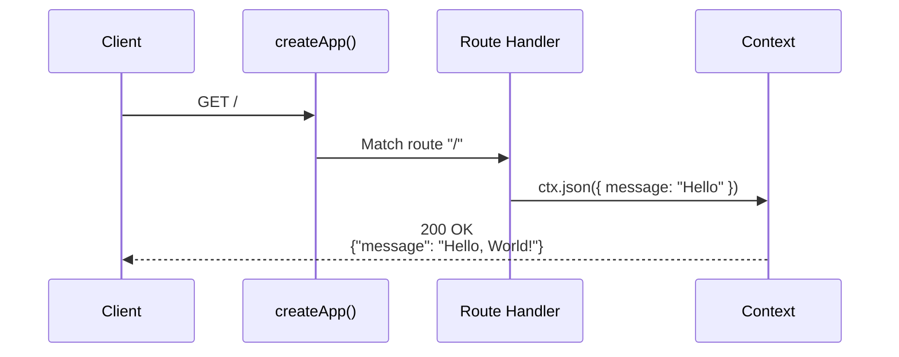

# Hello World

> The simplest NextRush application — running in 30 seconds.

## The Code

```typescript
// src/index.ts
import { createApp } from '@nextrush/core';

const app = createApp();

app.get('/', (ctx) => {
  ctx.json({ message: 'Hello, World!' });
});

app.listen(3000, () => {
  console.log('Server running on http://localhost:3000');
});
```

**That's it.** No configuration, no boilerplate, just code.

## Step-by-Step

### 1. Create Project

```bash
mkdir hello-world && cd hello-world
pnpm init -y
```

### 2. Install NextRush

```bash
pnpm add @nextrush/core @nextrush/dev
```

### 3. Create the Server

```typescript
// src/index.ts
import { createApp } from '@nextrush/core';

// Create the application
const app = createApp();

// Define a route
app.get('/', (ctx) => {
  ctx.json({ message: 'Hello, World!' });
});

// Start the server
app.listen(3000, () => {
  console.log('Server running on http://localhost:3000');
});
```

### 4. Run It

```bash
npx nextrush dev
```

### 5. Test It

```bash
curl http://localhost:3000
# {"message":"Hello, World!"}
```

## What's Happening?



### Line by Line

```typescript
import { createApp } from '@nextrush/core';
```
Import the application factory.

```typescript
const app = createApp();
```
Create a new NextRush application instance.

```typescript
app.get('/', (ctx) => {
  ctx.json({ message: 'Hello, World!' });
});
```
Register a GET route at `/`. The handler receives a `ctx` (context) object with request data and response methods.

```typescript
app.listen(3000, () => {
  console.log('Server running on http://localhost:3000');
});
```
Start the HTTP server on port 3000.

## Adding More Routes

```typescript
import { createApp } from '@nextrush/core';

const app = createApp();

// Root route
app.get('/', (ctx) => {
  ctx.json({ message: 'Hello, World!' });
});

// Health check
app.get('/health', (ctx) => {
  ctx.json({ status: 'healthy', timestamp: new Date().toISOString() });
});

// Echo route with path parameter
app.get('/echo/:message', (ctx) => {
  ctx.json({ echo: ctx.params.message });
});

// POST route
app.post('/greet', (ctx) => {
  const { name } = ctx.body as { name: string };
  ctx.json({ greeting: `Hello, ${name}!` });
});

app.listen(3000);
```

Test the routes:

```bash
# Root
curl http://localhost:3000
# {"message":"Hello, World!"}

# Health
curl http://localhost:3000/health
# {"status":"healthy","timestamp":"2025-01-01T00:00:00.000Z"}

# Echo
curl http://localhost:3000/echo/test
# {"echo":"test"}

# POST with body (requires body-parser middleware for production)
curl -X POST http://localhost:3000/greet \
  -H "Content-Type: application/json" \
  -d '{"name":"Alice"}'
# {"greeting":"Hello, Alice!"}
```

## Adding Middleware

```typescript
import { createApp } from '@nextrush/core';
import { json } from '@nextrush/body-parser';
import { cors } from '@nextrush/cors';

const app = createApp();

// Add middleware
app.use(cors());                    // Enable CORS
app.use(json());                    // Parse JSON bodies

// Request logging
app.use(async (ctx, next) => {
  const start = Date.now();
  await next();
  console.log(`${ctx.method} ${ctx.path} - ${Date.now() - start}ms`);
});

// Routes
app.get('/', (ctx) => {
  ctx.json({ message: 'Hello, World!' });
});

app.post('/echo', (ctx) => {
  ctx.json({ received: ctx.body });
});

app.listen(3000);
```

## TypeScript Configuration

For the best experience, use this `tsconfig.json`:

```json
{
  "compilerOptions": {
    "target": "ES2022",
    "module": "ESNext",
    "moduleResolution": "bundler",
    "strict": true,
    "esModuleInterop": true,
    "skipLibCheck": true,
    "outDir": "dist",
    "rootDir": "src"
  },
  "include": ["src/**/*"]
}
```

## Package.json Scripts

```json
{
  "name": "hello-world",
  "type": "module",
  "scripts": {
    "dev": "nextrush dev",
    "build": "nextrush build",
    "start": "node dist/index.js"
  },
  "dependencies": {
    "@nextrush/core": "^3.0.0"
  },
  "devDependencies": {
    "@nextrush/dev": "^3.0.0",
    "typescript": "^5.0.0"
  }
}
```

## Complete Example

<details>
<summary>Full project structure</summary>

```
hello-world/
├── package.json
├── tsconfig.json
└── src/
    └── index.ts
```

**package.json**
```json
{
  "name": "hello-world",
  "version": "1.0.0",
  "type": "module",
  "scripts": {
    "dev": "nextrush dev",
    "build": "nextrush build",
    "start": "node dist/index.js"
  },
  "dependencies": {
    "@nextrush/core": "^3.0.0",
    "@nextrush/body-parser": "^3.0.0",
    "@nextrush/cors": "^3.0.0"
  },
  "devDependencies": {
    "@nextrush/dev": "^3.0.0",
    "typescript": "^5.0.0"
  }
}
```

**tsconfig.json**
```json
{
  "compilerOptions": {
    "target": "ES2022",
    "module": "ESNext",
    "moduleResolution": "bundler",
    "strict": true,
    "esModuleInterop": true,
    "skipLibCheck": true,
    "outDir": "dist",
    "rootDir": "src"
  },
  "include": ["src/**/*"]
}
```

**src/index.ts**
```typescript
import { createApp } from '@nextrush/core';
import { json } from '@nextrush/body-parser';
import { cors } from '@nextrush/cors';

const app = createApp();

// Middleware
app.use(cors());
app.use(json());

// Logging middleware
app.use(async (ctx, next) => {
  const start = Date.now();
  await next();
  const ms = Date.now() - start;
  console.log(`${ctx.method} ${ctx.path} ${ctx.status} - ${ms}ms`);
});

// Routes
app.get('/', (ctx) => {
  ctx.json({ message: 'Hello, World!' });
});

app.get('/health', (ctx) => {
  ctx.json({
    status: 'healthy',
    uptime: process.uptime(),
    timestamp: new Date().toISOString(),
  });
});

app.post('/echo', (ctx) => {
  ctx.json({ received: ctx.body });
});

// Start server
const port = Number(process.env.PORT) || 3000;
app.listen(port, () => {
  console.log(`Server running on http://localhost:${port}`);
});
```

</details>

## Next Steps

Now that you have a running server:

- **[REST CRUD Example](/examples/rest-crud)** — Build a complete CRUD API
- **[Class-Based Example](/examples/class-based-api)** — Use controllers and DI
- **[Context Guide](/concepts/context)** — Learn all ctx methods
- **[Middleware Guide](/concepts/middleware)** — Understand the middleware flow
