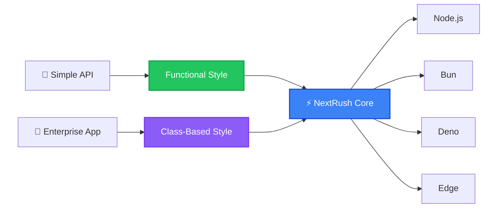
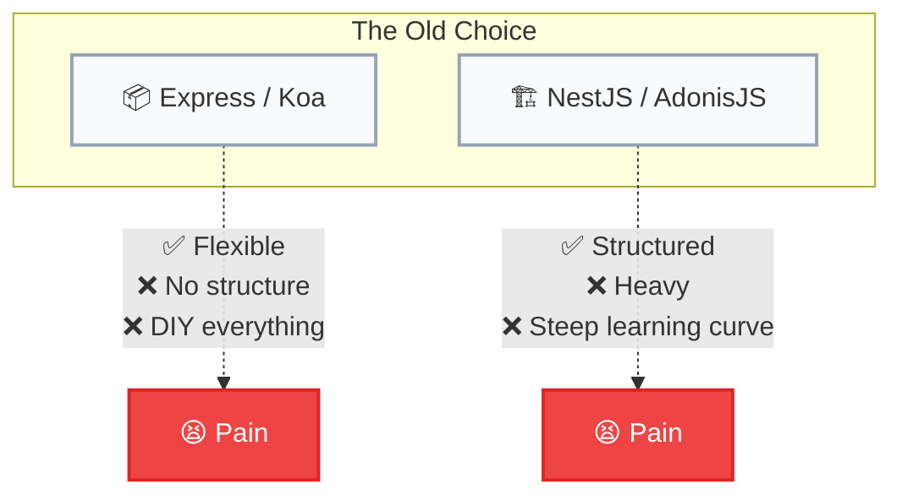
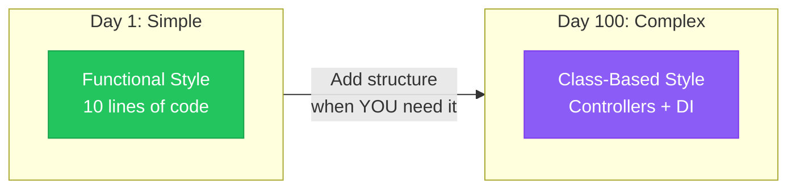
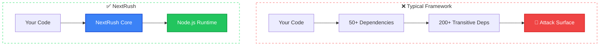
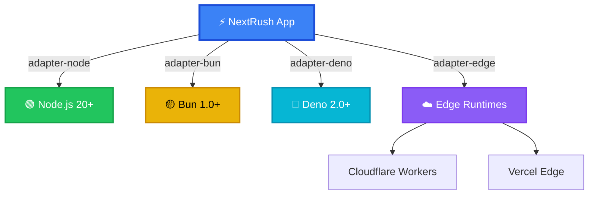
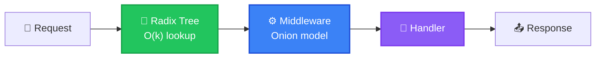
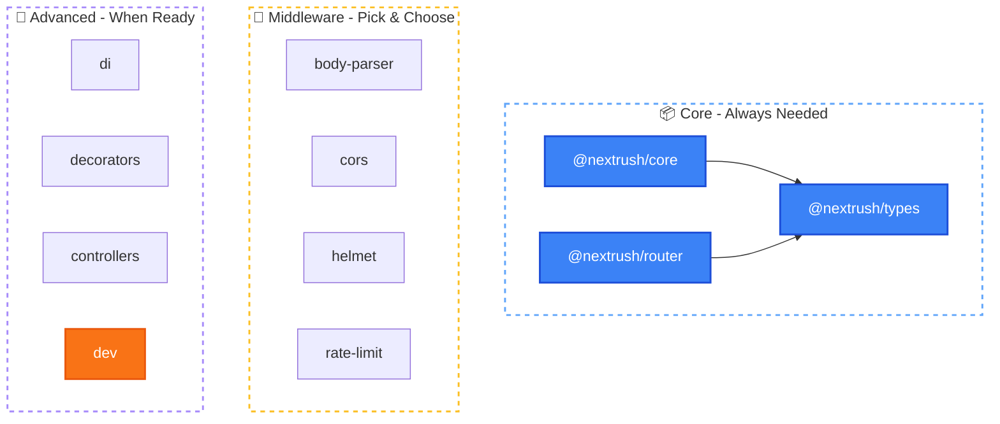

# Introduction

> The zero-dependency backend framework that runs everywhere.

## What is NextRush?

NextRush is a **modern backend framework** for JavaScript and TypeScript that gives you the best of both worlds: **the simplicity of Express** with **the structure of NestJS** — without forcing you to choose.



**Core principles:**

| Principle | What It Means |
|-----------|--------------|
| **Zero Dependencies** | Core has NO external runtime deps — no supply chain risks |
| **Multi-Runtime** | Same code runs on Node.js, Bun, Deno, and Edge |
| **Dual Paradigm** | Use functions OR classes — migrate when ready |
| **Type Safety** | Full TypeScript with zero `any` types |
| **Modular** | Install only what you need |

## The Problem With Existing Frameworks

Backend frameworks force you into a false choice:



**Minimal but limited.** Express and Koa give you flexibility but no structure. You end up reinventing authentication, validation, and dependency injection for every project.

**Structured but heavy.** NestJS and AdonisJS provide structure but force you into patterns. Their learning curves are steep, and you pay for features you don't use.

## How NextRush is Different

NextRush gives you **both options** in a single framework — and you can migrate between them progressively:



### Start Simple (Functional)

For small services, APIs, and developers who prefer functions:

```typescript
import { createApp } from '@nextrush/core';
import { createRouter } from '@nextrush/router';
import { serve } from '@nextrush/adapter-node';

const app = createApp();
const router = createRouter();

router.get('/hello', (ctx) => {
  ctx.json({ message: 'Hello, World!' });
});

app.use(router.routes());
serve(app, { port: 3000 });
```

**That's it.** No configuration. No boilerplate. Just a working API.

### Scale with Structure (Class-Based)

For larger applications, teams, and developers who prefer structure:

```typescript
// src/controllers/hello.controller.ts
import { Controller, Get, Service } from '@nextrush/decorators';

@Service()
class GreetingService {
  getGreeting() {
    return 'Hello, World!';
  }
}

@Controller('/hello')
export class HelloController {
  constructor(private greetingService: GreetingService) {}

  @Get()
  sayHello() {
    return { message: this.greetingService.getGreeting() };
  }
}
```

```typescript
// src/index.ts
import 'reflect-metadata';
import { createApp } from '@nextrush/core';
import { serve } from '@nextrush/adapter-node';
import { controllersPlugin } from '@nextrush/controllers';
import { HelloController } from './controllers/hello.controller';

const app = createApp();

app.plugin(controllersPlugin({
  controllers: [HelloController],
}));

serve(app, { port: 3000 });
```

**Same framework. Same performance. Your choice.**

## Why Zero Dependencies?

The core framework (`@nextrush/core`, `@nextrush/router`, `@nextrush/types`) has **zero external runtime dependencies**.



| Benefit | Why It Matters |
|---------|----------------|
| **No supply chain attacks** | Nothing to compromise except your own code |
| **No version conflicts** | Works with any project, any Node.js 20+ |
| **Minimal attack surface** | Only your code and the runtime |
| **Fast installs** | No dependency tree to resolve |
| **Full auditability** | You can read and understand every line |

## Runtime Compatibility

Write once, run anywhere:



| Runtime | Version | Adapter |
|---------|---------|---------|
| Node.js | 20+ | `@nextrush/adapter-node` |
| Bun | 1.0+ | `@nextrush/adapter-bun` |
| Deno | 2.0+ | `@nextrush/adapter-deno` |
| Cloudflare Workers | Latest | `@nextrush/adapter-edge` |
| Vercel Edge | Latest | `@nextrush/adapter-edge` |

## Performance

NextRush is built on architectural decisions that prioritize speed:



| vs Framework | Performance |
|--------------|-------------|
| Express | **52% faster** |
| Koa | **5% faster** |
| Hono | Competitive |

*Benchmarks vary by hardware. Run your own tests.*

### Why It's Fast

1. **Radix tree routing** — O(k) lookup where k = path length, not route count
2. **Async middleware composition** — Koa-style onion model
3. **Zero dependencies** — No unused code paths
4. **Modern JavaScript** — ES2022+ features, no polyfills

## Modular Architecture

Every feature is a separate package. Install only what you need:



| Need | Install |
|------|---------|
| Routing | `@nextrush/router` |
| Body parsing | `@nextrush/body-parser` |
| CORS | `@nextrush/cors` |
| Security headers | `@nextrush/helmet` |
| Controllers + DI | `@nextrush/controllers` |
| Rate limiting | `@nextrush/rate-limit` |

Or use the `nextrush` meta package for common essentials:

```bash
pnpm add nextrush
```

## When to Use NextRush

::: tip Use NextRush when:
- Building REST APIs or microservices
- You want TypeScript-first development
- You need multi-runtime support (Node.js, Bun, Deno, Edge)
- You want to start simple and add structure later
- You care about supply chain security
:::

::: warning Consider alternatives when:
- You need a full-stack framework with SSR (use Next.js, Remix)
- You're building a monolithic MVC app (use AdonisJS)
- You need maximum raw speed above all else (use Fastify)
:::

## Next Steps

Ready to build something?

<div class="vp-card-grid">

- **[Quick Start →](/getting-started/quick-start)**

  Your first app in 5 minutes

- **[Installation →](/getting-started/installation)**

  Detailed setup guide for all runtimes

- **[Package Overview →](/packages/)**

  Explore all available packages

</div>
