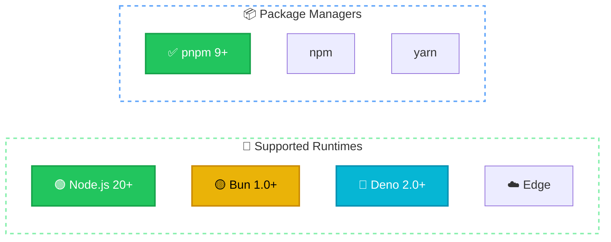
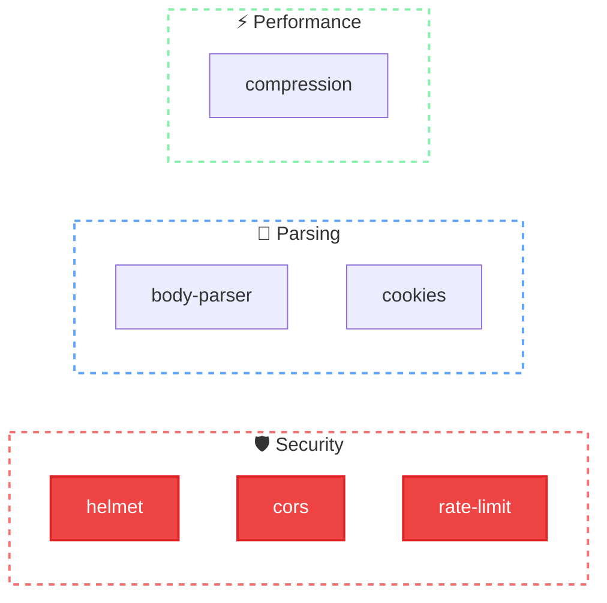

# Installation

This guide covers installation for all supported runtimes and development setups.

## Requirements



| Runtime | Minimum Version | Status |
|---------|-----------------|--------|
| Node.js | 20.0.0+ | ✅ Full Support |
| Bun | 1.0.0+ | ✅ Full Support |
| Deno | 2.0.0+ | ✅ Full Support |
| Cloudflare Workers | Latest | ✅ Full Support |
| Vercel Edge | Latest | ✅ Full Support |

## Package Manager

We recommend **pnpm** for its speed and efficient disk usage:

```bash
npm install -g pnpm
```

## Choose Your Packages

NextRush is modular. Install only what you need:

```mermaid
flowchart TB
    subgraph minimal["🚀 Minimal Setup"]
        M1["@nextrush/core"] --> M2["@nextrush/router"]
        M2 --> M3["@nextrush/adapter-node"]
    end

    subgraph full["🏢 Full Setup"]
        F1["@nextrush/controllers"] --> F2["@nextrush/di"]
        F2 --> F3["@nextrush/decorators"]
        F3 --> F4["@nextrush/adapter-node"]
        F4 -.-> DEV["@nextrush/dev"]
    end

    subgraph meta["📦 Meta Package"]
        MP["nextrush\nAll-in-one"]
    end

    style M1 fill:#22c55e,stroke:#16a34a,color:#fff,stroke-width:2px
    style F1 fill:#8b5cf6,stroke:#7c3aed,color:#fff,stroke-width:2px
    style MP fill:#3b82f6,stroke:#1d4ed8,color:#fff,stroke-width:2px
    style DEV fill:#f97316,stroke:#ea580c,color:#fff,stroke-width:2px
    style minimal fill:transparent,stroke:#86efac,stroke-width:2px,stroke-dasharray:5 5
    style full fill:transparent,stroke:#a78bfa,stroke-width:2px,stroke-dasharray:5 5
    style meta fill:transparent,stroke:#60a5fa,stroke-width:2px,stroke-dasharray:5 5
```



### Minimal Setup (Functional)

For simple APIs and microservices:

```bash
pnpm add @nextrush/core @nextrush/router @nextrush/adapter-node
```

### Full Setup (Class-Based)

For larger applications with dependency injection:

```bash
pnpm add @nextrush/core @nextrush/router @nextrush/adapter-node \
         @nextrush/di @nextrush/decorators @nextrush/controllers \
         reflect-metadata

# Required for development (emits decorator metadata)
pnpm add -D @nextrush/dev
```

::: warning Why @nextrush/dev?
Most bundlers (tsx, esbuild, tsup) **strip decorator metadata**, breaking dependency injection.

`@nextrush/dev` uses SWC to properly emit `emitDecoratorMetadata`, ensuring DI works correctly!
:::

### Meta Package

For convenience, the `nextrush` meta-package includes common packages:

```bash
pnpm add nextrush
```

This includes:
- `@nextrush/core` — Application and middleware
- `@nextrush/router` — Routing
- `@nextrush/types` — TypeScript types
- `@nextrush/errors` — HTTP error classes

---

## TypeScript Configuration

### Functional Style

```json
{
  "compilerOptions": {
    "target": "ES2022",
    "module": "NodeNext",
    "moduleResolution": "NodeNext",
    "strict": true,
    "esModuleInterop": true,
    "skipLibCheck": true,
    "outDir": "dist"
  },
  "include": ["src"]
}
```

### Class-Based Style

Requires decorator support:

```json
{
  "compilerOptions": {
    "target": "ES2022",
    "module": "NodeNext",
    "moduleResolution": "NodeNext",
    "strict": true,
    "esModuleInterop": true,
    "skipLibCheck": true,
    "experimentalDecorators": true,
    "emitDecoratorMetadata": true,
    "outDir": "dist"
  },
  "include": ["src"]
}
```

::: warning Important for Controllers
The class-based style requires `reflect-metadata` to be imported **before** any other NextRush imports:

```typescript
import 'reflect-metadata';  // Must be first!
import { Controller, Get } from '@nextrush/decorators';
```
:::

---

## Runtime-Specific Setup

### Node.js

The most common setup for production servers:

```bash
pnpm add @nextrush/adapter-node
```

```typescript
import { createApp } from '@nextrush/core';
import { createRouter } from '@nextrush/router';
import { serve } from '@nextrush/adapter-node';

const app = createApp();
const router = createRouter();

router.get('/', (ctx) => ctx.json({ hello: 'world' }));

app.use(router.routes());

serve(app, {
  port: 3000,
  onListen: ({ port }) => console.log(`Server on port ${port}`),
});
```

### Bun

Native Bun performance with full API compatibility:

```bash
pnpm add @nextrush/adapter-bun
```

```typescript
import { createApp } from '@nextrush/core';
import { createRouter } from '@nextrush/router';
import { serve } from '@nextrush/adapter-bun';

const app = createApp();
const router = createRouter();

router.get('/', (ctx) => ctx.json({ hello: 'world' }));

app.use(router.routes());

serve(app, { port: 3000 });
```

### Deno

Use npm specifiers for Deno compatibility:

```typescript
// Import from npm specifier
import { createApp } from 'npm:@nextrush/core';
import { createRouter } from 'npm:@nextrush/router';
import { serve } from 'npm:@nextrush/adapter-deno';

const app = createApp();
const router = createRouter();

router.get('/', (ctx) => ctx.json({ hello: 'world' }));

app.use(router.routes());

serve(app, { port: 3000 });
```

### Cloudflare Workers

```bash
pnpm add @nextrush/adapter-edge
```

```typescript
import { createApp } from '@nextrush/core';
import { createRouter } from '@nextrush/router';
import { createHandler } from '@nextrush/adapter-edge';

const app = createApp();
const router = createRouter();

router.get('/', (ctx) => ctx.json({ hello: 'world' }));

app.use(router.routes());

export default {
  fetch: createHandler(app)
};
```

### Vercel Edge Functions

```typescript
import { createApp } from '@nextrush/core';
import { createRouter } from '@nextrush/router';
import { createHandler } from '@nextrush/adapter-edge';

const app = createApp();
const router = createRouter();

router.get('/', (ctx) => ctx.json({ hello: 'world' }));

app.use(router.routes());

export const config = { runtime: 'edge' };
export default createHandler(app);
```

---

## Common Middleware

Install these separately as needed:



```bash
# Body parsing (JSON, URL-encoded)
pnpm add @nextrush/body-parser

# CORS headers
pnpm add @nextrush/cors

# Security headers
pnpm add @nextrush/helmet

# Rate limiting
pnpm add @nextrush/rate-limit

# Request compression
pnpm add @nextrush/compression

# Cookie handling
pnpm add @nextrush/cookies
```

---

## Development Tools

### @nextrush/dev

The development CLI provides file watching, auto-reload, and **proper decorator metadata emission**:

```bash
pnpm add -D @nextrush/dev
```

```bash
# Development with watch mode (auto-detects entry file)
npx nextrush dev

# Specify entry file
npx nextrush dev src/index.ts

# Build for production (with decorator metadata)
npx nextrush build
```

### package.json Scripts

After installing `@nextrush/dev`, add these scripts to your `package.json`:

::: code-group

```json [Functional Style]
{
  "name": "my-api",
  "type": "module",
  "scripts": {
    "dev": "tsx watch src/index.ts",
    "build": "tsc",
    "start": "node dist/index.js"
  },
  "dependencies": {
    "@nextrush/core": "^3.0.0",
    "@nextrush/router": "^3.0.0",
    "@nextrush/adapter-node": "^3.0.0"
  },
  "devDependencies": {
    "typescript": "^5.0.0",
    "@types/node": "^20.0.0",
    "tsx": "^4.0.0"
  }
}
```

```json [Class-Based Style]
{
  "name": "my-api",
  "type": "module",
  "scripts": {
    "dev": "nextrush dev",
    "build": "nextrush build",
    "start": "node dist/index.js"
  },
  "dependencies": {
    "@nextrush/core": "^3.0.0",
    "@nextrush/router": "^3.0.0",
    "@nextrush/adapter-node": "^3.0.0",
    "@nextrush/di": "^3.0.0",
    "@nextrush/decorators": "^3.0.0",
    "@nextrush/controllers": "^3.0.0",
    "reflect-metadata": "^0.2.0"
  },
  "devDependencies": {
    "typescript": "^5.0.0",
    "@types/node": "^20.0.0",
    "@nextrush/dev": "^3.0.0"
  }
}
```

:::

**Script Reference:**

| Script | Functional | Class-Based | Description |
|--------|-----------|-------------|-------------|
| `dev` | `tsx watch src/index.ts` | `nextrush dev` | Development with hot reload |
| `build` | `tsc` | `nextrush build` | Compile for production |
| `start` | `node dist/index.js` | `node dist/index.js` | Run production build |

::: tip When to use @nextrush/dev
| Style | Development | Build |
|-------|-------------|-------|
| **Functional** | `npx tsx src/index.ts` | `tsc` or `tsup` |
| **Class-Based** | `npx nextrush dev` ✅ | `npx nextrush build` ✅ |

For class-based apps with DI, always use `@nextrush/dev` to preserve decorator metadata.
:::

### VSCode Configuration

Recommended settings for NextRush development:

```json
// .vscode/settings.json
{
  "typescript.preferences.importModuleSpecifier": "non-relative",
  "editor.formatOnSave": true,
  "editor.codeActionsOnSave": {
    "source.organizeImports": "explicit"
  }
}
```

---

## Project Structure

### Functional Style

```
my-api/
├── src/
│   ├── index.ts        # Entry point
│   ├── routes/
│   │   ├── users.ts    # User routes
│   │   └── posts.ts    # Post routes
│   └── middleware/
│       └── auth.ts     # Auth middleware
├── package.json
└── tsconfig.json
```

### Class-Based Style

```
my-api/
├── src/
│   ├── index.ts              # Entry point
│   ├── controllers/
│   │   ├── user.controller.ts
│   │   └── post.controller.ts
│   ├── services/
│   │   ├── user.service.ts
│   │   └── post.service.ts
│   └── guards/
│       └── auth.guard.ts
├── package.json
└── tsconfig.json
```

---

## Verifying Installation

Create a test file to verify everything works:

```typescript
// src/test.ts
import { createApp } from '@nextrush/core';
import { createRouter } from '@nextrush/router';
import { serve } from '@nextrush/adapter-node';

const app = createApp();
const router = createRouter();

router.get('/', (ctx) => {
  ctx.json({
    message: 'NextRush is working!',
    version: '3.0.0',
    node: process.version,
    runtime: ctx.runtime,
  });
});

app.use(router.routes());

serve(app, {
  port: 3000,
  onListen: () => {
    console.log('✅ NextRush installed correctly!');
    console.log('🚀 Server running on http://localhost:3000');
  },
});
```

Run it:

```bash
npx tsx src/test.ts
```

Expected output:

```bash
✅ NextRush installed correctly!
🚀 Server running on http://localhost:3000
```

```bash
curl http://localhost:3000
# {"message":"NextRush is working!","version":"3.0.0","node":"v20.x.x","runtime":"node"}
```

---

## Troubleshooting

### "TypeInfo not known for [ClassName]"

This error means decorator metadata is not being emitted. Solutions:

1. **Use `@nextrush/dev` instead of `tsx`:**
   ```bash
   # ❌ Wrong (strips metadata)
   npx tsx src/index.ts

   # ✅ Correct (emits metadata)
   npx nextrush dev
   ```

2. **Make sure `reflect-metadata` is imported first:**
   ```typescript
   import 'reflect-metadata';  // Must be first!
   import { Controller } from '@nextrush/decorators';
   ```

### "Cannot find module '@nextrush/...'"

Make sure you've installed the package:

```bash
pnpm add @nextrush/core
```

### "Decorators are not enabled"

Add to your `tsconfig.json`:

```json
{
  "compilerOptions": {
    "experimentalDecorators": true,
    "emitDecoratorMetadata": true
  }
}
```

### "reflect-metadata must be imported"

Import at the top of your entry file:

```typescript
import 'reflect-metadata';  // Must be first!
// Then other imports...
```

### Type errors with ctx

Make sure you have the types package:

```bash
pnpm add @nextrush/types
```

---

## Next Steps

<div class="vp-card-grid">

- **[Quick Start →](/getting-started/quick-start)**

  Build your first app in 5 minutes

- **[Context API →](/concepts/context)**

  Understand the `ctx` object

- **[Packages Overview →](/packages/)**

  All available packages

</div>
