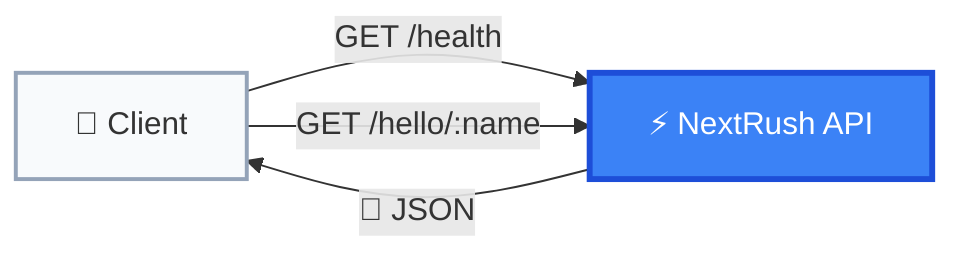
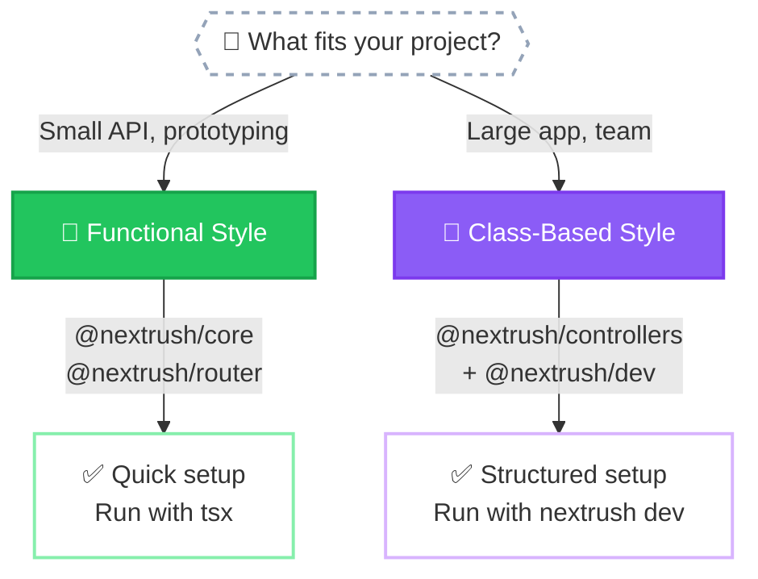
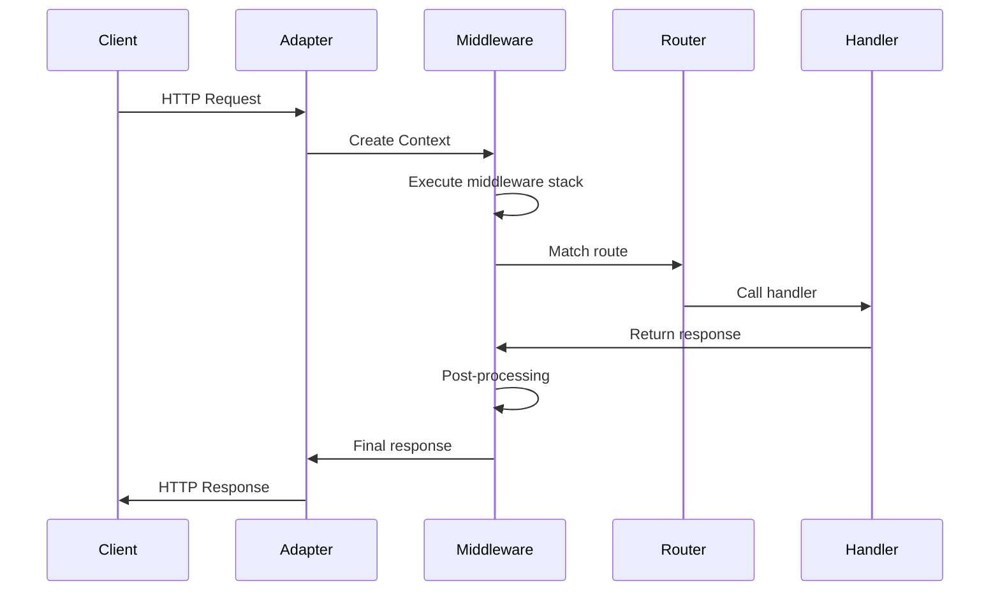
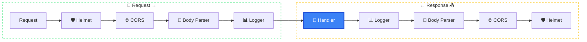

# Quick Start

Get a NextRush application running in under 5 minutes.

## What You'll Build

A simple API with two endpoints:



| Endpoint | Response |
|----------|----------|
| `GET /health` | `{ "status": "healthy" }` |
| `GET /hello/Alice` | `{ "message": "Hello, Alice!" }` |

## Prerequisites

- **Node.js 20+** (or Bun 1.0+, Deno 2.0+)
- **pnpm** (recommended) or npm/yarn

## Choose Your Style

NextRush supports two programming styles. Pick what fits your project:



::: code-group

```bash [Functional (Minimal)]
pnpm add @nextrush/core @nextrush/router @nextrush/adapter-node
```

```bash [Class-Based (Structured)]
pnpm add @nextrush/controllers @nextrush/adapter-node reflect-metadata
```

:::

---

## Functional Style

For small services, APIs, and developers who prefer functions.

### 1. Create Your Project

```bash
mkdir my-api && cd my-api
pnpm init
pnpm add @nextrush/core @nextrush/router @nextrush/adapter-node
pnpm add -D typescript @types/node tsx
```

### 2. Configure TypeScript

Create `tsconfig.json`:

```json
{
  "compilerOptions": {
    "target": "ES2022",
    "module": "NodeNext",
    "moduleResolution": "NodeNext",
    "strict": true,
    "esModuleInterop": true,
    "skipLibCheck": true,
    "outDir": "dist"
  },
  "include": ["src"]
}
```

### 3. Create Your App

Create `src/index.ts`:

```typescript
import { createApp } from '@nextrush/core';
import { createRouter } from '@nextrush/router';
import { serve } from '@nextrush/adapter-node';

// Create application and router
const app = createApp();
const router = createRouter();

// Health check endpoint
router.get('/health', (ctx) => {
  ctx.json({ status: 'healthy' });
});

// Hello endpoint with route parameter
router.get('/hello/:name', (ctx) => {
  const { name } = ctx.params;
  ctx.json({ message: `Hello, ${name}!` });
});

// Mount routes and start server
app.use(router.routes());

serve(app, {
  port: 3000,
  onListen: ({ port }) => {
    console.log(`🚀 Server running on http://localhost:${port}`);
  },
});
```

### 4. Add Scripts to package.json

Update your `package.json` with development and build scripts:

```json
{
  "name": "my-api",
  "type": "module",
  "scripts": {
    "dev": "tsx watch src/index.ts",
    "start": "node dist/index.js",
    "build": "tsc"
  }
}
```

| Script | Command | Description |
|--------|---------|-------------|
| `dev` | `pnpm dev` | Development with hot reload |
| `start` | `pnpm start` | Run compiled production code |
| `build` | `pnpm build` | Compile TypeScript to JavaScript |

### 5. Run It

```bash
# Development (with hot reload)
pnpm dev

# Or run directly
npx tsx src/index.ts
```

### 6. Test It

```bash
curl http://localhost:3000/health
# {"status":"healthy"}

curl http://localhost:3000/hello/World
# {"message":"Hello, World!"}
```

::: tip Success!
You just built your first NextRush API. 🎉
:::

---

## Class-Based Style

For larger applications, teams, and developers who prefer structure.

::: tip Why @nextrush/dev?
Class-based style uses **decorators with dependency injection**. Most bundlers (tsx, esbuild, tsup) **strip decorator metadata**, breaking DI.

**`@nextrush/dev`** properly emits decorator metadata using SWC, ensuring DI works correctly!
:::

### 1. Create Your Project

```bash
mkdir my-api && cd my-api
pnpm init
pnpm add @nextrush/core @nextrush/router @nextrush/adapter-node @nextrush/di @nextrush/decorators @nextrush/controllers reflect-metadata
pnpm add -D @nextrush/dev typescript @types/node
```

### 2. Configure TypeScript

Create `tsconfig.json` with decorator support:

```json
{
  "compilerOptions": {
    "target": "ES2022",
    "module": "NodeNext",
    "moduleResolution": "NodeNext",
    "strict": true,
    "esModuleInterop": true,
    "skipLibCheck": true,
    "experimentalDecorators": true,
    "emitDecoratorMetadata": true,
    "outDir": "dist"
  },
  "include": ["src"]
}
```

### 3. Create Your App

Create `src/index.ts`:

```typescript
import 'reflect-metadata';
import { createApp } from '@nextrush/core';
import { serve } from '@nextrush/adapter-node';
import { Service } from '@nextrush/di';
import { Controller, Get, ParamProp } from '@nextrush/decorators';
import { controllersPlugin } from '@nextrush/controllers';

// Service with business logic (auto-injected)
@Service()
class GreetingService {
  getGreeting(name: string): string {
    return `Hello, ${name}!`;
  }
}

// Controller with routes
@Controller('/')
class AppController {
  constructor(private greeting: GreetingService) {}

  @Get('health')
  health() {
    return { status: 'healthy' };
  }

  @Get('hello/:name')
  hello(@ParamProp('name') name: string) {
    return { message: this.greeting.getGreeting(name) };
  }
}

// Bootstrap application
const app = createApp();

app.plugin(controllersPlugin({
  controllers: [AppController],
}));

serve(app, {
  port: 3000,
  onListen: ({ port }) => {
    console.log(`🚀 Server running on http://localhost:${port}`);
  },
});
```

### 4. Add Scripts to package.json

Update your `package.json` with development and build scripts:

```json
{
  "name": "my-api",
  "type": "module",
  "scripts": {
    "dev": "nextrush dev",
    "build": "nextrush build",
    "start": "node dist/index.js"
  }
}
```

| Script | Command | Description |
|--------|---------|-------------|
| `dev` | `pnpm dev` | Development with hot reload + decorator metadata |
| `build` | `pnpm build` | Production build with decorator metadata |
| `start` | `pnpm start` | Run compiled production code |

::: info Why different scripts?
- **Functional style**: Uses `tsx` (fast, but strips metadata)
- **Class-based style**: Uses `nextrush dev` (preserves decorator metadata for DI)
:::

### 5. Run It

```bash
# Development (with hot reload + decorator metadata)
pnpm dev

# Or run directly
npx nextrush dev

# Or specify entry file
npx nextrush dev src/index.ts
```

::: warning Don't use tsx for class-based style!
`tsx` and `esbuild` strip decorator metadata, breaking dependency injection.

Always use `nextrush dev` for class-based applications.
:::

### 5. Test It

```bash
curl http://localhost:3000/health
# {"status":"healthy"}

curl http://localhost:3000/hello/World
# {"message":"Hello, World!"}
```

::: tip What's Different?
- `@Service()` creates injectable services
- `@Controller()` defines route prefixes
- `@Get()`, `@Post()`, etc. define HTTP methods
- `@ParamProp('name')` extracts route parameters
- Dependencies are automatically injected via constructor
:::

---

## Understanding the Request Flow

Both styles follow the same request flow:



The **Context object** (`ctx`) flows through the entire request:

| Property | Type | Description |
|----------|------|-------------|
| `ctx.method` | `string` | HTTP method (GET, POST, etc.) |
| `ctx.path` | `string` | Request path without query string |
| `ctx.params` | `object` | Route parameters (`:id` → `ctx.params.id`) |
| `ctx.query` | `object` | Query string parameters |
| `ctx.body` | `unknown` | Request body (when using body-parser) |
| `ctx.json()` | `function` | Send JSON response |
| `ctx.status` | `number` | HTTP status code (default: 200) |

---

## Add Middleware

Both styles support the same middleware:

```typescript
import { json } from '@nextrush/body-parser';
import { cors } from '@nextrush/cors';
import { helmet } from '@nextrush/helmet';

const app = createApp();

// Security headers (always first)
app.use(helmet());

// CORS for API access
app.use(cors());

// Parse JSON bodies
app.use(json());

// Logging middleware
app.use(async (ctx) => {
  const start = Date.now();
  await ctx.next();
  console.log(`${ctx.method} ${ctx.path} - ${Date.now() - start}ms`);
});

// Your routes here...
```

Middleware execution follows the **onion model**:



---

## Project Structure

### Functional Style

```
my-api/
├── src/
│   ├── index.ts        # Entry point
│   ├── routes/
│   │   ├── users.ts    # User routes
│   │   └── posts.ts    # Post routes
│   └── middleware/
│       └── auth.ts     # Auth middleware
├── package.json
└── tsconfig.json
```

### Class-Based Style

```
my-api/
├── src/
│   ├── index.ts              # Entry point
│   ├── controllers/
│   │   ├── user.controller.ts
│   │   └── post.controller.ts
│   ├── services/
│   │   ├── user.service.ts
│   │   └── post.service.ts
│   └── guards/
│       └── auth.guard.ts
├── package.json
└── tsconfig.json
```

---

## What's Next?

Now that you have a running app:

<div class="vp-card-grid">

- **[Installation →](/getting-started/installation)**

  Detailed setup for all runtimes (Node.js, Bun, Deno, Edge)

- **[Context API →](/concepts/context)**

  Understand the `ctx` object in depth

- **[Middleware →](/concepts/middleware)**

  Learn the request/response pipeline

- **[Routing →](/concepts/routing)**

  Route patterns, parameters, and groups

</div>
