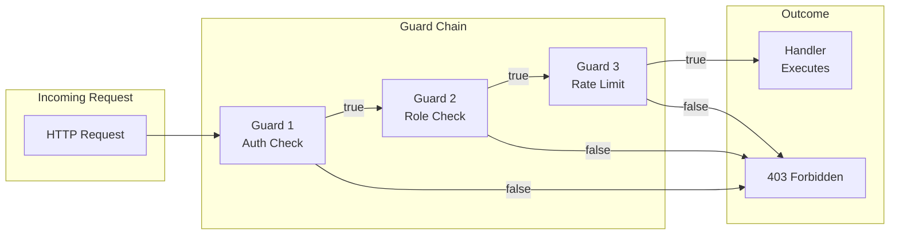
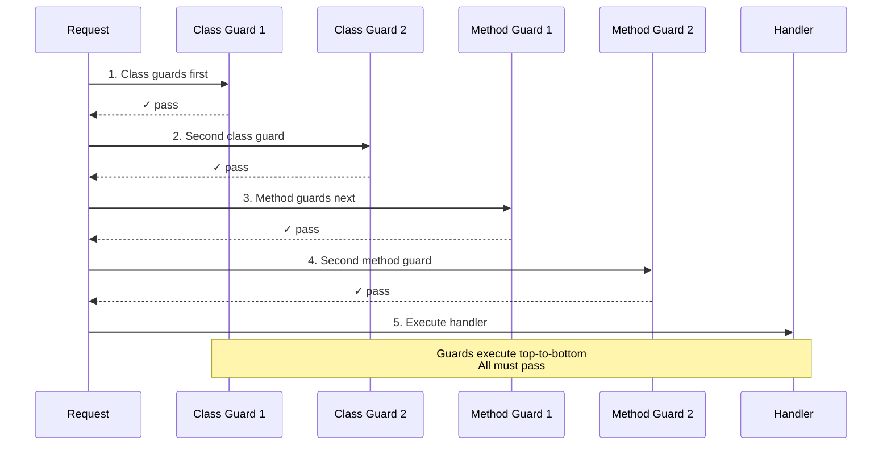
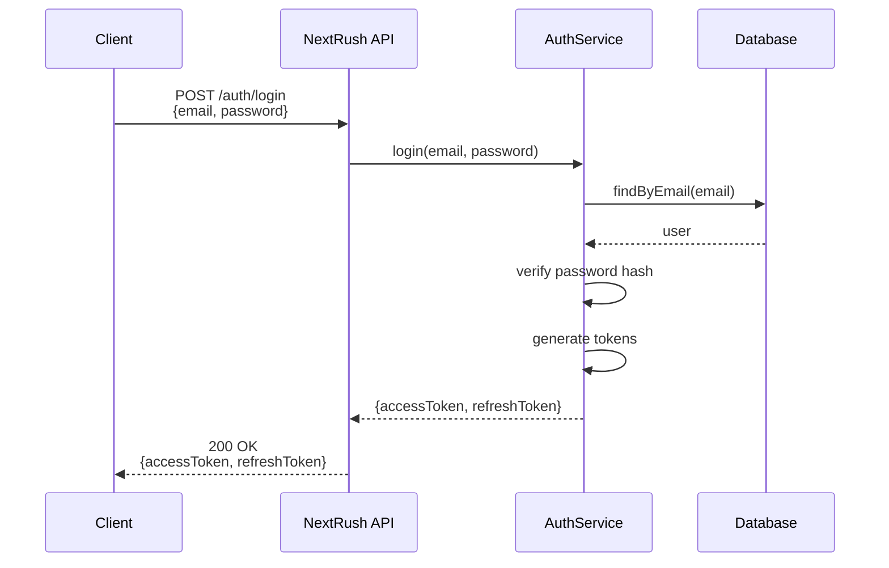
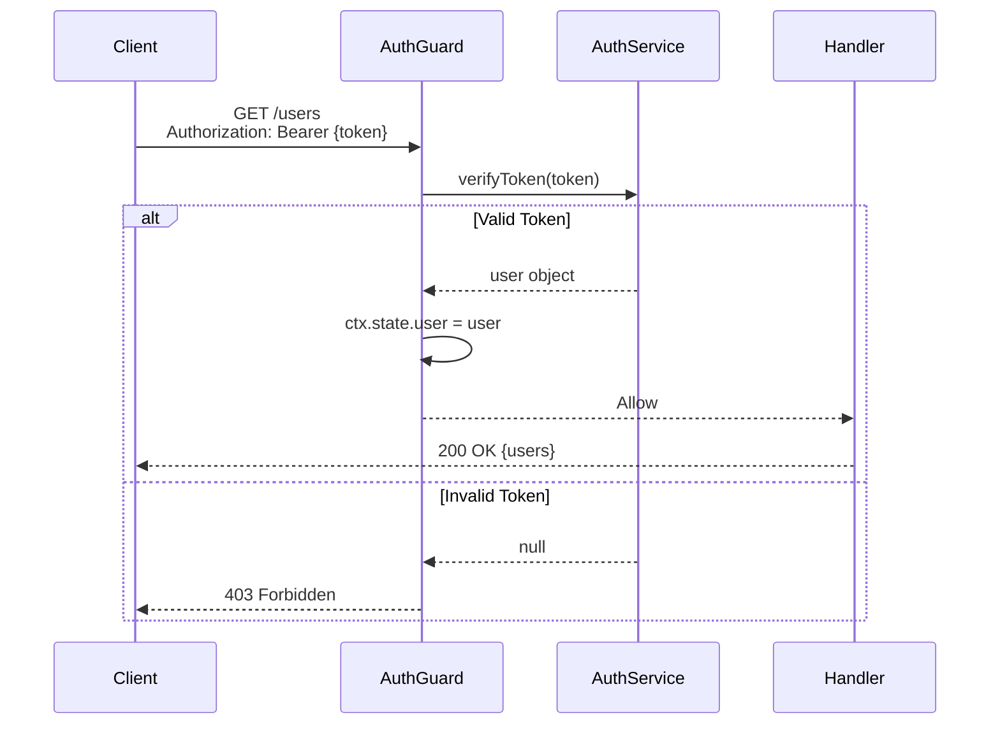
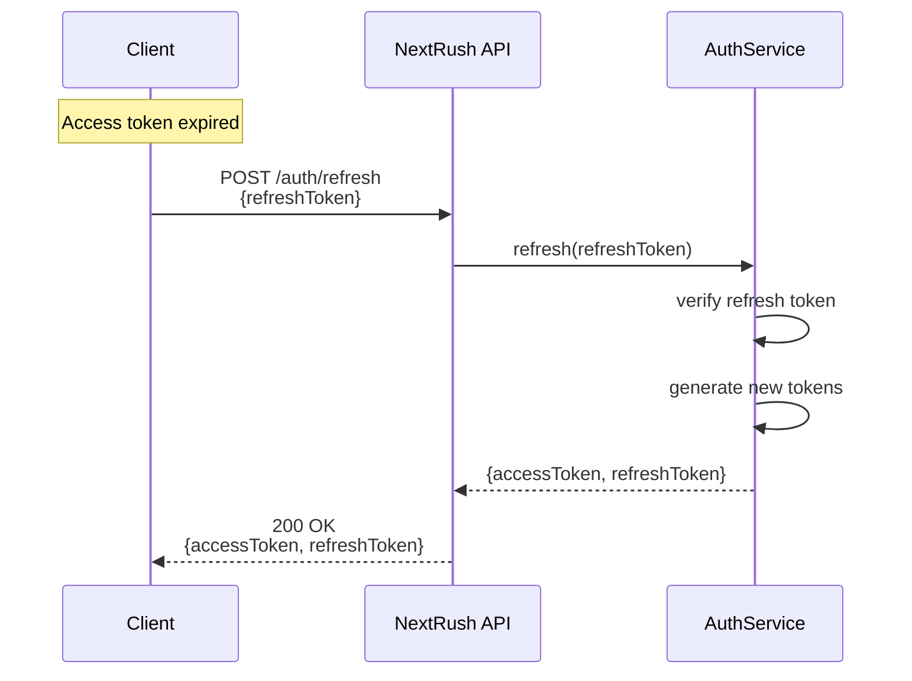

# Authentication

> Implement secure authentication using guards, JWT tokens, and best practices.

## What You'll Learn

- Understand guards and how they protect routes
- Implement JWT-based authentication
- Create role-based authorization
- Handle common auth patterns securely

## Guards: The Foundation

Guards are the core mechanism for protecting routes in NextRush. They run **before** your handler and decide whether the request proceeds.



### Guard Types

NextRush supports two types of guards:

| Type | Use Case | DI Support |
|------|----------|------------|
| **Function Guards** | Simple checks, no dependencies | No |
| **Class Guards** | Complex logic, needs services | Yes |

## Function Guards

The simplest way to protect routes:

```typescript
import type { GuardFn } from '@nextrush/controllers';

// Basic auth check
const AuthGuard: GuardFn = async (ctx) => {
  const token = ctx.get('authorization');

  if (!token) {
    return false;  // Request rejected → 403
  }

  // Verify token and attach user to context
  const user = await verifyToken(token);

  if (!user) {
    return false;  // Invalid token → 403
  }

  ctx.state.user = user;  // Available in handler
  return true;  // Request proceeds
};
```

### Guard Factories

Create configurable guards:

```typescript
// Role guard factory
const RoleGuard = (requiredRoles: string[]): GuardFn => async (ctx) => {
  const user = ctx.state.user as { role: string } | undefined;

  if (!user) {
    return false;  // Not authenticated
  }

  return requiredRoles.includes(user.role);
};

// Permission guard factory
const PermissionGuard = (...permissions: string[]): GuardFn => async (ctx) => {
  const user = ctx.state.user as { permissions: string[] } | undefined;

  if (!user) {
    return false;
  }

  return permissions.every((p) => user.permissions.includes(p));
};

// Usage
@UseGuard(AuthGuard)
@UseGuard(RoleGuard(['admin', 'moderator']))
@Controller('/admin')
class AdminController {}
```

## Class Guards (with DI)

For guards that need services:

```typescript
import { Service, type CanActivate, type GuardContext } from '@nextrush/controllers';

@Service()
class AuthGuard implements CanActivate {
  constructor(
    private authService: AuthService,
    private logger: LoggerService
  ) {}

  async canActivate(ctx: GuardContext): Promise<boolean> {
    const header = ctx.get('authorization');

    if (!header?.startsWith('Bearer ')) {
      this.logger.warn('Missing or malformed auth header');
      return false;
    }

    const token = header.slice(7);

    try {
      const user = await this.authService.verifyToken(token);
      ctx.state.user = user;
      this.logger.info(`User ${user.id} authenticated`);
      return true;
    } catch (error) {
      this.logger.warn('Invalid token', { error });
      return false;
    }
  }
}
```

### Applying Guards

```typescript
// Controller-level (protects all routes)
@UseGuard(AuthGuard)
@Controller('/users')
class UserController {
  @Get()
  findAll() {}  // Protected

  @Get('/:id')
  findOne() {}  // Protected
}

// Method-level (protects specific routes)
@Controller('/posts')
class PostController {
  @Get()
  findAll() {}  // Public

  @UseGuard(AuthGuard)
  @Post()
  create() {}  // Protected
}

// Multiple guards (all must pass)
@UseGuard(AuthGuard)
@UseGuard(RoleGuard(['admin']))
@UseGuard(RateLimitGuard({ max: 10, window: '1m' }))
@Controller('/admin')
class AdminController {}
```

## Guard Execution Order

Guards execute in a specific order:



```typescript
@UseGuard(GuardA)      // Runs 1st
@UseGuard(GuardB)      // Runs 2nd
@Controller('/example')
class ExampleController {
  @UseGuard(GuardC)    // Runs 3rd
  @UseGuard(GuardD)    // Runs 4th
  @Get()
  handler() {}         // Runs 5th (if all pass)
}
```

## JWT Authentication

### Setup

```bash
pnpm add jsonwebtoken
pnpm add -D @types/jsonwebtoken
```

### JWT Service

```typescript
// src/services/jwt.service.ts
import { Service } from '@nextrush/controllers';
import jwt, { type JwtPayload } from 'jsonwebtoken';

interface TokenPayload {
  sub: string;       // User ID
  email: string;
  role: string;
  iat?: number;
  exp?: number;
}

@Service()
export class JwtService {
  private readonly secret = process.env.JWT_SECRET!;
  private readonly accessExpiry = '15m';
  private readonly refreshExpiry = '7d';

  generateAccessToken(payload: Omit<TokenPayload, 'iat' | 'exp'>): string {
    return jwt.sign(payload, this.secret, { expiresIn: this.accessExpiry });
  }

  generateRefreshToken(userId: string): string {
    return jwt.sign({ sub: userId, type: 'refresh' }, this.secret, {
      expiresIn: this.refreshExpiry,
    });
  }

  verifyAccessToken(token: string): TokenPayload | null {
    try {
      return jwt.verify(token, this.secret) as TokenPayload;
    } catch {
      return null;
    }
  }

  verifyRefreshToken(token: string): { sub: string } | null {
    try {
      const payload = jwt.verify(token, this.secret) as JwtPayload;
      if (payload.type !== 'refresh') return null;
      return { sub: payload.sub as string };
    } catch {
      return null;
    }
  }

  decodeWithoutVerify(token: string): TokenPayload | null {
    try {
      return jwt.decode(token) as TokenPayload;
    } catch {
      return null;
    }
  }
}
```

### Auth Service

```typescript
// src/services/auth.service.ts
import { Service } from '@nextrush/controllers';
import { UnauthorizedError, BadRequestError } from '@nextrush/errors';
import { JwtService } from './jwt.service';
import { UserService } from './user.service';
import { PasswordService } from './password.service';

interface AuthTokens {
  accessToken: string;
  refreshToken: string;
  expiresIn: number;
}

@Service()
export class AuthService {
  constructor(
    private jwt: JwtService,
    private users: UserService,
    private password: PasswordService
  ) {}

  async login(email: string, password: string): Promise<AuthTokens> {
    const user = await this.users.findByEmail(email);

    if (!user) {
      throw new UnauthorizedError('Invalid credentials');
    }

    const valid = await this.password.verify(password, user.passwordHash);

    if (!valid) {
      throw new UnauthorizedError('Invalid credentials');
    }

    return this.generateTokens(user);
  }

  async register(email: string, password: string, name: string): Promise<AuthTokens> {
    const existing = await this.users.findByEmail(email);

    if (existing) {
      throw new BadRequestError('Email already registered');
    }

    const passwordHash = await this.password.hash(password);
    const user = await this.users.create({ email, name, passwordHash });

    return this.generateTokens(user);
  }

  async refresh(refreshToken: string): Promise<AuthTokens> {
    const payload = this.jwt.verifyRefreshToken(refreshToken);

    if (!payload) {
      throw new UnauthorizedError('Invalid refresh token');
    }

    const user = await this.users.findById(payload.sub);

    if (!user) {
      throw new UnauthorizedError('User not found');
    }

    return this.generateTokens(user);
  }

  async verifyToken(token: string) {
    const payload = this.jwt.verifyAccessToken(token);

    if (!payload) {
      return null;
    }

    return this.users.findById(payload.sub);
  }

  private generateTokens(user: { id: string; email: string; role: string }): AuthTokens {
    return {
      accessToken: this.jwt.generateAccessToken({
        sub: user.id,
        email: user.email,
        role: user.role,
      }),
      refreshToken: this.jwt.generateRefreshToken(user.id),
      expiresIn: 15 * 60, // 15 minutes in seconds
    };
  }
}
```

### Auth Controller

```typescript
// src/controllers/auth.controller.ts
import { Controller, Post, Body, UseGuard, Ctx } from '@nextrush/controllers';
import { z } from 'zod';
import type { Context } from '@nextrush/types';
import { AuthService } from '../services/auth.service';
import { AuthGuard } from '../guards/auth.guard';

const LoginSchema = z.object({
  email: z.string().email(),
  password: z.string().min(8),
});

const RegisterSchema = z.object({
  email: z.string().email(),
  password: z.string().min(8),
  name: z.string().min(1),
});

const RefreshSchema = z.object({
  refreshToken: z.string(),
});

@Controller('/auth')
export class AuthController {
  constructor(private auth: AuthService) {}

  @Post('/login')
  async login(
    @Body({ transform: LoginSchema.parse }) body: z.infer<typeof LoginSchema>
  ) {
    const tokens = await this.auth.login(body.email, body.password);
    return { ...tokens, tokenType: 'Bearer' };
  }

  @Post('/register')
  async register(
    @Body({ transform: RegisterSchema.parse }) body: z.infer<typeof RegisterSchema>
  ) {
    const tokens = await this.auth.register(body.email, body.password, body.name);
    return { ...tokens, tokenType: 'Bearer' };
  }

  @Post('/refresh')
  async refresh(
    @Body({ transform: RefreshSchema.parse }) body: z.infer<typeof RefreshSchema>
  ) {
    const tokens = await this.auth.refresh(body.refreshToken);
    return { ...tokens, tokenType: 'Bearer' };
  }

  @UseGuard(AuthGuard)
  @Post('/logout')
  async logout(@Ctx() ctx: Context) {
    // If using token blacklist or sessions, invalidate here
    return { success: true };
  }

  @UseGuard(AuthGuard)
  @Post('/me')
  async me(@Ctx() ctx: Context) {
    const user = ctx.state.user;
    return { user };
  }
}
```

## Auth Guard Implementation

```typescript
// src/guards/auth.guard.ts
import { Service, type CanActivate, type GuardContext } from '@nextrush/controllers';
import { AuthService } from '../services/auth.service';

@Service()
export class AuthGuard implements CanActivate {
  constructor(private auth: AuthService) {}

  async canActivate(ctx: GuardContext): Promise<boolean> {
    const header = ctx.get('authorization');

    if (!header?.startsWith('Bearer ')) {
      return false;
    }

    const token = header.slice(7);
    const user = await this.auth.verifyToken(token);

    if (!user) {
      return false;
    }

    ctx.state.user = user;
    return true;
  }
}
```

## Role-Based Access Control

### Role Guard

```typescript
// src/guards/role.guard.ts
import type { GuardFn } from '@nextrush/controllers';

type Role = 'user' | 'admin' | 'moderator';

export const RoleGuard = (...roles: Role[]): GuardFn => async (ctx) => {
  const user = ctx.state.user as { role: Role } | undefined;

  if (!user) {
    return false;
  }

  return roles.includes(user.role);
};
```

### Usage

```typescript
@UseGuard(AuthGuard)
@Controller('/admin')
class AdminController {
  @UseGuard(RoleGuard('admin'))
  @Get('/users')
  listUsers() {
    // Only admins
  }

  @UseGuard(RoleGuard('admin', 'moderator'))
  @Delete('/posts/:id')
  deletePost() {
    // Admins and moderators
  }
}
```

## Permission-Based Access Control

For fine-grained access control:

```typescript
// src/guards/permission.guard.ts
import type { GuardFn } from '@nextrush/controllers';

type Permission = 'users:read' | 'users:write' | 'posts:read' | 'posts:write' | 'admin:*';

export const PermissionGuard = (...required: Permission[]): GuardFn => async (ctx) => {
  const user = ctx.state.user as { permissions: Permission[] } | undefined;

  if (!user) {
    return false;
  }

  // Admin wildcard
  if (user.permissions.includes('admin:*')) {
    return true;
  }

  return required.every((p) => user.permissions.includes(p));
};
```

## Auth Flow Diagrams

### Login Flow



### Protected Request Flow



### Token Refresh Flow



## Security Best Practices

### Token Storage

```typescript
// ✅ Good: Short-lived access tokens
const accessExpiry = '15m';

// ✅ Good: Longer refresh tokens (but still limited)
const refreshExpiry = '7d';

// ❌ Avoid: Very long-lived access tokens
const accessExpiry = '30d';  // Too long!
```

### Password Hashing

```typescript
// src/services/password.service.ts
import { Service } from '@nextrush/controllers';
import { createHash, randomBytes, timingSafeEqual } from 'crypto';

@Service()
export class PasswordService {
  async hash(password: string): Promise<string> {
    const salt = randomBytes(16).toString('hex');
    const hash = createHash('sha256')
      .update(password + salt)
      .digest('hex');
    return `${salt}:${hash}`;
  }

  async verify(password: string, stored: string): Promise<boolean> {
    const [salt, hash] = stored.split(':');
    const inputHash = createHash('sha256')
      .update(password + salt)
      .digest('hex');

    // Timing-safe comparison
    return timingSafeEqual(Buffer.from(hash), Buffer.from(inputHash));
  }
}
```

### Rate Limiting Auth Endpoints

```typescript
import { rateLimit } from '@nextrush/rate-limit';

// Stricter limits for auth endpoints
const authLimiter = rateLimit({
  max: 5,           // 5 attempts
  window: '15m',    // per 15 minutes
  message: 'Too many attempts, please try again later',
});

@Controller('/auth')
class AuthController {
  @Post('/login')
  @UseMiddleware(authLimiter)  // or apply at route level
  async login() {}
}
```

### Secure Headers

```typescript
import { helmet } from '@nextrush/helmet';

app.use(helmet({
  // Prevent XSS
  contentSecurityPolicy: {
    directives: {
      defaultSrc: ["'self'"],
    },
  },
  // Prevent clickjacking
  xFrameOptions: { action: 'deny' },
}));
```

## Common Patterns

### Optional Authentication

```typescript
// Guard that doesn't reject, just sets user if present
const OptionalAuthGuard: GuardFn = async (ctx) => {
  const header = ctx.get('authorization');

  if (header?.startsWith('Bearer ')) {
    const token = header.slice(7);
    const user = await verifyToken(token);
    if (user) {
      ctx.state.user = user;
    }
  }

  return true;  // Always allow
};

@Controller('/posts')
class PostController {
  @UseGuard(OptionalAuthGuard)
  @Get()
  findAll(@Ctx() ctx: Context) {
    const user = ctx.state.user;  // May be undefined

    if (user) {
      // Show personalized content
    } else {
      // Show public content
    }
  }
}
```

### Owner-Only Access

```typescript
const OwnerGuard: GuardFn = async (ctx) => {
  const user = ctx.state.user as { id: string } | undefined;
  const resourceId = ctx.params.id;

  if (!user) return false;

  const resource = await findResource(resourceId);

  if (!resource) return false;

  return resource.ownerId === user.id;
};

@Controller('/posts')
class PostController {
  @UseGuard(AuthGuard)
  @UseGuard(OwnerGuard)
  @Put('/:id')
  update(@Param('id') id: string) {
    // Only owner can update
  }
}
```

### API Key Authentication

```typescript
const ApiKeyGuard: GuardFn = async (ctx) => {
  const apiKey = ctx.get('x-api-key');

  if (!apiKey) return false;

  const client = await validateApiKey(apiKey);

  if (!client) return false;

  ctx.state.client = client;
  return true;
};

@UseGuard(ApiKeyGuard)
@Controller('/api/v1')
class ApiController {}
```

## Testing Authentication

```typescript
import { describe, it, expect, beforeEach } from 'vitest';
import { createTestApp } from '../test/utils';

describe('Auth', () => {
  let app: TestApp;

  beforeEach(() => {
    app = createTestApp();
  });

  it('should login with valid credentials', async () => {
    const res = await app.post('/auth/login', {
      email: 'test@example.com',
      password: 'password123',
    });

    expect(res.status).toBe(200);
    expect(res.body).toHaveProperty('accessToken');
    expect(res.body).toHaveProperty('refreshToken');
  });

  it('should reject invalid credentials', async () => {
    const res = await app.post('/auth/login', {
      email: 'test@example.com',
      password: 'wrong',
    });

    expect(res.status).toBe(401);
  });

  it('should access protected route with token', async () => {
    const { accessToken } = await login(app);

    const res = await app.get('/users', {
      headers: { Authorization: `Bearer ${accessToken}` },
    });

    expect(res.status).toBe(200);
  });

  it('should reject request without token', async () => {
    const res = await app.get('/users');

    expect(res.status).toBe(403);
  });
});
```

## Related Guides

- **[Class-Based Development](/guides/class-based-development)** — Controllers with guards
- **[REST API](/guides/rest-api)** — Build complete APIs
- **[Error Handling](/guides/error-handling)** — Handle auth errors
- **[Testing](/guides/testing)** — Test protected routes

## Related Packages

- **[@nextrush/controllers](/packages/controllers/)** — Guards and decorators
- **[@nextrush/errors](/packages/errors/)** — Auth error classes
- **[@nextrush/rate-limit](/middleware/rate-limit/)** — Rate limiting
