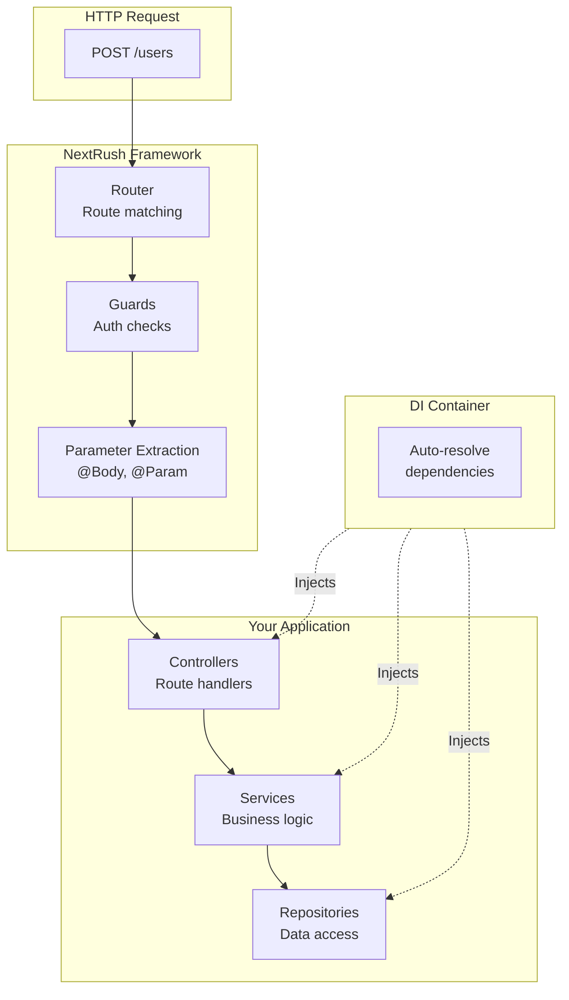
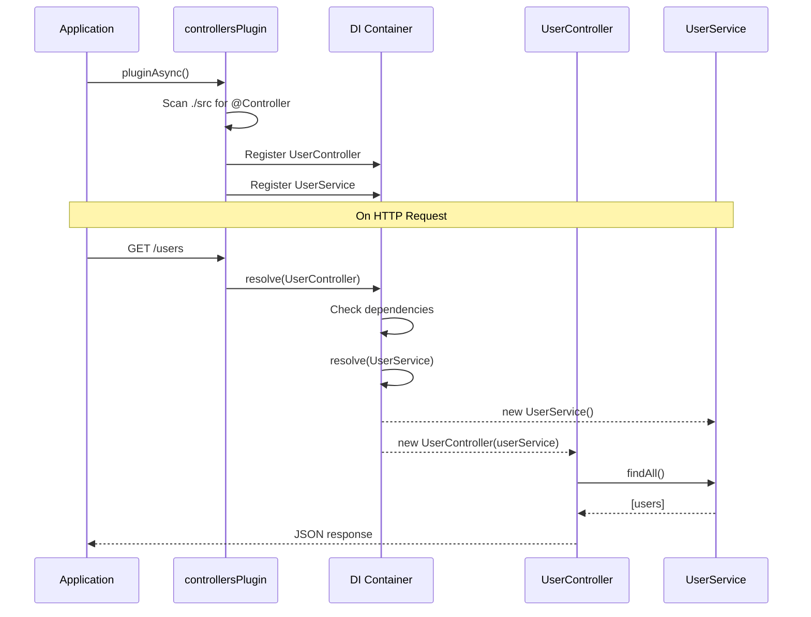
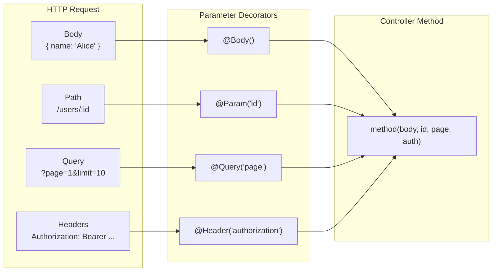
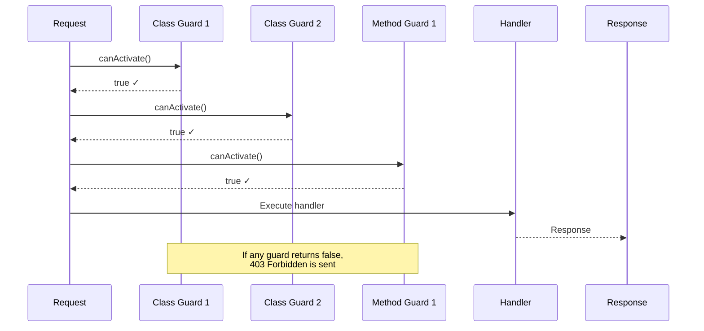

# Class-Based Development

> Build structured, scalable APIs with controllers, dependency injection, and decorators.

## Why Class-Based?

NextRush supports **two programming styles**:

| Style | Best For | Complexity |
|-------|----------|------------|
| **Functional** | Small APIs, serverless, prototypes | Simple |
| **Class-Based** | Large APIs, teams, enterprise | Structured |

Class-based development provides:

- **Dependency Injection** — Automatic wiring of services
- **Controllers** — Organized route handlers
- **Guards** — Declarative authentication/authorization
- **Separation of Concerns** — Clean architecture patterns

## Architecture Overview



## Prerequisites

Before starting, ensure you have:

1. **tsconfig.json** with decorator support:
```json
{
  "compilerOptions": {
    "experimentalDecorators": true,
    "emitDecoratorMetadata": true,
    "target": "ES2022",
    "module": "ESNext",
    "moduleResolution": "bundler"
  }
}
```

2. **Required packages**:
```bash
pnpm add @nextrush/controllers reflect-metadata
pnpm add -D @nextrush/dev
```

## Quick Start

### 1. Create Entry Point

```typescript
// src/index.ts
import 'reflect-metadata';  // Required! Import first.
import { createApp } from '@nextrush/core';
import { createRouter } from '@nextrush/router';
import { controllersPlugin } from '@nextrush/controllers';

async function main() {
  const app = createApp();
  const router = createRouter();

  // Auto-discover all @Controller classes
  await app.pluginAsync(
    controllersPlugin({
      router,
      root: './src',  // Scan this directory
      debug: true,    // Log discovered controllers
    })
  );

  app.use(router.routes());

  app.listen(3000, () => {
    console.log('Server running on http://localhost:3000');
  });
}

main();
```

### 2. Create a Service

```typescript
// src/services/user.service.ts
import { Service } from '@nextrush/controllers';

interface User {
  id: string;
  name: string;
  email: string;
}

@Service()  // Marks as injectable singleton
export class UserService {
  private users = new Map<string, User>();

  constructor() {
    // Seed some data
    this.users.set('1', { id: '1', name: 'Alice', email: 'alice@example.com' });
  }

  findAll(): User[] {
    return Array.from(this.users.values());
  }

  findById(id: string): User | undefined {
    return this.users.get(id);
  }

  create(data: Omit<User, 'id'>): User {
    const id = String(Date.now());
    const user = { id, ...data };
    this.users.set(id, user);
    return user;
  }

  update(id: string, data: Partial<Omit<User, 'id'>>): User | undefined {
    const user = this.users.get(id);
    if (!user) return undefined;
    Object.assign(user, data);
    return user;
  }

  delete(id: string): boolean {
    return this.users.delete(id);
  }
}
```

### 3. Create a Controller

```typescript
// src/controllers/user.controller.ts
import { Controller, Get, Post, Put, Delete, Body, Param } from '@nextrush/controllers';
import { UserService } from '../services/user.service';

@Controller('/users')  // Base path for all routes
export class UserController {
  // UserService is automatically injected!
  constructor(private userService: UserService) {}

  @Get()  // GET /users
  findAll() {
    return this.userService.findAll();
  }

  @Get('/:id')  // GET /users/:id
  findOne(@Param('id') id: string) {
    return this.userService.findById(id);
  }

  @Post()  // POST /users
  create(@Body() data: { name: string; email: string }) {
    return this.userService.create(data);
  }

  @Put('/:id')  // PUT /users/:id
  update(
    @Param('id') id: string,
    @Body() data: { name?: string; email?: string }
  ) {
    return this.userService.update(id, data);
  }

  @Delete('/:id')  // DELETE /users/:id
  remove(@Param('id') id: string) {
    this.userService.delete(id);
    return { deleted: true };
  }
}
```

### 4. Run Development Server

```bash
npx nextrush dev
```

Test your API:
```bash
# Get all users
curl http://localhost:3000/users

# Create user
curl -X POST http://localhost:3000/users \
  -H "Content-Type: application/json" \
  -d '{"name":"Bob","email":"bob@example.com"}'

# Get single user
curl http://localhost:3000/users/1
```

## The Dependency Injection Flow

Understanding how DI works is crucial for class-based development.



## Service Patterns

### Singleton Services (Default)

```typescript
@Service()  // Singleton - one instance shared everywhere
export class DatabaseService {
  private connection: Connection;

  constructor() {
    this.connection = createConnection();
  }

  query(sql: string) {
    return this.connection.query(sql);
  }
}
```

### Transient Services

```typescript
@Service({ scope: 'transient' })  // New instance each time
export class RequestLogger {
  readonly timestamp = Date.now();

  log(message: string) {
    console.log(`[${this.timestamp}] ${message}`);
  }
}
```

### Service Dependencies

Services can depend on other services:

```typescript
@Service()
export class UserService {
  constructor(
    private db: DatabaseService,       // Injected!
    private logger: LoggerService,     // Injected!
    private cache: CacheService,       // Injected!
  ) {}

  async findAll() {
    const cached = await this.cache.get('users');
    if (cached) return cached;

    this.logger.log('Fetching users from database');
    const users = await this.db.query('SELECT * FROM users');

    await this.cache.set('users', users);
    return users;
  }
}
```

### Repository Pattern

Use `@Repository()` for data access classes:

```typescript
@Repository()  // Semantic alias for @Service()
export class UserRepository {
  constructor(private db: DatabaseService) {}

  async findById(id: string): Promise<User | null> {
    const [user] = await this.db.query(
      'SELECT * FROM users WHERE id = ?',
      [id]
    );
    return user ?? null;
  }

  async save(user: User): Promise<User> {
    await this.db.query(
      'INSERT INTO users (id, name, email) VALUES (?, ?, ?)',
      [user.id, user.name, user.email]
    );
    return user;
  }
}
```

## Parameter Decorators

Extract data from different parts of the request:



### Available Decorators

```typescript
@Controller('/example')
export class ExampleController {
  @Post('/demo/:id')
  async demo(
    // Request body
    @Body() body: CreateDto,                    // Full body
    @Body('name') name: string,                 // Specific property

    // Route parameters
    @Param() params: { id: string },            // All params
    @Param('id') id: string,                    // Specific param

    // Query string
    @Query() query: Record<string, string>,     // All query params
    @Query('page') page: string,                // Specific query param

    // Headers
    @Header() headers: Record<string, string>,  // All headers
    @Header('authorization') auth: string,      // Specific header

    // Context
    @Ctx() ctx: Context,                        // Full context object
  ) {
    // ...
  }
}
```

### Parameter Transforms

Transform and validate parameters:

```typescript
import { z } from 'zod';

const CreateUserSchema = z.object({
  name: z.string().min(1),
  email: z.string().email(),
});

@Controller('/users')
export class UserController {
  @Post()
  async create(
    // Validate with Zod
    @Body({ transform: CreateUserSchema.parse })
    data: z.infer<typeof CreateUserSchema>
  ) {
    // data is validated and typed!
    return this.userService.create(data);
  }

  @Get('/:id')
  findOne(
    // Convert to number
    @Param('id', { transform: Number }) id: number
  ) {
    return this.userService.findById(id);
  }

  @Get()
  findAll(
    // Default values + transform
    @Query('page', { transform: (v) => Number(v) || 1 }) page: number,
    @Query('limit', { transform: (v) => Math.min(Number(v) || 10, 100) }) limit: number
  ) {
    return this.userService.findAll({ page, limit });
  }
}
```

## Guards (Authentication & Authorization)

Guards protect routes by returning `true` (allow) or `false` (deny).

### Function Guards

Simple guards as functions:

```typescript
import type { GuardFn } from '@nextrush/controllers';

// Check for authorization header
const AuthGuard: GuardFn = async (ctx) => {
  const token = ctx.get('authorization');
  if (!token) return false;

  // Verify token and attach user to state
  const user = await verifyToken(token);
  if (!user) return false;

  ctx.state.user = user;
  return true;
};

// Role-based guard factory
const RoleGuard = (roles: string[]): GuardFn => async (ctx) => {
  const user = ctx.state.user as { role: string } | undefined;
  return user ? roles.includes(user.role) : false;
};
```

### Applying Guards

```typescript
@UseGuard(AuthGuard)  // Applied to all routes in controller
@Controller('/admin')
export class AdminController {
  @Get('/dashboard')  // Protected by AuthGuard
  dashboard() {
    return { admin: true };
  }

  @UseGuard(RoleGuard(['superadmin']))  // Additional guard
  @Delete('/users/:id')  // Protected by AuthGuard + RoleGuard
  deleteUser(@Param('id') id: string) {
    return this.userService.delete(id);
  }
}
```

### Class-Based Guards (with DI)

Guards that need services use DI:

```typescript
import { Service, type CanActivate, type GuardContext } from '@nextrush/controllers';

@Service()
export class AuthGuard implements CanActivate {
  constructor(
    private authService: AuthService,
    private logger: LoggerService
  ) {}

  async canActivate(ctx: GuardContext): Promise<boolean> {
    const token = ctx.get('authorization')?.replace('Bearer ', '');

    if (!token) {
      this.logger.warn('No token provided');
      return false;
    }

    const user = await this.authService.verifyToken(token);
    if (!user) {
      this.logger.warn('Invalid token');
      return false;
    }

    ctx.state.user = user;
    this.logger.info(`User ${user.id} authenticated`);
    return true;
  }
}
```

### Guard Execution Order



## Controller Discovery

The controllers plugin auto-discovers `@Controller` classes:

### Default Patterns

```typescript
controllersPlugin({
  router,
  root: './src',
  // Default include patterns:
  // - **/*.ts
  // - **/*.js

  // Default exclude patterns:
  // - **/*.test.ts, **/*.spec.ts
  // - **/node_modules/**, **/dist/**
  // - **/__tests__/**
})
```

### Custom Patterns

```typescript
controllersPlugin({
  router,
  root: './src',
  include: [
    'controllers/**/*.ts',       // Only controllers folder
    'modules/**/*.controller.ts' // Or module structure
  ],
  exclude: [
    '**/*.test.ts',
    '**/*.spec.ts',
    '**/mocks/**'
  ],
  debug: true  // Log discovered controllers
})
```

### Manual Registration (Testing)

For tests, skip auto-discovery:

```typescript
controllersPlugin({
  router,
  controllers: [UserController, ProductController],  // Explicit list
})
```

## Project Structure

### Recommended Structure

```
src/
├── index.ts                 # Entry point
├── controllers/
│   ├── user.controller.ts
│   ├── product.controller.ts
│   └── order.controller.ts
├── services/
│   ├── user.service.ts
│   ├── product.service.ts
│   └── order.service.ts
├── repositories/
│   ├── user.repository.ts
│   └── product.repository.ts
├── guards/
│   ├── auth.guard.ts
│   └── role.guard.ts
├── dto/                     # Data Transfer Objects
│   ├── create-user.dto.ts
│   └── update-user.dto.ts
└── types/
    └── index.ts
```

### Module-Based Structure (Larger Apps)

```
src/
├── index.ts
├── app.module.ts
├── common/
│   ├── guards/
│   ├── middleware/
│   └── filters/
├── modules/
│   ├── users/
│   │   ├── users.controller.ts
│   │   ├── users.service.ts
│   │   ├── users.repository.ts
│   │   └── dto/
│   ├── products/
│   │   ├── products.controller.ts
│   │   ├── products.service.ts
│   │   └── dto/
│   └── orders/
│       └── ...
└── config/
    └── database.ts
```

## Complete Example

A full CRUD API with authentication:

```typescript
// src/index.ts
import 'reflect-metadata';
import { createApp } from '@nextrush/core';
import { createRouter } from '@nextrush/router';
import { json } from '@nextrush/body-parser';
import { cors } from '@nextrush/cors';
import { errorHandler } from '@nextrush/errors';
import { controllersPlugin } from '@nextrush/controllers';

async function main() {
  const app = createApp();
  const router = createRouter();

  // Global middleware
  app.use(errorHandler());
  app.use(cors());
  app.use(json());

  // Auto-discover controllers
  await app.pluginAsync(
    controllersPlugin({
      router,
      root: './src',
      prefix: '/api/v1',  // All routes prefixed
      debug: true,
    })
  );

  app.use(router.routes());

  app.listen(3000, () => {
    console.log('API running on http://localhost:3000/api/v1');
  });
}

main();
```

```typescript
// src/guards/auth.guard.ts
import { Service, type CanActivate, type GuardContext } from '@nextrush/controllers';
import { AuthService } from '../services/auth.service';

@Service()
export class AuthGuard implements CanActivate {
  constructor(private authService: AuthService) {}

  async canActivate(ctx: GuardContext): Promise<boolean> {
    const token = ctx.get('authorization')?.replace('Bearer ', '');
    if (!token) return false;

    const user = await this.authService.verifyToken(token);
    if (!user) return false;

    ctx.state.user = user;
    return true;
  }
}
```

```typescript
// src/services/user.service.ts
import { Service } from '@nextrush/controllers';
import { NotFoundError } from '@nextrush/errors';
import { UserRepository } from '../repositories/user.repository';

@Service()
export class UserService {
  constructor(private userRepo: UserRepository) {}

  async findAll(page: number, limit: number) {
    return this.userRepo.findAll(page, limit);
  }

  async findById(id: string) {
    const user = await this.userRepo.findById(id);
    if (!user) {
      throw new NotFoundError(`User ${id} not found`);
    }
    return user;
  }

  async create(data: { name: string; email: string }) {
    return this.userRepo.create(data);
  }

  async update(id: string, data: { name?: string; email?: string }) {
    const user = await this.userRepo.update(id, data);
    if (!user) {
      throw new NotFoundError(`User ${id} not found`);
    }
    return user;
  }

  async delete(id: string) {
    const deleted = await this.userRepo.delete(id);
    if (!deleted) {
      throw new NotFoundError(`User ${id} not found`);
    }
  }
}
```

```typescript
// src/controllers/user.controller.ts
import {
  Controller, Get, Post, Put, Delete,
  Body, Param, Query, UseGuard
} from '@nextrush/controllers';
import { z } from 'zod';
import { UserService } from '../services/user.service';
import { AuthGuard } from '../guards/auth.guard';

const CreateUserSchema = z.object({
  name: z.string().min(1),
  email: z.string().email(),
});

const UpdateUserSchema = CreateUserSchema.partial();

@UseGuard(AuthGuard)
@Controller('/users')
export class UserController {
  constructor(private userService: UserService) {}

  @Get()
  async findAll(
    @Query('page', { transform: (v) => Number(v) || 1 }) page: number,
    @Query('limit', { transform: (v) => Math.min(Number(v) || 10, 100) }) limit: number,
  ) {
    const users = await this.userService.findAll(page, limit);
    return { users, page, limit };
  }

  @Get('/:id')
  async findOne(@Param('id') id: string) {
    const user = await this.userService.findById(id);
    return { user };
  }

  @Post()
  async create(
    @Body({ transform: CreateUserSchema.parse }) data: z.infer<typeof CreateUserSchema>
  ) {
    const user = await this.userService.create(data);
    return { user, created: true };
  }

  @Put('/:id')
  async update(
    @Param('id') id: string,
    @Body({ transform: UpdateUserSchema.parse }) data: z.infer<typeof UpdateUserSchema>
  ) {
    const user = await this.userService.update(id, data);
    return { user, updated: true };
  }

  @Delete('/:id')
  async remove(@Param('id') id: string) {
    await this.userService.delete(id);
    return { deleted: true };
  }
}
```

## Common Mistakes

### Forgetting reflect-metadata

```typescript
// ❌ Wrong - decorators won't work
import { createApp } from '@nextrush/core';

// ✅ Correct - import first!
import 'reflect-metadata';
import { createApp } from '@nextrush/core';
```

### Importing from Wrong Package

```typescript
// ❌ Don't mix packages
import { Controller } from '@nextrush/decorators';
import { Service } from '@nextrush/di';
import { controllersPlugin } from '@nextrush/controllers';

// ✅ Import everything from controllers
import {
  Controller, Service, controllersPlugin
} from '@nextrush/controllers';
```

### Class Guards Without @Service

```typescript
// ❌ DI won't resolve dependencies
class AuthGuard implements CanActivate {
  constructor(private authService: AuthService) {}  // Not injected!
}

// ✅ Register in DI container
@Service()
class AuthGuard implements CanActivate {
  constructor(private authService: AuthService) {}  // Injected!
}
```

### Not Using Async for Plugin

```typescript
// ❌ Controller discovery is async
app.plugin(controllersPlugin({ router, root: './src' }));
app.use(router.routes());  // Controllers not loaded yet!

// ✅ Use pluginAsync
await app.pluginAsync(controllersPlugin({ router, root: './src' }));
app.use(router.routes());  // Controllers loaded
```

## When NOT to Use Class-Based

Class-based development adds structure but also ceremony. Consider functional style for:

- **Small APIs** (< 10 routes)
- **Serverless functions** (one handler per function)
- **Prototypes** (speed over structure)
- **Simple CRUD** (no complex business logic)

```typescript
// Sometimes this is all you need
const router = createRouter();

router.get('/health', (ctx) => ctx.json({ status: 'ok' }));
router.get('/users', (ctx) => ctx.json(users));
router.post('/users', (ctx) => {
  const user = { id: Date.now(), ...ctx.body };
  users.push(user);
  ctx.json(user);
});

app.use(router.routes());
```

## Related Guides

- **[Development Tools](/guides/dev-tools)** — Build and run your app
- **[Authentication](/guides/authentication)** — Implement auth with guards
- **[Testing](/guides/testing)** — Test controllers and services
- **[Error Handling](/guides/error-handling)** — Handle errors gracefully

## Related Packages

- **[@nextrush/controllers](/packages/controllers/)** — Full API reference
- **[@nextrush/di](/packages/di/)** — Dependency injection details
- **[@nextrush/decorators](/packages/decorators/)** — Decorator reference
