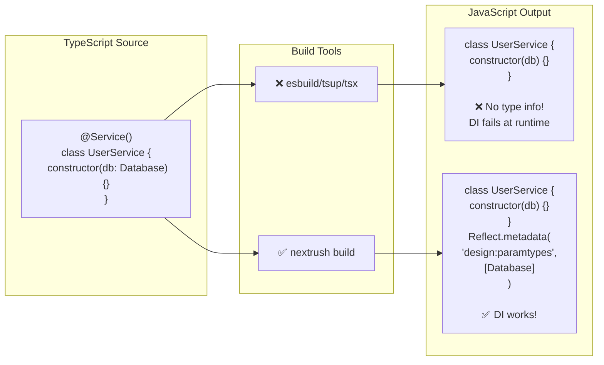
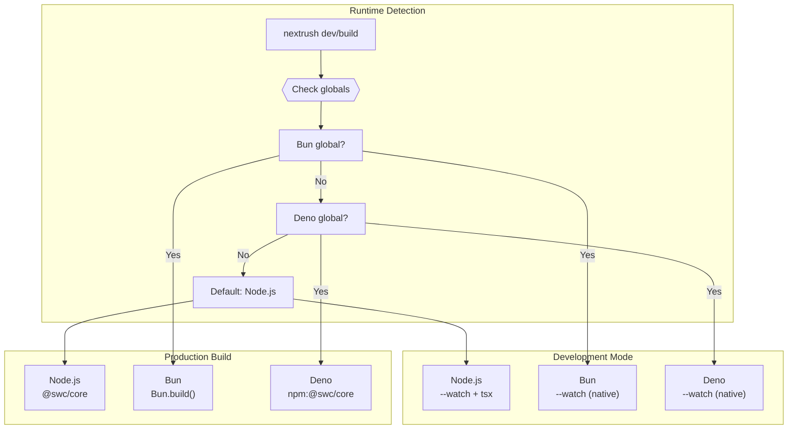

# Development Tools

> Master the nextrush CLI for rapid development and production builds.

## Why You Need This

Modern TypeScript development is fragmented. You need:
- A dev server with hot reload
- A build tool that emits decorator metadata
- Multi-runtime support (Node.js, Bun, Deno)

Most bundlers (esbuild, tsup, tsx) **strip type information**, breaking dependency injection. The `nextrush` CLI solves this with a unified toolchain.

## The Decorator Metadata Problem



**Without decorator metadata, DI containers cannot resolve constructor parameters.**

## Installation

```bash
pnpm add -D @nextrush/dev
```

## Quick Start

### Development

```bash
# Auto-detects entry file and runtime
npx nextrush dev

# With custom port
npx nextrush dev --port 4000

# With debugging
npx nextrush dev --inspect
```

### Production Build

```bash
# Build with decorator metadata
npx nextrush build

# With minification
npx nextrush build --minify

# Custom output directory
npx nextrush build --outDir dist
```

## How It Works

The CLI detects your runtime and uses the optimal tools:



## Development Server

### Command

```bash
nextrush dev [entry] [options]
```

### Options

| Option | Alias | Default | Description |
|--------|-------|---------|-------------|
| `--port` | `-p` | `3000` | Server port |
| `--watch` | `-w` | `src` | Paths to watch (repeatable) |
| `--inspect` | | `false` | Enable Node.js debugger |
| `--inspect-port` | | `9229` | Debugger port |
| `--no-clear` | | | Don't clear console |
| `--verbose` | `-v` | `false` | Verbose output |

### Entry File Detection

If no entry is specified, the CLI looks for (in order):

1. `package.json` → `main` field (converts `dist/` to `src/`)
2. `src/index.ts`
3. `src/main.ts`
4. `src/app.ts`
5. `src/server.ts`
6. `index.ts`

### Examples

```bash
# Basic (auto-detect everything)
nextrush dev

# Custom entry
nextrush dev ./src/server.ts

# Custom port + watch paths
nextrush dev --port 4000 --watch ./src --watch ./config

# With debugger
nextrush dev --inspect --inspect-port 9230
```

### What Happens Under the Hood

**Node.js:**
```bash
node --watch --import tsx src/index.ts
```

**Bun:**
```bash
bun --watch src/index.ts
```

**Deno:**
```bash
deno run --allow-all --watch --node-modules-dir src/index.ts
```

## Production Build

### Command

```bash
nextrush build [entry] [options]
```

### Options

| Option | Alias | Default | Description |
|--------|-------|---------|-------------|
| `--outDir` | `-o` | `dist` | Output directory |
| `--target` | `-t` | `es2022` | ES target version |
| `--sourcemap` | | `true` | Generate sourcemaps |
| `--no-sourcemap` | | | Disable sourcemaps |
| `--minify` | `-m` | `false` | Minify output |
| `--no-decorator-metadata` | | | Disable metadata emission |
| `--no-clean` | | | Don't clean output directory |
| `--verbose` | `-v` | `false` | Verbose output |

### Examples

```bash
# Basic build
nextrush build

# Custom output with minification
nextrush build --outDir build --minify

# ES2020 target
nextrush build --target es2020

# Production build
nextrush build --minify --sourcemap
```

### Build Output

```
dist/
├── index.js           # Compiled JavaScript
├── index.js.map       # Source map
├── index.d.ts         # Type declarations
├── controllers/
│   └── user.controller.js
├── services/
│   └── user.service.js
└── ...
```

### What Happens Under the Hood

**Node.js (using SWC):**
```typescript
await swc.transform(source, {
  jsc: {
    parser: { syntax: 'typescript', decorators: true },
    transform: {
      legacyDecorator: true,
      decoratorMetadata: true,  // ← Critical for DI
    },
  },
});
```

**Bun (native):**
```typescript
await Bun.build({
  entrypoints: [entry],
  outdir: 'dist',
  // Bun preserves decorator metadata natively
});
```

**Deno (using npm:@swc/core):**
```typescript
const swc = await import('npm:@swc/core');
// Same transform API as Node.js
```

## Package.json Scripts

Add these scripts for convenience:

```json
{
  "scripts": {
    "dev": "nextrush dev",
    "build": "nextrush build",
    "start": "node dist/index.js"
  }
}
```

## Complete Workflow

### Functional Development

For simple, functional apps:

```typescript
// src/index.ts
import { createApp } from '@nextrush/core';
import { createRouter } from '@nextrush/router';

const app = createApp();
const router = createRouter();

router.get('/', (ctx) => {
  ctx.json({ message: 'Hello World!' });
});

router.get('/users/:id', (ctx) => {
  ctx.json({ id: ctx.params.id });
});

app.use(router.routes());
app.listen(3000, () => console.log('Server running'));
```

```bash
# Development
nextrush dev

# Production
nextrush build
node dist/index.js
```

### Class-Based Development

For structured apps with DI and controllers:

```typescript
// src/index.ts
import 'reflect-metadata';  // Required for decorators!
import { createApp } from '@nextrush/core';
import { createRouter } from '@nextrush/router';
import { controllersPlugin } from '@nextrush/controllers';

async function main() {
  const app = createApp();
  const router = createRouter();

  // Auto-discover @Controller classes
  await app.pluginAsync(
    controllersPlugin({
      router,
      root: './src',
      debug: true,
    })
  );

  app.use(router.routes());
  app.listen(3000, () => console.log('Server running'));
}

main();
```

```typescript
// src/services/user.service.ts
import { Service } from '@nextrush/controllers';

@Service()
export class UserService {
  findAll() {
    return [{ id: 1, name: 'Alice' }];
  }
}
```

```typescript
// src/controllers/user.controller.ts
import { Controller, Get } from '@nextrush/controllers';
import { UserService } from '../services/user.service';

@Controller('/users')
export class UserController {
  constructor(private userService: UserService) {}

  @Get()
  findAll() {
    return this.userService.findAll();
  }
}
```

```bash
# Development (decorator metadata works!)
nextrush dev

# Production (decorator metadata preserved!)
nextrush build
node dist/index.js
```

## Runtime Compatibility

### Support Matrix

| Feature | Node.js 20+ | Bun 1.0+ | Deno 2.0+ |
|---------|-------------|----------|-----------|
| Development server | ✅ | ✅ | ✅ |
| Hot reload | ✅ | ✅ | ✅ |
| Decorator metadata (dev) | ✅ | ✅ | ✅ |
| Production build | ✅ | ✅ | ✅ |
| Decorator metadata (build) | ✅ | ✅ | ✅ |
| Sourcemaps | ✅ | ✅ | ✅ |
| Type declarations | ✅ | ✅ | ✅ |

### Runtime-Specific Notes

**Node.js:**
- Uses `tsx` for development (fast, no decorator metadata)
- Uses `@swc/core` for build (with decorator metadata)
- Use `@swc-node/register` if you need decorator metadata in dev

**Bun:**
- Native TypeScript support
- Native decorator metadata support
- Fastest development experience

**Deno:**
- Native TypeScript support
- Uses `npm:@swc/core` for build decorator metadata
- Requires `--node-modules-dir` for npm packages

## Verifying Decorator Metadata

After building, verify metadata is emitted:

```bash
# Search for metadata in output
grep -r "design:paramtypes\|metadata" dist/

# Should find patterns like:
# Reflect.defineMetadata("design:paramtypes", [Database], UserService);
# Reflect.metadata("design:paramtypes", [Database])
# __metadata("design:paramtypes", [Database])
```

## Troubleshooting

### DI Not Working (TypeInfo not known)

**Symptom:**
```
Error: TypeInfo not known for UserService
```

**Cause:** Decorator metadata not emitted.

**Solutions:**

1. Ensure tsconfig.json has:
```json
{
  "compilerOptions": {
    "experimentalDecorators": true,
    "emitDecoratorMetadata": true
  }
}
```

2. Use `nextrush build` instead of other bundlers

3. Import `reflect-metadata` at app entry:
```typescript
import 'reflect-metadata';
```

### Hot Reload Not Working

**Symptom:** Changes not reflected without restart.

**Solutions:**

1. Check watch paths:
```bash
nextrush dev --watch ./src --watch ./config
```

2. Ensure files are in watched directory

3. Check for syntax errors (prevents reload)

### Build Output Missing Files

**Symptom:** Some files not in dist/.

**Cause:** Files not in source directory or excluded.

**Solutions:**

1. Check source structure:
```bash
ls -la src/
```

2. Ensure all files are `.ts` (not `.js`)

3. Check for `.gitignore` patterns affecting build

### Deno Build Fails

**Symptom:** Module not found errors in Deno.

**Solutions:**

1. Use node-modules-dir:
```bash
deno run --allow-all --node-modules-dir nextrush build
```

2. Ensure `package.json` exists for npm resolution

## CI/CD Integration

### GitHub Actions

```yaml
name: Build
on: [push, pull_request]

jobs:
  build:
    runs-on: ubuntu-latest
    steps:
      - uses: actions/checkout@v4
      - uses: pnpm/action-setup@v4
      - uses: actions/setup-node@v4
        with:
          node-version: 20
          cache: pnpm

      - run: pnpm install
      - run: pnpm nextrush build

      - uses: actions/upload-artifact@v4
        with:
          name: dist
          path: dist/
```

### Docker

```dockerfile
# Build stage
FROM node:20-alpine AS builder
WORKDIR /app

RUN npm install -g pnpm
COPY package.json pnpm-lock.yaml ./
RUN pnpm install --frozen-lockfile

COPY . .
RUN pnpm nextrush build

# Production stage
FROM node:20-alpine
WORKDIR /app

COPY --from=builder /app/dist ./dist
COPY --from=builder /app/node_modules ./node_modules
COPY package.json ./

CMD ["node", "dist/index.js"]
```

## Programmatic API

For build tool integration:

```typescript
import { dev, build } from '@nextrush/dev';

// Start dev server
const server = await dev('./src/index.ts', {
  port: 3000,
  watch: ['./src', './config'],
  env: { DATABASE_URL: 'postgres://...' },
});

// Production build
await build('./src/index.ts', {
  outDir: 'dist',
  minify: true,
  sourcemap: true,
  decoratorMetadata: true,
});
```

## Related Guides

- **[Class-Based Development](/guides/class-based-development)** — Use DI and controllers
- **[REST APIs](/guides/rest-api)** — Build RESTful endpoints
- **[Testing](/guides/testing)** — Test your application

## Related Packages

- **[@nextrush/dev](/packages/dev)** — Full API reference
- **[@nextrush/controllers](/packages/controllers/)** — Controller plugin
- **[@nextrush/di](/packages/di/)** — Dependency injection
