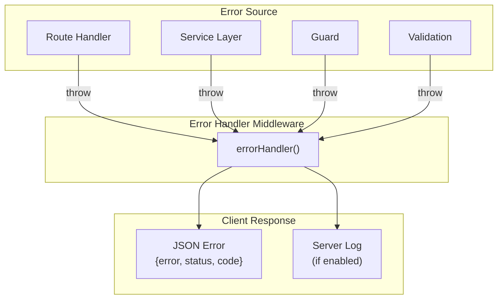
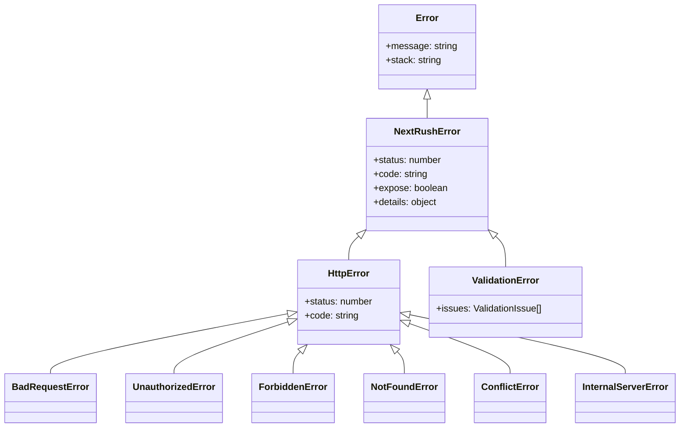
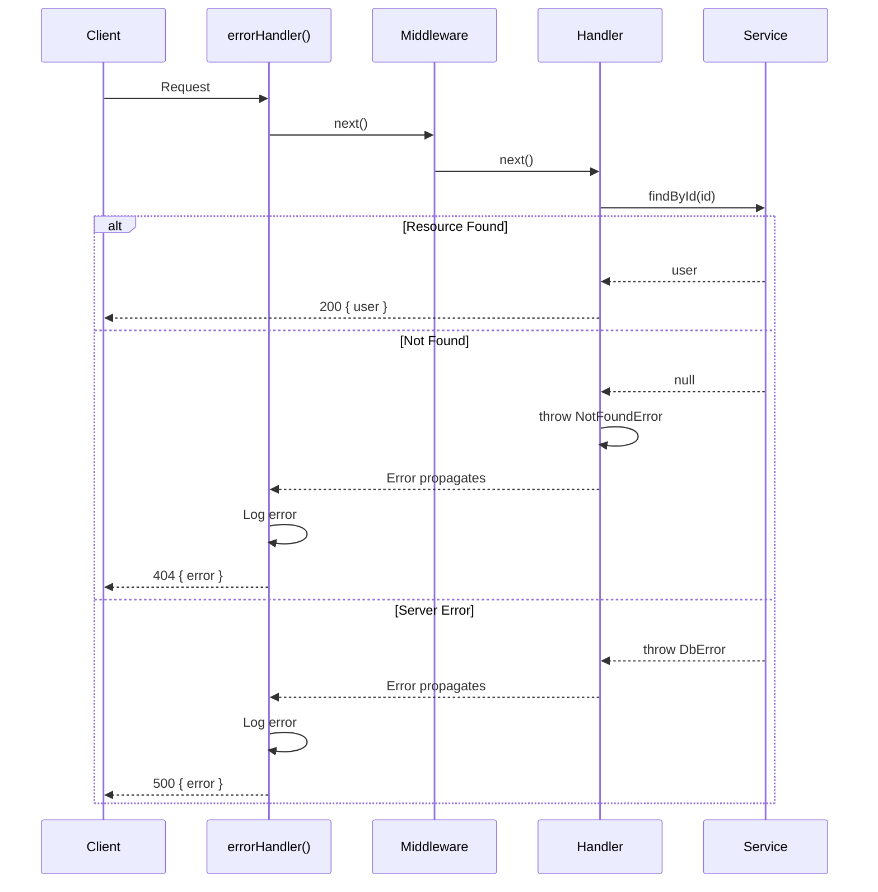

# Error Handling

> Handle errors gracefully with NextRush's structured error system.

## What You'll Learn

- Understand NextRush's error hierarchy
- Throw appropriate HTTP errors
- Configure global error handling
- Handle validation errors
- Production error best practices

## Error Philosophy

NextRush treats errors as **first-class citizens**:



## Error Hierarchy

NextRush provides a comprehensive error hierarchy:



### Key Properties

| Property | Type | Description |
|----------|------|-------------|
| `status` | `number` | HTTP status code (400, 404, 500, etc.) |
| `code` | `string` | Machine-readable error code |
| `message` | `string` | Human-readable message |
| `expose` | `boolean` | Whether to expose details to client |
| `details` | `object` | Additional context (if `expose: true`) |

## HTTP Error Classes

### Client Errors (4xx)

```typescript
import {
  BadRequestError,       // 400 - Invalid request
  UnauthorizedError,     // 401 - Auth required
  ForbiddenError,        // 403 - Access denied
  NotFoundError,         // 404 - Resource not found
  MethodNotAllowedError, // 405 - Wrong HTTP method
  ConflictError,         // 409 - Resource conflict
  UnprocessableEntityError, // 422 - Validation failed
  TooManyRequestsError,  // 429 - Rate limited
} from '@nextrush/errors';
```

### Server Errors (5xx)

```typescript
import {
  InternalServerError,    // 500 - Generic server error
  NotImplementedError,    // 501 - Not implemented
  BadGatewayError,        // 502 - Upstream error
  ServiceUnavailableError,// 503 - Temporarily down
  GatewayTimeoutError,    // 504 - Upstream timeout
} from '@nextrush/errors';
```

## Throwing Errors

### Basic Usage

```typescript
import { NotFoundError, BadRequestError } from '@nextrush/errors';

router.get('/users/:id', async (ctx) => {
  const user = await db.users.findById(ctx.params.id);

  if (!user) {
    throw new NotFoundError('User not found');
  }

  ctx.json({ user });
});

router.post('/users', async (ctx) => {
  const { email } = ctx.body;

  if (!email) {
    throw new BadRequestError('Email is required');
  }

  // Create user...
});
```

### With Options

```typescript
throw new NotFoundError('User not found', {
  code: 'USER_NOT_FOUND',  // Custom error code
  details: {               // Additional context
    userId: ctx.params.id,
    searchedAt: new Date(),
  },
});

// Results in:
// {
//   "error": "NotFoundError",
//   "message": "User not found",
//   "code": "USER_NOT_FOUND",
//   "status": 404,
//   "details": { "userId": "123", ... }
// }
```

### Common Patterns

```typescript
// Resource not found
const user = await db.users.findById(id);
if (!user) {
  throw new NotFoundError(`User ${id} not found`);
}

// Duplicate resource
const existing = await db.users.findByEmail(email);
if (existing) {
  throw new ConflictError('Email already registered', {
    details: { field: 'email' },
  });
}

// Invalid input
if (!isValidEmail(email)) {
  throw new BadRequestError('Invalid email format');
}

// Unauthorized access
if (!ctx.state.user) {
  throw new UnauthorizedError('Authentication required');
}

// Forbidden action
if (ctx.state.user.role !== 'admin') {
  throw new ForbiddenError('Admin access required');
}

// Rate limited
throw new TooManyRequestsError('Rate limit exceeded', {
  retryAfter: 60,  // Seconds until retry
});
```

## Error Handler Middleware

### Setup

```typescript
import { createApp } from '@nextrush/core';
import { errorHandler, notFoundHandler } from '@nextrush/errors';

const app = createApp();

// Add error handler EARLY (to catch errors from middleware below)
app.use(errorHandler());

// ... other middleware and routes ...

// Add 404 handler LAST
app.use(notFoundHandler());
```

### Configuration Options

```typescript
app.use(errorHandler({
  // Show stack traces (development only!)
  includeStack: process.env.NODE_ENV === 'development',

  // Custom logger
  logger: (error, ctx) => {
    myLogger.error({
      error: error.message,
      stack: error.stack,
      path: ctx.path,
      method: ctx.method,
    });
  },

  // Custom response format
  transform: (error, ctx) => ({
    success: false,
    error: {
      type: error.name,
      message: error.message,
      code: error instanceof HttpError ? error.code : 'UNKNOWN',
    },
  }),

  // Handle specific error types
  handlers: new Map([
    [ValidationError, (error, ctx) => {
      ctx.status = 400;
      ctx.json({
        error: 'ValidationError',
        issues: (error as ValidationError).issues,
      });
    }],
  ]),
}));
```

### Error Response Format

Default response format:

```json
{
  "error": "NotFoundError",
  "message": "User not found",
  "code": "NOT_FOUND",
  "status": 404
}
```

With details (when `expose: true`):

```json
{
  "error": "BadRequestError",
  "message": "Validation failed",
  "code": "BAD_REQUEST",
  "status": 400,
  "details": {
    "field": "email",
    "reason": "invalid format"
  }
}
```

With stack trace (development):

```json
{
  "error": "InternalServerError",
  "message": "Database connection failed",
  "code": "INTERNAL_SERVER_ERROR",
  "status": 500,
  "stack": [
    "Error: Database connection failed",
    "    at DatabaseService.connect (/src/services/database.ts:42:11)",
    "    at async UserService.findAll (/src/services/user.ts:15:5)"
  ]
}
```

## Validation Errors

### ValidationError Class

```typescript
import { ValidationError, ValidationIssue } from '@nextrush/errors';

// Multiple issues
const issues: ValidationIssue[] = [
  { path: 'email', message: 'Invalid email format', rule: 'email' },
  { path: 'password', message: 'Must be at least 8 characters', rule: 'minLength' },
];

throw new ValidationError(issues);
```

### Specialized Validation Errors

```typescript
import {
  RequiredFieldError,
  TypeMismatchError,
  RangeError,
  LengthError,
  PatternError,
  InvalidEmailError,
  InvalidUrlError,
} from '@nextrush/errors';

// Required field
if (!ctx.body.name) {
  throw new RequiredFieldError('name');
}

// Type mismatch
if (typeof ctx.body.age !== 'number') {
  throw new TypeMismatchError('age', 'number', typeof ctx.body.age);
}

// Range validation
if (ctx.body.age < 0 || ctx.body.age > 150) {
  throw new RangeError('age', 0, 150);
}

// String length
if (ctx.body.password.length < 8) {
  throw new LengthError('password', 8);
}

// Email format
if (!isValidEmail(ctx.body.email)) {
  throw new InvalidEmailError('email');
}
```

### Integration with Zod

```typescript
import { z } from 'zod';
import { ValidationError } from '@nextrush/errors';

const UserSchema = z.object({
  name: z.string().min(1),
  email: z.string().email(),
  age: z.number().min(0).max(150),
});

function validate<T>(schema: z.ZodSchema<T>, data: unknown): T {
  const result = schema.safeParse(data);

  if (!result.success) {
    const issues = result.error.issues.map(issue => ({
      path: issue.path.join('.'),
      message: issue.message,
      rule: issue.code,
    }));
    throw new ValidationError(issues);
  }

  return result.data;
}

// Usage
router.post('/users', async (ctx) => {
  const data = validate(UserSchema, ctx.body);
  // data is typed and validated
});
```

## Error Flow



## Factory Functions

For quick error creation:

```typescript
import {
  notFound,
  badRequest,
  unauthorized,
  forbidden,
  conflict,
  internalError,
  createError,
} from '@nextrush/errors';

// Quick factories
throw notFound('User not found');
throw badRequest('Invalid input');
throw unauthorized('Login required');
throw forbidden('Access denied');
throw conflict('Email taken');
throw internalError('Something went wrong');

// Custom status
throw createError(418, "I'm a teapot");
```

## Error Utilities

### isHttpError

```typescript
import { isHttpError, HttpError } from '@nextrush/errors';

try {
  await riskyOperation();
} catch (error) {
  if (isHttpError(error)) {
    // Safe to access status, code, etc.
    console.log(error.status, error.code);
  } else {
    // Unknown error type
    throw new InternalServerError('Unexpected error');
  }
}
```

### getErrorStatus / getSafeErrorMessage

```typescript
import { getErrorStatus, getSafeErrorMessage } from '@nextrush/errors';

catch (error) {
  const status = getErrorStatus(error);  // Returns status or 500
  const message = getSafeErrorMessage(error);  // Safe message or 'Internal Server Error'
}
```

### catchAsync

Wrap async handlers for cleaner code:

```typescript
import { catchAsync } from '@nextrush/errors';

// Without catchAsync - need try/catch in every handler
router.get('/users/:id', async (ctx) => {
  try {
    const user = await db.users.findById(ctx.params.id);
    if (!user) throw new NotFoundError('User not found');
    ctx.json({ user });
  } catch (error) {
    throw error;  // Re-throw for error handler
  }
});

// With catchAsync - cleaner
router.get('/users/:id', catchAsync(async (ctx) => {
  const user = await db.users.findById(ctx.params.id);
  if (!user) throw new NotFoundError('User not found');
  ctx.json({ user });
}));
```

## Service Layer Errors

### Error Translation

```typescript
// src/services/user.service.ts
import { Service } from '@nextrush/controllers';
import { NotFoundError, ConflictError, InternalServerError } from '@nextrush/errors';

@Service()
export class UserService {
  constructor(private db: DatabaseService) {}

  async findById(id: string): Promise<User> {
    try {
      const user = await this.db.query('SELECT * FROM users WHERE id = ?', [id]);

      if (!user) {
        throw new NotFoundError(`User ${id} not found`);
      }

      return user;
    } catch (error) {
      // Re-throw HTTP errors
      if (error instanceof HttpError) {
        throw error;
      }

      // Translate database errors
      if (error.code === 'ECONNREFUSED') {
        throw new ServiceUnavailableError('Database unavailable');
      }

      // Unknown errors become 500
      throw new InternalServerError('Failed to fetch user', {
        cause: error,  // Preserve original for logging
      });
    }
  }

  async create(data: CreateUserDto): Promise<User> {
    try {
      return await this.db.insert('users', data);
    } catch (error) {
      // Handle unique constraint violation
      if (error.code === 'ER_DUP_ENTRY') {
        throw new ConflictError('Email already registered');
      }

      throw new InternalServerError('Failed to create user');
    }
  }
}
```

## Production Best Practices

### Never Expose Internal Errors

```typescript
// ❌ Bad - exposes internal details
throw new Error('SELECT * FROM users WHERE id = 123 failed');

// ✅ Good - safe message, log internally
console.error('Database query failed:', error);
throw new InternalServerError('Failed to fetch user');
```

### Use Error Codes

```typescript
// ✅ Good - machine-readable codes for clients
throw new BadRequestError('Invalid input', {
  code: 'INVALID_EMAIL_FORMAT',  // Client can handle this
});
```

### Structured Logging

```typescript
app.use(errorHandler({
  logger: (error, ctx) => {
    const logEntry = {
      timestamp: new Date().toISOString(),
      level: error.status >= 500 ? 'error' : 'warn',
      message: error.message,
      code: error.code,
      status: error.status,
      method: ctx.method,
      path: ctx.path,
      stack: error.stack,
      // Don't log sensitive data!
    };

    if (error.status >= 500) {
      logger.error(logEntry);
      alerting.notify(logEntry);  // Alert on 5xx errors
    } else {
      logger.warn(logEntry);
    }
  },
}));
```

### Security Considerations

```typescript
app.use(errorHandler({
  // Production: hide stack traces
  includeStack: process.env.NODE_ENV === 'development',

  // Don't expose sensitive errors
  transform: (error, ctx) => {
    const status = getErrorStatus(error);

    // 5xx errors - hide details
    if (status >= 500) {
      return {
        error: 'InternalServerError',
        message: 'An unexpected error occurred',
        code: 'INTERNAL_ERROR',
        status: 500,
      };
    }

    // 4xx errors - safe to expose
    return {
      error: error.name,
      message: error.message,
      code: error.code || 'ERROR',
      status,
    };
  },
}));
```

### Error Monitoring Integration

```typescript
import * as Sentry from '@sentry/node';

app.use(errorHandler({
  logger: (error, ctx) => {
    // Send to error monitoring
    Sentry.captureException(error, {
      tags: {
        path: ctx.path,
        method: ctx.method,
      },
      extra: {
        status: error.status,
        code: error.code,
      },
    });
  },
}));
```

## Complete Example

```typescript
// src/index.ts
import 'reflect-metadata';
import { createApp } from '@nextrush/core';
import { createRouter } from '@nextrush/router';
import { json } from '@nextrush/body-parser';
import { errorHandler, notFoundHandler, isHttpError } from '@nextrush/errors';

const app = createApp();
const router = createRouter();

// Error handler (place early)
app.use(errorHandler({
  includeStack: process.env.NODE_ENV !== 'production',
  logger: (error, ctx) => {
    const level = error.status >= 500 ? 'error' : 'warn';
    console[level]({
      type: error.name,
      message: error.message,
      status: error.status,
      path: ctx.path,
      stack: error.stack,
    });
  },
}));

// Body parsing
app.use(json());

// Routes
router.get('/users/:id', async (ctx) => {
  const user = await userService.findById(ctx.params.id);
  ctx.json({ user });
});

router.post('/users', async (ctx) => {
  const data = validate(CreateUserSchema, ctx.body);
  const user = await userService.create(data);
  ctx.status = 201;
  ctx.json({ user });
});

app.use(router.routes());

// 404 handler (place last)
app.use(notFoundHandler('Resource not found'));

app.listen(3000);
```

## Related Guides

- **[REST API](/guides/rest-api)** — Error handling in APIs
- **[Authentication](/guides/authentication)** — Auth error patterns
- **[Testing](/guides/testing)** — Testing error cases

## Related Packages

- **[@nextrush/errors](/packages/errors/)** — Full API reference
- **[@nextrush/controllers](/packages/controllers/)** — Controller error handling
