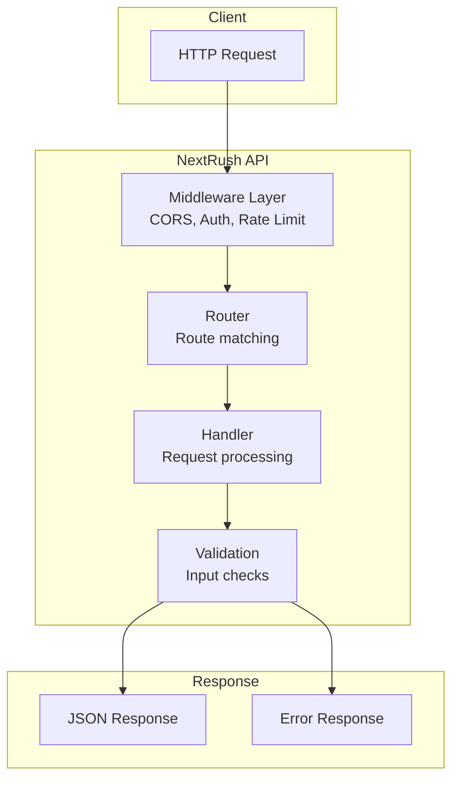
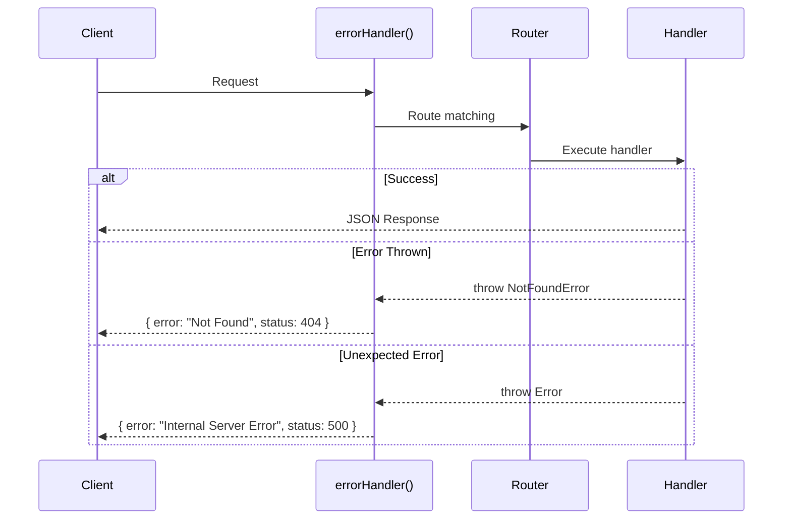
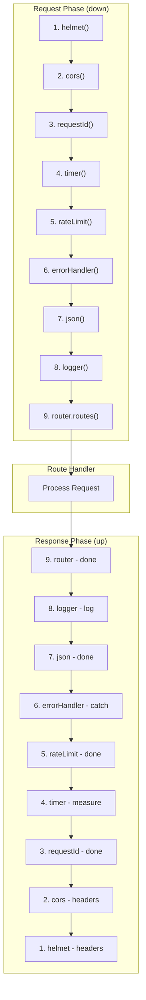

# Building REST APIs

> Design and build production-ready REST APIs with NextRush.

## What You'll Learn

- Set up a structured REST API project
- Implement CRUD operations
- Validate request data
- Handle errors consistently
- Apply REST best practices

## Architecture Overview

A well-structured REST API separates concerns:



## Project Setup

### 1. Initialize Project

```bash
mkdir my-api && cd my-api
pnpm init

# Core packages
pnpm add @nextrush/core @nextrush/router @nextrush/errors

# Middleware
pnpm add @nextrush/body-parser @nextrush/cors @nextrush/helmet

# Development
pnpm add -D typescript @types/node @nextrush/dev
```

### 2. Configure TypeScript

```json
{
  "compilerOptions": {
    "target": "ES2022",
    "module": "ESNext",
    "moduleResolution": "bundler",
    "strict": true,
    "esModuleInterop": true,
    "outDir": "dist",
    "rootDir": "src"
  },
  "include": ["src/**/*"]
}
```

### 3. Create Entry Point

```typescript
// src/index.ts
import { createApp } from '@nextrush/core';
import { createRouter } from '@nextrush/router';
import { json } from '@nextrush/body-parser';
import { cors } from '@nextrush/cors';
import { helmet } from '@nextrush/helmet';
import { errorHandler, notFoundHandler } from '@nextrush/errors';

const app = createApp();
const router = createRouter();

// Security middleware
app.use(helmet());
app.use(cors());

// Body parsing
app.use(json({ limit: '1mb' }));

// Error handling (placed early to catch all errors)
app.use(errorHandler());

// Health check
router.get('/health', (ctx) => {
  ctx.json({ status: 'healthy', timestamp: new Date().toISOString() });
});

// Mount routes
app.use(router.routes());
app.use(router.allowedMethods());

// 404 handler (placed last)
app.use(notFoundHandler());

const port = Number(process.env.PORT) || 3000;
app.listen(port, () => {
  console.log(`API running on http://localhost:${port}`);
});
```

### 4. Run Development Server

```bash
npx nextrush dev
```

## Routing Basics

### Route Methods

```typescript
const router = createRouter();

router.get('/resource', handler);      // Read
router.post('/resource', handler);     // Create
router.put('/resource/:id', handler);  // Replace
router.patch('/resource/:id', handler);// Update
router.delete('/resource/:id', handler);// Delete
```

### Route Parameters

```typescript
// Path parameters
router.get('/users/:id', (ctx) => {
  const { id } = ctx.params;
  ctx.json({ id });
});

// Multiple parameters
router.get('/users/:userId/posts/:postId', (ctx) => {
  const { userId, postId } = ctx.params;
  ctx.json({ userId, postId });
});

// Wildcard (catches everything after)
router.get('/files/*', (ctx) => {
  const filePath = ctx.params['*'];  // e.g., "docs/readme.md"
  ctx.json({ path: filePath });
});
```

### Query Parameters

```typescript
// GET /users?page=2&limit=10&sort=name
router.get('/users', (ctx) => {
  const { page = '1', limit = '10', sort } = ctx.query;

  ctx.json({
    page: Number(page),
    limit: Number(limit),
    sort: sort ?? 'createdAt'
  });
});
```

### Route Groups

```typescript
const router = createRouter();

// Group related routes
router.group('/api/v1', (r) => {
  r.get('/users', listUsers);
  r.post('/users', createUser);
  r.get('/users/:id', getUser);
});

// Group with middleware
router.group('/admin', [authMiddleware], (r) => {
  r.get('/dashboard', dashboard);
  r.post('/settings', updateSettings);
});

// Nested groups
router.group('/api/v1', (r) => {
  r.group('/users', [rateLimitMiddleware], (ur) => {
    ur.get('/', listUsers);
    ur.get('/:id', getUser);
  });

  r.group('/products', (pr) => {
    pr.get('/', listProducts);
  });
});
```

## CRUD Implementation

### Data Model

```typescript
// src/types/user.ts
export interface User {
  id: string;
  name: string;
  email: string;
  createdAt: Date;
  updatedAt: Date;
}

export interface CreateUserDto {
  name: string;
  email: string;
}

export interface UpdateUserDto {
  name?: string;
  email?: string;
}
```

### In-Memory Store (Development)

```typescript
// src/stores/user.store.ts
import type { User, CreateUserDto, UpdateUserDto } from '../types/user';

const users = new Map<string, User>();

export const userStore = {
  findAll(): User[] {
    return Array.from(users.values());
  },

  findById(id: string): User | undefined {
    return users.get(id);
  },

  create(data: CreateUserDto): User {
    const user: User = {
      id: crypto.randomUUID(),
      ...data,
      createdAt: new Date(),
      updatedAt: new Date(),
    };
    users.set(user.id, user);
    return user;
  },

  update(id: string, data: UpdateUserDto): User | undefined {
    const user = users.get(id);
    if (!user) return undefined;

    Object.assign(user, data, { updatedAt: new Date() });
    return user;
  },

  delete(id: string): boolean {
    return users.delete(id);
  },
};
```

### CRUD Routes

```typescript
// src/routes/users.ts
import { createRouter } from '@nextrush/router';
import { NotFoundError, BadRequestError } from '@nextrush/errors';
import { userStore } from '../stores/user.store';
import type { CreateUserDto, UpdateUserDto } from '../types/user';

export const userRouter = createRouter();

// GET /users - List all users
userRouter.get('/', (ctx) => {
  const users = userStore.findAll();
  ctx.json({ users, count: users.length });
});

// GET /users/:id - Get single user
userRouter.get('/:id', (ctx) => {
  const user = userStore.findById(ctx.params.id);

  if (!user) {
    throw new NotFoundError(`User ${ctx.params.id} not found`);
  }

  ctx.json({ user });
});

// POST /users - Create user
userRouter.post('/', (ctx) => {
  const body = ctx.body as CreateUserDto;

  // Validation (basic example)
  if (!body.name || !body.email) {
    throw new BadRequestError('Name and email are required');
  }

  const user = userStore.create(body);

  ctx.status = 201;
  ctx.json({ user });
});

// PUT /users/:id - Replace user
userRouter.put('/:id', (ctx) => {
  const body = ctx.body as CreateUserDto;

  if (!body.name || !body.email) {
    throw new BadRequestError('Name and email are required');
  }

  const user = userStore.update(ctx.params.id, body);

  if (!user) {
    throw new NotFoundError(`User ${ctx.params.id} not found`);
  }

  ctx.json({ user });
});

// PATCH /users/:id - Partial update
userRouter.patch('/:id', (ctx) => {
  const body = ctx.body as UpdateUserDto;
  const user = userStore.update(ctx.params.id, body);

  if (!user) {
    throw new NotFoundError(`User ${ctx.params.id} not found`);
  }

  ctx.json({ user });
});

// DELETE /users/:id - Delete user
userRouter.delete('/:id', (ctx) => {
  const deleted = userStore.delete(ctx.params.id);

  if (!deleted) {
    throw new NotFoundError(`User ${ctx.params.id} not found`);
  }

  ctx.status = 204;
  ctx.body = '';
});
```

### Mount Router

```typescript
// src/index.ts
import { userRouter } from './routes/users';

// Mount at /api/users
router.use('/api/users', userRouter);
```

## Request Validation

### With Zod

```bash
pnpm add zod
```

```typescript
// src/validators/user.validator.ts
import { z } from 'zod';

export const CreateUserSchema = z.object({
  name: z.string().min(1, 'Name is required').max(100),
  email: z.string().email('Invalid email format'),
});

export const UpdateUserSchema = CreateUserSchema.partial();

export const PaginationSchema = z.object({
  page: z.coerce.number().int().min(1).default(1),
  limit: z.coerce.number().int().min(1).max(100).default(10),
  sort: z.enum(['name', 'email', 'createdAt']).default('createdAt'),
  order: z.enum(['asc', 'desc']).default('desc'),
});
```

### Validation Middleware

```typescript
// src/middleware/validate.ts
import type { Middleware } from '@nextrush/types';
import { z } from 'zod';
import { BadRequestError } from '@nextrush/errors';

interface ValidationSchema {
  body?: z.ZodSchema;
  query?: z.ZodSchema;
  params?: z.ZodSchema;
}

export function validate(schema: ValidationSchema): Middleware {
  return async (ctx, next) => {
    try {
      if (schema.body) {
        ctx.body = schema.body.parse(ctx.body);
      }
      if (schema.query) {
        ctx.query = schema.query.parse(ctx.query);
      }
      if (schema.params) {
        ctx.params = schema.params.parse(ctx.params);
      }
    } catch (error) {
      if (error instanceof z.ZodError) {
        throw new BadRequestError('Validation failed', {
          details: { errors: error.errors },
        });
      }
      throw error;
    }

    await next();
  };
}
```

### Using Validation

```typescript
import { CreateUserSchema, UpdateUserSchema, PaginationSchema } from '../validators/user.validator';
import { validate } from '../middleware/validate';

// POST /users with validation
userRouter.post(
  '/',
  validate({ body: CreateUserSchema }),
  (ctx) => {
    // ctx.body is now validated and typed!
    const user = userStore.create(ctx.body);
    ctx.status = 201;
    ctx.json({ user });
  }
);

// GET /users with pagination validation
userRouter.get(
  '/',
  validate({ query: PaginationSchema }),
  (ctx) => {
    const { page, limit, sort, order } = ctx.query as z.infer<typeof PaginationSchema>;
    // Type-safe pagination values
    ctx.json({ page, limit, sort, order });
  }
);
```

## Error Handling

### Error Flow



### Standard Error Classes

```typescript
import {
  // 4xx Client Errors
  BadRequestError,       // 400 - Invalid request
  UnauthorizedError,     // 401 - Auth required
  ForbiddenError,        // 403 - Access denied
  NotFoundError,         // 404 - Not found
  ConflictError,         // 409 - Conflict
  UnprocessableEntityError, // 422 - Validation failed
  TooManyRequestsError,  // 429 - Rate limited

  // 5xx Server Errors
  InternalServerError,   // 500 - Server error
  BadGatewayError,       // 502 - Upstream error
  ServiceUnavailableError, // 503 - Temporarily unavailable
} from '@nextrush/errors';
```

### Throwing Errors

```typescript
router.get('/users/:id', (ctx) => {
  const user = findUser(ctx.params.id);

  if (!user) {
    // Automatic JSON response: { error: "User not found", status: 404 }
    throw new NotFoundError('User not found');
  }

  ctx.json({ user });
});

router.post('/users', (ctx) => {
  const existing = findUserByEmail(ctx.body.email);

  if (existing) {
    throw new ConflictError('Email already registered', {
      details: { field: 'email' },
    });
  }

  // Create user...
});
```

### Error Handler Middleware

```typescript
import { errorHandler } from '@nextrush/errors';

// Basic usage
app.use(errorHandler());

// With options
app.use(errorHandler({
  // Expose stack traces in development
  exposeStack: process.env.NODE_ENV === 'development',

  // Log errors
  onError: (error, ctx) => {
    console.error(`[${ctx.method}] ${ctx.path}:`, error.message);
  },

  // Custom error format
  format: (error) => ({
    error: {
      code: error.code,
      message: error.message,
      details: error.details,
    },
  }),
}));
```

### Custom Error Format

```typescript
// Standard format
{
  "error": "User not found",
  "status": 404,
  "code": "NOT_FOUND"
}

// With details
{
  "error": "Validation failed",
  "status": 400,
  "code": "BAD_REQUEST",
  "details": {
    "errors": [
      { "path": ["email"], "message": "Invalid email format" }
    ]
  }
}
```

## Response Patterns

### Success Responses

```typescript
// Single resource
ctx.json({ user: { id: '1', name: 'Alice' } });

// Collection
ctx.json({
  users: [...],
  meta: {
    total: 100,
    page: 1,
    limit: 10,
    pages: 10,
  }
});

// Created resource (201)
ctx.status = 201;
ctx.json({ user: newUser });

// No content (204)
ctx.status = 204;
ctx.body = '';
```

### Pagination Response

```typescript
interface PaginatedResponse<T> {
  data: T[];
  meta: {
    total: number;
    page: number;
    limit: number;
    pages: number;
    hasNext: boolean;
    hasPrev: boolean;
  };
}

router.get('/users', (ctx) => {
  const page = Number(ctx.query.page) || 1;
  const limit = Number(ctx.query.limit) || 10;

  const { users, total } = userStore.findPaginated(page, limit);

  const response: PaginatedResponse<User> = {
    data: users,
    meta: {
      total,
      page,
      limit,
      pages: Math.ceil(total / limit),
      hasNext: page * limit < total,
      hasPrev: page > 1,
    },
  };

  ctx.json(response);
});
```

### Response Headers

```typescript
// Set single header
ctx.set('X-Request-Id', requestId);

// Set multiple headers
ctx.set({
  'X-Request-Id': requestId,
  'X-Response-Time': `${duration}ms`,
});

// Cache control
ctx.set('Cache-Control', 'public, max-age=3600');

// Location header (redirects, created resources)
ctx.set('Location', `/api/users/${user.id}`);
ctx.status = 201;
```

## Middleware Stack

### Recommended Order

```typescript
const app = createApp();

// 1. Security headers (earliest possible)
app.use(helmet());

// 2. CORS (before any business logic)
app.use(cors({ origin: process.env.ALLOWED_ORIGINS }));

// 3. Request ID (for tracing)
app.use(requestId());

// 4. Request timing
app.use(timer());

// 5. Rate limiting
app.use(rateLimit({ max: 100, window: '15m' }));

// 6. Error handling (catch errors from below)
app.use(errorHandler());

// 7. Body parsing
app.use(json({ limit: '1mb' }));

// 8. Request logging
app.use(logger());

// 9. Routes
app.use(router.routes());
app.use(router.allowedMethods());

// 10. 404 handler (last)
app.use(notFoundHandler());
```

### Execution Flow



## Complete Example

```typescript
// src/index.ts
import { createApp } from '@nextrush/core';
import { createRouter } from '@nextrush/router';
import { json } from '@nextrush/body-parser';
import { cors } from '@nextrush/cors';
import { helmet } from '@nextrush/helmet';
import { rateLimit } from '@nextrush/rate-limit';
import { requestId } from '@nextrush/request-id';
import { timer } from '@nextrush/timer';
import { errorHandler, notFoundHandler } from '@nextrush/errors';
import { userRouter } from './routes/users';
import { productRouter } from './routes/products';

const app = createApp();
const router = createRouter();

// Middleware stack
app.use(helmet());
app.use(cors({ origin: process.env.CORS_ORIGIN || '*' }));
app.use(requestId());
app.use(timer());
app.use(rateLimit({ max: 100, window: '15m' }));
app.use(errorHandler({ exposeStack: process.env.NODE_ENV !== 'production' }));
app.use(json({ limit: '1mb' }));

// Request logging
app.use(async (ctx, next) => {
  const start = Date.now();
  await next();
  const ms = Date.now() - start;
  console.log(`${ctx.method} ${ctx.path} ${ctx.status} - ${ms}ms`);
});

// Health check
router.get('/health', (ctx) => {
  ctx.json({
    status: 'healthy',
    version: process.env.npm_package_version,
    timestamp: new Date().toISOString(),
  });
});

// API routes
router.group('/api/v1', (r) => {
  r.use('/users', userRouter);
  r.use('/products', productRouter);
});

app.use(router.routes());
app.use(router.allowedMethods());
app.use(notFoundHandler());

// Start server
const port = Number(process.env.PORT) || 3000;
app.listen(port, () => {
  console.log(`API running on http://localhost:${port}`);
});
```

## Best Practices

### URL Design

```typescript
// ✅ Good: Resource-oriented, plural nouns
GET    /api/v1/users
POST   /api/v1/users
GET    /api/v1/users/:id
PUT    /api/v1/users/:id
DELETE /api/v1/users/:id

// ✅ Good: Nested resources
GET    /api/v1/users/:userId/posts
POST   /api/v1/users/:userId/posts

// ❌ Avoid: Verbs in URLs
GET    /api/v1/getUsers
POST   /api/v1/createUser
POST   /api/v1/deleteUser
```

### Status Codes

| Operation | Success Code | Error Codes |
|-----------|--------------|-------------|
| GET (single) | 200 | 404 |
| GET (list) | 200 | - |
| POST | 201 | 400, 409 |
| PUT | 200 | 400, 404 |
| PATCH | 200 | 400, 404 |
| DELETE | 204 | 404 |

### Versioning

```typescript
// URL versioning (recommended)
router.group('/api/v1', (r) => { /* v1 routes */ });
router.group('/api/v2', (r) => { /* v2 routes */ });

// Header versioning (alternative)
app.use(async (ctx, next) => {
  const version = ctx.get('Accept-Version') || 'v1';
  ctx.state.apiVersion = version;
  await next();
});
```

## Testing Your API

```bash
# Health check
curl http://localhost:3000/health

# List users
curl http://localhost:3000/api/v1/users

# Get single user
curl http://localhost:3000/api/v1/users/123

# Create user
curl -X POST http://localhost:3000/api/v1/users \
  -H "Content-Type: application/json" \
  -d '{"name":"Alice","email":"alice@example.com"}'

# Update user
curl -X PATCH http://localhost:3000/api/v1/users/123 \
  -H "Content-Type: application/json" \
  -d '{"name":"Alice Smith"}'

# Delete user
curl -X DELETE http://localhost:3000/api/v1/users/123
```

## Related Guides

- **[Class-Based Development](/guides/class-based-development)** — Structured approach with DI
- **[Authentication](/guides/authentication)** — Add authentication
- **[Error Handling](/guides/error-handling)** — Advanced error patterns
- **[Testing](/guides/testing)** — Test your API

## Related Packages

- **[@nextrush/router](/packages/router/)** — Router reference
- **[@nextrush/errors](/packages/errors/)** — Error classes
- **[@nextrush/body-parser](/middleware/body-parser/)** — Body parsing
