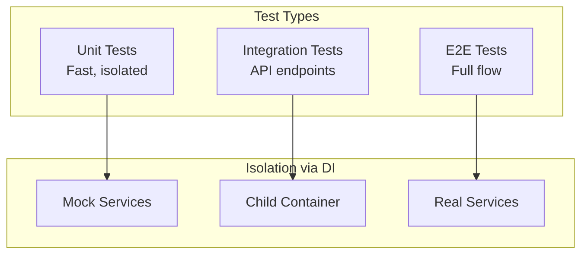
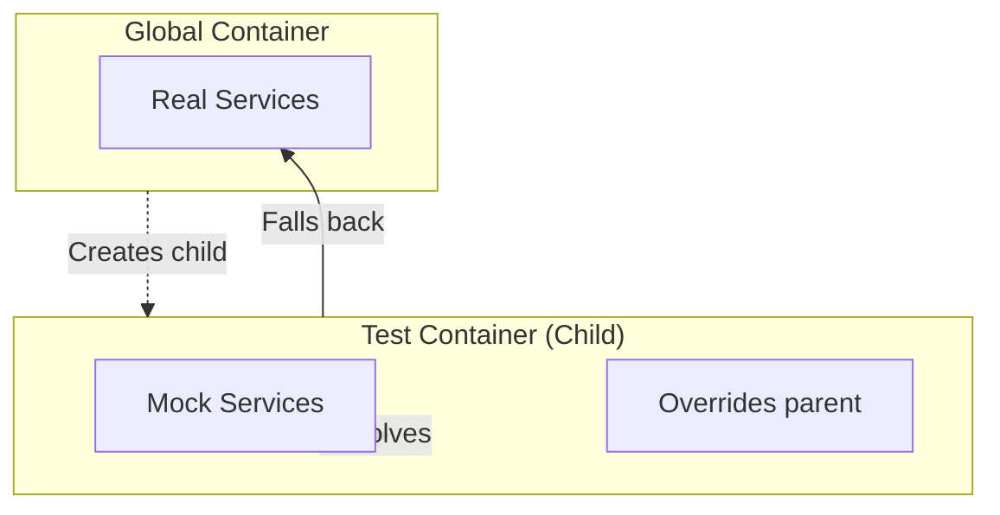

# Testing

> Test your NextRush applications with confidence — unit tests, integration tests, and DI mocking.

## What You'll Learn

- Set up a testing environment
- Write unit tests for services
- Test controllers with integration tests
- Mock dependencies using DI
- Test protected routes and guards

## Testing Philosophy

NextRush is designed for testability:



| Test Type | Scope | Speed | DI Approach |
|-----------|-------|-------|-------------|
| **Unit** | Single class/function | Fast | Mock everything |
| **Integration** | API endpoint | Medium | Child container |
| **E2E** | Full application | Slow | Real services |

## Project Setup

### Install Testing Dependencies

```bash
# Vitest (recommended)
pnpm add -D vitest @vitest/coverage-v8

# Supertest for HTTP testing
pnpm add -D supertest @types/supertest
```

### Configure Vitest

```typescript
// vitest.config.ts
import { defineConfig } from 'vitest/config';

export default defineConfig({
  test: {
    globals: true,
    environment: 'node',
    include: ['src/**/*.test.ts', 'src/**/*.spec.ts'],
    coverage: {
      provider: 'v8',
      reporter: ['text', 'html'],
      exclude: ['**/*.test.ts', '**/*.spec.ts', '**/types/**'],
    },
    setupFiles: ['./src/test/setup.ts'],
  },
});
```

### Test Setup File

```typescript
// src/test/setup.ts
import 'reflect-metadata';

// Reset container between tests
import { container } from '@nextrush/controllers';

beforeEach(() => {
  container.clearInstances();
});
```

## Unit Testing Services

### Basic Service Test

```typescript
// src/services/user.service.test.ts
import { describe, it, expect, beforeEach } from 'vitest';
import { UserService } from './user.service';

describe('UserService', () => {
  let service: UserService;

  beforeEach(() => {
    service = new UserService();
  });

  describe('findAll', () => {
    it('should return empty array initially', () => {
      const users = service.findAll();
      expect(users).toEqual([]);
    });
  });

  describe('create', () => {
    it('should create a user with generated id', () => {
      const user = service.create({ name: 'Alice', email: 'alice@example.com' });

      expect(user).toMatchObject({
        name: 'Alice',
        email: 'alice@example.com',
      });
      expect(user.id).toBeDefined();
    });
  });

  describe('findById', () => {
    it('should return user when exists', () => {
      const created = service.create({ name: 'Alice', email: 'alice@example.com' });
      const found = service.findById(created.id);

      expect(found).toEqual(created);
    });

    it('should return undefined when not exists', () => {
      const found = service.findById('non-existent');

      expect(found).toBeUndefined();
    });
  });
});
```

### Testing Services with Dependencies

```typescript
// src/services/order.service.test.ts
import { describe, it, expect, beforeEach, vi } from 'vitest';
import { OrderService } from './order.service';
import type { UserService } from './user.service';
import type { PaymentService } from './payment.service';

describe('OrderService', () => {
  let orderService: OrderService;
  let mockUserService: UserService;
  let mockPaymentService: PaymentService;

  beforeEach(() => {
    // Create mocks
    mockUserService = {
      findById: vi.fn(),
    } as unknown as UserService;

    mockPaymentService = {
      charge: vi.fn(),
    } as unknown as PaymentService;

    // Inject mocks manually
    orderService = new OrderService(mockUserService, mockPaymentService);
  });

  describe('createOrder', () => {
    it('should create order when user exists', async () => {
      vi.mocked(mockUserService.findById).mockResolvedValue({
        id: '1',
        name: 'Alice',
        email: 'alice@example.com',
      });
      vi.mocked(mockPaymentService.charge).mockResolvedValue({ success: true });

      const order = await orderService.createOrder('1', 100);

      expect(order.userId).toBe('1');
      expect(order.amount).toBe(100);
      expect(mockPaymentService.charge).toHaveBeenCalledWith('1', 100);
    });

    it('should throw when user not found', async () => {
      vi.mocked(mockUserService.findById).mockResolvedValue(null);

      await expect(
        orderService.createOrder('unknown', 100)
      ).rejects.toThrow('User not found');
    });
  });
});
```

## Integration Testing Controllers

### Test Utilities

```typescript
// src/test/utils.ts
import 'reflect-metadata';
import { createApp } from '@nextrush/core';
import { createRouter } from '@nextrush/router';
import { json } from '@nextrush/body-parser';
import { errorHandler } from '@nextrush/errors';
import { controllersPlugin, createContainer } from '@nextrush/controllers';
import type { ContainerInterface } from '@nextrush/di';
import type { Application } from '@nextrush/core';
import supertest from 'supertest';
import type { Server } from 'http';

interface TestApp {
  app: Application;
  container: ContainerInterface;
  request: supertest.SuperTest<supertest.Test>;
  close: () => void;
}

export async function createTestApp(
  controllers: Function[],
  setup?: (container: ContainerInterface) => void
): Promise<TestApp> {
  const app = createApp();
  const router = createRouter();
  const container = createContainer();

  // Allow custom DI setup
  if (setup) {
    setup(container);
  }

  app.use(errorHandler());
  app.use(json());

  await app.pluginAsync(
    controllersPlugin({
      router,
      controllers,
      container,
    })
  );

  app.use(router.routes());

  const server = app.listen(0) as Server;
  const address = server.address();
  const port = typeof address === 'object' ? address?.port : 0;

  return {
    app,
    container,
    request: supertest(`http://localhost:${port}`),
    close: () => server.close(),
  };
}
```

### Controller Integration Test

```typescript
// src/controllers/user.controller.test.ts
import { describe, it, expect, beforeAll, afterAll } from 'vitest';
import { createTestApp } from '../test/utils';
import { UserController } from './user.controller';
import { UserService } from '../services/user.service';

describe('UserController', () => {
  let testApp: Awaited<ReturnType<typeof createTestApp>>;

  beforeAll(async () => {
    testApp = await createTestApp([UserController]);
  });

  afterAll(() => {
    testApp.close();
  });

  describe('GET /users', () => {
    it('should return empty array initially', async () => {
      const res = await testApp.request.get('/users');

      expect(res.status).toBe(200);
      expect(res.body.users).toEqual([]);
    });
  });

  describe('POST /users', () => {
    it('should create a user', async () => {
      const res = await testApp.request
        .post('/users')
        .send({ name: 'Alice', email: 'alice@example.com' });

      expect(res.status).toBe(201);
      expect(res.body.user).toMatchObject({
        name: 'Alice',
        email: 'alice@example.com',
      });
    });

    it('should return 400 for invalid data', async () => {
      const res = await testApp.request
        .post('/users')
        .send({ name: '' });  // Missing email

      expect(res.status).toBe(400);
    });
  });

  describe('GET /users/:id', () => {
    it('should return user when exists', async () => {
      // Create a user first
      const createRes = await testApp.request
        .post('/users')
        .send({ name: 'Bob', email: 'bob@example.com' });

      const userId = createRes.body.user.id;

      const res = await testApp.request.get(`/users/${userId}`);

      expect(res.status).toBe(200);
      expect(res.body.user.id).toBe(userId);
    });

    it('should return 404 when not found', async () => {
      const res = await testApp.request.get('/users/non-existent');

      expect(res.status).toBe(404);
    });
  });
});
```

## Mocking with DI

### Child Container for Testing



### Mock Service Registration

```typescript
// src/controllers/user.controller.test.ts
import { describe, it, expect, beforeAll, afterAll, vi } from 'vitest';
import { createTestApp } from '../test/utils';
import { UserController } from './user.controller';
import { UserService } from '../services/user.service';

describe('UserController with mocked service', () => {
  let testApp: Awaited<ReturnType<typeof createTestApp>>;
  let mockUserService: UserService;

  beforeAll(async () => {
    // Create mock
    mockUserService = {
      findAll: vi.fn().mockReturnValue([
        { id: '1', name: 'Mock User', email: 'mock@example.com' }
      ]),
      findById: vi.fn(),
      create: vi.fn(),
      update: vi.fn(),
      delete: vi.fn(),
    } as unknown as UserService;

    // Setup test app with mock
    testApp = await createTestApp([UserController], (container) => {
      container.register(UserService, { useValue: mockUserService });
    });
  });

  afterAll(() => {
    testApp.close();
  });

  it('should use mocked service', async () => {
    const res = await testApp.request.get('/users');

    expect(res.status).toBe(200);
    expect(res.body.users).toHaveLength(1);
    expect(res.body.users[0].name).toBe('Mock User');
    expect(mockUserService.findAll).toHaveBeenCalled();
  });
});
```

### Mock Class Implementation

```typescript
// src/test/mocks/user.service.mock.ts
import { Service } from '@nextrush/controllers';
import type { User, CreateUserDto, UpdateUserDto } from '../../types/user';

@Service()
export class MockUserService {
  private users: User[] = [
    { id: '1', name: 'Test User', email: 'test@example.com', createdAt: new Date(), updatedAt: new Date() }
  ];

  findAll(): User[] {
    return this.users;
  }

  findById(id: string): User | undefined {
    return this.users.find(u => u.id === id);
  }

  create(data: CreateUserDto): User {
    const user: User = {
      id: `mock-${Date.now()}`,
      ...data,
      createdAt: new Date(),
      updatedAt: new Date(),
    };
    this.users.push(user);
    return user;
  }

  update(id: string, data: UpdateUserDto): User | undefined {
    const user = this.findById(id);
    if (!user) return undefined;
    Object.assign(user, data, { updatedAt: new Date() });
    return user;
  }

  delete(id: string): boolean {
    const index = this.users.findIndex(u => u.id === id);
    if (index === -1) return false;
    this.users.splice(index, 1);
    return true;
  }

  // Test helper methods
  reset(): void {
    this.users = [];
  }

  seed(users: User[]): void {
    this.users = users;
  }
}
```

## Testing Protected Routes

### Testing Guards

```typescript
// src/guards/auth.guard.test.ts
import { describe, it, expect, vi } from 'vitest';
import type { GuardContext } from '@nextrush/controllers';
import { AuthGuard } from './auth.guard';
import { AuthService } from '../services/auth.service';

describe('AuthGuard', () => {
  function createMockContext(overrides: Partial<GuardContext> = {}): GuardContext {
    return {
      method: 'GET',
      path: '/test',
      params: {},
      query: {},
      body: null,
      headers: {},
      state: {},
      get: vi.fn(),
      set: vi.fn(),
      ...overrides,
    };
  }

  it('should reject when no authorization header', async () => {
    const mockAuthService = { verifyToken: vi.fn() } as unknown as AuthService;
    const guard = new AuthGuard(mockAuthService);

    const ctx = createMockContext({
      get: vi.fn().mockReturnValue(undefined),
    });

    const result = await guard.canActivate(ctx);

    expect(result).toBe(false);
  });

  it('should reject when token is invalid', async () => {
    const mockAuthService = {
      verifyToken: vi.fn().mockResolvedValue(null),
    } as unknown as AuthService;
    const guard = new AuthGuard(mockAuthService);

    const ctx = createMockContext({
      get: vi.fn().mockReturnValue('Bearer invalid-token'),
    });

    const result = await guard.canActivate(ctx);

    expect(result).toBe(false);
    expect(mockAuthService.verifyToken).toHaveBeenCalledWith('invalid-token');
  });

  it('should allow when token is valid', async () => {
    const user = { id: '1', email: 'test@example.com' };
    const mockAuthService = {
      verifyToken: vi.fn().mockResolvedValue(user),
    } as unknown as AuthService;
    const guard = new AuthGuard(mockAuthService);

    const ctx = createMockContext({
      get: vi.fn().mockReturnValue('Bearer valid-token'),
    });

    const result = await guard.canActivate(ctx);

    expect(result).toBe(true);
    expect(ctx.state.user).toEqual(user);
  });
});
```

### Integration Test with Auth

```typescript
// src/controllers/protected.controller.test.ts
import { describe, it, expect, beforeAll, afterAll } from 'vitest';
import { createTestApp } from '../test/utils';
import { ProtectedController } from './protected.controller';
import { AuthService } from '../services/auth.service';
import { JwtService } from '../services/jwt.service';

describe('ProtectedController', () => {
  let testApp: Awaited<ReturnType<typeof createTestApp>>;
  let validToken: string;

  beforeAll(async () => {
    // Create real JWT service for generating test tokens
    const jwtService = new JwtService();
    validToken = jwtService.generateAccessToken({
      sub: 'test-user-1',
      email: 'test@example.com',
      role: 'user',
    });

    testApp = await createTestApp([ProtectedController], (container) => {
      container.register(JwtService, { useValue: jwtService });
    });
  });

  afterAll(() => {
    testApp.close();
  });

  describe('GET /protected/me', () => {
    it('should return user when authenticated', async () => {
      const res = await testApp.request
        .get('/protected/me')
        .set('Authorization', `Bearer ${validToken}`);

      expect(res.status).toBe(200);
      expect(res.body.user).toBeDefined();
    });

    it('should return 403 without token', async () => {
      const res = await testApp.request.get('/protected/me');

      expect(res.status).toBe(403);
    });

    it('should return 403 with invalid token', async () => {
      const res = await testApp.request
        .get('/protected/me')
        .set('Authorization', 'Bearer invalid-token');

      expect(res.status).toBe(403);
    });
  });
});
```

## Testing Patterns

### Arrange-Act-Assert

```typescript
it('should create user with valid data', async () => {
  // Arrange
  const userData = { name: 'Alice', email: 'alice@example.com' };

  // Act
  const res = await testApp.request
    .post('/users')
    .send(userData);

  // Assert
  expect(res.status).toBe(201);
  expect(res.body.user.name).toBe('Alice');
});
```

### Test Isolation

```typescript
describe('UserService', () => {
  let service: UserService;

  // Fresh instance for each test
  beforeEach(() => {
    service = new UserService();
  });

  it('test 1', () => {
    service.create({ name: 'A', email: 'a@test.com' });
    // Service has 1 user
  });

  it('test 2', () => {
    // Service is fresh, has 0 users
    expect(service.findAll()).toHaveLength(0);
  });
});
```

### Testing Error Cases

```typescript
describe('error handling', () => {
  it('should return 404 for non-existent resource', async () => {
    const res = await testApp.request.get('/users/non-existent');

    expect(res.status).toBe(404);
    expect(res.body.error).toBe('User not found');
  });

  it('should return 400 for invalid input', async () => {
    const res = await testApp.request
      .post('/users')
      .send({ name: '' });  // Invalid

    expect(res.status).toBe(400);
    expect(res.body.error).toContain('validation');
  });

  it('should return 409 for duplicate resource', async () => {
    await testApp.request
      .post('/users')
      .send({ name: 'Alice', email: 'alice@test.com' });

    const res = await testApp.request
      .post('/users')
      .send({ name: 'Alice 2', email: 'alice@test.com' });  // Same email

    expect(res.status).toBe(409);
  });
});
```

## Test Coverage

### Run Tests with Coverage

```bash
# Run all tests
pnpm test

# Run with coverage
pnpm test -- --coverage

# Run specific file
pnpm test -- src/services/user.service.test.ts

# Watch mode
pnpm test -- --watch
```

### Coverage Configuration

```typescript
// vitest.config.ts
export default defineConfig({
  test: {
    coverage: {
      provider: 'v8',
      reporter: ['text', 'html', 'lcov'],
      exclude: [
        '**/*.test.ts',
        '**/*.spec.ts',
        '**/types/**',
        '**/test/**',
        '**/mocks/**',
      ],
      thresholds: {
        lines: 80,
        functions: 80,
        branches: 80,
        statements: 80,
      },
    },
  },
});
```

## Test Organization

### Recommended Structure

```
src/
├── services/
│   ├── user.service.ts
│   └── user.service.test.ts      # Co-located tests
├── controllers/
│   ├── user.controller.ts
│   └── user.controller.test.ts
├── guards/
│   ├── auth.guard.ts
│   └── auth.guard.test.ts
└── test/
    ├── setup.ts                  # Global test setup
    ├── utils.ts                  # Test utilities
    └── mocks/
        ├── user.service.mock.ts
        └── auth.service.mock.ts
```

### Package.json Scripts

```json
{
  "scripts": {
    "test": "vitest run",
    "test:watch": "vitest",
    "test:coverage": "vitest run --coverage",
    "test:ui": "vitest --ui"
  }
}
```

## Best Practices

### Do

```typescript
// ✅ Test behavior, not implementation
it('should return user when found', async () => {
  const user = await service.findById('1');
  expect(user.name).toBe('Alice');
});

// ✅ Use descriptive test names
it('should return 404 when user does not exist', async () => {});

// ✅ Test one thing per test
it('should create user', () => {});
it('should hash password when creating user', () => {});

// ✅ Use mocks for external dependencies
const mockDb = { query: vi.fn() };
```

### Don't

```typescript
// ❌ Don't test implementation details
it('should call _internalMethod', () => {});

// ❌ Don't use vague names
it('should work', () => {});

// ❌ Don't test multiple things
it('should create user and send email and log event', () => {});

// ❌ Don't use real external services
const result = await fetch('https://api.external.com');
```

## Related Guides

- **[Class-Based Development](/guides/class-based-development)** — Controllers and DI
- **[Authentication](/guides/authentication)** — Testing protected routes
- **[Error Handling](/guides/error-handling)** — Testing error cases

## Related Packages

- **[@nextrush/controllers](/packages/controllers/)** — createContainer for testing
- **[@nextrush/di](/packages/di/)** — Dependency injection
