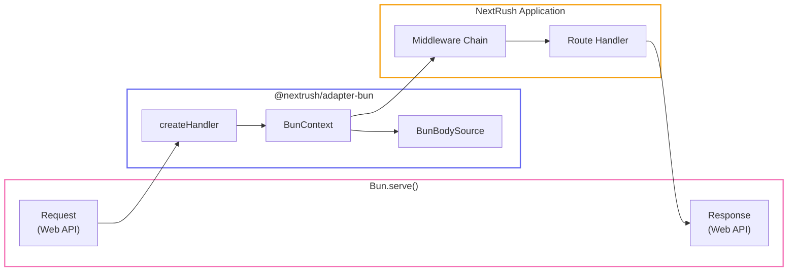

# Bun Adapter

> High-performance HTTP adapter for Bun's native server.

## Request Flow



## Installation

```bash
bun add @nextrush/adapter-bun @nextrush/core
```

## Quick Start

```typescript
import { createApp } from '@nextrush/core';
import { serve } from '@nextrush/adapter-bun';

const app = createApp();

app.use(async (ctx) => {
  ctx.json({ message: 'Hello from Bun!' });
});

serve(app, {
  port: 3000,
  onListen: ({ port }) => console.log(`🚀 Server running on port ${port}`)
});
```

## Why Bun?

Bun's native HTTP server is **significantly faster** than Node.js:

- **3-4x faster** request handling
- **Lower memory** usage
- **Native TypeScript** support
- **Built-in** Web APIs

NextRush's Bun adapter leverages these advantages while maintaining the same API.

## API Reference

### `serve(app, options?)`

Start a Bun HTTP server.

```typescript
import { serve } from '@nextrush/adapter-bun';

const server = serve(app, {
  port: 3000,
  hostname: '0.0.0.0',
  onListen: ({ port, hostname }) => {
    console.log(`Server running at http://${hostname}:${port}`);
  },
  onError: (error) => {
    console.error('Server error:', error);
  },
  development: false,
  maxRequestBodySize: 128 * 1024 * 1024, // 128MB
  tls: {
    cert: Bun.file('./cert.pem'),
    key: Bun.file('./key.pem'),
  },
});
```

**Options (`ServeOptions`):**

| Option | Type | Default | Description |
|--------|------|---------|-------------|
| `port` | `number` | `3000` | Port to listen on |
| `hostname` | `string` | `'0.0.0.0'` | Hostname to bind |
| `onListen` | `(info: { port: number; hostname: string }) => void` | - | Callback when server starts |
| `onError` | `(error: Error) => void` | - | Custom error handler |
| `tls` | `{ cert: string \| Buffer; key: string \| Buffer; ca?: string \| Buffer }` | - | TLS/HTTPS configuration |
| `maxRequestBodySize` | `number` | `128MB` | Maximum request body size |
| `development` | `boolean` | `false` | Enable Bun's development mode |

**Returns:** `ServerInstance`

```typescript
interface ServerInstance {
  server: ReturnType<typeof Bun.serve>;  // Bun server instance
  port: number;                          // Actual port
  hostname: string;                      // Actual hostname
  close(): Promise<void>;                // Close server gracefully
  address(): { port: number; hostname: string };
  reload(options?: Partial<ServeOptions>): void;  // Hot reload config
}
```

### `listen(app, port?)`

Shorthand to start server with default logging.

```typescript
import { listen } from '@nextrush/adapter-bun';

listen(app, 3000);
// Output: 🚀 NextRush listening on http://localhost:3000 (Bun)
```

**Parameters:**

| Parameter | Type | Default | Description |
|-----------|------|---------|-------------|
| `app` | `Application` | - | NextRush application |
| `port` | `number` | `3000` | Port to listen on |

**Returns:** `ServerInstance`

### `createHandler(app)`

Create a fetch handler for use with custom Bun.serve configurations.

```typescript
import { createHandler } from '@nextrush/adapter-bun';

const handler = createHandler(app);

// Use with Bun.serve
const server = Bun.serve({
  port: 3000,
  fetch: handler,
  // ... additional Bun options
});
```

**Returns:** `(request: Request, server: ReturnType<typeof Bun.serve>) => Promise<Response>`

::: tip Use Case
Use `createHandler()` when you need to:
- Configure WebSocket upgrades
- Use Bun-specific server options
- Integrate with existing Bun servers
:::

## BunContext

The `BunContext` class provides the execution context for Bun requests.

### Request Properties

```typescript
app.use(async (ctx) => {
  ctx.method;    // 'GET', 'POST', etc.
  ctx.url;       // Full URL including query string
  ctx.path;      // Path without query string
  ctx.query;     // Parsed query parameters
  ctx.params;    // Route parameters (from router)
  ctx.headers;   // Request headers
  ctx.ip;        // Client IP address (from Bun's requestIP)
  ctx.runtime;   // Always 'bun'
});
```

### Response Methods

```typescript
app.use(async (ctx) => {
  // Set status code
  ctx.status = 201;

  // Send JSON (uses Bun's optimized JSON)
  ctx.json({ data: 'value' });

  // Send text or buffer
  ctx.send('Hello World');
  ctx.send(new Uint8Array([1, 2, 3]));

  // Send HTML
  ctx.html('<h1>Hello</h1>');

  // Redirect
  ctx.redirect('/new-path');
  ctx.redirect('/new-path', 301);
});
```

### Header Helpers

```typescript
app.use(async (ctx) => {
  // Get request header
  const contentType = ctx.get('content-type');

  // Set response header
  ctx.set('X-Custom-Header', 'value');
});
```

### Error Helpers

```typescript
import { HttpError } from '@nextrush/adapter-bun';

app.use(async (ctx) => {
  // Throw HTTP error
  ctx.throw(404, 'User not found');

  // Assert with error
  ctx.assert(user, 404, 'User not found');

  // HttpError class
  throw new HttpError(400, 'Invalid input');
});
```

### Raw Access

```typescript
app.use(async (ctx) => {
  const { req } = ctx.raw;

  // Access Web API Request object
  const url = new URL(req.url);
  const headers = req.headers;

  ctx.json({
    url: url.pathname,
    userAgent: headers.get('user-agent'),
  });
});
```

## Body Parsing

The `BunBodySource` leverages Bun's optimized body parsing.

### Reading Body

```typescript
app.post('/data', async (ctx) => {
  // Uses Bun's native text() - highly optimized
  const text = await ctx.bodySource.text();

  // Uses Bun's native json() - faster than JSON.parse
  const json = await ctx.bodySource.json();

  // Uses Bun's native arrayBuffer()
  const buffer = await ctx.bodySource.buffer();

  // Stream for large bodies
  const stream = ctx.bodySource.stream();
});
```

### Body Source Properties

```typescript
app.post('/upload', async (ctx) => {
  ctx.bodySource.contentLength;  // Content-Length header value
  ctx.bodySource.contentType;    // Content-Type header value
  ctx.bodySource.consumed;       // Whether body has been read
});
```

### Body Errors

```typescript
import { BodyConsumedError, BodyTooLargeError } from '@nextrush/adapter-bun';

// BodyConsumedError: Thrown when body is read multiple times
// BodyTooLargeError: Thrown when body exceeds size limit
```

## Patterns

### HTTPS with TLS

```typescript
import { serve } from '@nextrush/adapter-bun';

serve(app, {
  port: 443,
  tls: {
    cert: Bun.file('cert.pem'),
    key: Bun.file('key.pem'),
  },
});
```

### Hot Reload Configuration

```typescript
const server = serve(app, { port: 3000 });

// Later, update configuration
server.reload({ port: 3001 });
```

### File Serving

Bun has optimized file serving:

```typescript
app.get('/files/:name', async (ctx) => {
  const { name } = ctx.params;
  const file = Bun.file(`./public/${name}`);

  if (await file.exists()) {
    ctx.set('Content-Type', file.type);
    ctx.send(await file.arrayBuffer());
  } else {
    ctx.status = 404;
    ctx.json({ error: 'File not found' });
  }
});
```

### Testing with Bun Test

```typescript
import { createHandler } from '@nextrush/adapter-bun';
import { describe, it, expect } from 'bun:test';

const app = createApp();
app.use((ctx) => ctx.json({ ok: true }));

const handler = createHandler(app);

describe('API', () => {
  it('should return ok', async () => {
    const request = new Request('http://localhost/test');
    const response = await handler(request, {} as any);
    const body = await response.json();

    expect(body).toEqual({ ok: true });
  });
});
```

## Performance Tips

### Use Bun's Native APIs

```typescript
// Prefer Bun.file over fs
const content = await Bun.file('data.json').text();

// Use Bun's native hashing
const hash = Bun.hash(data);

// Use Bun's native password hashing
const hashed = await Bun.password.hash(password);
```

### Optimize JSON

Bun's JSON parsing is faster than V8:

```typescript
app.post('/data', async (ctx) => {
  // This uses Bun's native JSON parsing
  const data = await ctx.bodySource.json();
  ctx.json(data);
});
```

### Hot Reloading

```bash
bun --hot run server.ts
```

## Exports

```typescript
import {
  // Server functions
  serve,
  listen,
  createHandler,

  // Context
  BunContext,
  createBunContext,
  HttpError,

  // Body source
  BunBodySource,
  createBunBodySource,
  EmptyBodySource,
  createEmptyBodySource,
  BodyConsumedError,
  BodyTooLargeError,

  // Utilities
  getContentLength,
  getContentType,
  parseQueryString,

  // Types
  type ServeOptions,
  type ServerInstance,
  type Application,
  type Context,
  type Middleware,
  type BodySource,
} from '@nextrush/adapter-bun';
```

## TypeScript

Full TypeScript support:

```typescript
import type { ServeOptions, ServerInstance } from '@nextrush/adapter-bun';
import type { Middleware } from '@nextrush/types';

const options: ServeOptions = {
  port: 3000,
  hostname: 'localhost',
  development: true,
};

// Type-safe middleware
const logger: Middleware = async (ctx) => {
  console.log(`${ctx.method} ${ctx.path}`);
  await ctx.next();
};
```

## See Also

- [Adapters Overview](/packages/adapters/)
- [Node.js Adapter](/packages/adapters/node)
- [Deno Adapter](/packages/adapters/deno)
- [Edge Adapter](/packages/adapters/edge)
