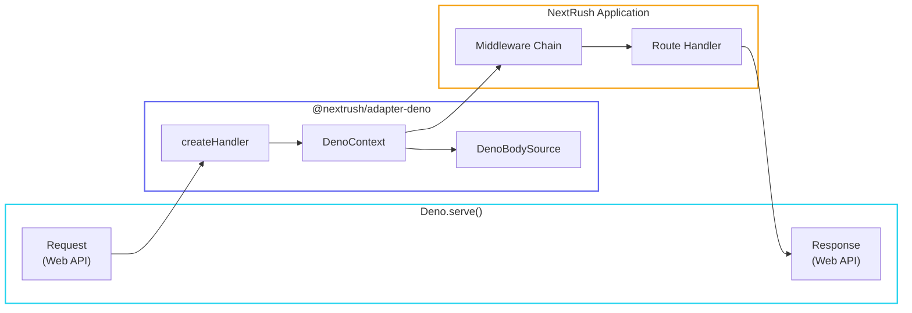

# Deno Adapter

> Type-safe HTTP adapter for Deno's native server.

## Request Flow



## Installation

```typescript
// Import directly (Deno style)
import { serve } from 'npm:@nextrush/adapter-deno';

// Or via import map
import { serve } from '@nextrush/adapter-deno';
```

## Quick Start

```typescript
import { createApp } from '@nextrush/core';
import { serve } from '@nextrush/adapter-deno';

const app = createApp();

app.use(async (ctx) => {
  ctx.json({ message: 'Hello from Deno!' });
});

const server = serve(app, {
  port: 3000,
  onListen: ({ port }) => console.log(`🚀 Server running on port ${port}`)
});
```

## Why Deno?

Deno offers unique advantages:

- **Secure by default** - Explicit permissions for network, filesystem, etc.
- **TypeScript native** - No compilation step needed
- **Web standard APIs** - Uses fetch, Request, Response
- **Modern tooling** - Built-in formatter, linter, test runner

NextRush's Deno adapter embraces these principles while providing a consistent API.

## API Reference

### `serve(app, options?)`

Start a Deno HTTP server.

```typescript
import { serve } from '@nextrush/adapter-deno';

const server = serve(app, {
  port: 3000,
  hostname: '0.0.0.0',
  onListen: ({ port, hostname }) => {
    console.log(`Server running at http://${hostname}:${port}`);
  },
  onError: (error) => {
    console.error('Server error:', error);
  },
  cert: await Deno.readTextFile('cert.pem'),
  key: await Deno.readTextFile('key.pem'),
});
```

**Options (`ServeOptions`):**

| Option | Type | Default | Description |
|--------|------|---------|-------------|
| `port` | `number` | `3000` | Port to listen on |
| `hostname` | `string` | `'0.0.0.0'` | Hostname to bind |
| `onListen` | `(info: { port: number; hostname: string }) => void` | - | Callback when server starts |
| `onError` | `(error: Error) => void` | - | Custom error handler |
| `cert` | `string` | - | TLS certificate for HTTPS |
| `key` | `string` | - | TLS private key for HTTPS |

**Returns:** `ServerInstance`

```typescript
interface ServerInstance {
  server: DenoServer;         // Deno server instance
  port: number;               // Actual port
  hostname: string;           // Actual hostname
  close(): Promise<void>;     // Close server gracefully
  address(): { port: number; hostname: string };
  finished: Promise<void>;    // Resolves when server finishes
}
```

### `listen(app, port?)`

Shorthand to start server with default logging.

```typescript
import { listen } from '@nextrush/adapter-deno';

listen(app, 3000);
// Output: 🚀 NextRush listening on http://localhost:3000 (Deno)
```

**Parameters:**

| Parameter | Type | Default | Description |
|-----------|------|---------|-------------|
| `app` | `Application` | - | NextRush application |
| `port` | `number` | `3000` | Port to listen on |

**Returns:** `ServerInstance`

### `createHandler(app)`

Create a fetch handler for use with custom Deno.serve configurations.

```typescript
import { createHandler } from '@nextrush/adapter-deno';

const handler = createHandler(app);

// Use with Deno.serve
Deno.serve({ port: 3000 }, handler);
```

**Returns:** `(request: Request, info: DenoServeHandlerInfo) => Promise<Response>`

::: tip Use Case
Use `createHandler()` when you need to:
- Deploy to Deno Deploy
- Configure custom Deno.serve options
- Integrate with existing Deno servers
:::

## DenoContext

The `DenoContext` class provides the execution context for Deno requests.

### Request Properties

```typescript
app.use(async (ctx) => {
  ctx.method;    // 'GET', 'POST', etc.
  ctx.url;       // Full URL including query string
  ctx.path;      // Path without query string
  ctx.query;     // Parsed query parameters
  ctx.params;    // Route parameters (from router)
  ctx.headers;   // Request headers
  ctx.ip;        // Client IP address (from remoteAddr)
  ctx.runtime;   // Always 'deno'
});
```

### Response Methods

```typescript
app.use(async (ctx) => {
  // Set status code
  ctx.status = 201;

  // Send JSON
  ctx.json({ data: 'value' });

  // Send text or buffer
  ctx.send('Hello World');
  ctx.send(new Uint8Array([1, 2, 3]));

  // Send HTML
  ctx.html('<h1>Hello</h1>');

  // Redirect
  ctx.redirect('/new-path');
  ctx.redirect('/new-path', 301);
});
```

### Header Helpers

```typescript
app.use(async (ctx) => {
  // Get request header
  const contentType = ctx.get('content-type');

  // Set response header
  ctx.set('X-Custom-Header', 'value');
});
```

### Error Helpers

```typescript
import { HttpError } from '@nextrush/adapter-deno';

app.use(async (ctx) => {
  // Throw HTTP error
  ctx.throw(404, 'User not found');

  // Assert with error
  ctx.assert(user, 404, 'User not found');

  // HttpError class
  throw new HttpError(400, 'Invalid input');
});
```

### Raw Access

```typescript
app.use(async (ctx) => {
  const { req } = ctx.raw;

  // Access Web API Request object
  const url = new URL(req.url);

  ctx.json({
    url: url.pathname,
    method: req.method,
  });
});
```

## Body Parsing

The `DenoBodySource` provides cross-runtime body reading.

### Reading Body

```typescript
app.post('/data', async (ctx) => {
  // Read as text
  const text = await ctx.bodySource.text();

  // Read as JSON
  const json = await ctx.bodySource.json();

  // Read as buffer
  const buffer = await ctx.bodySource.buffer();

  // Stream for large bodies
  const stream = ctx.bodySource.stream();
});
```

### Body Source Properties

```typescript
app.post('/upload', async (ctx) => {
  ctx.bodySource.contentLength;  // Content-Length header value
  ctx.bodySource.contentType;    // Content-Type header value
  ctx.bodySource.consumed;       // Whether body has been read
});
```

### Body Errors

```typescript
import { BodyConsumedError, BodyTooLargeError } from '@nextrush/adapter-deno';

// BodyConsumedError: Thrown when body is read multiple times
// BodyTooLargeError: Thrown when body exceeds size limit
```

## Patterns

### HTTPS with TLS

```typescript
import { serve } from '@nextrush/adapter-deno';

serve(app, {
  port: 443,
  cert: await Deno.readTextFile('cert.pem'),
  key: await Deno.readTextFile('key.pem'),
});
```

### Graceful Shutdown

```typescript
import { serve } from '@nextrush/adapter-deno';

const server = serve(app, { port: 3000 });

// Graceful shutdown on SIGINT
Deno.addSignalListener('SIGINT', async () => {
  console.log('Shutting down...');
  await server.close();
  Deno.exit(0);
});
```

### File Serving

```typescript
app.get('/files/:name', async (ctx) => {
  const { name } = ctx.params;

  try {
    const content = await Deno.readFile(`./public/${name}`);
    ctx.set('Content-Type', 'application/octet-stream');
    ctx.send(content);
  } catch {
    ctx.status = 404;
    ctx.json({ error: 'File not found' });
  }
});
```

### Testing with Deno Test

```typescript
import { createHandler } from '@nextrush/adapter-deno';
import { assertEquals } from 'https://deno.land/std/assert/mod.ts';

const app = createApp();
app.use((ctx) => ctx.json({ ok: true }));

const handler = createHandler(app);

Deno.test('API returns ok', async () => {
  const request = new Request('http://localhost/test');
  const mockInfo = { remoteAddr: { hostname: '127.0.0.1', port: 0 } };
  const response = await handler(request, mockInfo);
  const body = await response.json();

  assertEquals(body, { ok: true });
});
```

### Deploy to Deno Deploy

```typescript
// main.ts
import { createApp } from '@nextrush/core';
import { createHandler } from '@nextrush/adapter-deno';

const app = createApp();

app.use((ctx) => {
  ctx.json({ deployed: 'Deno Deploy' });
});

const handler = createHandler(app);

// Deno Deploy uses Deno.serve automatically
Deno.serve(handler);
```

## Permissions

Deno requires explicit permissions:

```bash
# Basic server
deno run --allow-net server.ts

# With file access
deno run --allow-net --allow-read server.ts

# With environment variables
deno run --allow-net --allow-env server.ts

# Production (all needed permissions)
deno run --allow-net --allow-read --allow-env server.ts
```

### Permission Checking

```typescript
app.get('/fs', async (ctx) => {
  // Check if we have permission before using
  const status = await Deno.permissions.query({ name: 'read', path: './' });

  if (status.state === 'granted') {
    const files = [];
    for await (const entry of Deno.readDir('./')) {
      files.push(entry.name);
    }
    ctx.json({ files });
  } else {
    ctx.status = 403;
    ctx.json({ error: 'File system access denied' });
  }
});
```

## Deno-Specific Features

### KV Store

```typescript
const kv = await Deno.openKv();

app.get('/counter', async (ctx) => {
  const key = ['counter'];
  const entry = await kv.get(key);
  const value = (entry.value as number) || 0;

  await kv.set(key, value + 1);

  ctx.json({ count: value + 1 });
});
```

### Web Streams

```typescript
app.get('/stream', (ctx) => {
  const stream = new ReadableStream({
    start(controller) {
      controller.enqueue(new TextEncoder().encode('Hello '));
      controller.enqueue(new TextEncoder().encode('World!'));
      controller.close();
    },
  });

  ctx.set('Content-Type', 'text/plain');
  ctx.send(stream);
});
```

## Exports

```typescript
import {
  // Server functions
  serve,
  listen,
  createHandler,

  // Context
  DenoContext,
  createDenoContext,
  HttpError,

  // Body source
  DenoBodySource,
  createDenoBodySource,
  EmptyBodySource,
  createEmptyBodySource,
  BodyConsumedError,
  BodyTooLargeError,

  // Utilities
  getContentLength,
  getContentType,
  parseQueryString,

  // Types
  type ServeOptions,
  type ServerInstance,
  type Application,
  type Context,
  type Middleware,
  type BodySource,
} from '@nextrush/adapter-deno';
```

## TypeScript

Full TypeScript support with Deno's built-in types:

```typescript
import type { ServeOptions, ServerInstance } from '@nextrush/adapter-deno';
import type { Middleware } from '@nextrush/types';

const options: ServeOptions = {
  port: 3000,
  hostname: 'localhost',
};

// Type-safe middleware
const logger: Middleware = async (ctx) => {
  console.log(`${ctx.method} ${ctx.path}`);
  await ctx.next();
};
```

## Import Maps

Create `deno.json`:

```json
{
  "imports": {
    "@nextrush/core": "npm:@nextrush/core",
    "@nextrush/adapter-deno": "npm:@nextrush/adapter-deno"
  }
}
```

Then import cleanly:

```typescript
import { createApp } from '@nextrush/core';
import { serve } from '@nextrush/adapter-deno';
```

## See Also

- [Adapters Overview](/packages/adapters/)
- [Node.js Adapter](/packages/adapters/node)
- [Bun Adapter](/packages/adapters/bun)
- [Edge Adapter](/packages/adapters/edge)
