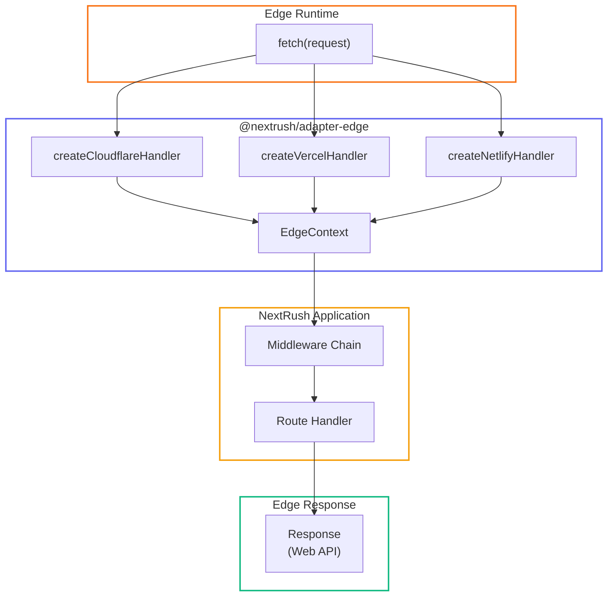

# Edge Adapter

> Deploy NextRush to edge runtimes: Cloudflare Workers, Vercel Edge, Netlify Edge.

## Architecture



## Installation

```bash
pnpm add @nextrush/adapter-edge
```

## Quick Start

::: code-group

```typescript [Cloudflare Workers]
import { createApp } from '@nextrush/core';
import { createCloudflareHandler } from '@nextrush/adapter-edge';

const app = createApp();

app.get('/', (ctx) => {
  ctx.json({ edge: 'Cloudflare Workers' });
});

export default createCloudflareHandler(app);
```

```typescript [Vercel Edge]
import { createApp } from '@nextrush/core';
import { createVercelHandler } from '@nextrush/adapter-edge';

const app = createApp();

app.get('/api/hello', (ctx) => {
  ctx.json({ edge: 'Vercel Edge' });
});

export default createVercelHandler(app);
```

```typescript [Netlify Edge]
import { createApp } from '@nextrush/core';
import { createNetlifyHandler } from '@nextrush/adapter-edge';

const app = createApp();

app.get('/', (ctx) => {
  ctx.json({ edge: 'Netlify Edge' });
});

export default createNetlifyHandler(app);
```

:::

## Why Edge?

Edge runtimes execute code close to users:

- **Low latency** - Requests served from nearest edge location
- **Global scale** - Automatic distribution across regions
- **No cold starts** - Instant startup (vs serverless functions)
- **Cost effective** - Pay only for execution time

Trade-offs:
- **Limited APIs** - No filesystem, limited Node.js APIs
- **Execution limits** - CPU time and memory constraints
- **Stateless** - No persistent connections or local state

## API Reference

### `createFetchHandler(app, options?)`

Create a universal fetch handler for any edge runtime.

```typescript
import { createFetchHandler } from '@nextrush/adapter-edge';

const handler = createFetchHandler(app);

// Works with any runtime that supports fetch handler
export default handler;
```

**Parameters:**

| Parameter | Type | Required | Description |
|-----------|------|----------|-------------|
| `app` | `Application` | Yes | NextRush application instance |
| `options` | `FetchHandlerOptions` | No | Handler configuration |

**Returns:** `FetchHandler` - `(request: Request, ctx?: EdgeExecutionContext) => Promise<Response>`

### `createCloudflareHandler(app, options?)`

Create a handler optimized for Cloudflare Workers. Returns a module export object.

```typescript
import { createCloudflareHandler } from '@nextrush/adapter-edge';

// Direct export (recommended)
export default createCloudflareHandler(app);

// Or use with env/ctx
export default {
  fetch: (request, env, ctx) => {
    const handler = createCloudflareHandler(app);
    return handler.fetch(request, { env, ctx });
  },
};
```

**Returns:** `{ fetch: FetchHandler }` - Cloudflare module export object

### `createVercelHandler(app, options?)`

Create a handler for Vercel Edge Functions.

```typescript
import { createVercelHandler } from '@nextrush/adapter-edge';

export default createVercelHandler(app);

// Configure as edge function
export const config = {
  runtime: 'edge',
};
```

**Returns:** `FetchHandler`

### `createNetlifyHandler(app, options?)`

Create a handler for Netlify Edge Functions.

```typescript
import { createNetlifyHandler } from '@nextrush/adapter-edge';

export default createNetlifyHandler(app);
```

**Returns:** `FetchHandler`

### `createHandler(app, options?)`

Alias for `createFetchHandler` for convenience.

```typescript
import { createHandler } from '@nextrush/adapter-edge';

const handler = createHandler(app);
```

### `FetchHandlerOptions`

Configuration options for handler creation.

```typescript
interface FetchHandlerOptions {
  /**
   * Custom error handler
   * Called when an error occurs during request handling
   */
  onError?: (error: Error, ctx: EdgeContext) => Response | Promise<Response>;
}
```

**Example with custom error handler:**

```typescript
const handler = createFetchHandler(app, {
  onError: (error, ctx) => {
    console.error('Request failed:', error.message);

    return new Response(
      JSON.stringify({
        error: 'Internal Server Error',
        requestId: crypto.randomUUID(),
      }),
      {
        status: 500,
        headers: { 'Content-Type': 'application/json' },
      }
    );
  },
});
```

## EdgeContext

The `EdgeContext` class provides the execution context for edge requests.

### Properties

| Property | Type | Description |
|----------|------|-------------|
| `method` | `HttpMethod` | HTTP method (GET, POST, etc.) |
| `url` | `string` | Full URL with path and query |
| `path` | `string` | URL path without query string |
| `query` | `Record<string, string \| string[]>` | Parsed query parameters |
| `headers` | `Record<string, string \| string[]>` | Request headers |
| `params` | `Record<string, string>` | Route parameters |
| `body` | `unknown` | Parsed request body |
| `ip` | `string` | Client IP address |
| `status` | `number` | Response status code (default: 200) |
| `state` | `Record<string, unknown>` | State bag for middleware |
| `runtime` | `Runtime` | Detected runtime ('cloudflare-workers', 'edge', etc.) |
| `bodySource` | `BodySource` | Cross-runtime body reading |
| `raw` | `{ req: Request, res: undefined }` | Raw Request object |
| `executionContext` | `EdgeExecutionContext` | Edge-specific execution context |
| `responded` | `boolean` | Whether response has been sent |

### Response Methods

```typescript
// Send JSON response
ctx.json({ message: 'Hello' });

// Send text/buffer response
ctx.send('Hello World');
ctx.send(new Uint8Array([72, 105]));

// Send HTML response
ctx.html('<h1>Hello</h1>');

// Redirect
ctx.redirect('/new-path');        // 302 by default
ctx.redirect('/new-path', 301);   // Permanent redirect
```

### Header Methods

```typescript
// Set response header
ctx.set('X-Custom-Header', 'value');
ctx.set('Cache-Control', 'max-age=3600');

// Get request header
const auth = ctx.get('authorization');
const contentType = ctx.get('content-type');
```

### Middleware Methods

```typescript
// Call next middleware
await ctx.next();

// Throw HTTP error
ctx.throw(404, 'Not Found');
ctx.throw(401);  // Uses default message

// Assert condition
ctx.assert(user, 401, 'Authentication required');
```

### Edge-Specific Methods

```typescript
// Extend request lifetime for background work
ctx.waitUntil(
  fetch('https://analytics.example.com/track', {
    method: 'POST',
    body: JSON.stringify({ path: ctx.path }),
  })
);

// Get final Response object
const response = ctx.getResponse();

// Mark as responded (for custom response handling)
ctx.markResponded();
```

### Body Reading

```typescript
app.post('/data', async (ctx) => {
  // Using bodySource (cross-runtime compatible)
  const json = await ctx.bodySource.json();
  const text = await ctx.bodySource.text();
  const buffer = await ctx.bodySource.buffer();
  const stream = ctx.bodySource.stream();

  ctx.json({ received: json });
});
```

## Runtime Detection

Automatically detect the current edge runtime:

```typescript
import { detectEdgeRuntime } from '@nextrush/adapter-edge';

const info = detectEdgeRuntime();
// {
//   runtime: 'cloudflare-workers',
//   isCloudflare: true,
//   isVercel: false,
//   isNetlify: false,
//   isGenericEdge: false
// }
```

### `EdgeRuntimeInfo`

```typescript
interface EdgeRuntimeInfo {
  runtime: Runtime;       // 'cloudflare-workers' | 'vercel-edge' | 'edge'
  isCloudflare: boolean;
  isVercel: boolean;
  isNetlify: boolean;
  isGenericEdge: boolean;
}
```

### Runtime Context Property

```typescript
app.get('/info', (ctx) => {
  console.log(ctx.runtime);
  // 'cloudflare-workers' | 'vercel-edge' | 'edge'
});
```

## Body Source Classes

### `EdgeBodySource`

Read request bodies with cross-runtime compatibility.

```typescript
import { EdgeBodySource } from '@nextrush/adapter-edge';

const bodySource = new EdgeBodySource(request, {
  limit: 1024 * 1024,  // 1MB limit (default)
  encoding: 'utf-8',
});

// Properties
bodySource.consumed;       // boolean - whether body was read
bodySource.contentLength;  // number | undefined
bodySource.contentType;    // string | undefined

// Methods
await bodySource.text();   // string
await bodySource.json();   // T
await bodySource.buffer(); // Uint8Array
bodySource.stream();       // ReadableStream<Uint8Array>
```

### Body Errors

```typescript
import { BodyConsumedError, BodyTooLargeError } from '@nextrush/adapter-edge';

try {
  const data = await ctx.bodySource.json();
} catch (error) {
  if (error instanceof BodyConsumedError) {
    // Body was already read
  }
  if (error instanceof BodyTooLargeError) {
    // Body exceeds size limit
    console.log(error.limit);    // configured limit
    console.log(error.received); // actual size
  }
}
```

## Platform-Specific Patterns

### Cloudflare Workers

#### KV Storage

```typescript
interface Env {
  MY_KV: KVNamespace;
}

const app = createApp();

app.get('/kv/:key', async (ctx) => {
  const { key } = ctx.params;
  const env = ctx.state.env as Env;

  const value = await env.MY_KV.get(key);

  if (value) {
    ctx.json({ key, value });
  } else {
    ctx.status = 404;
    ctx.json({ error: 'Key not found' });
  }
});

export default {
  fetch: (request: Request, env: Env, executionCtx: ExecutionContext) => {
    const handler = createFetchHandler(app);
    return handler(request, { ...executionCtx, env });
  },
};
```

#### D1 Database

```typescript
interface Env {
  DB: D1Database;
}

app.get('/users', async (ctx) => {
  const env = ctx.state.env as Env;
  const { results } = await env.DB.prepare('SELECT * FROM users').all();
  ctx.json(results);
});
```

#### R2 Storage

```typescript
interface Env {
  BUCKET: R2Bucket;
}

app.get('/files/:name', async (ctx) => {
  const { name } = ctx.params;
  const env = ctx.state.env as Env;

  const object = await env.BUCKET.get(name);

  if (object) {
    ctx.set('Content-Type', object.httpMetadata?.contentType || 'application/octet-stream');
    ctx.send(await object.arrayBuffer());
  } else {
    ctx.status = 404;
    ctx.json({ error: 'File not found' });
  }
});
```

#### waitUntil for Background Work

```typescript
app.post('/async', async (ctx) => {
  const data = await ctx.bodySource.json();

  // Don't wait for background work
  ctx.waitUntil(
    fetch('https://analytics.example.com/track', {
      method: 'POST',
      body: JSON.stringify(data),
    })
  );

  ctx.json({ queued: true });
});
```

### Vercel Edge

#### Edge Config

```typescript
import { get } from '@vercel/edge-config';

app.get('/config/:key', async (ctx) => {
  const { key } = ctx.params;
  const value = await get(key);

  ctx.json({ key, value });
});

export const config = {
  runtime: 'edge',
};
```

#### Geolocation Headers

```typescript
app.get('/geo', (ctx) => {
  ctx.json({
    city: ctx.get('x-vercel-ip-city'),
    country: ctx.get('x-vercel-ip-country'),
    region: ctx.get('x-vercel-ip-country-region'),
  });
});
```

### Netlify Edge

#### Netlify Blobs

```typescript
import { getStore } from '@netlify/blobs';

app.get('/blob/:key', async (ctx) => {
  const { key } = ctx.params;
  const store = getStore('my-store');

  const value = await store.get(key, { type: 'json' });

  if (value) {
    ctx.json(value);
  } else {
    ctx.status = 404;
    ctx.json({ error: 'Not found' });
  }
});
```

## Utility Functions

### `getContentLength(headers)`

Get Content-Length header as number.

```typescript
import { getContentLength } from '@nextrush/adapter-edge';

const length = getContentLength(request.headers);
// number | undefined
```

### `getContentType(headers)`

Get Content-Type header value.

```typescript
import { getContentType } from '@nextrush/adapter-edge';

const type = getContentType(request.headers);
// string | undefined
```

### `parseQueryString(queryString)`

Parse query string into object.

```typescript
import { parseQueryString } from '@nextrush/adapter-edge';

const params = parseQueryString('name=John&tags=a&tags=b');
// { name: 'John', tags: ['a', 'b'] }
```

## Edge Limitations

### No Filesystem

```typescript
// ❌ Does not work on edge
import fs from 'fs';
const content = fs.readFileSync('file.txt');

// ✅ Use KV, R2, or fetch instead
const content = await env.KV.get('file-content');
const content = await fetch('https://cdn.example.com/file.txt').then(r => r.text());
```

### Limited Node.js APIs

```typescript
// ❌ Not available
import { createServer } from 'http';
import { spawn } from 'child_process';

// ✅ Use Web APIs
const response = await fetch('https://api.example.com/data');
const hash = await crypto.subtle.digest('SHA-256', data);
```

### Execution Limits

| Platform | CPU Time | Memory | Body Size |
|----------|----------|--------|-----------|
| Cloudflare Workers | 10-30ms | 128MB | 100MB |
| Vercel Edge | 30s | 128MB | 4MB |
| Netlify Edge | 50ms | 512MB | 4MB |

### No Persistent Connections

```typescript
// ❌ Connection closes after response
const db = await connect('postgres://...');

// ✅ Use connection pooling services
const data = await fetch('https://your-api.com/query', {
  method: 'POST',
  body: JSON.stringify({ query: 'SELECT * FROM users' }),
});
```

## Best Practices

### Cache Responses

```typescript
app.get('/cached', (ctx) => {
  ctx.set('Cache-Control', 'public, max-age=3600');
  ctx.json({ data: 'cached for 1 hour' });
});
```

### Stream Large Responses

```typescript
app.get('/stream', (ctx) => {
  const stream = new ReadableStream({
    async start(controller) {
      for (let i = 0; i < 1000; i++) {
        controller.enqueue(new TextEncoder().encode(`Line ${i}\n`));
        await new Promise(r => setTimeout(r, 10));
      }
      controller.close();
    },
  });

  ctx.set('Content-Type', 'text/plain');
  ctx.send(stream);
});
```

## Testing

```typescript
import { createFetchHandler } from '@nextrush/adapter-edge';
import { describe, it, expect } from 'vitest';

const app = createApp();
app.get('/test', (ctx) => ctx.json({ ok: true }));

const handler = createFetchHandler(app);

describe('Edge Handler', () => {
  it('should handle requests', async () => {
    const request = new Request('http://localhost/test');
    const response = await handler(request);
    const body = await response.json();

    expect(body).toEqual({ ok: true });
  });
});
```

## TypeScript

Full TypeScript support with all types exported:

```typescript
import type {
  EdgeContext,
  EdgeExecutionContext,
  EdgeRuntimeInfo,
  FetchHandler,
  FetchHandlerOptions,
} from '@nextrush/adapter-edge';

import {
  EdgeBodySource,
  EmptyBodySource,
  BodyConsumedError,
  BodyTooLargeError,
  createEdgeContext,
  createEdgeBodySource,
  createEmptyBodySource,
} from '@nextrush/adapter-edge';
```

## Complete Exports

```typescript
// Handler creators
export { createFetchHandler, createCloudflareHandler, createVercelHandler, createNetlifyHandler, createHandler } from '@nextrush/adapter-edge';

// Types
export type { FetchHandler, FetchHandlerOptions } from '@nextrush/adapter-edge';

// Context
export { EdgeContext, createEdgeContext } from '@nextrush/adapter-edge';
export type { EdgeExecutionContext } from '@nextrush/adapter-edge';

// Body source
export { EdgeBodySource, EmptyBodySource, createEdgeBodySource, createEmptyBodySource, BodyConsumedError, BodyTooLargeError } from '@nextrush/adapter-edge';

// Utilities
export { detectEdgeRuntime, getContentLength, getContentType, parseQueryString } from '@nextrush/adapter-edge';
export type { EdgeRuntimeInfo } from '@nextrush/adapter-edge';

// Re-exports from @nextrush/types
export type { BodySource, Runtime, RuntimeCapabilities } from '@nextrush/adapter-edge';
```

## Deployment

### Cloudflare Workers

```bash
# wrangler.toml
name = "my-api"
main = "src/index.ts"
compatibility_date = "2025-01-01"

# Deploy
wrangler deploy
```

### Vercel Edge

```bash
# vercel.json
{
  "functions": {
    "api/**/*.ts": {
      "runtime": "edge"
    }
  }
}

# Deploy
vercel deploy
```

### Netlify Edge

```bash
# netlify.toml
[[edge_functions]]
  function = "api"
  path = "/api/*"

# Deploy
netlify deploy
```

## See Also

- [Adapters Overview](/adapters/)
- [Node.js Adapter](/adapters/node)
- [Bun Adapter](/adapters/bun)
- [Deno Adapter](/adapters/deno)
