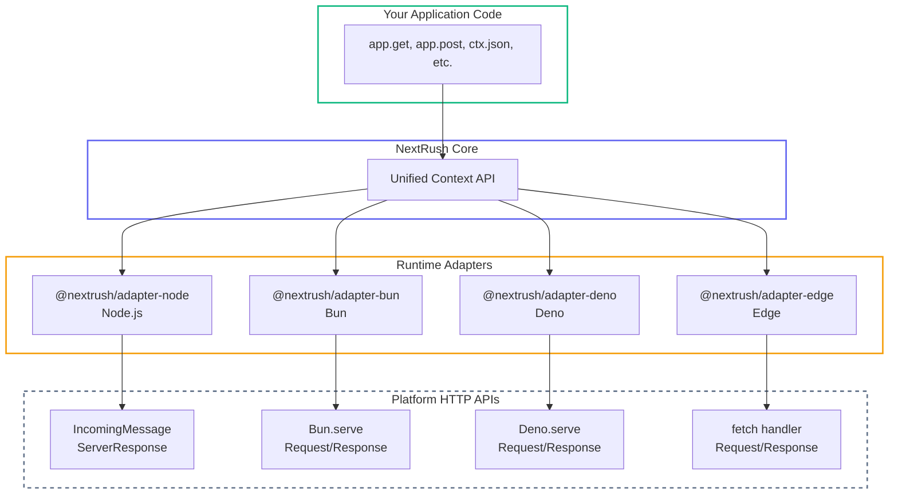

# Adapters

> Platform-specific HTTP adapters for running NextRush on any JavaScript runtime.

## The Problem

Modern JavaScript runs everywhere—Node.js servers, Bun, Deno, Cloudflare Workers, Vercel Edge Functions. But each runtime has different HTTP APIs:

**Node.js** uses `IncomingMessage`/`ServerResponse` with streams and event emitters. **Bun** and **Deno** use the Web Fetch API with `Request`/`Response` objects. **Edge runtimes** have unique constraints like no filesystem access and request limits.

Building a framework that works consistently across all these environments while maximizing performance on each is hard. Most frameworks either:

1. Target only one runtime (losing portability)
2. Use lowest-common-denominator abstractions (losing performance)
3. Require different code for different platforms (losing DX)

## How NextRush Approaches This

NextRush uses a **unified Context API** with **runtime-specific adapters**:



Write your app once. Deploy anywhere. Each adapter optimizes for its platform.

## Quick Start

Choose the adapter for your runtime:

::: code-group

```typescript [Node.js]
import { createApp } from '@nextrush/core';
import { serve } from '@nextrush/adapter-node';

const app = createApp();

app.get('/', (ctx) => {
  ctx.json({ runtime: 'node', message: 'Hello!' });
});

await serve(app, { port: 3000 });
```

```typescript [Bun]
import { createApp } from '@nextrush/core';
import { serve } from '@nextrush/adapter-bun';

const app = createApp();

app.get('/', (ctx) => {
  ctx.json({ runtime: 'bun', message: 'Hello!' });
});

serve(app, { port: 3000 });
```

```typescript [Deno]
import { createApp } from '@nextrush/core';
import { serve } from '@nextrush/adapter-deno';

const app = createApp();

app.get('/', (ctx) => {
  ctx.json({ runtime: 'deno', message: 'Hello!' });
});

await serve(app, { port: 3000 });
```

```typescript [Edge (Cloudflare)]
import { createApp } from '@nextrush/core';
import { createCloudflareHandler } from '@nextrush/adapter-edge';

const app = createApp();

app.get('/', (ctx) => {
  ctx.json({ runtime: 'cloudflare', message: 'Hello!' });
});

export default createCloudflareHandler(app);
```

:::

## Adapter Packages

| Package | Runtime | Install |
|---------|---------|---------|
| `@nextrush/adapter-node` | Node.js 20+ | `pnpm add @nextrush/adapter-node` |
| `@nextrush/adapter-bun` | Bun 1.0+ | `pnpm add @nextrush/adapter-bun` |
| `@nextrush/adapter-deno` | Deno 1.38+ | `pnpm add @nextrush/adapter-deno` |
| `@nextrush/adapter-edge` | Cloudflare/Vercel/Netlify | `pnpm add @nextrush/adapter-edge` |

## Common Patterns

### Runtime Detection

Every context includes the detected runtime:

```typescript
app.get('/info', (ctx) => {
  console.log(ctx.runtime); // 'node' | 'bun' | 'deno' | 'cloudflare-workers' | etc.

  ctx.json({
    runtime: ctx.runtime,
    timestamp: Date.now(),
  });
});
```

### Body Reading (Cross-Runtime)

All adapters provide a unified `bodySource` for reading request bodies:

```typescript
app.post('/data', async (ctx) => {
  // Works identically on Node.js, Bun, Deno, and Edge
  const text = await ctx.bodySource.text();
  const json = await ctx.bodySource.json();
  const buffer = await ctx.bodySource.buffer();

  ctx.json({ received: json });
});
```

### Using Body Parser

The body-parser middleware works transparently across all runtimes:

```typescript
import { createApp } from '@nextrush/core';
import { json } from '@nextrush/body-parser';

const app = createApp();
app.use(json());

app.post('/users', async (ctx) => {
  // ctx.body works on any runtime!
  const { name, email } = ctx.body as { name: string; email: string };
  ctx.json({ id: Date.now(), name, email });
});
```

## Detailed Adapter Guides

- [Node.js Adapter](/adapters/node) - Production Node.js servers
- [Bun Adapter](/adapters/bun) - Bun.serve() with native performance
- [Deno Adapter](/adapters/deno) - Deno.serve() with TypeScript
- [Edge Adapter](/adapters/edge) - Cloudflare Workers, Vercel Edge, Netlify Edge

## Runtime Package

For advanced use cases, the `@nextrush/runtime` package provides:

- Runtime detection utilities
- Cross-runtime BodySource abstraction
- Runtime capability checking

See [Runtime Package](/packages/runtime) for details.
