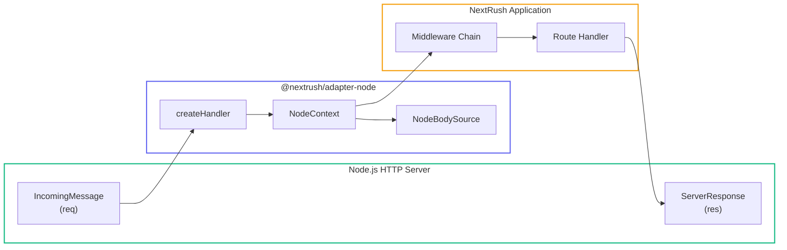

# Node.js Adapter

> Production-ready HTTP adapter for Node.js servers with zero external dependencies.

## Request Flow



## Installation

```bash
pnpm add @nextrush/adapter-node @nextrush/core
```

## Quick Start

```typescript
import { createApp } from '@nextrush/core';
import { serve } from '@nextrush/adapter-node';

const app = createApp();

app.use(async (ctx) => {
  ctx.json({ message: 'Hello from Node.js!' });
});

const server = await serve(app, {
  port: 3000,
  onListen: ({ port }) => console.log(`🚀 Server running on port ${port}`)
});
```

## API Reference

### `serve(app, options?)`

Start an HTTP server for the application.

```typescript
import { serve } from '@nextrush/adapter-node';

const server = await serve(app, {
  port: 3000,
  host: '0.0.0.0',
  onListen: ({ port, host }) => {
    console.log(`Server running at http://${host}:${port}`);
  },
  onError: (error) => {
    console.error('Server error:', error);
  },
  timeout: 30000,
  keepAliveTimeout: 5000,
});
```

**Options (`ServeOptions`):**

| Option | Type | Default | Description |
|--------|------|---------|-------------|
| `port` | `number` | `3000` | Port to listen on |
| `host` | `string` | `'0.0.0.0'` | Host to bind to |
| `onListen` | `(info: { port: number; host: string }) => void` | - | Callback when server starts |
| `onError` | `(error: Error) => void` | - | Custom error handler |
| `timeout` | `number` | `30000` | Request timeout in milliseconds |
| `keepAliveTimeout` | `number` | `5000` | Keep-alive timeout in milliseconds |

**Returns:** `Promise<ServerInstance>`

```typescript
interface ServerInstance {
  server: Server;           // Node.js HTTP server
  port: number;             // Actual port
  host: string;             // Actual host
  close(): Promise<void>;   // Close server gracefully
  address(): { port: number; host: string };
}
```

### `listen(app, port?)`

Shorthand to start server with default logging.

```typescript
import { listen } from '@nextrush/adapter-node';

await listen(app, 3000);
// Output: 🚀 NextRush listening on http://localhost:3000
```

**Parameters:**

| Parameter | Type | Default | Description |
|-----------|------|---------|-------------|
| `app` | `Application` | - | NextRush application |
| `port` | `number` | `3000` | Port to listen on |

**Returns:** `Promise<ServerInstance>`

### `createHandler(app)`

Create a request handler for use with existing Node.js servers.

```typescript
import { createHandler } from '@nextrush/adapter-node';
import { createServer } from 'node:http';

const handler = createHandler(app);

const server = createServer(handler);
server.listen(3000);
```

**Returns:** `(req: IncomingMessage, res: ServerResponse) => void`

::: tip Use Case
Use `createHandler()` when you need to:
- Integrate with an existing HTTP server
- Use HTTPS or HTTP/2
- Run behind a reverse proxy that creates the server
- Write tests with mock request/response objects
:::

## NodeContext

The `NodeContext` class provides the execution context for Node.js requests.

### Request Properties

```typescript
app.use(async (ctx) => {
  ctx.method;    // 'GET', 'POST', etc.
  ctx.url;       // Full URL including query string
  ctx.path;      // Path without query string
  ctx.query;     // Parsed query parameters
  ctx.params;    // Route parameters (from router)
  ctx.headers;   // Request headers
  ctx.ip;        // Client IP address (respects X-Forwarded-For)
  ctx.runtime;   // Always 'node'
});
```

### Response Methods

```typescript
app.use(async (ctx) => {
  // Set status code
  ctx.status = 201;

  // Send JSON
  ctx.json({ data: 'value' });

  // Send text or buffer
  ctx.send('Hello World');
  ctx.send(Buffer.from('binary data'));

  // Send HTML
  ctx.html('<h1>Hello</h1>');

  // Redirect
  ctx.redirect('/new-path');
  ctx.redirect('/new-path', 301); // Permanent redirect
});
```

### Header Helpers

```typescript
app.use(async (ctx) => {
  // Get request header
  const contentType = ctx.get('content-type');

  // Set response header
  ctx.set('X-Custom-Header', 'value');
});
```

### Error Helpers

```typescript
import { HttpError } from '@nextrush/adapter-node';

app.use(async (ctx) => {
  // Throw HTTP error
  ctx.throw(404, 'User not found');

  // Assert with error
  ctx.assert(user, 404, 'User not found');

  // HttpError class
  throw new HttpError(400, 'Invalid input');
});
```

### Raw Access

```typescript
app.use(async (ctx) => {
  const { req, res } = ctx.raw;

  // Node.js IncomingMessage
  console.log(req.url);
  console.log(req.socket.remoteAddress);

  // Node.js ServerResponse
  res.setHeader('X-Custom', 'value');
});
```

## Body Parsing

The `NodeBodySource` provides cross-runtime body reading.

### Reading Body

```typescript
app.post('/data', async (ctx) => {
  // Read as text
  const text = await ctx.bodySource.text();

  // Read as JSON
  const json = await ctx.bodySource.json();

  // Read as buffer
  const buffer = await ctx.bodySource.buffer();

  // Stream for large bodies
  const stream = ctx.bodySource.stream();
});
```

### Body Source Properties

```typescript
app.post('/upload', async (ctx) => {
  ctx.bodySource.contentLength;  // Content-Length header value
  ctx.bodySource.contentType;    // Content-Type header value
  ctx.bodySource.consumed;       // Whether body has been read
});
```

### Body Errors

```typescript
import { BodyConsumedError, BodyTooLargeError } from '@nextrush/adapter-node';

// BodyConsumedError: Thrown when body is read multiple times
// BodyTooLargeError: Thrown when body exceeds size limit (default: 1MB)
```

::: warning Body Can Only Be Read Once
The request body stream can only be consumed once. If you need to read it multiple times, read it as buffer first and cache it.
:::

## Patterns

### HTTPS Server

```typescript
import { createHandler } from '@nextrush/adapter-node';
import { createServer } from 'node:https';
import { readFileSync } from 'node:fs';

const app = createApp();
app.use((ctx) => ctx.json({ secure: true }));

const handler = createHandler(app);

const server = createServer({
  key: readFileSync('server.key'),
  cert: readFileSync('server.cert'),
}, handler);

server.listen(443);
```

### HTTP/2 Server

```typescript
import { createHandler } from '@nextrush/adapter-node';
import { createSecureServer } from 'node:http2';
import { readFileSync } from 'node:fs';

const handler = createHandler(app);

const server = createSecureServer({
  key: readFileSync('server.key'),
  cert: readFileSync('server.cert'),
  allowHTTP1: true,
}, handler);

server.listen(443);
```

### Graceful Shutdown

```typescript
import { serve } from '@nextrush/adapter-node';

const server = await serve(app, { port: 3000 });

process.on('SIGTERM', async () => {
  console.log('Shutting down gracefully...');
  await server.close();
  console.log('Server closed');
  process.exit(0);
});
```

### Cluster Mode

Scale to multiple CPU cores:

```typescript
import cluster from 'node:cluster';
import os from 'node:os';
import { createApp } from '@nextrush/core';
import { serve } from '@nextrush/adapter-node';

if (cluster.isPrimary) {
  const numCPUs = os.cpus().length;
  console.log(`Primary ${process.pid} starting ${numCPUs} workers`);

  for (let i = 0; i < numCPUs; i++) {
    cluster.fork();
  }

  cluster.on('exit', (worker) => {
    console.log(`Worker ${worker.process.pid} died, restarting...`);
    cluster.fork();
  });
} else {
  const app = createApp();
  app.use((ctx) => ctx.json({ worker: process.pid }));

  serve(app, { port: 3000 });
  console.log(`Worker ${process.pid} started`);
}
```

### Behind Reverse Proxy

```typescript
import { createApp } from '@nextrush/core';
import { serve } from '@nextrush/adapter-node';

const app = createApp({
  proxy: true,  // Trust X-Forwarded-* headers
});

app.use(async (ctx) => {
  // ctx.ip uses X-Forwarded-For when behind proxy
  ctx.json({ ip: ctx.ip });
});

serve(app, { port: 3000 });
```

### Express Integration

```typescript
import { createHandler } from '@nextrush/adapter-node';
import express from 'express';

const app = createApp();
app.use((ctx) => ctx.json({ nextrush: true }));

const handler = createHandler(app);
const expressApp = express();

// Mount NextRush at /api
expressApp.use('/api', (req, res) => handler(req, res));

expressApp.listen(3000);
```

## Exports

```typescript
import {
  // Server functions
  serve,
  listen,
  createHandler,

  // Context
  NodeContext,
  createNodeContext,
  HttpError,

  // Body source
  NodeBodySource,
  createNodeBodySource,
  EmptyBodySource,
  createEmptyBodySource,
  BodyConsumedError,
  BodyTooLargeError,

  // Utilities
  getContentLength,
  getContentType,
  parseQueryString,

  // Types
  type ServeOptions,
  type ServerInstance,
  type Application,
  type Context,
  type Middleware,
  type BodySource,
} from '@nextrush/adapter-node';
```

## TypeScript

Full TypeScript support:

```typescript
import type { ServeOptions, ServerInstance } from '@nextrush/adapter-node';
import type { Middleware } from '@nextrush/types';

const options: ServeOptions = {
  port: 3000,
  host: 'localhost',
  timeout: 60000,
};

// Type-safe middleware
const logger: Middleware = async (ctx) => {
  console.log(`${ctx.method} ${ctx.path}`);
  await ctx.next();
};
```

## See Also

- [Adapters Overview](/packages/adapters/)
- [Bun Adapter](/packages/adapters/bun)
- [Deno Adapter](/packages/adapters/deno)
- [Edge Adapter](/packages/adapters/edge)
