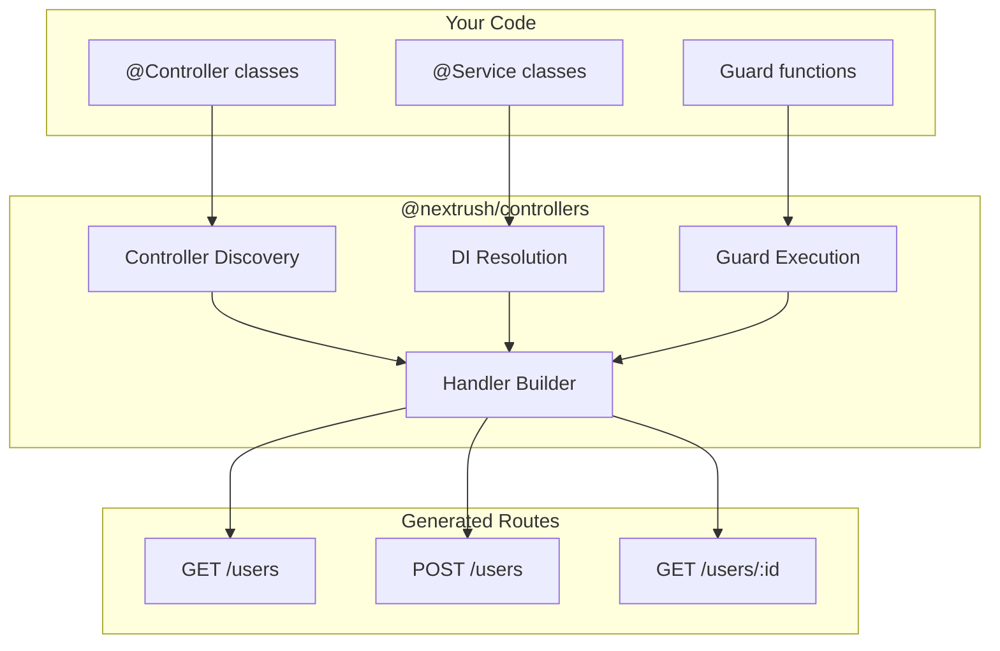
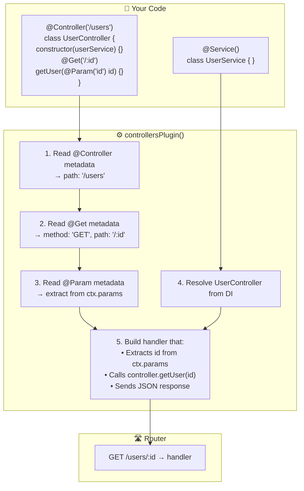
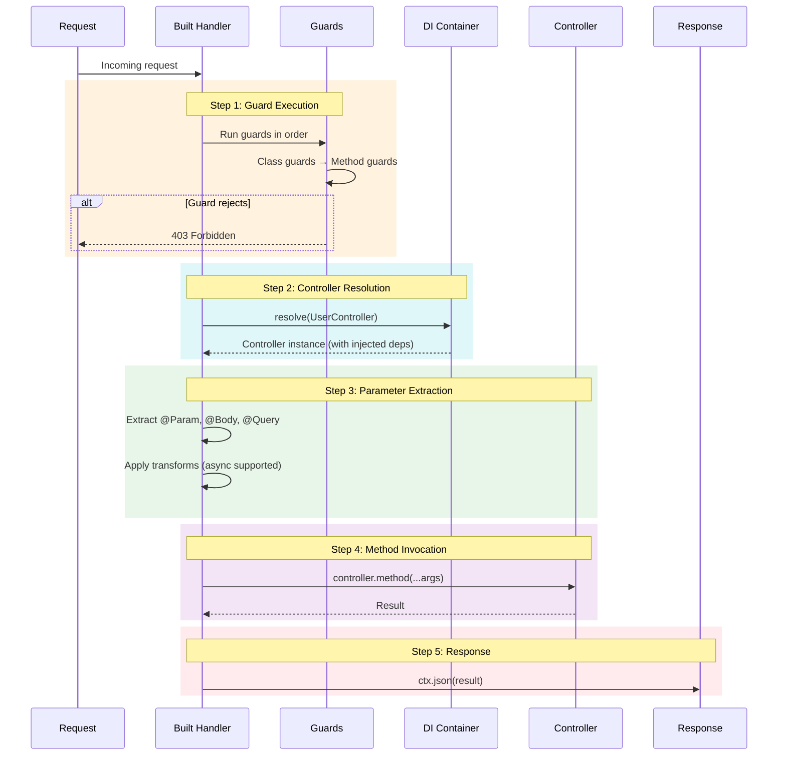
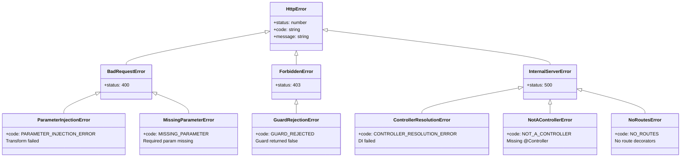

# Controllers Plugin

> The all-in-one package for class-based development with automatic wiring, dependency injection, and route registration.

## The Complete Picture



## The Problem

Using class-based patterns in Node.js frameworks means juggling multiple packages and manual wiring:

**Multiple imports everywhere.** Want decorators? `import from '@nextrush/decorators'`. Need DI? `import from '@nextrush/di'`. Building routes? Wire them up manually. Every file has 5+ imports from different packages.

**Manual controller registration is tedious.** You have 50 controllers spread across directories. For each one: import, instantiate, register routes. Miss one? Silent failure. Add a new controller? Remember to update the registration file.

**Guards and DI don't talk to each other.** Your `AuthGuard` needs `AuthService`. But guards run separately from DI. So you end up with global singletons, hacky workarounds, or duplicate code.

**The handler building is your problem.** You write `@Get()` and `@Body()`, but YOU have to write the code that reads those decorators, extracts parameters, calls methods, and serializes responses. That's hundreds of lines of boilerplate per project.

## How NextRush Approaches This

`@nextrush/controllers` is the **single package** for class-based development.

Install it. Import everything from it. Done.

```typescript
// Everything you need - ONE package, ONE import
import {
  // Decorators
  Controller, Get, Post, Put, Delete, Body, Param, Query, UseGuard,
  // DI
  Service, Repository, container,
  // Plugin
  controllersPlugin,
  // Types
  type GuardFn, type GuardContext,
} from '@nextrush/controllers';
```

The plugin handles:
1. **Controller discovery** — Auto-scan directories, find `@Controller` classes
2. **DI resolution** — Resolve controllers and their dependencies from container
3. **Route registration** — Read decorators, register routes with the router
4. **Handler building** — Extract parameters, run guards, call methods, serialize responses
5. **Guard execution** — Run function and class guards with DI support

You write decorated classes. The plugin does the rest.

## Mental Model

Think of the controllers plugin as the **glue** that connects decorators, DI, and routing.

### The Wiring Flow



## Installation

```bash
pnpm add @nextrush/controllers @nextrush/adapter-node
```

That's it. No need to install `@nextrush/decorators` or `@nextrush/di` separately — they're included and re-exported.

## Quick Start

### Minimal Example

```typescript
// src/controllers/hello.controller.ts
import { Controller, Get } from '@nextrush/controllers';

@Controller('/hello')
export class HelloController {
  @Get()
  sayHello() {
    return { message: 'Hello, World!' };
  }
}
```

```typescript
// src/index.ts
import 'reflect-metadata';
import { createApp } from '@nextrush/core';
import { createRouter } from '@nextrush/router';
import { nodeAdapter } from '@nextrush/adapter-node';
import { controllersPlugin } from '@nextrush/controllers';

async function main() {
  const app = createApp();
  const router = createRouter();

  // Auto-discover controllers from ./src directory
  await app.pluginAsync(
    controllersPlugin({
      router,
      root: './src',  // Scans for @Controller classes
      debug: true,
    })
  );

  app.use(router.routes());
  nodeAdapter(app).listen(3000);
}

main();
```

### With Service and DI

```typescript
// src/services/user.service.ts
import { Service } from '@nextrush/controllers';

@Service()
export class UserService {
  private users = new Map([['1', { id: '1', name: 'Alice' }]]);

  findById(id: string) {
    return this.users.get(id);
  }

  create(data: { name: string }) {
    const id = String(Date.now());
    const user = { id, ...data };
    this.users.set(id, user);
    return user;
  }
}
```

```typescript
// src/controllers/user.controller.ts
import { Controller, Get, Post, Body, Param } from '@nextrush/controllers';
import { UserService } from '../services/user.service';

@Controller('/users')
export class UserController {
  constructor(private userService: UserService) {}

  @Get('/:id')
  getUser(@Param('id') id: string) {
    return this.userService.findById(id);
  }

  @Post()
  createUser(@Body() data: { name: string }) {
    return this.userService.create(data);
  }
}
```

```typescript
// src/index.ts
import 'reflect-metadata';
import { createApp } from '@nextrush/core';
import { createRouter } from '@nextrush/router';
import { controllersPlugin } from '@nextrush/controllers';

async function main() {
  const app = createApp();
  const router = createRouter();

  await app.pluginAsync(
    controllersPlugin({
      router,
      root: './src',
      debug: true,
    })
  );

  app.use(router.routes());
  app.listen(3000);
}

main();
```

## Auto-Discovery (Recommended)

Auto-discovery is the **recommended approach** for all applications. It scans your source directory and automatically finds all `@Controller` classes.

### Basic Discovery

```typescript
import { createApp } from '@nextrush/core';
import { createRouter } from '@nextrush/router';
import { controllersPlugin } from '@nextrush/controllers';

const app = createApp();
const router = createRouter();

// Auto-discover all @Controller classes in ./src
await app.pluginAsync(
  controllersPlugin({
    router,
    root: './src',
    debug: true,  // Log discovered controllers
  })
);

app.use(router.routes());
```

### Discovery with Patterns

Control which files to scan:

```typescript
await app.pluginAsync(
  controllersPlugin({
    router,
    root: './src',
    include: ['controllers/**/*.ts'],  // Only scan controllers folder
    exclude: [
      '**/*.test.ts',     // Exclude tests
      '**/*.spec.ts',
      '**/mocks/**',      // Exclude mocks
    ],
    debug: true,  // Log what's being discovered
  })
);
```

Console output with `debug: true`:
```
[Controllers] Scanning: /home/project/src
[Controllers] Include: controllers/**/*.ts
[Controllers] Exclude: **/*.test.ts, **/*.spec.ts, **/mocks/**
[Controllers] Found 12 files to scan
[Controllers] Discovered: UserController from /home/project/src/controllers/user.controller.ts
[Controllers] Discovered: ProductController from /home/project/src/controllers/product.controller.ts
...
```

### Default Patterns

Without specifying patterns, discovery uses sensible defaults:

| Default Include | Default Exclude |
|-----------------|-----------------|
| `**/*.ts` | `**/*.test.ts` |
| `**/*.js` | `**/*.spec.ts` |
| | `**/*.test.js` |
| | `**/*.spec.js` |
| | `**/node_modules/**` |
| | `**/dist/**` |
| | `**/__tests__/**` |

### Handling Discovery Errors

Some files might fail to import (syntax errors, missing deps). Check for errors:

```typescript
import {
  discoverControllers,
  getControllersFromResults,
  getErrorsFromResults,
} from '@nextrush/controllers';

const results = await discoverControllers({
  root: './src',
});

const errors = getErrorsFromResults(results);
if (errors.length > 0) {
  console.error('Discovery errors:');
  for (const error of errors) {
    console.error(`  ${error.filePath}: ${error.message}`);
  }
}

const controllers = getControllersFromResults(results);
```

## Plugin Options

### `controllersPlugin(options)`

| Option | Type | Required | Description |
|--------|------|----------|-------------|
| `router` | `Router` | Yes | Router instance for route registration |
| `root` | `string` | Recommended | Directory to scan for controllers (default: `'./src'`) |
| `include` | `string[]` | No | Glob patterns for files to include |
| `exclude` | `string[]` | No | Glob patterns for files to exclude |
| `prefix` | `string` | No | Global route prefix for all controllers |
| `debug` | `boolean` | No | Log discovered controllers at startup |
| `strict` | `boolean` | No | Throw on discovery errors |
| `controllers` | `Function[]` | Deprecated | Manual controller registration (testing only) |
| `container` | `ContainerInterface` | No | Custom DI container (default: global container) |

### Global Route Prefix

Add a prefix to all controller routes:

```typescript
await app.pluginAsync(
  controllersPlugin({
    router,
    root: './src',
    prefix: '/api/v1',
  })
);

// Routes become:
// GET /api/v1/users/:id  (instead of /users/:id)
// GET /api/v1/products   (instead of /products)
```

### Custom Container

Use a separate container (useful for testing or isolation):

```typescript
import { createContainer, controllersPlugin } from '@nextrush/controllers';

const testContainer = createContainer();

// Register mocks in test container
testContainer.register(UserService, { useClass: MockUserService });

await app.pluginAsync(
  controllersPlugin({
    router,
    root: './src',
    container: testContainer,
  })
);
```

## Guards with DI

The controllers plugin integrates guards with the DI container. Class guards are resolved automatically.

### Function Guards

```typescript
import type { GuardFn } from '@nextrush/controllers';

const AuthGuard: GuardFn = async (ctx) => {
  return Boolean(ctx.get('authorization'));
};

@UseGuard(AuthGuard)
@Controller('/users')
class UserController {}
```

### Class Guards (with DI)

```typescript
import { Service, type CanActivate, type GuardContext } from '@nextrush/controllers';

@Service()
class AuthGuard implements CanActivate {
  constructor(private authService: AuthService) {}

  async canActivate(ctx: GuardContext): Promise<boolean> {
    const token = ctx.get('authorization');
    if (!token) return false;

    const user = await this.authService.verify(token);
    ctx.state.user = user;
    return Boolean(user);
  }
}

// Plugin resolves AuthGuard from container, injecting AuthService
@UseGuard(AuthGuard)
@Controller('/protected')
class ProtectedController {}
```

## Handler Building Pipeline

Understanding what the plugin does helps debug issues. Here's the complete pipeline:



### 1. Metadata Reading

```typescript
// Your code:
@Controller('/users')
class UserController {
  @UseGuard(AuthGuard)
  @Get('/:id')
  getUser(@Param('id') id: string) {}
}

// Plugin reads:
// - Controller path: '/users'
// - Route: { method: 'GET', path: '/:id' }
// - Guards: [AuthGuard]
// - Parameters: [{ index: 0, source: 'param', key: 'id' }]
```

### 2. Controller Resolution

```typescript
// Plugin resolves from DI:
const controller = container.resolve(UserController);
// → UserService injected automatically
```

### 3. Handler Building

```typescript
// Plugin builds:
async function handler(ctx) {
  // Step 1: Run guards
  for (const guard of guards) {
    const canActivate = await runGuard(guard, ctx);
    if (!canActivate) {
      throw new GuardRejectionError();
    }
  }

  // Step 2: Extract parameters
  const args = [];
  for (const param of parameters) {
    let value = extractParam(ctx, param.source, param.key);
    if (param.transform) {
      value = await param.transform(value);
    }
    args[param.index] = value;
  }

  // Step 3: Call method
  const result = await controller.getUser(...args);

  // Step 4: Send response
  if (result !== undefined) {
    ctx.json(result);
  }
}
```

### 4. Route Registration

```typescript
// Plugin registers:
router.get('/users/:id', handler);
```

## Error Handling

The controllers plugin throws specific errors for different failure modes.

### Error Hierarchy



**Client Errors (4xx)** — Request issues:

| Error | Code | HTTP | When |
|-------|------|------|------|
| `MissingParameterError` | `MISSING_PARAMETER` | 400 | Required parameter not provided |
| `ParameterInjectionError` | `PARAMETER_INJECTION_ERROR` | 400 | Transform/validation failed |
| `GuardRejectionError` | `GUARD_REJECTED` | 403 | Guard returned false |

**Server Errors (5xx)** — Configuration issues:

| Error | Code | HTTP | When |
|-------|------|------|------|
| `NotAControllerError` | `NOT_A_CONTROLLER` | 500 | Class missing `@Controller` |
| `NoRoutesError` | `NO_ROUTES` | 500 | No `@Get`/`@Post` decorators |
| `ControllerResolutionError` | `CONTROLLER_RESOLUTION_ERROR` | 500 | DI failed to resolve |
| `DiscoveryError` | `DISCOVERY_ERROR` | 500 | File import failed |

### Handling Errors

Use the error middleware from `@nextrush/errors`:

```typescript
import { createApp } from '@nextrush/core';
import { createRouter } from '@nextrush/router';
import { errorHandler } from '@nextrush/errors';
import { controllersPlugin } from '@nextrush/controllers';

const app = createApp();
const router = createRouter();

// Error handler FIRST
app.use(errorHandler());

// Then auto-discover controllers
await app.pluginAsync(
  controllersPlugin({
    router,
    root: './src',
  })
);

app.use(router.routes());
```

### Custom Error Responses

```typescript
import { errorHandler } from '@nextrush/errors';

app.use(errorHandler({
  // Custom response format
  format: (error) => ({
    success: false,
    error: {
      code: error.code,
      message: error.message,
    },
  }),

  // Don't log 4xx errors
  logLevel: (error) => error.status >= 500 ? 'error' : 'silent',
}));
```

## Complete Application Example

A full CRUD API with auth, validation, and error handling:

```typescript
import 'reflect-metadata';
import { createApp } from '@nextrush/core';
import { nodeAdapter } from '@nextrush/adapter-node';
import { errorHandler, NotFoundError } from '@nextrush/errors';
import { json } from '@nextrush/body-parser';
import { cors } from '@nextrush/cors';
import {
  Controller, Get, Post, Put, Delete,
  Body, Param, Query, UseGuard,
  Service, Repository,
  controllersPlugin,
  type GuardFn,
} from '@nextrush/controllers';
import { z } from 'zod';

// ============ Validation Schemas ============

const CreateUserSchema = z.object({
  name: z.string().min(1, 'Name is required'),
  email: z.string().email('Invalid email'),
});

const UpdateUserSchema = CreateUserSchema.partial();

type CreateUserDto = z.infer<typeof CreateUserSchema>;
type UpdateUserDto = z.infer<typeof UpdateUserSchema>;

// ============ Repository ============

interface User {
  id: string;
  name: string;
  email: string;
}

@Repository()
class UserRepository {
  private users = new Map<string, User>();

  findAll(): User[] {
    return Array.from(this.users.values());
  }

  findById(id: string): User | undefined {
    return this.users.get(id);
  }

  create(data: CreateUserDto): User {
    const id = String(Date.now());
    const user = { id, ...data };
    this.users.set(id, user);
    return user;
  }

  update(id: string, data: UpdateUserDto): User | undefined {
    const user = this.users.get(id);
    if (!user) return undefined;
    Object.assign(user, data);
    return user;
  }

  delete(id: string): boolean {
    return this.users.delete(id);
  }
}

// ============ Service ============

@Service()
class UserService {
  constructor(private userRepo: UserRepository) {}

  findAll(page: number, limit: number): User[] {
    const users = this.userRepo.findAll();
    return users.slice((page - 1) * limit, page * limit);
  }

  findById(id: string): User {
    const user = this.userRepo.findById(id);
    if (!user) {
      throw new NotFoundError(`User ${id} not found`);
    }
    return user;
  }

  create(data: CreateUserDto): User {
    return this.userRepo.create(data);
  }

  update(id: string, data: UpdateUserDto): User {
    const user = this.userRepo.update(id, data);
    if (!user) {
      throw new NotFoundError(`User ${id} not found`);
    }
    return user;
  }

  delete(id: string): void {
    const deleted = this.userRepo.delete(id);
    if (!deleted) {
      throw new NotFoundError(`User ${id} not found`);
    }
  }
}

// ============ Guard ============

const AuthGuard: GuardFn = async (ctx) => {
  const token = ctx.get('authorization');
  // In real app: verify JWT, check expiry, etc.
  return token === 'Bearer secret-token';
};

// ============ Controller ============

@UseGuard(AuthGuard)
@Controller('/users')
class UserController {
  constructor(private userService: UserService) {}

  @Get()
  findAll(
    @Query('page', { transform: (v) => Number(v) || 1 }) page: number,
    @Query('limit', { transform: (v) => Number(v) || 10 }) limit: number,
  ) {
    return {
      users: this.userService.findAll(page, limit),
      page,
      limit,
    };
  }

  @Get('/:id')
  findOne(@Param('id') id: string) {
    return { user: this.userService.findById(id) };
  }

  @Post()
  async create(
    @Body({ transform: (d) => CreateUserSchema.parseAsync(d) }) data: CreateUserDto,
  ) {
    const user = this.userService.create(data);
    return { user, created: true };
  }

  @Put('/:id')
  async update(
    @Param('id') id: string,
    @Body({ transform: (d) => UpdateUserSchema.parseAsync(d) }) data: UpdateUserDto,
  ) {
    const user = this.userService.update(id, data);
    return { user, updated: true };
  }

  @Delete('/:id')
  remove(@Param('id') id: string) {
    this.userService.delete(id);
    return { deleted: true };
  }
}

// ============ App Setup ============

const app = createApp();

// Middleware
app.use(errorHandler());
app.use(cors());
app.use(json());

// Controllers - auto-discovered from ./src
await app.pluginAsync(
  controllersPlugin({
    router,
    root: './src',
    prefix: '/api/v1',
  })
);

// Start server
const port = Number(process.env.PORT) || 3000;
nodeAdapter(app).listen(port, () => {
  console.log(`Server running on http://localhost:${port}`);
});
```

## Testing Controllers

### Unit Testing Services

```typescript
import { describe, it, expect, beforeEach } from 'vitest';
import { createContainer } from '@nextrush/controllers';
import { UserService } from './user.service';
import { UserRepository } from './user.repository';

describe('UserService', () => {
  let container;
  let userService: UserService;

  beforeEach(() => {
    container = createContainer();

    // Mock repository
    container.register(UserRepository, {
      useValue: {
        findById: () => ({ id: '1', name: 'Test', email: 'test@example.com' }),
      },
    });

    userService = container.resolve(UserService);
  });

  it('should find user by id', () => {
    const user = userService.findById('1');
    expect(user.name).toBe('Test');
  });
});
```

### Integration Testing Controllers

```typescript
import { describe, it, expect } from 'vitest';
import { createApp } from '@nextrush/core';
import { createRouter } from '@nextrush/router';
import { controllersPlugin, Controller, Get } from '@nextrush/controllers';

describe('HelloController', () => {
  @Controller('/test')
  class TestController {
    @Get()
    hello() {
      return { message: 'Hello' };
    }
  }

  it('should respond with hello', async () => {
    const app = createApp();
    const router = createRouter();

    // For testing, manual registration is acceptable
    await app.pluginAsync(
      controllersPlugin({
        router,
        controllers: [TestController],  // Manual is OK for tests
      })
    );

    app.use(router.routes());

    // Use your preferred testing approach (supertest, etc.)
    const response = await testRequest(app, 'GET', '/test');
    expect(response.body).toEqual({ message: 'Hello' });
  });
});
```

## Common Mistakes

### Forgetting `reflect-metadata`

```typescript
// ❌ Decorators silently fail
@Controller('/users')
class UserController {}

// ✅ Import at app entry point (ONCE)
import 'reflect-metadata';
```

### Importing from Wrong Package

```typescript
// ❌ Don't import from individual packages when using controllers
import { Controller } from '@nextrush/decorators';
import { Service } from '@nextrush/di';
import { controllersPlugin } from '@nextrush/controllers';

// ✅ Import everything from controllers
import {
  Controller, Service, controllersPlugin
} from '@nextrush/controllers';
```

### Registering Controllers Without Discovery

```typescript
// ❌ Tedious for large apps - easy to miss controllers
await app.pluginAsync(
  controllersPlugin({
    router,
    controllers: [
      UserController,
      ProductController,
      OrderController,
      // ... 50 more imports - TEDIOUS!
    ],
  })
);

// ✅ Use auto-discovery
await app.pluginAsync(
  controllersPlugin({
    router,
    root: './src',  // Scans automatically!
    debug: true,
  })
);
```

### Class Guards Without @Service

```typescript
// ❌ Guard won't be in DI container
class AuthGuard implements CanActivate {
  constructor(private authService: AuthService) {} // Won't be injected!
  canActivate(ctx) { ... }
}

// ✅ Register guard in container
@Service()
class AuthGuard implements CanActivate {
  constructor(private authService: AuthService) {} // Now injected!
  canActivate(ctx) { ... }
}
```

## When NOT to Use Controllers

The controllers plugin adds structure. Sometimes you don't need it:

- **Simple APIs** — Functional routing is faster to write
- **Serverless functions** — One handler per file doesn't benefit from controllers
- **Prototypes** — Skip the ceremony, ship faster
- **Performance-critical paths** — Controller overhead is minimal but exists

For small apps, functional routing is cleaner:

```typescript
import { createApp } from '@nextrush/core';
import { createRouter } from '@nextrush/router';

const app = createApp();
const router = createRouter();

router.get('/health', (ctx) => ctx.json({ status: 'ok' }));
router.get('/users', (ctx) => ctx.json(getUsers()));

app.use(router.routes());
app.listen(3000);
```

Use controllers when:
- Your app has 10+ routes
- You need dependency injection
- You want consistent patterns across a team
- You need guards on multiple endpoints

## API Reference

### Plugin

| Export | Purpose |
|--------|---------|
| `controllersPlugin(options)` | Create the plugin |

### Discovery

| Export | Purpose |
|--------|---------|
| `discoverControllers(options)` | Scan directories for controllers |
| `getControllersFromResults(results)` | Extract controllers from results |
| `getErrorsFromResults(results)` | Extract errors from results |

### Re-exports from @nextrush/decorators

| Export | Purpose |
|--------|---------|
| `Controller`, `Get`, `Post`, `Put`, `Patch`, `Delete` | Route decorators |
| `Body`, `Param`, `Query`, `Header`, `Ctx` | Parameter decorators |
| `UseGuard` | Guard decorator |
| `GuardFn`, `GuardContext`, `CanActivate` | Guard types |

### Re-exports from @nextrush/di

| Export | Purpose |
|--------|---------|
| `Service`, `Repository` | Service decorators |
| `container`, `createContainer` | DI container |
| `inject` | Explicit injection |

## Next Steps

- **[Decorators Package](/packages/decorators/)** — Deep dive into decorators
- **[DI Package](/packages/di/)** — Dependency injection details
- **[Guards Guide](/guides/guards)** — Authentication patterns
- **[Testing Guide](/guides/testing)** — Testing strategies

## Runtime Compatibility

| Runtime | Supported |
|---------|-----------|
| Node.js 20+ | ✅ |
| Bun 1.0+ | ✅ |
| Deno 2.0+ | ✅ |

**Dependencies:** `@nextrush/decorators`, `@nextrush/di`, `@nextrush/router`
