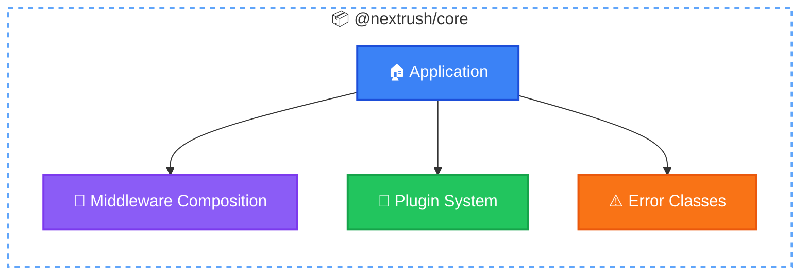
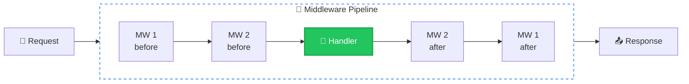

# @nextrush/core

> The minimal core of NextRush: Application, middleware composition, and plugin system.

## The Problem

Backend frameworks bundle everything together. Routing logic when you only need middleware. Body parsing when you're building a proxy. Complex event systems when you need simple extensibility.

You pay for features you don't use. Cold starts suffer. Memory bloats. Debugging becomes archaeology.

## Why NextRush Exists Here

`@nextrush/core` provides the **absolute minimum** to build an HTTP application:



| Component | Purpose | Size |
|-----------|---------|------|
| Application | Middleware registration, plugin management | ~300 LOC |
| Middleware Composition | Koa-style async onion model | ~100 LOC |
| Error Classes | Typed HTTP errors with proper status codes | ~150 LOC |

Everything else lives in separate packages. Router? `@nextrush/router`. Body parsing? `@nextrush/body-parser`. You install what you use.

## Mental Model

Think of core as a **middleware pipeline manager**:



Each middleware:
1. Does something **before** calling `next()`
2. Calls `await next()` to pass control downstream
3. Does something **after** `next()` returns

This is the "onion model" - requests flow inward, responses flow outward. If you understand this, you understand NextRush.

## Installation

```bash
pnpm add @nextrush/core
```

## Quick Start

```typescript
import { createApp } from '@nextrush/core';
import { listen } from '@nextrush/adapter-node';

const app = createApp();

// Logging middleware - runs before and after
app.use(async (ctx, next) => {
  const start = Date.now();
  console.log(`→ ${ctx.method} ${ctx.path}`);

  await next();

  console.log(`← ${ctx.status} (${Date.now() - start}ms)`);
});

// Handler - the actual response
app.use(async (ctx) => {
  ctx.json({ message: 'Hello World' });
});

listen(app, { port: 3000 });
```

## Application

### Creating an Application

```typescript
import { createApp } from '@nextrush/core';

// Default configuration
const app = createApp();

// With options
const app = createApp({
  env: 'production',  // Controls error exposure
  proxy: true,        // Trust X-Forwarded-* headers
});
```

### Application Options

| Option | Type | Default | Description |
|--------|------|---------|-------------|
| `env` | `'development' \| 'production' \| 'test'` | `process.env.NODE_ENV` | Environment mode |
| `proxy` | `boolean` | `false` | Trust proxy headers for `ctx.ip` |

### Application Properties

```typescript
// Read-only state
app.isProduction;    // true if env === 'production'
app.isRunning;       // true after app.start()
app.middlewareCount; // Number of registered middleware
app.options;         // Readonly config object
```

## Middleware

### Registration

```typescript
// Single middleware
app.use(async (ctx, next) => {
  await next();
});

// Multiple at once
app.use(middleware1, middleware2, middleware3);

// Chainable
app.use(cors())
   .use(helmet())
   .use(json());
```

### Two Syntax Styles

Both work identically - use whichever you prefer:

```typescript
// Modern: ctx.next()
app.use(async (ctx) => {
  console.log('Before');
  await ctx.next();
  console.log('After');
});

// Koa-style: next parameter
app.use(async (ctx, next) => {
  console.log('Before');
  await next();
  console.log('After');
});
```

### Execution Order

The onion model in action:

```typescript
app.use(async (ctx, next) => {
  console.log('1: Start');
  await next();
  console.log('1: End');
});

app.use(async (ctx, next) => {
  console.log('2: Start');
  await next();
  console.log('2: End');
});

app.use(async (ctx) => {
  console.log('3: Handler');
  ctx.json({ ok: true });
});

// Request produces:
// 1: Start
// 2: Start
// 3: Handler
// 2: End
// 1: End
```

### Conditional Execution

Skip logic based on conditions:

```typescript
app.use(async (ctx, next) => {
  // Skip expensive logging for health checks
  if (ctx.path === '/health') {
    return next();
  }

  const start = Date.now();
  await next();
  console.log(`${ctx.path}: ${Date.now() - start}ms`);
});
```

### Early Termination

Don't call `next()` to stop the pipeline:

```typescript
app.use(async (ctx, next) => {
  if (!ctx.get('Authorization')) {
    ctx.status = 401;
    ctx.json({ error: 'Unauthorized' });
    return; // Pipeline stops here
  }
  await next();
});
```

## Context API

The `ctx` object provides unified access to request and response.

### Request Properties

| Property | Type | Description |
|----------|------|-------------|
| `ctx.method` | `HttpMethod` | GET, POST, PUT, DELETE, etc. |
| `ctx.url` | `string` | Full URL including query string |
| `ctx.path` | `string` | Path without query string |
| `ctx.query` | `QueryParams` | Parsed query parameters |
| `ctx.headers` | `IncomingHeaders` | Request headers |
| `ctx.ip` | `string` | Client IP (respects proxy setting) |
| `ctx.body` | `unknown` | Request body (set by parser middleware) |
| `ctx.params` | `RouteParams` | Route parameters (set by router) |

### Response Methods

| Method | Description |
|--------|-------------|
| `ctx.json(data)` | Send JSON response |
| `ctx.send(data)` | Send text, buffer, or stream |
| `ctx.html(content)` | Send HTML response |
| `ctx.redirect(url, status?)` | Redirect (default 302) |
| `ctx.set(header, value)` | Set response header |
| `ctx.get(header)` | Get request header |

```typescript
app.use(async (ctx) => {
  // Set status
  ctx.status = 201;

  // Set headers
  ctx.set('X-Request-Id', crypto.randomUUID());

  // Send response
  ctx.json({ created: true });
});
```

### Error Helpers

Throw HTTP errors with proper status codes:

```typescript
app.use(async (ctx) => {
  // Throw with status and message
  ctx.throw(404, 'User not found');
  ctx.throw(401); // Uses default message

  // Assert conditions
  const user = await getUser(id);
  ctx.assert(user, 404, 'User not found');
  ctx.assert(user.isAdmin, 403, 'Forbidden');
});
```

### State

Share data between middleware:

```typescript
// Auth middleware sets user
app.use(async (ctx, next) => {
  ctx.state.user = await validateToken(ctx.get('Authorization'));
  ctx.state.requestId = crypto.randomUUID();
  await next();
});

// Handler accesses user
app.use(async (ctx) => {
  ctx.json({ user: ctx.state.user });
});
```

### Raw Access

When you need platform-specific objects:

```typescript
// Node.js
ctx.raw.req;  // IncomingMessage
ctx.raw.res;  // ServerResponse

// Bun/Deno/Edge
ctx.raw.req;  // Request (Web API)
```

### Runtime Detection

```typescript
app.use(async (ctx) => {
  switch (ctx.runtime) {
    case 'node': // Node.js
    case 'bun':  // Bun
    case 'deno': // Deno
    case 'edge': // Cloudflare Workers, Vercel Edge
  }
});
```

## Error Handling

### Custom Error Handler

```typescript
app.onError((error, ctx) => {
  console.error('Request failed:', {
    error: error.message,
    path: ctx.path,
    method: ctx.method,
  });

  ctx.status = error.status || 500;
  ctx.json({
    error: error.message,
    code: error.code || 'INTERNAL_ERROR',
  });
});
```

### Default Behavior

| Environment | Behavior |
|-------------|----------|
| Development | Full error message in response |
| Production | Generic "Internal Server Error" |

```typescript
const app = createApp({ env: 'production' });

app.use(async () => {
  throw new Error('Database connection failed');
  // Client sees: { "error": "Internal Server Error" }
});
```

### Error Classes

```typescript
import {
  HttpError,
  NotFoundError,
  BadRequestError,
  UnauthorizedError,
  ForbiddenError,
  InternalServerError,
} from '@nextrush/core';

app.use(async (ctx) => {
  throw new NotFoundError('User not found');
  throw new BadRequestError('Invalid email format');
  throw new UnauthorizedError('Token expired');
  throw new ForbiddenError('Admin access required');
});
```

Each error class sets the appropriate HTTP status code automatically.

## Plugins

### Using Plugins

```typescript
import { createApp } from '@nextrush/core';
import { eventsPlugin } from '@nextrush/events';
import { loggerPlugin } from '@nextrush/logger';

const app = createApp();

// Synchronous
app.plugin(eventsPlugin());
app.plugin(loggerPlugin({ level: 'info' }));

// Async (database connections, etc.)
await app.pluginAsync(databasePlugin({ uri: '...' }));
```

### Plugin Management

```typescript
app.plugin(plugin);              // Install sync plugin
await app.pluginAsync(plugin);   // Install async plugin
app.hasPlugin('plugin-name');    // Check if installed
app.getPlugin('plugin-name');    // Get plugin instance
```

### Creating Plugins

```typescript
import type { Plugin } from '@nextrush/types';

interface MetricsOptions {
  prefix: string;
}

function metricsPlugin(options: MetricsOptions): Plugin {
  const metrics = new Map<string, number>();

  return {
    name: 'metrics',

    install(app) {
      app.use(async (ctx, next) => {
        const start = Date.now();
        await next();

        const key = `${options.prefix}.${ctx.method}.${ctx.path}`;
        metrics.set(key, Date.now() - start);
      });
    },

    destroy() {
      metrics.clear();
    },
  };
}

app.plugin(metricsPlugin({ prefix: 'api' }));
```

## Middleware Composition

### compose()

Combine multiple middleware into one:

```typescript
import { compose } from '@nextrush/core';

// Create a security stack
const security = compose([
  cors(),
  helmet(),
  rateLimit({ max: 100 }),
]);

// Use as single middleware
app.use(security);
```

### Utilities

```typescript
import { isMiddleware, flattenMiddleware } from '@nextrush/core';

// Type guard
if (isMiddleware(fn)) {
  app.use(fn);
}

// Flatten nested arrays
const flat = flattenMiddleware([
  mw1,
  [mw2, mw3],
  [[mw4]],
]);
// Result: [mw1, mw2, mw3, mw4]
```

## Lifecycle

### Starting the Application

```typescript
// Adapters call this internally
app.start();
console.log(app.isRunning); // true
```

### Graceful Shutdown

```typescript
await app.close();

// This:
// 1. Sets isRunning = false
// 2. Calls destroy() on plugins (reverse order)
// 3. Clears plugin registry
```

### HTTP Server Integration

```typescript
// Get the raw callback
const callback = app.callback();

// Use with Node.js http
import http from 'http';
http.createServer(callback).listen(3000);

// Or use an adapter (recommended)
import { listen } from '@nextrush/adapter-node';
listen(app, { port: 3000 });
```

## Common Patterns

### Request Timing

```typescript
app.use(async (ctx, next) => {
  const start = Date.now();
  await next();
  ctx.set('X-Response-Time', `${Date.now() - start}ms`);
});
```

### Request ID Propagation

```typescript
app.use(async (ctx, next) => {
  const requestId = ctx.get('X-Request-Id') || crypto.randomUUID();
  ctx.state.requestId = requestId;
  ctx.set('X-Request-Id', requestId);
  await next();
});
```

### Error Recovery

```typescript
app.use(async (ctx, next) => {
  try {
    await next();
  } catch (error) {
    // Log but don't crash
    console.error('Unhandled error:', error);

    if (!ctx.status || ctx.status === 200) {
      ctx.status = 500;
    }

    ctx.json({
      error: 'Something went wrong',
      requestId: ctx.state.requestId,
    });
  }
});
```

## Common Mistakes

### Forgetting await on next()

```typescript
// ❌ Wrong: Response headers already sent
app.use(async (ctx, next) => {
  next(); // Missing await!
  ctx.set('X-After', 'value'); // May not work
});

// ✅ Correct
app.use(async (ctx, next) => {
  await next();
  ctx.set('X-After', 'value');
});
```

### Multiple Responses

```typescript
// ❌ Wrong: Two responses
app.use(async (ctx) => {
  ctx.json({ step: 1 });
  ctx.json({ step: 2 }); // Error or ignored
});

// ✅ Correct: One response
app.use(async (ctx) => {
  ctx.json({ steps: [1, 2] });
});
```

### Accessing Body Without Parser

```typescript
// ❌ Wrong: body is undefined
app.use(async (ctx) => {
  console.log(ctx.body); // undefined!
});

// ✅ Correct: Add body parser first
import { json } from '@nextrush/body-parser';

app.use(json());
app.use(async (ctx) => {
  console.log(ctx.body); // { name: 'Alice' }
});
```

## When NOT to Use Core Alone

Use `@nextrush/core` directly when:
- Building custom middleware
- Creating adapters for new runtimes
- Building minimal proxies

Use the full stack (`nextrush` meta-package) when:
- Building REST APIs (need routing)
- Building web applications (need templating)
- Building production services (need logging, metrics)

## API Reference

### Exports

```typescript
import {
  // Application
  createApp,
  Application,

  // Middleware
  compose,
  isMiddleware,
  flattenMiddleware,

  // Errors
  NextRushError,
  HttpError,
  NotFoundError,
  BadRequestError,
  UnauthorizedError,
  ForbiddenError,
  InternalServerError,
  createHttpError,

  // Re-exports
  HttpStatus,
  ContentType,
} from '@nextrush/core';
```

### Types

```typescript
import type {
  // Application
  ApplicationOptions,
  ErrorHandler,
  ComposedMiddleware,

  // From @nextrush/types
  Context,
  ContextState,
  Middleware,
  Next,
  Plugin,
  RouteParams,
  QueryParams,
  HttpMethod,
} from '@nextrush/core';
```

## Package Size

| Metric | Size |
|--------|------|
| Bundle | ~10 KB |
| Types | ~8 KB |
| Dependencies | `@nextrush/types` only |

## Runtime Compatibility

| Runtime | Supported |
|---------|-----------|
| Node.js 20+ | ✅ |
| Bun 1.0+ | ✅ |
| Deno 2.0+ | ✅ |
| Cloudflare Workers | ✅ |
| Vercel Edge | ✅ |

The core uses only standard JavaScript APIs. Runtime-specific code lives in adapters.

## See Also

- [@nextrush/router](/packages/router) - Radix tree routing
- [@nextrush/body-parser](/middleware/body-parser) - Request body parsing
- [@nextrush/adapter-node](/adapters/node) - Node.js HTTP server
